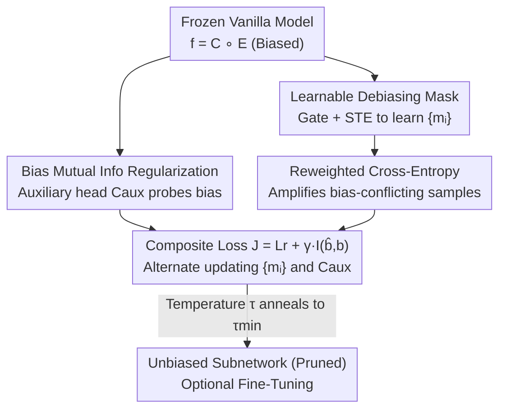

# Bias In, Bias Out? Finding Unbiased Subnetworks in Vanilla Models

**Conference**: CVPR 2026  
**Paper**: [CVF Open Access](https://openaccess.thecvf.com/content/CVPR2026/html/De_Moura_Matos_Bias_In_Bias_Out_Finding_Unbiased_Subnetworks_in_Vanilla_Models_CVPR_2026_paper.html)  
**Code**: https://github.com/ivanluizmatos/BISE  
**Area**: Model Debiasing / Structured Pruning  
**Keywords**: Algorithmic Bias, Subnetwork Extraction, Structured Pruning, Mutual Information Regularization, Fairness  

## TL;DR
BISE proposes that a biased model trained normally (vanilla) on biased data actually **already contains a relatively unbiased subnetwork**. By freezing the original parameters and learning a set of structured pruning masks, combined with "reweighted cross-entropy + biased mutual information regularization" to prune neurons relying on shortcut features, this subnetwork can be extracted without retraining or additional unbiased datasets. Performance is on par with SOTA debiasing methods, can exceed them after fine-tuning, and the model becomes smaller and faster.

## Background & Motivation
**Background**: Deep models succeed by learning statistical patterns from data. However, when training sets contain "shortcuts"—such as lighting or background color in face recognition that are strongly correlated with labels but lack causality—models tend to rely on these pseudo-features, leading to **algorithmic bias**. Samples following pseudo-correlations are called bias-aligned (majority), while those that do not are called bias-conflicting (scarce).

**Limitations of Prior Work**: Mainstream debiasing methods fall into two categories. **Data-centric** (resampling, oversampling, bias-conflicting augmentation) requires injecting or removing specific samples from the distribution, but bias-conflicting samples are naturally scarce and hard to balance. **Model-centric** (adversarial debiasing, fairness constraints, decoupled representations) almost always requires **retraining** the entire model from scratch, which is costly or unfeasible for large-scale deployment. Both treat bias as an "external impurity to be cleared via extra training signals."

**Key Challenge**: Prior works assume "clean models must be created from extra training or data." No one has asked an intuitive question: does a biased model **already contain an unbiased representation** internally, simply drowned out by neurons relying on shortcuts? Existing work (FFW [66]) proved the existence of unbiased subnetworks in principle, but it relies on **unbiased variants** of the original dataset for extraction, which are unavailable in reality.

**Goal**: Under the dual constraints of (i) not modifying original parameters and (ii) using only the original biased training set without any unbiased data, extract the hidden unbiased subnetwork from a vanilla model.

**Key Insight**: Reformulate "debiasing" as "**structured pruning**." Since bias originates from neurons/filters over-relying on pseudo-features, identifying and removing them naturally leaves a subnetwork less dependent on bias. Pruning additionally accelerates inference, a rare "smaller but better" improvement in debiasing.

**Core Idea**: Freeze the original network and learn only a set of binary masks $M$ to toggle each neuron. Use a "reweighted cross-entropy loss that amplifies scarce bias-conflicting samples" to ensure the subnetwork maintains performance on the unbiased distribution, and "adversarial biased mutual information regularization" to force the masks to prune neurons leaking bias information.

## Method

### Overall Architecture
The input to BISE (Bias-Invariant Subnetwork Extraction) is a vanilla model $f = C \circ E$ (encoder $E$ + classifier $C$) already trained on a biased training set $D_{train}$, along with the biased training set itself. The output is a set of structured pruning masks that define an unbiased subnetwork. Throughout the process, **parameters of the original model $f$ remain frozen**. Only two components are trained: ① Mask parameters $\{m_i\}$ attached to each neuron output in the encoder; ② A temporary auxiliary bias classification head $C_{aux}$.

The workflow is an alternating optimization loop: first, inject masks into the encoder and attach $C_{aux}$ to the bottleneck layer, pre-training it to recognize bias labels from features. Then enter the main loop: for each minibatch, **simultaneously** update masks using a composite loss $J$ (ensuring task accuracy while minimizing bias leakage) and update $C_{aux}$ (maintaining its "bias detection" probe capability to provide an effective mutual information upper bound). The temperature $\tau$ is annealed (multiplied by $\kappa$) every $\upsilon$ epochs until $\tau < \tau_{min}$. The final masks are returned. If an unbiased validation set is available, it is used to select the best masks (best); otherwise, the last masks (last) are used. The subnetwork can optionally be fine-tuned on $D_{train}$.

### Key Designs

**1. Learnable Pruning Mask: Turning neuron selection into end-to-end trainable binary switches**

To address the constraint of not modifying parameters while selecting an unbiased subnetwork, BISE decomposes the network into $f = C \circ E$ and attaches a mask parameter $m_i$ to each neuron/filter output $h_i$ (after non-linearity). Structured pruning is performed (entire neurons/filters/channels are removed, allowing acceleration on standard hardware). The gating is defined as:

$$\hat{h}_i = h_i \cdot \mathbb{1}\{\hat{m}_i \ge 0.5\}, \quad \hat{m}_i = \sigma\!\left(\frac{m_i}{\tau}\right)$$

Where $m_i$ is initialized to 0 and is trainable, and $\tau > 0$ is the temperature annealed towards zero. $m_i \ge 0$ retains the neuron, while $m_i < 0$ prunes it. As $\tau$ decreases, the sigmoid function becomes steeper, making the mask approach a hard binary value and increasing confidence. Since the derivative of the indicator function $\mathbb{1}\{\cdot\}$ is zero almost everywhere, BISE uses a **straight-through estimator (STE)**: the hard threshold is used in the forward pass, while the gradient is passed directly to the continuous $m_i$ in the backward pass.

**2. Reweighted Cross-Entropy: Amplifying scarce bias-conflicting samples**

Optimizing masks using standard cross-entropy $L_{CE}(\hat{y}, y)$ on biased $D_{train}$ would lead the optimizer to select a subnetwork that performs well on $D_{train}$ but poorly on unbiased test sets, due to the dominance of bias-aligned samples. BISE replaces this with a group-reweighted version $L_r$, assigning weights inversely proportional to group sizes $(y, b)$ to amplify the contribution of bias-conflicting samples:

$$L_r(\hat{y}, y) = \frac{1}{N}\sum_{j=1}^{N} \ell(\hat{y}_j, y_j)\cdot r_j$$

Where for bias-aligned samples $r_j = \frac{1}{C\rho}$, otherwise $r_j = \frac{C-1}{C(1-\rho)}$; $\rho$ is the ratio of bias-aligned samples, and $C$ is the number of target/bias classes. This weights the distribution to be approximately balanced, forcing the subnetwork to rely on causal features rather than shortcuts.

**3. Bias Mutual Info Regularization: Adversarial probe to identify and prune bias-leaking neurons**

Reweighting alone is insufficient to actively "erase" bias. BISE borrows from privacy protection: an auxiliary classifier $C_{aux}$ is attached to the bottleneck layer (the output $\hat{z}$ of $E$) to predict bias labels $b$. If $C_{aux}$ is a perfect classifier, the mutual information $I(\hat{B}, B)$ between predicted and true bias serves as an **upper bound** for the bias information available to the main classifier, i.e., $I(\hat{B}, B) \ge I(\hat{Y}, B)$. The composite loss is updated to:

$$J(\hat{y}, y, \hat{b}, b) = L_r(\hat{y}, y) + \gamma\, I(\hat{b}, b)$$

Masks $\{m_i\}$ **minimize** $J$ (aiming for task accuracy and bottleneck bias minimization), while $C_{aux}$ **minimizes** $L_{CE}(\hat{b}, b)$ to **maximize** its probe capability. This forms an adversarial min-max game: as the probe tries harder to detect bias, masks are forced to prune neurons leaking it. $\gamma$ controls regularization strength.

### Loss & Training
The final objective is the composite loss $J = L_r(\hat{y}, y) + \gamma I(\hat{b}, b)$, with masks and $C_{aux}$ updated alternately (Algorithm 1). Masks use SGD (lr $10^{-2}$, momentum 0.9, weight decay $10^{-4}$); $C_{aux}$ uses SGD (lr 0.1), pre-trained for $E=50$ epochs. Temperature is multiplied by $\kappa=0.5$ every $\upsilon=10$ epochs until $\tau_{min}=10^{-3}$. $\gamma=1$. The mutual information term $I(\hat{y},b)$ is calculated only on bias-conflicting samples to avoid inflated internal correlations. Optional fine-tuning uses $L_r$ on $D_{train}$ without changing subnetwork size.

## Key Experimental Results

### Main Results
Evaluated on 5 debiasing benchmarks: BiasedMNIST, Corrupted-CIFAR10, CelebA, Multi-Color MNIST (multiple biases), CivilComments (text/BERT). Key conclusion: BISE extracted subnetworks outperform vanilla models "out of the box" and compete with SOTA debiasing methods; fine-tuning often exceeds SOTA, while models are sparser and have lower FLOPs.

BiasedMNIST target accuracy (different bias-aligned ratios $\rho$):

| Method | ρ=0.99 | ρ=0.995 | ρ=0.997 |
|------|--------|---------|---------|
| Vanilla | 88.9 | 75.1 | 66.1 |
| LfF | 95.1 | 90.3 | 63.7 |
| SoftCon | 95.2 | 93.1 | 88.6 |
| BCon+BBal | 98.1 | 97.7 | **97.3** |
| **BISE** | 96.1 | 92.2 | 90.8 |
| **BISE + FT** | **98.1** | 96.3 | 95.9 |

Note: Other methods have the same inference complexity as vanilla; BISE reaches 35.0% sparsity at ρ=0.997, reducing MFLOPs from 415.4 to 269.6. **Extreme bias results in more pruning**. On CelebA, BISE achieves 89.7 / FT 91.8 (vs vanilla 76.5) with ~67.6% sparsity and nearly halved FLOPs.

Sparsity and acceleration across datasets (excerpts):

| Dataset | Sparsity S(%) | FLOPs Change |
|--------|-------------|------------|
| BiasedMNIST (ρ=0.997) | 35.0 | 415.4 → 269.6 MFLOPs |
| Corrupted-CIFAR10 (ρ=0.99) | 92.2 | 37.1 → 15.7 MFLOPs |
| CelebA | ~67.6 | 1818.6 → 821.5 MFLOPs |

Notably, on Multi-Color MNIST, BISE's unbiased average accuracy (60.3, FT 70.6) is significantly higher than **FFW** (36.37)—even though FFW **uses unbiased datasets** for debiasing.

### Ablation Study
On BiasedMNIST (ρ=0.99), decomposing components of $J$:

| Reweighted $L_{CE}$ | Mutual Info $I(\hat{b},b)$ | Acc.(%) | Sparsity S(%) | MFLOPs |
|:---:|:---:|------|------|------|
| - | - | 91.9 | 5.8 | 390.9 |
| ✓ | - | 96.0 | 18.5 | 338.2 |
| - | ✓ | 91.1 | 18.7 | 337.3 |
| ✓ | ✓ | **96.1** | **20.9** | **328.3** |

### Key Findings
- **Reweighting determines accuracy, mutual info determines sparsity**: Removing reweighting (mutual info only) drops accuracy from 96.1 to 91.1. Removing mutual info (reweighting only) maintains 96.0 accuracy but drops sparsity from 20.9% to 18.5%.
- **$\gamma$ should be moderate**: $\gamma=0$ still finds subnetworks but they are denser. Excessively large $\gamma$ makes the mutual info term dominate the task loss, decreasing accuracy.
- **Learned masks outperform random/magnitude pruning**: Magnitude pruning based on L2 norm is less effective for debiasing, suggesting that "which neurons to prune" must be guided by bias signals.
- **Stronger bias yields higher gains**: As $\rho$ increases (extreme pseudo-correlation), vanilla performance drops sharply while BISE gains and sparsity increase.

## Highlights & Insights
- **Paradigm Shift: Debiasing = "Subtraction" rather than "Addition"**. Most debiasing methods add data, losses, or training. BISE argues that unbiased representations already exist in biased models; structure pruning simply removes shortcut-dependent neurons.
- **Simultaneous Debiasing and Compression**. While other methods maintain vanilla inference costs, BISE is the only one where models become smaller and faster while debiasing.
- **Leveraging "Privacy Bounds" for Debiasing**. Treating bias prediction as a privacy upper bound to be minimized effectively transfers techniques from privacy protection to fairness.
- **STE + Temperature Annealing** enables end-to-end learning of binary masks, providing a general recipe for extracting discrete structures.

## Limitations & Future Work
- **Existence Constraint**: BISE does not update original parameters. If a model lacks a sufficiently good unbiased subnetwork (e.g., bias is deeply coupled across all neurons), BISE's effectiveness is limited and requires fine-tuning.
- **Dependency on Bias Labels $b$**: The method assumes bias labels are available during training for $C_{aux}$ and reweighting. This limits applicability in "bias unknown" scenarios.
- **Stability under extreme scarcity**: Reweighting puts massive weight on very few samples when bias-conflicting data is extremely scarce, potentially introducing variance.
- **Simplified Assumptions (C=|Y|=|B|)**: The assumption that target classes count equals bias classes count follows literature but may not hold in general asymmetric/continuous bias scenarios.

## Related Work & Insights
- **vs FFW [66]**: Both search for subnetworks, but FFW requires **unbiased variants** of the dataset. BISE achieves better results on Multi-Color MNIST (60.3 vs 36.37) using only biased training data.
- **vs Adversarial Debiasing (Group DRO, etc.)**: These methods retrain the whole model. BISE freezes parameters and only learns masks, reducing the cost while producing smaller models.
- **vs Fairness Pruning**: Prior pruning research often finds that compression **exacerbates** sensitivity to distribution shifts. BISE flips this, using pruning **actively** as a debiasing tool to drive the subnetwork behavior away from the biased origin.

## Rating
- Novelty: ⭐⭐⭐⭐⭐ A paradigm shift demonstrating that unbiased subnetworks exist and can be extracted using only biased data.
- Experimental Thoroughness: ⭐⭐⭐⭐ Five benchmarks across image/text, but lacks evaluation under unknown bias labels.
- Writing Quality: ⭐⭐⭐⭐ Clear motivation and derivations; diagrams are intuitive.
- Value: ⭐⭐⭐⭐⭐ Highly attractive for real-world deployment due to combined debiasing and acceleration.

<!-- RELATED:START -->

## Related Papers

- [\[ACL 2025\] Causal Estimation of Tokenisation Bias](../../ACL2025/others/causal_tokenisation_bias.md)
- [\[ECCV 2024\] Rethinking Data Bias: Dataset Copyright Protection via Embedding Class-Wise Hidden Bias](../../ECCV2024/others/rethinking_data_bias_dataset_copyright_protection_via_embedding_class-wise_hidde.md)
- [\[ICML 2026\] DISCO: Mitigating Bias in Deep Learning with Conditional Distance Correlation](../../ICML2026/others/disco_mitigating_bias_in_deep_learning_with_conditional_distance_correlation.md)
- [\[ICML 2025\] NeuronTune: Towards Self-Guided Spurious Bias Mitigation](../../ICML2025/others/neurontune_towards_self-guided_spurious_bias_mitigation.md)
- [\[NeurIPS 2025\] The Persistence of Neural Collapse Despite Low-Rank Bias](../../NeurIPS2025/others/the_persistence_of_neural_collapse_despite_low-rank_bias.md)

<!-- RELATED:END -->
