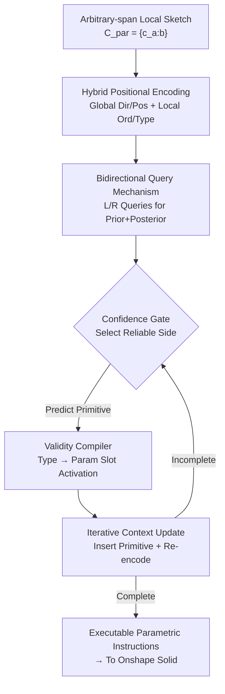

# Bidirectional Query-Driven Generation of Parametric CAD Sketch

**Conference**: CVPR 2026  
**Paper**: [CVF Open Access](https://openaccess.thecvf.com/content/CVPR2026/html/Liu_Bidirectional_Query-Driven_Generation_of_Parametric_CAD_Sketch_CVPR_2026_paper.html)  
**Code**: None (Private)  
**Area**: Parametric CAD Sketch Generation  
**Keywords**: Parametric CAD, sketch completion, bidirectional query, confidence guidance, hybrid positional encoding  

## TL;DR
CADSketcher reformulates parametric CAD sketch completion from a unidirectional "prefix → continuation" task into a "middle fragment → bidirectional outward expansion" query-driven generation. By integrating bidirectional query learning, confidence gating, and a validity compiler, it improves sketch-level accuracy on SketchGraphs from ~33% to 45.6% and reduces the invalid rate to zero.

## Background & Motivation

**Background**: Parametric CAD sketches (2D blueprints defining primitives like lines, circles, and arcs along with their constraints) are the foundation of 3D modeling. Current learning-based CAD modeling typically represents sketches as sequences of "modeling command tokens" and uses autoregressive Transformers (e.g., Vitruvion) to predict primitives from left to right, or enhances geometric reasoning via multi-modal cues (CAD-VLM).

**Limitations of Prior Work**: Existing methods treat sketch generation as a conditional generation problem—creating a whole sketch from image, text, or hand-drawn input—ignoring two essential characteristics of real CAD workflows: **incremental interaction** and **state dependency**. First, designers usually start from an existing partial geometry or rough intent and refine it gradually; these observed fragments may fall at any position (arbitrary-span) in the final sequence, not just the prefix. Second, each primitive added is attached to existing geometry, changing the topological state; early deviations propagate downstream, leading to global failure.

**Key Challenge**: Standard autoregressive architectures implicitly assume a "fixed, unidirectional construction order" (treating the current step as a strict prefix). However, in reality, a sketch can evolve along multiple reasonable trajectories, undergo frequent revisions, or involve modifications to early geometry. CAD sketch completion is essentially an **out-filling** problem (expanding outwards from a middle state) rather than standard infilling seen in NLP.

**Goal**: To enable models to internalize the incremental, non-linear construction logic of CAD sketches, inferring both **prior and posterior** modeling instructions from **arbitrary-span local sketches** to generate executable command sequences for standard CAD systems.

**Key Insight**: Completion is reformulated as **query-driven bidirectional generation**. Two sets of learnable directional queries (prior/posterior) probe missing instructions from a shared context representation. During inference, confidence determines the expansion direction at each step, while a validity compiler ensures primitive executability.

## Method

### Overall Architecture
The input is an arbitrary-span local sketch $C_{par}=\{c_{a:b}\}$ (where each command $c_i=(\omega_i,\varepsilon_i)$ consists of a primitive type $\omega_i$ and geometric parameters $\varepsilon_i$), and the output is the missing instructions $C_{oth}=C\setminus C_{par}$. The objective is $C_{oth}^{*}=\arg\max_{C_{oth}} p_\theta(C_{oth}\mid C_{par})$.

The workflow consists of two phases. **Phase 1: Bidirectional Sketch Learning (Training)**: Local sketch tokens are augmented with Hybrid Positional Encoding and processed by a 4-layer Transformer encoder $E$ to obtain context features $f_{par}$ (acting as semantic anchors). Learnable left/right queries are appended to the token sequence for an 8-layer decoder $D$ with cross-attention to simultaneously decode prior and posterior contexts. **Phase 2: Confidence-Guided Completion (Inference)**: An iterative "Select-Predict-Update" cycle uses a confidence gate to choose the most reliable expansion direction, predicts the next primitive, and inserts it back into the context to refresh the state until completion.

### Key Designs

**1. Bidirectional Query Mechanism: From Prefix Continuation to Outward Expansion**

Addressing the issue where missing instructions are distributed on both sides of a fragment, the model shifts from next-token prediction to $p_\theta(C_{oth}\mid C_{par})=\prod_{t=1}^{T} p_\theta(c_t\mid S_t, Q_d)$, where $S_t=C_{par}\cup C_{<t}$ is the current state and $Q_d\in\{Q_{prior},Q_{post}\}$ specifies the direction relative to $C_{par}$. $Q_{prior}$ and $Q_{post}$ are sets of **learnable query embeddings** (256-dim each) that guide the decoder. To allow parallel training, instructions are split into two branches anchored at the local context; the **prior branch is reversed at the primitive level** (maintaining internal token order) so that both branches appear as standard directional sequences to the decoder.

**2. Hybrid Positional Encoding (HyPE): Stable Priors for Arbitrary Spans**

To handle spans appearing at any position, the encoding is decoupled into global and local layers. The global layer includes direction encoding $E^{dir}_{global}$ and relative position encoding $E^{pos}_{global}$ (offset from the center). The local layer includes slot order $E^{ord}_{local}$ and type encoding $E^{type}_{local}$. The final encoding is:

$$E_{pos}=w_{dir}E^{dir}_{global}+w_{pos}E^{pos}_{global}+w_{ord}E^{ord}_{local}+w_{type}E^{type}_{local}$$

This ensures the model maintains a sense of "global progress" and "local semantics" simultaneously.

**3. Confidence Gate + Validity Compiler: Reliable Direction and Executability**

The **Confidence Gate** estimates the prediction probability for type tokens on both sides at each step, choosing the side with higher certainty to avoid error accumulation. The **Validity Compiler** utilizes the rigid parameter constraints of CAD: once a primitive type is predicted, it only activates corresponding parameter slots and rejects incompatible predictions, ensuring every primitive satisfies construction rules and geometric solvability.

**4. Iterative Context Update: Synchronizing with Evolving States**

Since sketch generation is state-driven, each new primitive is inserted back into its respective side of the context. The sequence is then re-encoded with HyPE to refresh context features. This prevents the "drift" associated with static context assumptions common in standard infilling.

### Loss & Training
A sequence-level loss $L_{seq}$ is used for supervision, applying position-wise cross-entropy to discretized tokens. An indicator function masks out observed primitives:

$$L_{seq}=-\sum_{i=1}^{T}\mathbb{1}[c_i\notin C_{par}]\log p_\theta(\hat{c}_i=c_i\mid S_i,Q_d)$$

Training parameters: 4-layer encoder, 8-layer decoder, 8 heads, FFN dim 1024, dropout 0.2, AdamW optimizer, 200 epochs on 4×A100.

## Key Experimental Results

### Main Results: Partial-to-Complete & Early Expansion
Evaluated on SketchGraphs (693k training, 38.5k test, 6-bit quantization).

| Task | Metric | Ours | Prev. SOTA | Gain |
|------|------|------|----------|------|
| Part-to-Complete | ACC_skt ↑ | **45.6** | 33.5 (Dual-AR) | +12.1 |
| Part-to-Complete | F1 ↑ | **59.2** | 48.8 (Dual-AR) | +10.4 |
| Part-to-Complete | IR ↓ | **0** | 0.03 (CAD-VLM) | -0.03 |
| Early Expansion | COV ↑ | **77.0** | 75.9 (Vitruvion) | +1.1 |
| Early Expansion | Unique ↑ | **84.9** | 80.3 (CAD-VLM) | +4.6 |

The model achieves state-of-the-art accuracy and a 0% invalid rate. Cross-dataset evaluation (CAD as a Language) confirms robustness, with ACC_skt at 14.1 vs. 7.96 for the runner-up.

### Ablation Study

| Configuration | ACC_skt | F1 | IR | Note |
|------|---------|-----|-----|------|
| Full Model | 45.6 | 59.2 | 0 | - |
| w/o BiQuery | 33.7 | 48.6 | 0 | Most significant drop |
| w/o HyPE | 42.6 | 57.0 | 0 | - |
| w/o ConfGate | 37.8 | 51.5 | 0 | Uses right-priority |
| w/o ValComp | 38.5 | 52.8 | 0.03 | IR increases |
| w/o CtxUpdate | 35.7 | 50.9 | 0 | Static context drift |

### Key Findings
- **Bidirectional Query is critical**: Removing it drops sketch accuracy from 45.6 to 33.7, as global constraints and semantic continuity break down.
- **Context Updates are vital**: The drop to 35.7 without updates confirms the "state dependency" hypothesis.
- **Validity Compiler is the sole guard of IR**: IR only becomes non-zero (0.03) when it is disabled.
- **Confidence Gate provides ~8 points gain**: Selecting the more certain side effectively suppresses error propagation.

## Highlights & Insights
- **Reconceptualizing as Out-filling**: Distinguishing CAD completion from standard NLP infilling by highlighting the lack of a standard direction is a primary contribution.
- **Parallel Contextual Learning**: Flipping the prior branch at the primitive level is a clever trick to enable parallel training for bidirectional queries.
- **"Pick the low-hanging fruit"**: The confidence gate turns "which side is easier to predict" into an explicit strategy, useful for any outward-expanding structured sequence generation.
- **Hard-coding constraints**: The validity compiler ensures 100% geometric executability, which is more efficient than post-hoc filtering.

## Limitations & Future Work
- **Lack of Explicit Constraints**: The model does not explicitly model geometric constraints (like parallelism or symmetry) as these are often decoupled from primitive drawing in CAD workflows.
- **Limited Primitive Support**: Currently covers Lines, Arcs, and Circles. Support for splines or complex curves remains future work.
- **Future Direction**: Injecting geometric constraints as additional supervision or decoding constraints to reduce visual distortion.

## Related Work & Insights
- **vs Vitruvion**: Autoregressive methods assume a fixed order; Ours supports arbitrary-span outward expansion (ACC_skt 45.6 vs 2.11).
- **vs CAD-VLM**: While CAD-VLM uses vision, Ours pure-token bidirectional approach achieves higher accuracy and lower IR.
- **vs Dual-AR**: Dual-AR uses independent branches; Ours shares context and uses parallel masking to avoid distributional shift between directions.

## Rating
- Novelty: ⭐⭐⭐⭐⭐ 
- Experimental Thoroughness: ⭐⭐⭐⭐ 
- Writing Quality: ⭐⭐⭐⭐ 
- Value: ⭐⭐⭐⭐ 

<!-- RELATED:START -->

- **Vitruvion**: Seff et al., "Vitruvion: A Generative Model of Parametric CAD Sketches," ICLR 2022.
- **DeepCAD**: Wu et al., "DeepCAD: A Deep Generative Network for Computer-Aided Design Models," ICCV 2021.
- **CAD-VLM**: "Multimodal Understanding for CAD Sketching," CVPR 2024.

<!-- RELATED:END -->

## Related Papers

- [\[CVPR 2026\] CAD-Refiner: A Unified Framework for CAD Generation and Iterative Editing](cad-refiner_a_unified_framework_for_cad_generation_and_iterative_editing.md)
- [\[CVPR 2026\] Bidirectional Normalizing Flow: From Data to Noise and Back](bidirectional_normalizing_flow_from_data_to_noise_and_back.md)
- [\[CVPR 2026\] Convolutional Neural Networks Driven by Content Similarity](convolutional_neural_networks_driven_by_content_similarity.md)
- [\[CVPR 2026\] A Unified Framework for Knowledge Transfer in Bidirectional Model Scaling](a_unified_framework_for_knowledge_transfer_in_bidirectional_model_scaling.md)
- [\[CVPR 2026\] EXOTIC: External Vision-driven Incomplete Multi-view Classification](exotic_external_vision-driven_incomplete_multi-view_classification.md)

<!-- RELATED:END -->
