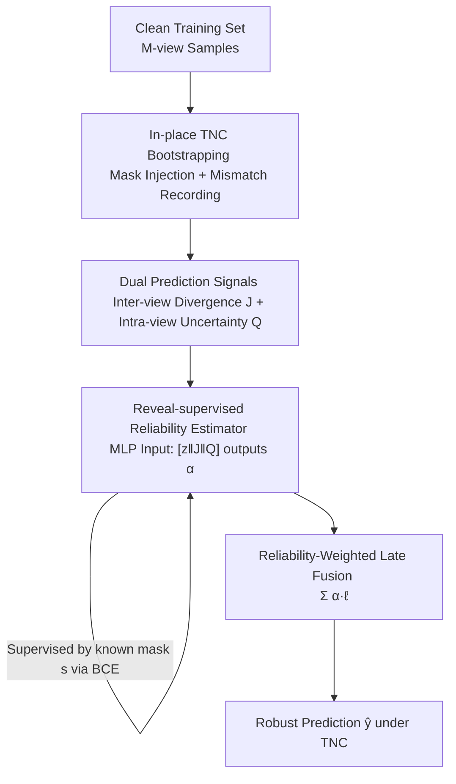

# Bootstrapping Multi-view Learning for Test-time Noisy Correspondence

**Conference**: CVPR 2026  
**Paper**: [CVF Open Access](https://openaccess.thecvf.com/content/CVPR2026/html/He_Bootstrapping_Multi-view_Learning_for_Test-time_Noisy_Correspondence_CVPR_2026_paper.html)  
**Code**: https://github.com/XLearning-SCU/2026-CVPR-BML  
**Area**: Multi-view Learning / Trusted Fusion  
**Keywords**: Test-time Noisy Correspondence, Multi-view Fusion, Reliability Estimation, Bootstrapping, Reveal-supervised

## TL;DR
Focusing on "view mismatch" (Test-time Noisy Correspondence, TNC) that occurs only during deployment, BML performs **in-place bootstrapping to inject controllable mismatches and record contaminated views** on a clean training set. This "revealed" knowledge is used to supervise a lightweight reliability estimator (incorporating both intra-view uncertainty and inter-view prediction divergence). During inference, the estimated reliability weights are used in a weighted fusion to suppress corrupted views, consistently outperforming existing SOTAs across 11 benchmarks.

## Background & Motivation
**Background**: Multi-view/multimodal learning enhances perception and decision-making by fusing complementary views (RGB, depth, text, etc.). A class of "trusted fusion" methods (such as TMC, ECML, FUML) estimates a reliability/uncertainty weight for each view, down-weighting suspicious views during fusion.

**Limitations of Prior Work**: In real-world deployment, factors like asynchronous sensor sampling or transient network congestion cause certain views to no longer correspond to the true label **at inference time**—a phenomenon the authors formally define as **Test-time Noisy Correspondence (TNC)**. Existing reliability weights are almost entirely **learned on clean, well-aligned training sets** and then rigidly applied to noisy inputs during inference.

**Key Challenge**: There exists an overlooked **train-test task gap**. During the training stage, the model never encounters mismatched samples, resulting in "blind estimation" of reliability that is often overconfident and poorly calibrated under TNC. Furthermore, these methods mostly infer uncertainty in an **unsupervised** indirect manner, lacking any direct supervision signal regarding whether a view is actually corrupted.

**Goal**: Without introducing any additional data or annotations, enable the model to explicitly "learn to fuse under TNC" by training the reliability estimator on the actual test-time distribution with explicit supervision signals.

**Key Insight**: Since mismatch involves "replacing view $m$ with view $m$ from a different sample," it can be **manually manufactured during training with known answers**. Thus, the authors intervene at both the "data" and "model" levels: creating controllable mismatches in-place and using "known contaminated positions" as supervision.

**Core Idea**: Replace the unsupervised uncertainty paradigm with a **reveal-supervised** paradigm. This involves bootstrapping an augmented set with TNC and using the manually injected noise positions as supervision labels to directly train a lightweight reliability estimator.

## Method

### Overall Architecture
BML is a plug-and-play late fusion framework. For an $M$-view classification task, each view $m$ passes through an encoder-classifier $[f(\cdot;\theta_m), g(\cdot;\phi_m)]$ to obtain features $z_i^{(m)}$, logits $\ell_i^{(m)}$, and a prediction distribution $p_i^{(m)}=\mathrm{softmax}(\ell_i^{(m)})$. The final fusion is a **view-adaptive weighted sum**:

$$\bar{\ell}_i=\sum_{m=1}^{M}\alpha_i^{(m)}\ell_i^{(m)},\qquad \bar{y}_i=\arg\max_{c}\bar{\ell}_{i,c}$$

The key to the method is obtaining the reliability weights $\alpha_i^{(m)}\in(0,1)$ for each view. The BML pipeline is: at the start of each epoch, bootstrap an augmented set with controllable mismatches from the clean training set (recording contaminated views) $\rightarrow$ interleave augmented and clean data for training $\rightarrow$ for each view, a lightweight MLP estimator $E(\cdot;\psi_m)$ processes three signals: "features + inter-view prediction divergence $J$ + intra-view uncertainty $Q$" to output reliability $\rightarrow$ supervise the estimator using the "contaminated positions" as known answers $\rightarrow$ perform weighted fusion using estimated $\alpha$ during inference.

### Key Designs

**1. In-place TNC Bootstrapping: Closing the gap from the data side**

The fundamental issue of existing methods is that the training set is clean while the test set contains mismatches; the estimator never "sees" the type of input it will handle later. BML **simulates TNC** directly on the training set: at the start of each epoch, a subset $\widetilde{S}$ is sampled from $N$ samples ($|\widetilde{S}|=\lfloor\rho N\rfloor$, where $\rho$ is the augmentation rate). For each sample $i$ in the subset, a view-level mask $s_i=(s_i^{(1)},\dots,s_i^{(M)})\in\{0,1\}^M$ is drawn, constrained to a "minority mismatch" range:

$$1\le\sum_{m=1}^{M}s_i^{(m)}\le\Big\lfloor\tfrac{M}{2}\Big\rfloor$$

This ensures at least one view is mismatched while at most half are corrupted, guaranteeing that the remaining clean views can still identify the label. When $s_i^{(m)}=1$, the input for view $m$ is **replaced with view $m$ from another sample $j$** ($x_j^{(m)}$) within the bootstrap pool (keeping the label $y_i$ constant to create a mismatch), while $s_i^{(m)}=0$ keeps the original view. Masks for samples outside the subset are always 0. "In-place + per-epoch resampling" is crucial—it requires no external data and ensures changing mismatch patterns to prevent the estimator from memorizing fixed corruption.

**2. Reveal-supervised Reliability Estimator: Using known answers of artificial noise**

Since the mismatches are self-generated, **it is known which views are contaminated**—the missing supervision signal in unsupervised methods. BML uses a lightweight MLP $E(\cdot;\psi_m)$ to map the evidence $u_i^{(m)}$ of each view to a reliability score $\alpha_i^{(m)}=\sigma[E(u_i^{(m)};\psi_m)]\in(0,1)$. The complement of the mask $1-s_i^{(m)}$ (clean=1, contaminated=0) serves as the label for Binary Cross-Entropy (BCE) supervision:

$$\mathcal{L}_w(\psi)=-\frac{1}{NM}\sum_{i=1}^{N}\sum_{m=1}^{M}\Big[(1-s_i^{(m)})\log\alpha_i^{(m)}+s_i^{(m)}\log(1-\alpha_i^{(m)})\Big]$$

This objective pushes the reliability of clean views toward 1 and noisy views toward 0. Compared to "unsupervisely modeling uncertainty and hoping it equals reliability," this approach **directly tells the model the answer**, making the weights more stable and interpretable.

**3. Dual Prediction-derived Signals: Augmenting features with "divergence" and "ambiguity"**

Learning reliability solely from features $z_i^{(m)}$ is insufficient for detecting mismatches, as features do not directly quantify noise. BML adds two signals derived from predictions. One is **inter-view prediction divergence**, measured by the symmetrized Jeffreys divergence between view $m$ and others:

$$J_i^{(m)}=\frac{1}{M-1}\sum_{n\neq m}\Big[D_{KL}(p_i^{(m)}\|p_i^{(n)})+D_{KL}(p_i^{(n)}\|p_i^{(m)})\Big]$$

A larger $J_i^{(m)}$ indicates the view deviates from the consensus. The second is **intra-view prediction uncertainty**, measured by normalized entropy:

$$Q_i^{(m)}=-\log\Big[1+\frac{\sum_{c=1}^{C}p_{i,c}^{(m)}\log p_{i,c}^{(m)}}{\log C}\Big]$$

$Q$ is smaller for confident predictions and larger for ambiguous ones. $J$ detects "alignment with others" while $Q$ detects "self-certainty." The three signals are concatenated as input:

$$u_i^{(m)}=[z_i^{(m)}\,\|\,J_i^{(m)}\,\|\,Q_i^{(m)}]\in\mathbb{R}^{d+2}$$

### Loss & Training
The framework performs end-to-end joint optimization. Classification uses Cross-Entropy on fused predictions $\mathcal{L}_{cls}=-\frac{1}{|\mathcal{B}|}\sum_{i\in\mathcal{B}}\log\hat{p}_{i,y_i}$, and the total loss is:

$$\mathcal{L}=\mathcal{L}_{cls}+\lambda\,\mathcal{L}_w$$

The hyperparameter $\lambda>0$ balances the task objective and bootstrap supervision ($\lambda=1.0$ for feature vector datasets, $\lambda=50.0$ for the raw SUN R-D-T dataset). During inference, $\hat{J}$, $\hat{Q}$, and $\alpha$ are computed for potential noisy inputs to perform weighted fusion **without any explicit noise indicator**, as the estimator has learned to automatically identify and suppress inconsistent views.

## Key Experimental Results

### Main Results
On 11 benchmarks (10 feature vector datasets + 1 raw dataset SUN R-D-T), BML was compared against 9 SOTAs including trusted methods (TMC, UIMC, ECML, CCML, ETF, TMCEK, FUML) and deterministic methods (MAMC, RML) across noise ratios $\eta\in\{0\%, 50\%, 100\%\}$.

| Noise Ratio | Dataset Group | Prev. SOTA Baseline | BML | Gain |
|-------------|---------------|----------------------|-----|------|
| 0% | Caltech/Leaves/HW/LandUse/Scene | 89.38 (FUML) | **92.45** | +3.07 |
| 50% | Above | 83.49 (FUML) | **89.02** | +5.53 |
| 100% | Above | 78.11 (FUML) | **85.39** | +7.28 |
| 0% | CCV/Fashion/NUS-OBJ/AWA/YouTubeFace | 64.51 (ETF) | **69.79** | +5.28 |
| 50% | Above | 57.04 (FUML) | **63.72** | +6.68 |
| 100% | Above | 51.32 (FUML) | **57.83** | +6.51 |

The advantage of BML becomes more pronounced as noise increases, confirming it successfully bridges the train-test gap. Even in 0% clean scenarios, BML leads significantly (e.g., +6.03% over RML on LandUse), showing reveal-supervised learning utilizes per-view quality even when aligned.

### Ablation Study
Ablation results under 50% TNC (AVG. over 7 datasets):

| Configuration | AVG. | Description |
|---------------|------|-------------|
| FULL | **79.38** | Complete BML |
| W/O $\mathcal{L}_w$ | 71.77 | Removing reveal-supervised loss drops **7.61** (most critical) |
| W/O on-the-fly | 74.25 | Without per-epoch resampling drops 5.13 |
| W/O $J$ | 78.35 | Removing inter-view divergence drops 1.03 |
| W/O $Q$ | 79.14 | Removing intra-view uncertainty drops 0.24 |

### Key Findings
- **Reveal-supervised loss $\mathcal{L}_w$ is most critical**: Removing it results in the largest performance drop, proving that using known noise positions as supervision is the core differentiator.
- **On-the-fly resampling is essential**: Fixed corruption patterns lead to a drop of 5.13, verifying that diverse bootstrapped mismatches prevent overfitting.
- **Dual prediction signals provide incremental gains**: $J$ is more useful than $Q$, as inter-view disagreement more directly exposes the cross-view inconsistency inherent in mismatches.
- **Reliability calibration is reasonable**: Visualizations show distinct separation in $\alpha$ distributions for clean vs. noisy views.

## Highlights & Insights
- **Formalizing TNC and the train-test task gap**: This addresses a deployment-side problem often ignored by previous research focused only on training-time NC.
- **Reveal-supervised paradigm**: Converting unsupervised uncertainty estimation into supervised binary classification is elegant, stable, and requires no manual labeling. This "simulating noise to generate supervision" logic is transferable to other test-time shift problems.
- **Plug-and-play late fusion**: It modifies only the fusion weights without altering the backbone encoders, ensuring low migration costs and performance gains even on clean data.

## Limitations & Future Work
- **TNC Assumes "majority views are aligned"**: The method is primarily validated in scenarios where at most half the views are corrupted.
- **Mismatch via sample swapping**: This simulates view-label mismatches, but real-world degradation might include complex noise, blur, or temporal misalignments. The effectiveness against non-replacement types of corruption requires further study.
- **Calibration depends on augmentation distribution**: If test-time mismatch statistics differ significantly from bootstrapping, the supervision effectiveness might decrease.
- Most experiments utilize feature vector datasets; validation on large-scale raw multimodal data remains relatively limited.

## Related Work & Insights
- **vs Trusted Multi-view Fusion (TMC / ECML / FUML)**: While these methods use EDL or fuzzy set theory for unsupervised estimation on clean sets, BML avoids the resulting train-test gap by using supervised reliability via bootstrapping.
- **vs Training-time Noisy Correspondence**: BML extends the scope of NC from the training phase to the **deployment/inference phase**.
- **vs Deterministic Multi-view Methods (MAMC / RML)**: These rely on representation quality but fail under TNC; BML is significantly more robust by explicitly modeling test-time mismatches.

## Rating
- Novelty: ⭐⭐⭐⭐⭐ Formalizes the overlooked TNC problem and solves it with a reveal-supervised paradigm.
- Experimental Thoroughness: ⭐⭐⭐⭐⭐ Extensive testing across 11 benchmarks, 3 noise levels, and 10 seeds.
- Writing Quality: ⭐⭐⭐⭐ Clear problem definition and methodology. 
- Value: ⭐⭐⭐⭐⭐ A plug-and-play, deployment-oriented robust fusion approach.

## Related Papers

- [\[CVPR 2026\] Cluster-aware Anchor Learning for Multi-View Clustering](cluster-aware_anchor_learning_for_multi-view_clustering.md)
- [\[CVPR 2026\] Neural Collapse in Test-Time Adaptation](neural_collapse_in_test-time_adaptation.md)
- [\[CVPR 2026\] Cross-View Distillation and Adaptive Masking for Incomplete Multi-View Multi-Label Classification](cross-view_distillation_and_adaptive_masking_for_incomplete_multi-view_multi-lab.md)
- [\[CVPR 2026\] Learning Anchor in Dual Orthogonal Space for Fast Multi-view Clustering](learning_anchor_in_dual_orthogonal_space_for_fast_multi-view_clustering.md)
- [\[CVPR 2026\] Multi-Hierarchical Contrastive Spectral Fusion for Multi-View Clustering](multi-hierarchical_contrastive_spectral_fusion_for_multi-view_clustering.md)

<!-- RELATED:END -->

<!-- RELATED:START -->

## Related Papers

- [\[CVPR 2026\] PAUL: Uncertainty-Guided Partition and Augmentation for Robust Cross-View Geo-Localization under Noisy Correspondence](paul_uncertainty-guided_partition_and_augmentation_for_robust_cross-view_geo-loc.md)
- [\[CVPR 2026\] Neural Collapse in Test-Time Adaptation](neural_collapse_in_test-time_adaptation.md)
- [\[CVPR 2026\] DF²-VB: Dual-level Fuzzy Fusion with View-specific Boosting for Multi-view Multi-label Classification](df2-vb_dual-level_fuzzy_fusion_with_view-specific_boosting_for_multi-view_multi-.md)
- [\[CVPR 2026\] Debiased Sample Selection for Learning with Noisy Labels](debiased_sample_selection_for_learning_with_noisy_labels.md)
- [\[CVPR 2026\] Plug-and-Play Incomplete Multi-View Clustering via Janus-Faced Affinity Learning with Topology Harmonization](plug-and-play_incomplete_multi-view_clustering_via_janus-faced_affinity_learning.md)

<!-- RELATED:END -->
