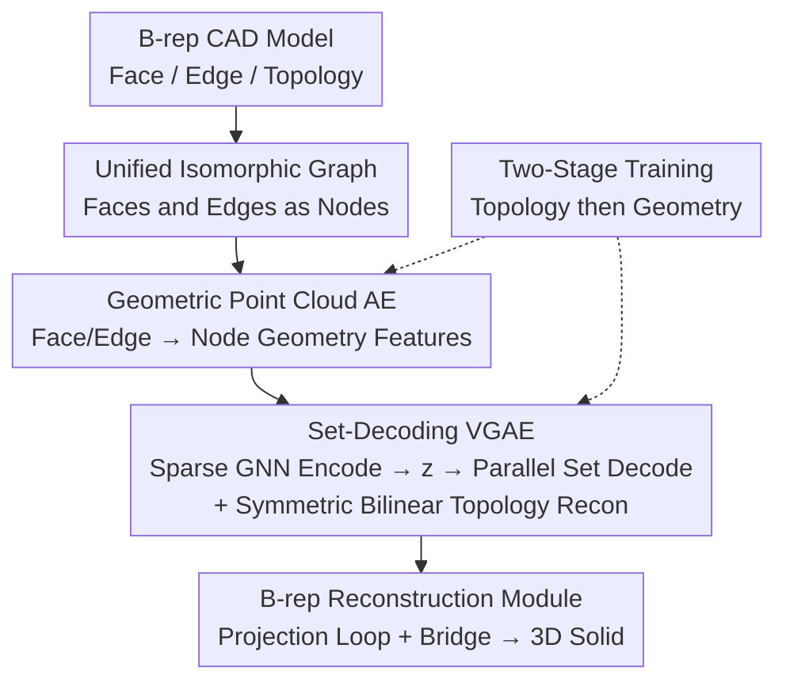

# BrepVGAE: Variational Graph Autoencoder with Unified Latent Representation for B-rep

**Conference**: CVPR 2026  
**Paper**: [CVF Open Access](https://openaccess.thecvf.com/content/CVPR2026/html/Guo_BrepVGAE_Variational_Graph_Autoencoder_with_Unified_Latent_Representation_for_B-rep_CVPR_2026_paper.html)  
**Code**: None  
**Area**: B-rep / CAD Representation Learning  
**Keywords**: B-rep generation, Variational Graph Autoencoder, Set decoding, Topology-geometry coupling, CAD  

## TL;DR
BrepVGAE unifies heterogeneous "faces" and "edges" in CAD B-rep models as nodes of a single sparse isomorphic graph. Using a Variational Graph Autoencoder (VGAE), it compresses the graph into a global latent vector and employs a set-based parallel decoder to reconstruct the entire topological adjacency and continuous geometric features in a single pass. It significantly outperforms methods like BrepGen in reconstruction accuracy, topological validity, and generation diversity.

## Background & Motivation
**Background**: Boundary Representation (B-rep) is the underlying data structure of modern CAD systems, describing a 3D solid via "faces / edges / vertices + their topological relationships." To enable generative models to learn and produce B-rep directly, mainstream approaches either treat CAD as operation sequences (e.g., DeepCAD using Transformers for sketch+parameter sequences), treat B-rep as graphs (e.g., UV-Net, BRepNet for recognition/segmentation), or use diffusion/autoregressive generation (e.g., SolidGen for autoregressive vertex/edge/face generation, BrepGen with structured latent-geometry trees).

**Limitations of Prior Work**: The authors identify three fundamental challenges. First, the strong coupling of geometry and topology often leads to invalid "non-watertight" results where faces do not align. Second, B-rep graphs are extremely sparse, making it difficult for standard graph generative models to adapt to complex CAD structures. Third, existing graph generation methods generally lack a mechanism to robustly reconstruct **continuous node features**; they mostly reconstruct adjacency matrices (link prediction) or discrete labels, which is insufficient for CAD where each node carries continuous geometry (UV surfaces, curve samples).

**Key Challenge**: A deeper contradiction lies in the **heterogeneous** nature of B-rep graphs—faces and edges are fundamentally different geometric primitives (2D surfaces vs. 1D curves). Traditional graph-based representations cannot establish a unified description for both, limiting the ability to encode and decode geometry and topology simultaneously within a shared latent space.

**Goal**: Construct a framework capable of **holistically** encoding and decoding a complete B-rep—recovering topological adjacency and continuous geometric features of all nodes from a single latent vector while ensuring topological validity.

**Key Insight**: The authors observe that since the "heterogeneity" of faces and edges is the bottleneck, they should be **flattened into the same entity**. By treating edges as graph nodes and allowing face and edge nodes to share the same representation, the graph is transformed from a heterogeneous graph into an isomorphic sparse graph. Consequently, downstream message passing, pooling, and decoding can be handled by unified operators.

**Core Idea**: Unify faces and edges as isomorphic graph nodes + use a set-parallel decoder to reconstruct "topology + continuous geometry" simultaneously from a single latent, supported by a two-stage training strategy to stabilize geometry-topology coupling.

## Method

### Overall Architecture
The input to BrepVGAE is a B-rep CAD model (faces, edges, and topology), and the output is a reconstructed/generated complete 3D solid. The pipeline consists of four modules: first, faces and edges are unified into a **sparse isomorphic graph**, where each face/edge is compressed into node geometric features via a **point cloud autoencoder**. These features are fed into a **set-decoding VGAE**—where a sparse GNN encodes the graph and multi-head attention pooling yields a global latent $z$. A set-parallel decoder with learnable queries extracts all node features from $z$ at once, while a symmetric bilinear layer reconstructs the adjacency matrix. Finally, the **B-rep Reconstruction Module** assembles the predicted topology and geometry into a watertight solid using projection loops and bridging algorithms. A **two-stage training strategy** is employed throughout, freezing geometry to learn topology first before progressively introducing geometric reconstruction.

### Key Designs

**1. Unified Isomorphic Graph Representation: Faces and Edges as the Same Node Type**

To address the heterogeneity issue, the authors construct a **sparse isomorphic graph** $X \in \mathbb{R}^{N \times d}$, where $N$ is the total number of face and edge nodes. In this view, edges are no longer just connections between faces but are **nodes** themselves. Faces and edges share a unified representation of dimension $d = 33$, and the graph-level latent dimension is $L = 256$. The adjacency matrix only preserves **Face–Edge** and **Edge–Edge** sub-blocks without self-loops. This transforms complex B-rep topology into a unified, learnable, and highly sparse isomorphic graph. Graph augmentation (random node dropping, edge perturbation) is applied during training, with masks and adjacency matrices updated synchronously to avoid isolated edges. This representation is the foundation: because faces and edges are isomorphic, subsequent sparse GNNs, attention pooling, and set decoding can use a single set of operators.

**2. Geometry Point Cloud Autoencoder: High-Fidelity Geometry for Faces and Edges**

Abstracting geometry into nodes is insufficient; each node must carry geometric features capable of recovering real surfaces/curves. The authors design a dedicated **point cloud autoencoder** for each: faces use a downsampling (DS) encoder (convolution-transpose convolution) on point clouds sampled from surfaces, while edges use 1D Residual Blocks with dilated convolutions to preserve curve details without increasing model size. Both output features of shape $[B, F, 32]$ and use $\tanh$ to bound outputs to $[-1, 1]$ for stability and alignment. A 1D type vector is appended to indicate if a node is a face or an edge (totaling $d=33$). The geometric loss is a weighted sum of MSE and symmetric Chamfer Distance (CD). Ablations show that removing the CD loss degrades Face VAE CD from 0.619 to 1.126, proving CD is vital for fidelity.

**3. Set Parallel Decoding + Symmetric Bilinear Topology Reconstruction: One-shot Generation**

This core design addresses "difficult continuous feature reconstruction" and "inefficient autoregressive generation." **Graph Encoding**: Multi-layer isomorphic sparse GNNs perform message passing (decoupled linear transforms for messages and self-loops, normalized aggregation by degree, residual updates) to obtain node embeddings $H \in \mathbb{R}^{N \times d}$. Multi-head attention pooling with learnable queries $q$ compresses the graph into a vector $h$, which MLP maps to $\mu$ and $\log \sigma^2$. Reparameterization yields the global latent:

$$z = \mu + \epsilon \odot \exp\!\Big(\tfrac{1}{2}\log \sigma^2\Big), \quad \epsilon \sim \mathcal{N}(0, I)$$

This $z$ is the sole condition for decoding. **Set Parallel Decoding**: To avoid node-by-node generation, $z$ is linear-mapped and expanded into $M$ parallel key/value pairs $K, V \in \mathbb{R}^{M \times d}$. $N_{\max}$ learnable queries $Q$ interact with $K, V$ through Pre-LN residual cross-attention + FFN: $\tilde U^{(t)} = Q^{(t)} + \mathrm{MHA}(\mathrm{LN}(Q^{(t)}), \mathrm{LN}(K), \mathrm{LN}(V))$, $U^{(t)} = \tilde U^{(t)} + \mathrm{FFN}(\mathrm{LN}(\tilde U^{(t)}))$. Node index and type embeddings are added before a final self-attention layer yields unified node representation $U$. Type-conditioned linear projections produce face features $F$, edge features $E$, and classification heads $C(U) \in \mathbb{R}^{N_{\max}\times 3}$. **Topology Reconstruction**: A symmetric bilinear layer reconstructs the adjacency matrix in one shot. Face-edge connection scores are $S_{FE}(i,j) = x_{f_i}^\top W_{FE} x_{e_j} + b_{FE}$, where bias $b_{FE}$ is initialized with the baseline positive-case rate of the training set. Edge-edge connections use explicit symmetric parameterization $W_{EE} = \mathrm{tril}(A) + \mathrm{tril}(A,-1)^\top$ to exclude self-loops. Scores pass through sigmoid with label smoothing (clipped to $[0.05, 0.95]$) to prevent overconfidence. This mechanism allows **parallel** node generation and **one-shot** adjacency reconstruction, overcoming the inefficiency of autoregressive models.

**4. Two-stage Training + Hungarian Matching: Decoupling Geometry and Topology**

The set decoder produces an **unordered set**, which cannot be directly aligned with ground truth nodes. The authors use the **Hungarian algorithm** for one-to-one optimal matching using squared Euclidean distance $C_{ij} = \|u_i - v_j\|_2^2$ as the cost matrix. The resulting feature matching loss is $L_{\text{feat}} = \frac{1}{n}\sum_i \|u_i - v_{\pi(i)}\|_2^2$. CAD physical priors are injected via **degree convergence constraints**: ideally, each edge connects to 2 faces, so a penalty $L_{\text{deg}}$ is applied for deviations. Crucially, the **two-stage training** strategy freezes the geometry autoencoder in the first stage ($\lambda_{\text{geo}}=0$), training only topology and type heads ($L_{\text{Graph}} = \lambda_{\text{BCE}}L_{\text{adj}} + \lambda_{\text{deg}}L_{\text{deg}} + \lambda_{\text{type}}L_{\text{type}}$). The second stage progressively introduces geometry with a linear warm-up ($L_{\text{Geometry}} = \lambda_{\text{geo}}(\lambda_{\text{MSE}}L_{\text{MSE}} + \lambda_{\text{CD}}L_{\text{CD}})$). The total loss is $L = L_{\text{Graph}} + L_{\text{Geometry}}$. This prevents early coarse geometric errors from polluting topological learning.

### Loss & Training
- Total loss $L = L_{\text{Graph}} + L_{\text{Geometry}}$, enabled in two stages.
- Training spans 600 epochs across three phases: Stage 1 (200 ep) freezes geometry; Stage 2-1 (200 ep) linearly increases geometry loss weight from 0 to 1; Stage 2-2 (200 ep) end-to-end joint training.
- Augmentation control: Node/edge perturbations are active in the first phase and disabled later for stable convergence.
- Implementation: PyTorch, 2×NVIDIA H20 GPUs, mixed precision, AdamW (lr=5e-4), batch size 256.

## Key Experimental Results

### Main Results
Unconditional generation comparison on the DeepCAD dataset (preprocessed: removed non-polygonal faces, faces ≤30, edges ≤90). Ours(\*N/\*S/\*H) represent Nearest Neighbor / Sinkhorn / Hungarian matching strategies.

| Method | COV↑ | MMD↓ | JSD↓ | Novel↑ | Unique↑ | Valid↑ |
|------|------|------|------|--------|---------|--------|
| DeepCAD | 65.46 | 1.29 | 1.67 | 87.4 | 89.3 | 46.1 |
| SolidGen | 71.03 | 1.08 | 1.31 | 99.1 | 96.2 | 60.3 |
| BrepGen | 73.87 | **1.04** | 1.28 | 99.8 | 99.7 | 62.9 |
| Ours(\*N) | 73.40 | 1.34 | 1.30 | 97.2 | 97.0 | 63.7 |
| Ours(\*S) | 78.71 | 1.18 | 1.25 | 99.8 | 99.8 | 70.7 |
| **Ours(\*H)** | **79.82** | 1.13 | **1.21** | 98.2 | 98.1 | **72.6** |

For geometric reconstruction, Surface VAE reduced CD from 1.285 (BrepGen) to 0.619 (−51.8%). Edge VAE CD was reduced from 1.117 to 0.658 (approx. −41%). On the ABC dataset (faces ≤50, edges ≤150), Ours(\*H) achieved 73.51 COV and 63.1 Valid, outperforming BrepGen.

### Ablation Study
Ablations performed on DeepCAD 60K models (600 epochs, Hungarian matching).

| Configuration | COV↑ | MMD↓ | JSD↓ | Precision↑ | ELBO↑ |
|------|------|------|------|-----------|-------|
| **GNN:** GAT | 60.46 | 1.38 | 1.56 | 68.58 | -4.89 |
| **GNN:** GCN | 68.78 | 1.18 | 1.33 | 60.21 | -3.65 |
| **GNN:** Ours(SparseGNN) | **78.75** | 1.18 | 1.27 | **70.96** | **-3.21** |
| **Decoding:** Single-Query | 65.30 | 1.48 | 1.58 | 60.81 | -3.95 |
| **Decoding:** Fixed-Queries | 63.53 | 1.52 | 1.62 | 58.92 | -4.66 |
| **Decoding:** No-KV-Expansion | 70.25 | 1.35 | 1.45 | 65.40 | -3.80 |
| **Training:** End-to-End | 60.20 | 1.52 | 1.62 | 58.68 | -4.27 |
| **Training:** Freeze-Geo Whole | 76.35 | 1.26 | 1.37 | 68.80 | -3.45 |
| **Training:** Ours(Two-Stage) | **78.75** | **1.18** | **1.27** | **70.96** | **-3.21** |

### Key Findings
- **Two-stage training is critical**: End-to-end joint training resulted in a COV of only 60.20, while the two-stage approach reached 78.75 (+18.5), confirming that early geometric errors hinder topological learning.
- **Sparse GNN outperforms GAT/GCN**: GAT's feature smoothing actually made geometry decoding harder. Sparse GNN is more compatible with the extreme sparsity of B-rep.
- **Multi-slot learnable queries are indispensable**: Single-query, fixed-query, and no-KV-expansion variations caused significant drops in COV.
- **Precision being lower than Valid is not a bug**: The authors explain that because the set decoder is generative, one GT face node might be generated as two topologically valid face nodes, lowering Precision under strict matching while maintaining high Validity.
- **Latent space for part retrieval**: The 256-dim latent vectors allow for robust part retrieval across geometry and topology dimensions.

## Highlights & Insights
- **Isomorphism resolves heterogeneity**: Instead of complex heterogeneous graph operators, the authors simply uplifted edges to nodes, unifying the entire pipeline.
- **Set Decoding + Symmetric Bilinear = One-pass graph generation**: Replaces autoregressive methods and allows simultaneous reconstruction of continuous geometric features and sparse adjacency.
- **Physical priors as regularization**: Encoding CAD-specific knowledge (e.g., an edge connects to 2 faces) into the loss function $L_{\text{deg}}$ is a strong example of domain-informed neural networks.
- **Curriculum-style two-stage training**: Learning the topological skeleton before progressively adding geometric detail is a valuable strategy for any task involving strongly coupled structures and continuous attributes.

## Limitations & Future Work
- **Reliance on regularized preprocessing**: Evaluation was performed on simplified models (polygonal faces only, capped node counts); performance on large-scale industrial B-reps with free-form surfaces is unproven.
- **MMD is not uniformly leading**: BrepGen maintains a slight lead in MMD (1.04 vs 1.13), indicating the method might not fully match the reference set density in all respects.
- **Precision–Valid mismatch requires careful interpretation**: While explained, the low Precision suggests that Precision may be a misleading signal for monitoring or early stopping.
- **Reconstruction relies on manual algorithms**: The assembly still relies on hand-crafted geometry algorithms (DFS for loops, bridging for G2 continuity), limiting the degree of end-to-end integration and potential robustness in complex topologies.

## Related Work & Insights
- **vs. Graph VAE/JTVAE**: Classic graph VAEs mostly perform link prediction via inner-product decoding or decode small graphs with labels. This work treats B-rep as a **typed sparse isomorphic graph** and uses set parallel decoding for **continuous geometric embeddings** per node.
- **vs. BrepGen / DTGBrepGen**: BrepGen uses structured trees + diffusion. This method unifies geometry and topology into a **single latent** and decodes them in one shot, using a two-stage curriculum to stabilize high-fidelity reconstruction.
- **vs. UV-Net / BRepNet**: These are discriminative pipelines. BrepVGAE uses similar topological message passing but targets **generation**, demonstrating that a shared latent can also be effective for retrieval and discovery.

## Rating
- Novelty: ⭐⭐⭐⭐⭐ The isomorphic unification and set-parallel one-shot generation represent a self-consistent new paradigm for B-rep generation.
- Experimental Thoroughness: ⭐⭐⭐⭐ Covers main results, geometry fidelity, four ablation groups, and cross-dataset testing, though it lacks stress tests on extra-large models.
- Writing Quality: ⭐⭐⭐ Generally clear with full formulas, but contains minor inconsistencies between text and table figures.
- Value: ⭐⭐⭐⭐ Provides a feasible path for unified latent CAD generation with potential for downstream transfer.

<!-- RELATED:START -->

## Related Papers

- [\[CVPR 2026\] Negative Binomial Variational Autoencoders for Overdispersed Latent Modeling](negative_binomial_variational_autoencoders_for_overdispersed_latent_modeling.md)
- [\[CVPR 2026\] HyperNAS: Enhancing Architecture Representation for NAS Predictor via Hypernetwork](hypernas_enhancing_architecture_representation_for_nas_predictor_via_hypernetwor.md)
- [\[CVPR 2026\] FedSDR: Federated Graph Learning with Structural Noise Detection and Reconstruction](fedsdr_federated_graph_learning_with_structural_noise_detection_and_reconstructi.md)
- [\[CVPR 2026\] Graph Attention Prototypical Network for Robust Few-Shot Classification](graph_attention_prototypical_network_for_robust_few-shot_classification.md)
- [\[CVPR 2026\] FedSST: Rethinking Fair Federated Graph Learning under Structural Shift](fedsst_rethinking_fair_federated_graph_learning_under_structural_shift.md)

<!-- RELATED:END -->
