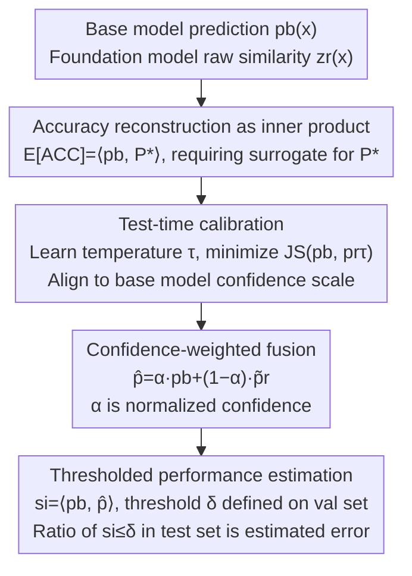

# Bridging Domain Expertise and Generalization for Performance Estimation

**Conference**: CVPR 2026  
**Paper**: [CVF Open Access](https://openaccess.thecvf.com/content/CVPR2026/html/Li_Bridging_Domain_Expertise_and_Generalization_for_Performance_Estimation_CVPR_2026_paper.html)  
**Code**: None  
**Area**: Model Evaluation / Performance Estimation  
**Keywords**: Performance Estimation, Distribution Shift, Foundation Models, Test-Time Calibration, Confidence Fusion  

## TL;DR
To estimate model accuracy on unlabeled test sets under distribution shift, this paper moves beyond relying solely on the evaluated model's own outputs by introducing a foundation model (CLIP/SigLIP) as an "external reference." It first calibrates the foundation model's predictions to the same confidence scale as the evaluated model using JS divergence, then fuses them via confidence-weighted averaging into a "pseudo-ground-truth" distribution. Accuracy is estimated by the consistency between the base model's predictions and this fused distribution, reducing the average MAE from a sub-optimal 6.72% to 6.53%.

## Background & Motivation

**Background**: Performance estimation aims to solve the problem of predicting the accuracy of a trained classifier on an **unlabeled** test set without accessing ground-truth labels. While straightforward under i.i.d. conditions, real-world deployments often violate this assumption through covariate shift, leading to significant accuracy drops. Unlabeled accuracy estimation has thus become a critical requirement for deploying reliable models. Mainstream approaches include agreement-based metrics, confidence statistics (AC/DoC/ATC), and prediction distribution characterization (ProjNorm/COT).

**Limitations of Prior Work**: Despite methodological variety, these indicators share a common vulnerability: **they rely entirely on the evaluated model's own outputs**. When distribution shifts occur, the model's self-predictions become biased; confidence no longer correlates positively with accuracy, and agreement scores may even increase while the model consistently makes incorrect predictions. Effectively, using a biased model's output to infer its own accuracy amplifies the existing bias.

**Key Challenge**: The evaluated model (base model) possesses **domain expertise** from task-oriented training but suffers from **generalization collapse** and biased predictions under distribution shift. To break this "self-certification" cycle, an external knowledge source that is **independent of the base model and highly generalizable** must be introduced for cross-validation.

**Goal**: To find a more reliable surrogate of ground-truth than the model's own output to anchor accuracy estimation.

**Key Insight**: Foundation models (e.g., CLIP, SigLIP) are trained on massive, diverse datasets and possess inherent cross-domain generalization, while the base model retains domain expertise. These two are **complementary**—one is broad in generalization, the other deep in specialization. Integrating them should theoretically yield a more stable reference signal than either alone. However, direct integration is difficult because the models come from different training paradigms and feature spaces with incompatible confidence scales. Furthermore, distribution shift causes severe miscalibration (especially in CLIP, where raw cosine similarities often resemble uniform distributions).

**Core Idea**: The proposed **FRAP (Fused Reference Alignment Prediction)** first **calibrates and aligns** the foundation model's predictions to the base model's confidence scale to establish a shared probability space. It then performs **confidence-weighted fusion** to create a "pseudo-ground-truth" distribution. Finally, accuracy is estimated based on the consistency between the base model's predictions and this fused distribution.

## Method

### Overall Architecture

FRAP is built upon an **accuracy reconstruction**: the expected accuracy on a target domain can be expressed as the sample-wise inner product between the "evaluated model's prediction distribution" and the "ground-truth one-hot distribution" (see Key Design 1). The base model's predictions are obtained via a forward pass, but the ground-truth distribution $P^*$ is unknown. FRAP constructs a **fused distribution $\hat{P}$ as a surrogate for $P^*$**.

The pipeline consists of three sequential steps: ① **Test-time calibration**: Raw similarities from the foundation model are used to learn a temperature $\tau$ that aligns its prediction distribution with the base model; ② **Confidence-weighted fusion**: The calibrated foundation model prediction and the base model prediction are blended based on their respective confidence scores; ③ **Thresholded performance estimation**: The inner product of the base model prediction and the fused distribution serves as a sample score. A threshold $\delta$ is determined on a labeled validation set; the proportion of test samples with scores below $\delta$ constitutes the estimated error rate.

### Key Designs

**1. Reconstructing accuracy as the inner product of "Prediction ↔ Ground-truth": Establishing a theoretical surrogate target**

Performance estimation requires an optimizable target. This paper rewrites the empirical accuracy on the target domain by introducing the one-hot ground-truth distribution $P^*(\cdot|x_i)$. The expected accuracy is approximated as the mean sample-wise inner product:

$$\mathbb{E}[\text{ACC}] \approx \frac{1}{N}\sum_{i=1}^{N}\sum_{j=1}^{K} \hat{P}_\theta(j|x_i)\, P^*(j|x_i).$$

This step explicitly splits accuracy estimation into two parts: $\hat{P}_\theta$ (obtained from the evaluated model) and $P^*$ (unknown). The problem is reduced to "**how to construct a good surrogate for $P^*$ without labels**." Unlike methods using confidence or agreement as heuristic scores, this inner-product form provides FRAP with a clear mathematical grounding.

**2. Test-time calibration: Aligning the foundation model to the base model's scale using JS divergence**

Direct fusion is unfeasible due to vast differences in confidence scales: the base model (trained with cross-entropy) produces sharp peaks, while foundation models (trained with contrastive learning) produce **nearly uniform** distributions. CLIP's raw cosine similarity often yields top-1 probabilities only slightly higher than other classes. 

Instead of using a fixed temperature, FRAP employs **dynamic calibration**. It learns a temperature $\tau$ on the unlabeled test set by minimizing the JS divergence between the base model's prediction $\hat{P}_\theta$ and the foundation model's temperature-scaled prediction $P^r_\tau$:

$$\mathcal{L}_{\text{cal}}(x;\tau) = \text{JS}\!\left(\hat{P}_\theta(\cdot|x),\, P^r_\tau(\cdot|x)\right),\qquad \tau^* = \arg\min_{\tau>0}\, \mathbb{E}_{x\sim D_{\text{test}}}\big[\mathcal{L}_{\text{cal}}(x;\tau)\big],$$

where $P^r_\tau(j|x) = \mathrm{softmax}(z^r_j(x)/\tau)$. The base model acts as an "anchor." Although it may be overconfident under distribution shift, its scale remains more informative than the near-uniformity of the foundation model. This allows for **unsupervised, test-set adaptive** calibration.

**3. Confidence-weighted fusion: Granting higher weight to the "more trustworthy" model**

After alignment, fusion should not be a simple average. Confidence scores $c_b(x)=\max_j \hat{P}_\theta(j|x)$ and $c_r(x)=\max_j P_r(j|x)$ are used to calculate weights:

$$\alpha(x) = \frac{c_b(x)}{c_b(x)+c_r(x)},\qquad \hat{P}(\cdot|x) = \alpha(x)\,P_b(\cdot|x) + (1-\alpha(x))\,\tilde{P}_r(\cdot|x).$$

This represents an interpolation point on the probability simplex $\Delta_K$. The intuition is that whichever model is more confident (post-calibration) should carry more weight. The resulting fused distribution incorporates both cross-domain generalization and domain expertise as a surrogate for $P^*$.

**4. Thresholded estimation: Converting "ground-truth approximation" into "binary classification"**

Since the fused distribution is only an approximation of $P^*$, direct inner products contain systematic errors. FRAP adopts a thresholding approach similar to ATC. A sample score $\text{Est}(x)=\langle P_b(x), \hat{P}(x)\rangle$ is calculated. A threshold $\delta$ is selected on a labeled source-domain validation set $D_s$ such that the ratio of samples with scores below $\delta$ equals the true error rate of the base model:

$$\frac{1}{|D_s|}\sum_{x\in D_s}\mathbb{I}\{\text{Est}(x)<\delta\} = \frac{1}{|D_s|}\sum_{(x,y)\in D_s}\mathbb{I}\{\hat{y}(x)\neq y\}.$$

Applying the same $\delta$ to the test set ensures robustness. It does not require the fused distribution to perfectly match the ground truth; it only requires the estimator to correctly rank samples relative to the threshold, shifting from a **regression-based approximation** to a **binary classification** task.

### Loss & Training

FRAP has no trainable backbone. The only optimized parameter is the temperature $\tau$ (via gradient descent $\tau \leftarrow \tau - \eta\nabla_\tau\mathcal{L}_B$ until convergence). Foundation models use public pre-trained weights and are **not fine-tuned** (CLIP ViT-B/32, SigLIP ViT-B/16). The process is a lightweight, test-time, per-dataset procedure with computational complexity growing **linearly** with the number of classes, making it more efficient than COT/COTT for large class spaces.

## Key Experimental Results

The method was evaluated on 10 benchmarks (MNIST, CIFAR-10/100, ImageNet, etc.) under natural shifts (-N) and synthetic corruptions (-S) across various architectures (DenseNet121, ResNet18/50). The metric is **MAE** (base-100 mean absolute error between true and estimated error rates).

### Main Results

Comparison of FRAP and representative baselines across 18 shift scenarios:

| Method | Avg. MAE(%) ↓ | Notes |
|------|------|------|
| **FRAP (CLIP)** | **6.53** | **Ours**, Best |
| COTT | 6.72 | **Prev. SOTA**, high complexity |
| COT | 7.65 | High complexity |
| FRAP (SigLIP) | 7.32 | Competitive with different foundation model |
| ATC-MC / ATC-NE | 8.45 / 8.48 | Thresholded confidence |
| ProjNorm | 10.46 | Distribution characterization |
| DoC / AC / IM | 12.70 / 12.30 / 13.76 | Confidence statistics |
| GDE | 14.87 | Prediction agreement |

FRAP(CLIP) achieves the best performance in 6 out of 18 datasets while being significantly more efficient than COT/COTT.

### Ablation Study

Temperature scheme ablation (Key Design 2, Avg. MAE %):

| Configuration | Avg. MAE(%) ↓ | Description |
|------|------|------|
| RAP (No calibration) | 8.20 | Direct fusion without scaling |
| FRAP$_{\tau=0.05}$ | 8.19 | Fixed temperature 0.05 |
| FRAP$_{\tau=0.01}$ | 6.61 | Fixed temperature 0.01 |
| **FRAP$_{\text{dyna}}$ (TTC)** | **6.53** | Dynamic temperature (Standard config) |

Reference dependency and robustness (Key Design 3, Avg. MAE %):

| Configuration | MAE(%) ↓ | Description |
|------|------|------|
| Base (CLIP) | 10.32 | Zero-shot pseudo-labels as ground-truth |
| Fix (CLIP) | 6.61 | FRAP framework + fixed scaling |
| **TTC (CLIP)** | **6.53** | Full FRAP |
| Random Reference | 8.10 | Graceful degradation with Dirichlet noise |

### Key Findings

- **Calibration $\neq$ Estimation Accuracy**: A fixed temperature $\tau=0.01$ often yields a lower ECE than dynamic TTC, yet its estimation MAE is worse. Dynamic $\tau$ acts as an implicit regularizer for scale alignment, which is more beneficial for fusion than pure ECE minimization.
- **Framework over Zero-shot**: Using CLIP pseudo-labels directly as ground-truth (10.32% MAE) is far inferior to full FRAP (6.53%), highlighting that the **Gain** comes from the calibration-fusion-thresholding framework rather than just the foundation model's capability.
- **Graceful Degradation**: Using a random Dirichlet distribution as a reference results in 8.10% MAE rather than a catastrophic failure, proving framework robustness.
- **Enhanced Semantic Consistency**: Measured by Semantic Alignment Score (SAS), fused predictions consistently show higher semantic similarity to ground-truth than either individual model, even when the top-1 prediction is incorrect.

## Highlights & Insights
- **Breaking the Cycle**: By introducing an independent external generalized reference, this work addresses the inherent bias of models validating themselves.
- **JS Alignment as Unsupervised Calibrator**: Using the base model as an anchor to constrain the foundation model's temperature is a clever unsupervised paradigm for scale alignment in multi-model fusion.
- **Reducing Complexity to Binary Classification**: The thresholding strategy significantly improves robustness by focusing on correct categorization relative to a threshold rather than high-precision regression.
- **Counter-intuitive Metrics**: The discovery that "lower calibration error can lead to worse estimation" suggests that intermediate metrics (ECE) should not be blindly optimized without considering the downstream objective.

## Limitations & Future Work
- FRAP's effectiveness is constrained by the generalization upper bound of the selected foundation model.
- Systematic methods for selecting the optimal reference model remain an open problem.
- Current experiments are limited to covariate shift in image classification; applicability to label shift, open-set scenarios, or regression tasks is yet to be verified.

## Related Work & Insights
- **vs. ATC / DoC / AC**: These methods rely solely on base model confidence. FRAP reduces average MAE from ~8.5% to 6.53% by breaking the self-reliance loop.
- **vs. COT / COTT**: While COTT is a strong baseline (6.72%), its OT solver scales poorly with the number of classes. FRAP is more efficient and accurate in large-scale settings.
- **vs. SFDA**: While both use external signals (like CLIP), SFDA aims to **improve** performance, while FRAP focuses on **estimating** it without modifying the model.

## Rating
- Novelty: ⭐⭐⭐⭐ Systematic framework for calibration/fusion/thresholding with foundation models is novel, though individual components are established techniques.
- Experimental Thoroughness: ⭐⭐⭐⭐⭐ Extensive testing across 10 datasets, multiple architectures, and stress tests (random reference, semantic analysis).
- Writing Quality: ⭐⭐⭐⭐ Clear motivation and theoretical reconstruction. 
- Value: ⭐⭐⭐⭐ A practical, efficient, and robust framework for the critical task of model deployment monitoring.

<!-- RELATED:START -->

## Related Papers

- [\[ICLR 2026\] Noise-Aware Generalization: Robustness to In-Domain Noise and Out-of-Domain Generalization](../../ICLR2026/others/noise-aware_generalization_robustness_to_in-domain_noise_and_out-of-domain_gener.md)
- [\[CVPR 2026\] NeuroRule: Bridging Vision and Logic with Differentiable Rule Induction](neurorule_bridging_vision_and_logic_with_differentiable_rule_induction.md)
- [\[CVPR 2025\] Gradient-Guided Annealing for Domain Generalization](../../CVPR2025/others/gradient-guided_annealing_for_domain_generalization.md)
- [\[ICML 2025\] Set-Valued Predictions for Robust Domain Generalization](../../ICML2025/others/set_valued_predictions_for_robust_domain_generalization.md)
- [\[CVPR 2026\] Data-Centric Meta-Learning for Robust Few-Shot Generalization](data-centric_meta-learning_for_robust_few-shot_generalization.md)

<!-- RELATED:END -->
