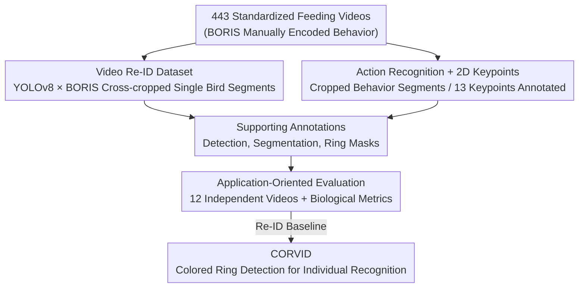

# CHIRP dataset: towards long-term, individual-level, behavioral monitoring of bird populations in the wild

**Conference**: CVPR 2026  
**Paper**: [CVF Open Access](https://openaccess.thecvf.com/content/CVPR2026/html/Chan_CHIRP_dataset_towards_long-term_individual-level_behavioral_monitoring_of_bird_populations_CVPR_2026_paper.html)  
**Code**: https://github.com/alexhang212/CHIRP_Dataset  
**Area**: Dataset / Animal Behavior Monitoring / Individual Re-identification  
**Keywords**: Wild bird monitoring, Individual Re-identification, Behavior recognition, Color rings, Application-oriented evaluation

## TL;DR
To enable computer vision to truly serve long-term, individual-level behavioral monitoring of wild birds, this paper reconstructs the CHIRP dataset (concurrently covering Re-ID, action recognition, 2D keypoints, detection, and instance segmentation) using a wild population of Siberian Jays in Swedish Lapland across 9 years (2014–2022). It proposes an "application-oriented evaluation" paradigm centered on biological indicators such as "feeding rate" and "co-occurrence rate." Additionally, it introduces a baseline method, CORVID—a pipeline for individual recognition by identifying colored leg rings—which outperforms the animal Re-ID foundation model MegaDescriptor in Top-1 accuracy under "territory constraints."

## Background & Motivation
**Background**: Behavior is often the primary response of animals to environmental changes; thus, long-term and continuous measurement of individual behavior is crucial for behavioral ecology and conservation biology. Recently, computer vision has been used to replace manual observation, showing significant progress in 2D/3D pose estimation, action recognition, and individual re-identification (Re-ID), enabling large-scale and automated biodiversity monitoring.

**Limitations of Prior Work**: The authors highlight two specific obstacles. First, CV research traditionally tackles detection, Re-ID, and keypoint estimation as independent tasks. However, long-term monitoring aims to answer "who did what"—requiring Re-ID and behavioral recognition to be solved **simultaneously**, supported by sub-tasks like detection, tracking, and keypoints. Single-task methods are difficult to assemble directly for deployment. Second, traditional evaluations score tasks **in isolation** (e.g., calculating mAP and PCK separately). Consequently, users cannot judge how errors in a specific model propagate to the final biological measurements. Multiple case studies have confirmed the unpredictability of this error propagation.

**Key Challenge**: There is a structural misalignment between the "task-centric, isolated evaluation" paradigm of CV and the biological requirements of "multi-task integration aimed at final biological measurements"—a model with higher mAP does not necessarily result in more accurate "individual feeding rate" estimates.

**Goal**: (1) Provide a dataset derived from real long-term biological studies capable of supporting multiple CV tasks; (2) Design an evaluation that directly measures method performance using biological metrics; (3) Propose a deployable Re-ID baseline.

**Key Insight**: Siberian Jays are social corvids (group sizes 2–7) with fixed year-round territories. Every bird is fitted with an aluminum ring and 2–3 colored plastic leg rings out of 11 possible colors (up to $11^3=1331$ combinations). This is a standard practice for individual identification in the wild and remains unaffected by plumage changes. The authors astutely transferred this biological cue—used by humans for visual identification—directly to computer vision.

**Core Idea**: Rather than using deep metric learning to memorize every bird's appearance, individuals should be identified by **explicitly detecting and classifying colored ring combinations** (CORVID). Furthermore, the evaluation target is shifted from single-task metrics to downstream biological measurements like "feeding rate" and "co-occurrence rate."

## Method
As a dataset paper, the focus is on "constructing multi-task annotations from a real long-term biological study and designing evaluations reflecting deployment effects," alongside the CORVID baseline pipeline.

### Overall Architecture
All raw materials for CHIRP (**C**ombining be**H**aviour, **I**ndividual **R**e-identification and **P**ostures) come from a standardized behavioral video recording protocol: 15–30 minute videos (25fps, 1920×1080) recorded at standardized feeding perches for each group. Researchers manually encoded time segments for behaviors such as feeding, submissiveness, and scaring using BORIS software. Over 9 years, 443 independent videos were used for the dataset. Each sample includes a collection date to support "time-aware" splitting, and sub-samples from the same behavioral video never cross into the same split (preventing background leakage).

The data production pipeline is organized around "who (is present) → what (they are doing) → supporting annotations → application-oriented evaluation": First, YOLOv8 detection and BORIS manual annotations are cross-validated to automatically crop single-bird segments for Re-ID; next, behavior segments are cropped for action recognition and keypoints; then, detection/segmentation and ring segmentation are supplemented; finally, 12 videos that never appeared previously are reserved for application-oriented evaluation.

### Key Designs

**1. CHIRP Dataset: Five Tasks with Unified Data—Solving "who × what" on Real Data**

To address the issue where "single-task methods cannot be assembled," CHIRP does not create another isolated task set but provides five categories of annotations for the same Siberian Jay population. **Video Re-ID** includes 16,190 segments of 1 second (25 frames), 183 individuals (averaging 89 segments per bird, with 32.42%/N=59 birds appearing across multiple years). The splitting involves using YOLOv8 to detect birds in long videos, then using BORIS annotations to locate segments where "only 1 bird is present" to automatically assign IDs, followed by manual review to remove 8.3% false positives. **Action Recognition** includes 1,387 short clips categorized as "eat," "submissive," and "others" (alert/resting/flying). **2D Keypoints** include 879 images, 1,176 individual instances, and 13 keypoints (36% from standard feeding videos, 64% from ground foraging scenes). **Supporting Annotations** include bounding boxes and segmentation for 1,156 frames / 1,669 individual instances (using SAM2 for mask generation from box prompts, with human validation showing an average IoU of 0.84), as well as 944 frames / 2,713 ring instances across 12 color categories. All splits (except Re-ID) follow an 80/20 ratio and ensure the same behavior video does not cross splits. This design allows "individual identification" and "behavior recognition" to be jointly trained and evaluated on real-world wild data for the first time.

**2. Three Re-ID Splits: Encoding Deployment Scenario Differences into the Benchmark**

Wild Re-ID difficulty depends heavily on deployment conditions. The authors designed three splits following Wildlife Datasets definitions. **Closed-set** is closest to the actual Siberian Jay study use case—researchers are present during recording, and new individuals can be added to the gallery at any time; thus, both training/testing sets contain all individuals (80/20). **Disjointed** assigns roughly half the individuals to training and half to testing to verify cross-system generalization. **Open-set** designates 20% of individuals as "unknown" and 80% as "known," simulating unattended camera traps where the task is to first determine "known/unknown" before assigning an ID. Crucially, leveraging the "fixed territory and stable group membership" of the jays, the authors provide two levels of metadata for each video: a short list of likely individuals in the territory (N=2–4, mean 2.92) and a list including neighbors (N=9–25, mean 14.58). This transforms domain knowledge into a difficulty-adjustable constraint and paves the way for CORVID's candidate matching.

**3. Application-Oriented Evaluation: Measuring Methods via "Feeding Rate/Co-occurrence" instead of mAP**

This is a paradigm shift intended to resolve the conflict where "isolated task evaluation does not reflect downstream impacts." The authors reserved 12 independent videos (35 individuals, frame-by-frame annotation of feeding behavior, identity, and detection boxes, also serving as an MOT benchmark) and defined two layers of metrics. **Low-level metrics**: ① Proportion of correct frame assignments (percentage of GT trajectory frames correctly assigned to individuals); ② Precision/Recall/F1 for individual feeding events in 1-second windows (averaged across individuals). **High-level biological metrics**: ① Individual feeding rate (pecks/minute); ② Co-occurrence rate (the proportion of video duration where a pair of individuals is present together). For both biological measurements, reported metrics include absolute error (Mean/Median/Std Dev) and the Pearson correlation $r$ between prediction and ground truth. Consequently, the goal of method optimization shifts from "overfitting task-specific points" to "making final biological measurements more accurate," directly exposing error propagation.

**4. CORVID: Color-based Video Re-identification Pipeline**

As a Re-ID baseline for application-oriented evaluation, CORVID (**CO**lou**R**-based **VID**eo re-ID) abandons the "memorizing appearance via image classifiers" approach in favor of explicit color ring combination recognition. The primary benefit is that **it does not rely on a Re-ID training set**; it generalizes to any new individual as long as the ring combination is known (provided no new colors are introduced). The pipeline involves three steps: (1) Detecting each ring using a Mask2Former instance segmentation model trained on the ring segmentation dataset, then cropping and and resizing to 20x20 in HSV space; (2) Feeding color histograms into a Random Forest, formulated as a multi-class classification, outputting confidence for each color (to handle ambiguous colors); (3) A matching algorithm pairs rings based on center-point distance thresholds, sums the Random Forest probabilities for each pair's color combination, and pools results across 25 frames to derive a color-pair probability matrix. Finally, the most likely ID is selected using the "likely individual" metadata. The naming convention follows the bird's perspective (Left-Up, Left-Down, Right-Up, Right-Down), e.g., 'oaor' = Orange-Aluminum-Orange-Red.

## Key Experimental Results

### Main Results: Video Re-ID (Table 1)
CORVID was compared with the animal Re-ID foundation model MegaDescriptor (pre-trained / fine-tuned on CHIRP) under three gallery constraints: Within Territory, +Neighbours, and All.

| Method | Closed-set Within Terr. Top-1 | Closed-set All Top-1 | Disjointed Within Terr. Top-1 | Disjointed +Neigh. Top-1 |
|------|------|------|------|------|
| **CORVID** | **0.66** | 0.05 | **0.69** | **0.31** |
| Pre-trained Mega | 0.28 | **0.10** | 0.31 | 0.14 |
| Fine-tuned Mega | 0.27 | **0.10** | 0.41 | 0.13 |

Key Findings: CORVID significantly leads under "Within Territory" and "+Neighbours" constraints (Closed-set Within Territory Top-1 0.66 vs 0.28), indicating that explicit use of ring colors is superior to deep metric learning. However, when the gallery is expanded to all individuals (All), CORVID falls behind (0.05 vs 0.10), as it relies heavily on the "territory candidate list" biological constraint.

### Other Task Baselines (Table 2/3)

| Task | Best Model | Key Metric |
|------|---------|---------|
| Action Recognition | C3D | Accuracy 0.72, F1 0.684 (better than SlowFast/X3D's 0.548) |
| 2D Keypoints | ViTPose-large | Mean Error 7.77px, PCK@10 0.978, PCK@5 0.915 |

PCK across architectures was generally high, indicating that annotation quality is sufficient to train pose models to support action recognition.

### Application-Oriented Evaluation (Table 4/5)
Detection (YOLOv8) + Tracking (BoTSORT) + Individual Recognition (CORVID / Fine-tuned MegaDescriptor / Random) + Action Recognition (C3D) were cascaded into a pipeline to compare ID assignment methods:

| ID Method | Correct Frame Ratio ↑ | Feeding F1 ↑ | Feeding Rate Mean Err ↓ | Feeding Rate r ↑ | Co-occurrence r ↑ |
|---------|------|------|------|------|------|
| **CORVID** | **0.647** | **0.537** | **9.00** | **0.582** | 0.654 |
| MegaDescriptor | 0.617 | 0.408 | 13.14 | 0.505 | 0.557 |
| Random | 0.331 | 0.327 | 9.35 | 0.437 | **0.799** |
| Human | — | — | 1.88 | 0.910 | 0.913 |

### Key Findings
- Differences in task-level metrics indeed propagate to application-level metrics: CORVID is stronger in Re-ID and more accurate in feeding rate/co-occurrence, supporting the value of "application-oriented evaluation."
- ⚠️ Unexpectedly, random assignment performed best on some high-level metrics (e.g., co-occurrence r=0.799, higher than CORVID's 0.654), and MegaDescriptor underperformed compared to random on all high-level biological metrics—indicating that task performance does not equate to deployment value and exposing significant room for improvement.
- All pipelines still show a large error gap compared to the human baseline (Feeding Rate Mean Err 1.88, r 0.910), highlighting CHIRP's value as an "unsolved benchmark."

## Highlights & Insights
- **Biological Cues as CV Features**: Leg rings were originally intended for human eyes. The authors are the first to use them as a basis for automated individual recognition, thereby bypassing the need for Re-ID training data and generalizing to new individuals with known combinations—a highly practical "domain-specific" insight.
- **Evaluation Paradigm Shift**: Using downstream measurements like feeding rate/co-occurrence instead of mAP/PCK directly addresses the "unpredictable error propagation" pain point in deployment. This application-specific benchmark approach is transferable to any scenario where CV is an intermediate step, such as medicine or agriculture.
- **Honest Reporting of Counter-intuitive Results**: The fact that random assignment outperformed SOTA Re-ID models on some biological metrics was not hidden but used to argue that "task metrics ≠ deployment value," adding significant credibility.
- **Time-aware + Leakage-proof Splitting**: Samples with collection dates and ensuring the same video does not cross splits set a standard for long-term monitoring in temporal scenarios.

## Limitations & Future Work
- CORVID relies heavily on the "territory candidate list": its performance degrades significantly when the gallery expands to the whole population, making it unsuitable for passive camera traps without candidate constraints. Furthermore, it cannot distinguish between "known/unknown" individuals, making it unevaluable in Open-set splits.
- Introducing new color rings would require retraining the segmentation/classification models; generalization is limited to the set of seen colors.
- All methods remain an order of magnitude away from human baselines (Feeding Rate error 9 vs 1.88), indicating that "multi-task wild behavioral monitoring" is far from solved.
- The species and scenario are narrow (Siberian Jays, standardized perches); cross-species and cross-scenario migration remains to be verified. ⚠️ The random baseline's superiority in co-occurrence suggests high-level metrics may be influenced by sample distribution and should be interpreted with caution.

## Related Work & Insights
- **vs Animal Kingdom**: The latter covers 850 species but uses YouTube footage; its utility for real biological research is unverified. CHIRP uses ethics-approved long-term wild study data, where annotations support both identity and behavior.
- **vs LoTE-animal / Baboonland / 3D-POP / Bucktales**: These originate from real studies but either focus on action recognition without Re-ID or collective tracking/pose without individual activities. CHIRP connects "who" and "what" on the same data.
- **vs WILD / IndividualBirdID**: These also use color rings or plumage patterns but typically feed cropped images into a classifier without explicitly utilizing color combinations. CORVID is the first to directly detect color ring combinations.
- **vs ChimpACT**: Also a long-term individual-level monitoring dataset, but it only provides task-level evaluation, making it hard to judge if a single model is sufficient for long-term monitoring. CHIRP fills this gap.

## Rating
- Novelty: ⭐⭐⭐⭐ The dataset itself integrates multiple tasks for a single system; the "application-oriented evaluation" paradigm and the "color-ring recognition" CORVID approach are truly novel.
- Experimental Thoroughness: ⭐⭐⭐⭐ Baselines for all five tasks + three splits + two layers of application metrics + human baselines, with honest reporting of counter-intuitive results.
- Writing Quality: ⭐⭐⭐⭐ Motivation, pain points, and solutions are logically structured; figures and tables are comprehensive.
- Value: ⭐⭐⭐⭐ Provides a reusable blueprint for "CV-to-biology" deployment and clearly shows that current methods are still far from practical utility, presenting a high level of challenge.

<!-- RELATED:START -->

## Related Papers

- [\[CVPR 2026\] Learning Long-term Motion Embeddings for Efficient Kinematics Generation](learning_long-term_motion_embeddings_for_efficient_kinematics_generation.md)
- [\[AAAI 2026\] Predict and Resist: Long-Term Accident Anticipation under Sensor Noise](../../AAAI2026/others/predict_and_resist_long-term_accident_anticipation_under_sensor_noise.md)
- [\[CVPR 2025\] Effortless Active Labeling for Long-Term Test-Time Adaptation](../../CVPR2025/others/effortless_active_labeling_for_long-term_test-time_adaptation.md)
- [\[CVPR 2026\] Confusion-Aware Spectral Regularizer for Long-Tailed Recognition](confusion-aware_spectral_regularizer_for_long-tailed_recognition.md)
- [\[ACL 2025\] In Prospect and Retrospect: Reflective Memory Management for Long-term Personalized Dialogue Agents](../../ACL2025/others/in_prospect_and_retrospect_reflective_memory_management_for_long-term_personaliz.md)

<!-- RELATED:END -->
