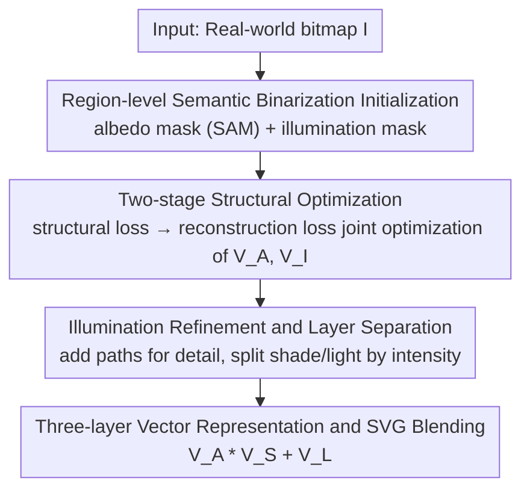

# Clair Obscur: an Illumination-Aware Method for Real-World Image Vectorization

**Conference**: CVPR 2026  
**Paper**: [CVF Open Access](https://openaccess.thecvf.com/content/CVPR2026/html/Lin_Clair_Obscur_an_Illumination-Aware_Method_for_Real-World_Image_Vectorization_CVPR_2026_paper.html)  
**Code**: Not released  
**Area**: Image Vectorization / Intrinsic Image Decomposition / Differentiable Rendering  
**Keywords**: Image Vectorization, SVG, Intrinsic Decomposition, Illumination-Aware, Differentiable Rendering

## TL;DR
COVec introduces the artistic concept of "Clair-Obscur" into image vectorization, performing intrinsic image decomposition in the vector domain for the first time. It decomposes a real photograph into three semantically coherent SVG layers—albedo, shade, and light—via region-level semantic binarization initialization and a two-stage differentiable rendering optimization. This achieves high fidelity with minimal layers, ensuring the resulting SVGs are truly editable.

## Background & Motivation

**Background**: Image vectorization converts bitmaps into scalable and editable SVGs composed of geometric primitives (polygons, Bézier curves). Existing methods fall into two categories: dataset-based (SVG-VAE, DeepSVG, StarVector), which learn generative models but suffer from data scarcity, poor generalization to real photos, and incomplete outputs; and optimization-based (DiffVG, LIVE, O&R, LayerVec), which use differentiable rasterizers to fit vector primitives to a target image. The latter requires no training data and is currently the mainstream for real-world image vectorization.

**Limitations of Prior Work**: While clean graphics like icons or emojis are easily handled, real photos contain rich tonal variations caused by lighting, shadows, and highlights. To approximate these continuous gradients, existing methods stack numerous tiny, fragmented shapes. This leads to **path redundancy and semantic fragmentation**—a single face might be sliced into hundreds of unrelated color blocks, losing the semantic simplicity of vector art and making editing nearly impossible (modifying one color requires changing dozens of paths).

**Key Challenge**: Prior layer decomposition methods (bottom-up in LIVE, top-down pruning in O&R, coarse-to-fine in LayerVec) mostly operate within an **RGBA overlay** framework, where illumination information is implicitly embedded within color regions. Entangled color and light force the use of fragmented paths to approximate gradients, creating a trade-off between simplicity and fidelity.

**Key Insight**: The authors build on two observations: first, the artistic technique of "Clair-Obscur," where artists use tonal variations within the same semantic region (e.g., skin, hair) to express light and volume rather than fragmenting the region; second, intrinsic image decomposition can now effectively separate images into albedo and illumination components. Combining these, the authors propose to **explicitly decouple color and illumination into different layers**, using coherent shapes within each layer to achieve both simplicity and fidelity.

**Core Idea**: This work performs intrinsic image decomposition in the vector domain for the first time. Using a unified SVG representation, the image is split into albedo, shade, and light layers. By leveraging native SVG blend modes—multiply and plus-lighter—to synthesize shadows and highlights, the method achieves semantic simplicity, illumination consistency, and inherent layer-wise editability.

## Method

### Overall Architecture

The goal of COVec is to output a unified SVG composed of albedo, shade, and light vector layers for a given real bitmap $I$. These layers recover $I$ with high fidelity when synthesized according to an intrinsic imaging model, while maintaining coherent shapes within each layer.

The theoretical foundation is an extended intrinsic imaging model, where a pixel is composed of "albedo multiplied by shade, plus additive light":

$$I = A * S + L$$

Translating this to the vector domain, the target SVG is represented as the composition of three vector layers:

$$V_{final} = V_A * V_S + V_L$$

Where $V_A$ (albedo layer) represents the intrinsic surface color, $V_S$ (shade layer) models geometric attenuation using the multiply mode, and $V_L$ (light layer) models additive lighting like specular highlights using the plus-lighter mode. Each layer $V_*$ is a set of parametric vector paths $V_* = \sum_n \theta_n$, where each path $\theta_n = \{P_n, C_n, \tau_n\}$ is defined by geometry $P_n$, fill color $C_n$, and opacity $\tau_n$.

Since optimizing three layers simultaneously is highly coupled and difficult to converge, the authors simplify the task based on a Lambertian assumption. They **first target two layers**—an albedo layer $V_A$ and a combined "illumination layer" $V_I$ containing both shade and light—optimizing $V_{final} = V_A * V_I$. Subsequently, $V_A$ is fixed to refine $V_I$, and finally, $V_I$ is split into shade and light. The pipeline is a coarse-to-fine process: Layer Initialization → Structural Optimization → Illumination Refinement & Layer Separation → Three-layer SVG Synthesis.

### Key Designs

**1. Region-level Semantic Binarization Initialization: Aligning Illumination with Object Boundaries**

Good initialization stabilizes layer separation. For $V_A$, an intrinsic decomposition model [3] generates an albedo map, followed by a SAM segmentation to extract illumination-invariant semantic masks $\{m^A_i\}$. The innovation lies in $V_I$ initialization: since **shadow intensity varies across different regions**, a global threshold for binarization results in fragmented shapes. The authors propose region-level semantic binarization, where **thresholding is performed independently within each semantic mask**. For each albedo mask $m^A_i$, the threshold is the average intensity of pixels within that region:

$$T_i = \frac{1}{|m^A_i|}\sum_{p \in m^A_i} I(p)$$

Pixels within $m^A_i$ where $I(p) \le T_i$ are classified as shadow pixels. This ensures shadow boundaries naturally adhere to object geometry, producing cleaner results than OTSU or adaptive thresholding. The resulting masks are organized into a hierarchy, simplified using Douglas-Peucker, and converted into closed cubic Bézier contours.

**2. Two-stage Structural Optimization: Fixing Geometry before Joint Color Recovery**

To ensure vector layers maintain structure while recovering color, two independent optimizers manage $V_A$ and $V_I$ over 50-epoch stages. In the warm-up stage, each layer is supervised by its own structural loss $L_A = L^A_{struct}$ and $L_I = L^I_{struct}$ to fit the initialization masks. For each path group $I^{group}_j$, the loss is:

$$L_{struct} = \sum_{j=1}^{N}\Big( \|I^{mask}_j - I^{group}_j\|_2^2 + \lambda \sum_{p} \mathrm{ReLU}(\delta - \alpha(p)) \Big)$$

The first term is pixel-wise MSE for shape alignment; the second term ($\lambda = 10^{-8}$) penalizes excessive overlap of paths within a group ($\alpha(p)$ is opacity), encouraging compact geometry. After warm-up, the second 50-epoch stage uses a shared reconstruction loss:

$$L_{recon} = \|I - R(V_A) * R(V_I)\|_2^2$$

where $R(\cdot)$ is the differentiable rasterizer [18]. Optimizing geometry first creates a stable foundation for correctly tuning colors during reconstruction.

**3. Illumination Refinement and Layer Separation: Refining Details and Splitting Light Types**

The refinement stage fixes $V_A$ and the base $V_I$, while **adding incremental paths to $V_I$** in areas with high reconstruction error, following the LIVE strategy. Periodic vector cleanup (merging/deleting redundant paths) as in LayerVec maintains compactness. Finally, $V_I$ is split into shade $V_S$ and light $V_L$ based on **fill color intensity**. Normalized intensities within $[0, 1]$ belong to $V_S$, while values exceeding $[0, 1]$ are identified as highlights for $V_L$. Shade paths inherit $V_I$ properties, but light paths utilize additive blending; their colors are re-calculated from the residual $I - R(V_A) * R(V_S)$ to ensure consistency.

**4. Three-layer Vector Representation and SVG Blending: Unified Editable SVG**

The albedo, shade, and light layers are synthesized via $V_{final} = V_A * V_S + V_L$. Unlike pixel-domain methods that output separate raster files, COVec **uses native SVG blend modes** (multiply and plus-lighter). This provides **layer-wise editability**: changing the color of $V_A$ while keeping $V_S/V_L$ intact naturally preserves the lighting structure, as the blending automatically adapts the output to the new albedo hue.

### Loss & Training
Implemented in PyTorch with Adam optimizer. Learning rates: 1.0 for control points, 0.01 for color parameters. Optimization involves 50 epochs of warm-up ($L_{struct}$), 50 epochs of reconstruction ($L_{recon}$), and a refinement stage ($L_{refine}$). For simple images like emojis, a degraded version of COVec (albedo only) is used.

## Key Experimental Results

### Main Results

Evaluated on three datasets (100 images each): Face (FFHQ), Scene (Things + TID2013) for complex real images, and Emoji (Noto Emoji). Compared against DiffVG, LIVE, O&R, and LayerVec.

| Dimension | Existing Methods (LIVE/O&R/LayerVec) | COVec (Ours) |
|--------|--------|--------|
| Framework | RGBA overlay, implicit lighting | Intrinsic: Explicit albedo/shade/light decoupling |
| Composition | Direct path stacking | SVG native multiply + plus-lighter blending |
| Real Image Details | Approximated by redundant fragments | Compact aligned shapes with accurate expression |
| Fidelity (MSE/LPIPS) | Higher error at same path budget | Lowest error; achieves better results with fewer paths |
| Editability | High complexity; breaks lighting | Minimal path changes; preserves lighting structure |

### Ablation Study

| Configuration | Observation | Explanation |
|------|---------|------|
| Full (Full Initialization + Two Losses) | Smooth geometry, faithful color, clear separation | Complete model |
| w/o Albedo-map Initialization | Entangled color and lighting | Albedo map provides illumination-invariant structural prior |
| Global/OTSU/Adaptive Binarization | Fragmented shadow areas, semantic mismatch | Pixel-level thresholds ignore regional semantics |
| w/o Reconstruction Loss $L_{recon}$ | Stable geometry but inaccurate color recovery | Missing color constraints |
| w/o Structural Loss $L_{struct}$ | Irregular boundaries and fragmented regions | Missing geometric constraints |

### Key Findings
- **Region-level semantic binarization is critical**: Independent regional thresholds ensure shadow boundaries align with object geometry, stabilizing optimization.
- **Complementary losses**: $L_{recon}$ ensures color accuracy while $L_{struct}$ ensures geometric smoothness; both are necessary for high-quality results.
- **Simplicity leads to editability**: Decoupling allows for natural appearance changes by modifying as few as 1-16 albedo paths.
- **Backward compatibility**: The degraded version handles simple graphics like emojis effectively, matching LayerVec performance.

## Highlights & Insights
- **Artistic Translation**: COVec maps the intuition of "Clair-Obscur" into a differentiable optimization objective $V_A * V_S + V_L$.
- **Native SVG Blend Modes**: Using multiply for shade and plus-lighter for light makes the SVG inherently editable without post-processing.
- **Residual Re-calculation**: Determining light layer colors via residuals ensures self-consistent synthesis.
- **Decoupled Optimization Strategy**: The "2-layer then 3-layer" strategy is a useful trick for handling highly coupled multi-component decomposition.

## Limitations & Future Work
- **External Dependency**: Reliance on intrinsic decomposition models [3] and SAM means errors in those modules propagate to the vector layers.
- **Heuristic Separation**: Splitting shade and light via a hard color threshold ($[0,1]$) might misclassify mid-tones.
- **Data Presentation**: Quantitative results are shown only as curves; exact numerical tables for path budgets are absent.
- **Manual Mode Switching**: Choosing between the full model and the degraded version for simple images currently requires manual intervention.

## Related Work & Insights
- **vs LayerVec**: Both use semantic-guided coarse-to-fine vectorization. COVec improves on this by decoupling illumination explicitly, whereas LayerVec remains in the RGBA framework.
- **vs LIVE / O&R**: These methods rely on path redundancy to approximate gradients. COVec avoids this through its multi-layer intrinsic representation.
- **vs Pixel-domain Intrinsic Decomposition**: While the goal of splitting albedo and illumination is shared, COVec is the first to implement this in the vector domain, providing a unified, scalable, and editable SVG file rather than separate raster layers.

## Rating
- Novelty: ⭐⭐⭐⭐⭐ First to bring intrinsic decomposition to vectorization via Clair-Obscur principles.
- Experimental Thoroughness: ⭐⭐⭐⭐ Solid dataset coverage and ablations, though quantitative tables are missing.
- Writing Quality: ⭐⭐⭐⭐ Clear motivation and technical pipeline.
- Value: ⭐⭐⭐⭐ Significant practical value for editable real-world image vectorization.

<!-- RELATED:START -->

## Related Papers

- [\[CVPR 2026\] VideoWorld 2: Learning Transferable Knowledge from Real-world Videos](videoworld_2_learning_transferable_knowledge_from_real-world_videos.md)
- [\[CVPR 2026\] UniMERNet: A Universal Network for Real-World Mathematical Expression Recognition](unimernet_a_universal_network_for_real-world_mathematical_expression_recognition.md)
- [\[CVPR 2026\] The Missing GAP: From Solving Square Jigsaw Puzzles to Handling Real World Archaeological Fragments](the_missing_gap_from_solving_square_jigsaw_puzzles_to_handling_real_world_archae.md)
- [\[CVPR 2026\] Multi-view Crowd Tracking Transformer with View-Ground Interactions Under Large Real-World Scenes](multi-view_crowd_tracking_transformer_with_view-ground_interactions_under_large_.md)
- [\[ICLR 2026\] SmellNet: A Large-scale Dataset for Real-world Smell Recognition](../../ICLR2026/others/smellnet_a_large-scale_dataset_for_real-world_smell_recognition.md)

<!-- RELATED:END -->
