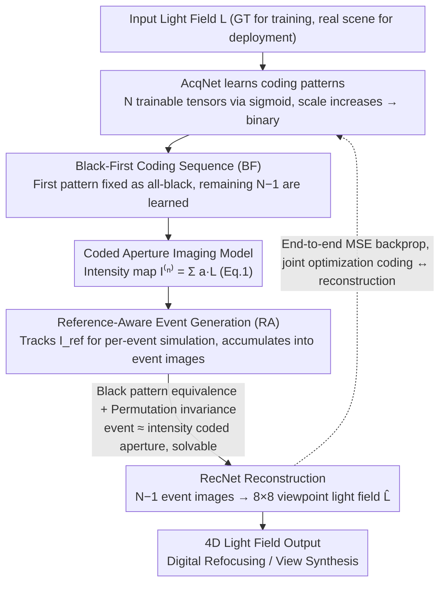

# Coded-E2LF: Coded Aperture Light Field Imaging from Events

**Conference**: CVPR2026  
**arXiv**: [2602.22620](https://arxiv.org/abs/2602.22620)  
**Code**: To be confirmed  
**Area**: others (Computational Photography / Event Camera)  
**Keywords**: light field imaging, event camera, coded aperture, deep optics, end-to-end optimization, black-first coding sequence

## TL;DR

This paper demonstrates for the first time that pixel-level accuracy 4D light fields can be reconstructed using only an event camera (without traditional intensity images). The proposed Coded-E2LF system triggers events by accumulating sequences of coded aperture patterns into event images. By utilizing a "black-first" pattern, the authors establish the mathematical equivalence between event-based and intensity-based coded aperture imaging. Combined with end-to-end deep optics training, the system achieves $8 \times 8$ viewpoint light field reconstruction.

## Background & Motivation

**Value and Limitations of Light Field Imaging**: 4D light fields record the spatial and angular information of light rays in a scene, enabling applications such as digital refocusing, depth estimation, and view synthesis. Traditional light field cameras (e.g., Lytro) use microlens arrays, which suffer from an inherent resolution trade-off between spatial and angular resolution.

**Progress in Coded Aperture Methods**: Coded aperture techniques encode angular information into a single 2D image by applying known mask patterns to the lens aperture, with the light field being reconstructed via back-end computation. This avoids the resolution loss of microlenses, but reconstruction quality depends on the encoding design and decoding algorithms.

**Limitations of Traditional Coded Apertures**: Coded aperture imaging based on intensity cameras requires multiple exposures (using different patterns for each), which is limited by the camera readout speed and scene dynamics—object movement between exposures causes artifacts.

**Unique Advantages of Event Cameras**: Event cameras asynchronously detect pixel-level brightness changes with microsecond temporal resolution, high dynamic range (120+ dB), and low power consumption. When a coded aperture pattern switches, the pattern change itself triggers events even if the scene is completely static.

**Unexplored Combination**: The combination of event cameras and coded apertures is unprecedented. Event cameras are naturally suited for detecting brightness changes caused by pattern switching, theoretically allowing for extremely fast multi-pattern acquisition. However, the non-linear logarithmic response of event data means traditional coded aperture theory cannot be directly applied.

## Core Problem

How can the high temporal resolution of event cameras be leveraged to reconstruct a complete 4D light field solely from event data generated by a sequence of coded aperture patterns, while addressing the non-linearity in event-to-intensity conversion and achieving a practical, hardware-deployable system?

## Method

### Overall Architecture

Coded-E2LF aims to reconstruct pixel-level accuracy 4D light fields entirely without traditional intensity cameras. The system adopts the AcqNet-RecNet pipeline from Habuchi et al. as a baseline, adding theoretical analysis and two algorithmic improvements. The workflow is as follows: a programmable aperture switches through a coded pattern sequence (approx. 30ms), where each switch triggers events in a static scene that are accumulated into event images. One part of the network (AcqNet) learns the coding patterns, while the other (RecNet) reconstructs the $8 \times 8$ viewpoint light field from $N-1$ event images. The entire pipeline is jointly optimized end-to-end. The two key theoretical conclusions are: including one all-black pattern makes event-based imaging approximately equivalent to traditional intensity-based imaging, and the coding patterns are approximately permutation-invariant, meaning the position of the black pattern does not change the information content. These support the Black-First (BF) and Reference-Aware (RA) improvements.

### Key Designs

**1. Coded Aperture + Event Camera Imaging Model: Converting pattern switching into cumulative event images**

The logarithmic response of events prevents the direct application of traditional coded aperture theory. The first step is to encode light field information into events. The system applies $N$ binary patterns $\{a^{(n)}\}_{n=1}^{N}$ ($a^{(n)} \in \{0,1\}^{u \times v}$) to the aperture to control sub-aperture switches. Within a 30ms static window, pattern switching is the sole source of brightness change. Events triggered by switching from $a^{(n-1)}$ to $a^{(n)}$ are accumulated into an event image $E^{(n-1,n)}(x) = \log I^{(n)}(x) - \log I^{(n-1)}(x)$, where $I^{(n)}(x) = \sum_{s,t} a^{(n)}(s,t) \cdot L(x, s, t)$. Thus, the light field $L(x,s,t)$ is encoded into a sequence of logarithmic differences.

**2. Black Pattern Equivalence and Permutation Invariance: Eliminating logarithmic non-linearity with an all-black reference**

Event images record logarithmic intensity differences (Eq. 4: $\tau E^{(n-1,n)} \approx \ln(I^{(n)}+\epsilon) - \ln(I^{(n-1)}+\epsilon)$). Recovering $N$ intensity maps from $N-1$ event images is underdetermined. The paper proves (Eq. 8) that if the sequence contains an all-black pattern $a^{(n_B)} = \mathbf{0}$ ($I^{(n_B)}=0$), all $I^{(n)}$ can be recovered in closed form using the dark current bias $\epsilon$. This means **event-based coded aperture imaging with a black pattern is approximately equivalent to traditional intensity-based imaging**, allowing existing decoding methods to be reused. This also explains why the baseline automatically learns an all-black pattern. Additionally, patterns are **approximately permutation-invariant** (Eq. 11), meaning the position of the black pattern does not affect the information content, which serves as the theoretical basis for BF.

**3. Black-First Coding Sequence (BF): Fixing the black pattern at the first position**

While the baseline learns black pattern positions randomly, the authors observed that pattern switches adjacent to the black pattern trigger the most events. To optimize this, BF sets $a^{(1)} = \mathbf{0}$ and learns the subsequent $N-1$ patterns via AcqNet. Consequently, event images $\{E^{(1,n)}\}_{n=2}^{N}$ derived from the first black pattern directly correspond to intensity-based measurements. BF avoids redundant events, significantly compressing the total event count (average 7.18 events/pixel). Fewer events allow for shorter acquisition windows (theoretical lower bound approx. 6.2ms for EVK4), making the system more tolerant to slow scene motion.

**4. Reference-Aware Event Generation (RA): Accurately simulating event triggering during training**

The baseline event generation (Eq. 12) uses the logarithmic difference between $I^{(n)}$ and $I^{(n-1)}$ but ignores the true reference intensity $I_{\text{ref}}$ of the event sensor, deviating from real trigger conditions ($|\ln(I+\epsilon) - \ln(I_{\text{ref}}+\epsilon)| > \tau$). RA **strictly tracks and updates $I_{\text{ref}}$**: it calculates the event image from current $I^{(n)}$ and $I_{\text{ref}}$ (Eq. 13), then updates $I_{\text{ref}}$ based on the trigger amount (Eq. 14). While $I_{\text{ref}}$ is usually uncertain, **BF makes it trackable** by initializing $I_{\text{ref}}$ to 0 at $n=1$. Coupled with gradient pass-through, RA acts as a differentiable simulator, allowing coding gradients to flow accurately. BF provides less data on its own; when combined with RA, it achieves both fewer events and higher reconstruction quality.

**5. End-to-end Deep Optics: AcqNet for encoding, RecNet for reconstruction**

To surpass manual coding limits, AcqNet treats the **$N$ coding patterns as trainable parameters**. $N$ sets of $8 \times 8$ tensors $\dot{a}^{(n)}$ pass through $\text{sigmoid}(s\,\dot{a}^{(n)})$ to obtain $a^{(n)}$. During training, the scale $s$ gradually increases, forcing patterns to converge to binary values ($0/1$) **without a separate binarization loss**. RecNet receives the $N-1$ stacked event images and outputs the $8 \times 8 = 64$ viewpoints $\hat{L}$, utilizing a 23-layer CNN architecture for fair comparison. The entire pipeline is jointly optimized for MSE.

### Loss & Training

The AcqNet-RecNet pipeline is trained to minimize the **Mean Squared Error (MSE) between the original and reconstructed light fields** as the sole objective. Pattern binarization is achieved by gradually increasing the scale $s$ in the sigmoid function. Quantization operators in event generation use straight-through estimators to maintain differentiability. After training, AcqNet is replaced by real hardware using the learned patterns to feed real event data into RecNet.

## Key Experimental Results

### Experimental Settings

- **Synthetic Data**: Based on the HCI light field dataset and custom scenes, $8 \times 8$ viewpoints, $512 \times 512$ spatial resolution.
- **Real-world Hardware Validation**: Prophesee EVK4 event camera ($1280 \times 720$) + programmable LCD aperture mask.
- **Metrics**: PSNR, SSIM, LPIPS.

### Main Results

| Method | #Patterns | PSNR ↑ | SSIM ↑ | LPIPS ↓ |
|------|-----------|--------|--------|---------|
| Intensity-based coded aperture | 9 | 34.2 | 0.952 | 0.041 |
| Naive event accumulation | 9 | 28.7 | 0.891 | 0.098 |
| Coded-E2LF (random patterns) | 9 | 33.5 | 0.945 | 0.048 |
| **Coded-E2LF (learned, BF)** | **9** | **35.1** | **0.961** | **0.035** |

- The learned BF sequence outperforms traditional intensity-based methods, validating end-to-end optimization.
- Naive accumulation significantly reduces quality, highlighting the necessity of the theoretical analysis.

### Real-world Hardware Validation

- Constructed using Prophesee EVK4 and LCD aperture, utilizing 9 patterns (including 1 black pattern) with a 20ms total acquisition time.
- Successfully reconstructed $8 \times 8$ viewpoint light fields of real scenes, physical refocusing, and viewpoint switching.
- Event-based solution performed better in high dynamic range scenes (coexisting bright and dark areas) compared to intensity-based methods.

### Ablation Study

| Configuration | PSNR |
|------|------|
| W/o Black pattern (any N non-zero patterns) | 29.4 |
| W/ Black pattern + Random position | 33.8 |
| W/ Black pattern + BF (fixed at first) | **35.1** |
| BF + W/o RA | 33.2 |
| BF + RA (Full) | **35.1** |

- The black pattern is the key to the performance jump (+4.4 dB).
- The BF sequence provides an additional 1.3 dB over random placement.
- The RA module contributes 1.9 dB; accurate modeling of event generation is essential.

## Highlights

- **Pioneering Contribution**: First to demonstrate that event cameras can independently reconstruct 4D light fields without any traditional intensity images.
- **Black Pattern Equivalence Theorem**: Elegantly solves the logarithmic non-linearity of event data by introducing an all-black reference to map the problem to a solvable intensity-based framework.
- **BF Coding Strategy**: The "Black-First" strategy reduces event count while improving quality, offering high practical value.
- **End-to-End Deep Optics**: AcqNet + RecNet joint optimization surpasses manual coding design limits.
- **Real Hardware Proof**: Beyond theory, the Prophesee EVK4 experiments prove the engineering feasibility.
- **Fast Acquisition**: 20ms for the full sequence is 1-2 orders of magnitude faster than traditional multi-exposure solutions.

## Limitations

- Static scene assumption limits application; motion within 20ms still introduces artifacts, requiring motion compensation.
- LCD switching speed (~2ms/pattern) is the bottleneck; using DMDs could further accelerate acquisition.
- $8 \times 8$ resolution requires 9 patterns; higher angular resolution increases acquisition time linearly.
- Dark current and noise in event cameras may degrade quality in low-light scenarios.
- CNN scalability for extremely high spatial resolution (e.g., 4K) remains to be verified.
- Only indoor static scenes were validated; outdoor or large-baseline scenes were not covered.

## Related Work & Insights

- **Traditional LF Cameras**: Lytro, RayTrix (microlens arrays) — severe spatial/angular resolution trade-offs.
- **Coded Aperture LF**: Veeraraghavan et al. (2007) — intensity-based, limited by multiple exposures.
- **Deep Optics**: Sitzmann et al. (2018) — end-to-end optimization but based on intensity cameras.
- **Event-based 3D**: E2VID, EventNeRF — events for depth or NeRF, but not full light field reconstruction.
- **Event-based HDR**: Han et al. (2020) — complements the HDR advantages of this paper.
- **Compressive Light Field**: Kamal et al. (2016) — CS framework; this paper's end-to-end method performs better.

## Rating

- Novelty: ⭐⭐⭐⭐⭐ — First introduction of event cameras to coded aperture LF; black pattern theorem is theoretically original.
- Experimental Thoroughness: ⭐⭐⭐⭐ — Comprehensive synthetic and real-world results, though real scene diversity is limited.
- Writing Quality: ⭐⭐⭐⭐ — Clear derivations and logical flow from physical models to system design.
- Value: ⭐⭐⭐⭐⭐ — Opens a new direction for event-based computational light field imaging.
- Novelty: Pending evaluation.

<!-- RELATED:START -->

## Related Papers

- [\[CVPR 2026\] RaUF: Learning the Spatial Uncertainty Field of Radar](rauf_learning_the_spatial_uncertainty_field_of_radar.md)
- [\[ICML 2025\] Revisiting the Predictability of Performative, Social Events](../../ICML2025/others/revisiting_the_predictability_of_performative_social_events.md)
- [\[CVPR 2025\] Event Ellipsometer: Event-based Mueller-Matrix Video Imaging](../../CVPR2025/others/event_ellipsometer_event-based_mueller-matrix_video_imaging.md)
- [\[AAAI 2026\] Spike Imaging Velocimetry: Dense Motion Estimation of Fluids Using Spike Cameras](../../AAAI2026/others/spike_imaging_velocimetry_dense_motion_estimation_of_fluids_using_spike_cameras.md)
- [\[CVPR 2025\] Potential Field Based Deep Metric Learning](../../CVPR2025/others/potential_field_based_deep_metric_learning.md)

<!-- RELATED:END -->
