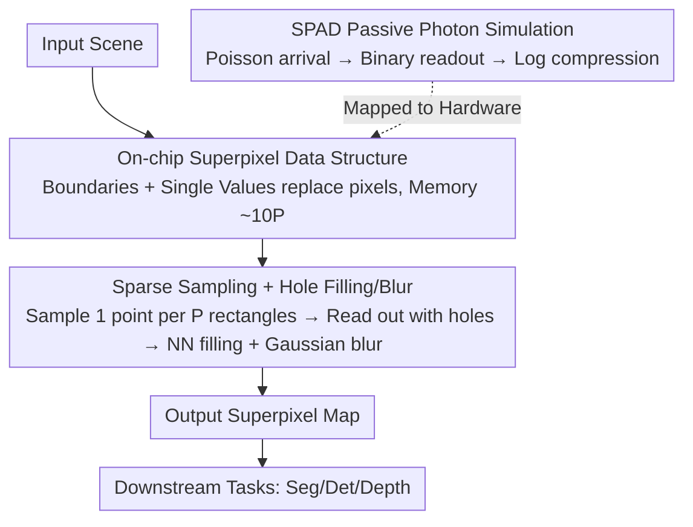

# Computer Vision with a Superpixelation Camera

**Conference**: CVPR 2026  
**Paper**: [CVF Open Access](https://openaccess.thecvf.com/content/CVPR2026/html/Mahalingam_Computer_Vision_with_a_Superpixelation_Camera_CVPR_2026_paper.html)  
**Code**: None  
**Area**: Computational Photography / Sensors  
**Keywords**: Superpixel Camera, SPAD Single-Photon Sensors, On-chip Compression, Edge Vision, Resource-Constrained Inference

## TL;DR
The authors propose "SuperCam," a superpixelation camera where the sensor generates superpixel maps directly on-chip through sparse sampling. It avoids storing full high-resolution images entirely, driving segmentation, detection, and depth estimation with memory requirements one to two orders of magnitude lower than conventional images. Under the same memory budget, its segmentation error is at least twice as good as a constrained version of SNIC.

## Background & Motivation
**Background**: Modern vision systems default to the paradigm of "image = uniform grid of square pixels." Superpixel algorithms (e.g., SLIC, SNIC, ERS) group similar pixels into regions of arbitrary shapes to compress input and simplify the search space for downstream tasks, serving as a classic image simplification tool.

**Limitations of Prior Work**: All existing superpixel algorithms are **post-processing** methods—they require capturing a full high-resolution image first before clustering superpixels. This means sensors still must capture, read out, and store millions of pixels, consuming significant power and bandwidth, only for most of that information to be discarded after superpixel simplification. On memory-constrained edge devices, this "capture-all-then-compress" pipeline is inherently wasteful. While clustering methods like SNIC are lightweight, their priority queues require storing all pixel intensities in memory, with usage dependent on both the number of pixels $M$ and superpixels $P$.

**Key Challenge**: The desired output is a "small number of adaptive region representations," yet traditional imaging chains are forced through the expensive intermediate state of "millions of square pixels." There is a structural mismatch between the sparsity of the representation and the density of the acquisition.

**Goal**: Can a sensor **skip the full image** step and natively output superpixels in real-time? The objective is to transform superpixels from an "algorithm output" into "raw camera data."

**Key Insight**: The authors draw an analogy to biological vision—the human eye does not form a high-resolution image like a camera; instead, edge detection and grouping of perceived similar regions occur at the retinal stage. Combined with the on-chip computation capabilities and fine-grained spatio-temporal sampling of Single-Photon Avalanche Diode (SPAD) sensors, this provides a hardware testbed for a "native superpixel" camera.

**Core Idea**: Design a camera that maintains a "boundary + single intensity value" data structure for superpixels. Sparse adaptive sampling is used on-chip to directly fill this structure, followed by off-chip hole filling and blurring, producing superpixel maps for downstream CV tasks without ever forming a full image.

## Method

### Overall Architecture
SuperCam abandons the dense grid representation in favor of a **superpixel set** $S=(S_i, I_i)_{i=1}^{N}$, where $S_i$ denotes the boundary information of the $i$-th superpixel and $I_i$ is its corresponding 8/24-bit intensity or color value. The pipeline consists of three stages: ① Maintaining this compact data structure on-chip (defining "what to store"); ② Performing sparse sampling on-chip to map photon measurements to corresponding superpixels, reading out a **sparse map with holes**, and then applying nearest-neighbor (NN) filling and Gaussian blurring off-chip (defining "how to sample and complete"); ③ Using a passive photon simulation of SPAD sensors to map this conceptual camera to a feasible hardware model (defining "what device to use"). The final superpixel map is fed directly into off-the-shelf models for segmentation, detection, or depth estimation.

### Key Designs

**1. On-chip Superpixel Data Structure: Replacing Grids with "Boundaries + Single Values"**

To address the waste of storing full images, SuperCam changes the sensor's internal state from "$M$ pixel intensities" to "$N$ superpixel pairs $(S_i, I_i)$." Upon integrating an exposure over a duration $\tau$ at coordinates $(x,y)$ to obtain a flux measurement $\phi$, all superpixels satisfying $(x,y)\in S_i$ update their intensity estimate $I_i$ immediately. For a $321\times481$ image (like BSD500), 1000–2000 superpixels are usually sufficient. Consequently, SuperCam's memory footprint (unoptimized) is approximately $\sim 10P$ (roughly 10 units of boundary and color info per superpixel), which is one to two orders of magnitude lower than "millions of pixels × 8/24 bits." This sparsity at the representation level is the source of memory efficiency.

**2. Sparse Sampling + Hole Filling/Blur: Generating Superpixel Maps in a Single Exposure**

A sampling process (the SuperCam Algorithm) is required to fill the sparse structure with minimal measurements. The approach is straightforward: the image is partitioned into $P$ equal-sized rectangles. Within each rectangle, one sensor coordinate $(x_i, y_i)$ is **randomly selected** and exposed for a fixed time $\tau$. The resulting intensity estimate $\hat\phi(x_i,y_i)$ initializes that superpixel's color and coordinates. This logic is computationally minimal and intended for on-pixel execution. The readout is a sparse map containing values only at sampled points. Off-chip, two steps follow: **nearest-neighbor hole filling** using the intensity of the closest superpixel, followed by **Gaussian blurring**. The blur radius corresponds to the superpixel grid size (using separable kernels for rectangular grids; see original supplement for derivations ⚠️). Blurring transitions the hard sampling boundaries, significantly improving robustness for downstream tasks.

**3. SPAD Passive Photon Simulation: Realizing the Conceptual Camera on Single-Photon Hardware**

While physical hardware is not yet built, the authors simulate SuperCam using a passive SPAD array model. The number of photons received by a SPAD pixel over time $\tau$ follows a Poisson distribution $P\{Z=k\}=\frac{(\phi\tau\eta)^k e^{-\phi\tau\eta}}{k!}$. However, since each pixel registers at most one photon event per frame, the readout is a binary $B(x,y)$ following a Bernoulli distribution $P\{B=1\}=1-e^{-(\phi\tau\eta+r_q\tau)}$. To generate this from RGB images, an "average photons per pixel" $p$ is set, and an exposure scaling factor $c$ is solved such that $\frac1M\sum_{i=1}^{M}(1-e^{-cI_i})=\frac{p}{N}$. Under low light ($cI_i\ll1$), a Taylor expansion provides a closed-form solution:

$$c=\frac{p}{N\,I_\text{avg}}$$

where $I_\text{avg}$ is the ground truth image mean. Summing $N$ binary frames and applying log compression recovers the intensity: $\hat\phi(x,y)=-\ln\!\big(1-S(x,y)/M\big)/(c\eta)-r_q/\eta$. This links abstract sampling to the data formats produced by real devices like SwissSPAD.

### Loss & Training
Ours **contains no learnable parameters and requires no training**. It is an imaging/sampling model paired with a classic completion pipeline. Downstream tasks utilize off-the-shelf pre-trained models (SAM2, YOLOv12, DepthAnythingV2). The only "tunable knob" is the number of superpixels $P$ (equivalent to the memory budget); as $P$ increases, fidelity and performance improve gracefully alongside memory usage.

## Key Experimental Results

As no direct baseline exists for a camera that generates superpixels instantaneously, the authors established an **equivalent-memory constrained protocol**. Existing methods (primarily SNIC) were restricted to the same on-chip memory budget as SuperCam. For SNIC, the total memory for "image + data structure" was adjusted to fit the budget (70–700KB). Experiments found SNIC performs best when allocating 5× more memory to image data than to the superpixel structure, which was used for the baseline. Evaluation covers superpixel quality and three downstream tasks across datasets including BSD500, NYUV2, SBD, SUNRGBD, COCO, and KITTI.

### Main Results: Superpixel Quality and Downstream Tasks (Constant Memory vs. SNIC)

| Task / Metric | Dataset | Ours (SuperCam) | Constrained SNIC | Conclusion |
|------|------|------|------|------|
| Undersegmentation Error (USE)↓ | BSD500/NYUV2/SBD/SUNRGBD | At least **2×** better | Baseline | Error halved at same memory |
| Boundary Precision–Recall | Same as above | Higher Recall, slightly lower Precision | Baseline | More superpixels in same memory $\rightarrow$ higher recall |
| Seg. mIOU Error↓ | NYUV2 / BSD500 | Consistently lower; approaches full image as memory increases | Higher | More complete segmentation with SAM2 |
| Det. mAP(50–95)↑ | COCO | Better than SNIC; approaches res-matched image | Lower | Detects targets SNIC misses at low memory |
| Depth AbsRel↓ / δ1↑ | NYUV2 | Superior to SNIC | Worse | SNIC depth maps nearly unusable at low memory |

### Comparison with Learned Methods and Memory Tiers

| Dimension | SuperCam | Comparison | Note |
|------|---------|------|------|
| vs LNS-Net (Learned) | Comparable at 68KB tier | LNS-Net 800 superpixels, ~2GB | **>1000×** less memory (kB vs GB) with better USE |
| Memory Tiers (Quality) | 68 / 205 / 615 KB | — | Edges, aliasing, and facial details improve smoothly |
| Real Hardware | SwissSPAD binary frames | Ground Truth | Close to GT on all tasks, validating simulation |

### Key Findings
- **Quality Doubled at Same Budget**: By spending memory on "more superpixels" rather than "storing the full image," SuperCam reduces USE by at least half. The trade-off is slightly lower precision due to the higher density of superpixels within the same budget.
- **Consistent Downstream Dominance**: Errors in all three tasks monotonically approach the "unsegmented full image" upper bound as $P$ increases, indicating superpixel maps preserve critical task information.
- **Small Objects are a Shortcoming**: Objects occupying very few pixels may be lost during superpixelation. This is a fundamental limit of the superpixel approach, mitigable only by increasing memory or re-sampling local regions under optical magnification.
- **Gaussian Blurring Benefits Both**: Adding the same blur to constrained SNIC improved its downstream results, leading the authors to include "SNIC with blur" for a fairer comparison.

## Highlights & Insights
- **Redefining Superpixels as "Raw Data"**: This is a paradigm shift. Rather than an incremental algorithm, it questions the premise that imaging must produce square-pixel grids, enabling sparse representations at the point of acquisition.
- **"Spatial Dual to Event Cameras"**: This analogy is insightful. Where event cameras discard temporal redundancy by firing only on changes, SuperCam discards spatial redundancy by storing only perceptually distinct regions.
- **Zero-Training, Plug-and-Play with Foundation Models**: The model-free nature allows direct input to SAM2, YOLOv12, or DepthAnythingV2. This "compress at the sensor, keep the model" strategy is applicable to any edge sensor with on-chip compute.
- **Single Knob Trade-off**: The number of superpixels $P$ provides system engineers with a clean interface to balance memory and performance.

## Limitations & Future Work
- **Conceptual Stage, No Physical Chip**: The authors acknowledge SuperCam is currently a conceptual design. Results depend on SPAD simulation and dataset emulation; hardware prototypes are needed to verify power benefits and update latencies.
- **Small Object Loss**: The loss of tiny objects is a structural defect, making it unsuitable for applications requiring high-reliability detection of minuscule targets.
- **Unquantified On-chip Update Costs**: The overhead of "updating all relevant superpixels for every measurement" is described qualitatively as "lightweight and parallelizable" ⚠️. Memory usage ($\sim 10P$) is also an unoptimized implementation.
- **Sampling Point Representativeness**: Each superpixel relies on a single random sample. If the sample point is unrepresentative (e.g., straddling a true boundary), the intensity estimate suffers.

## Related Work & Insights
- **vs SNIC / SLIC (Clustering)**: These require full high-res images and use priority queues or 5D clustering where memory scales with pixel count $M$. SuperCam generates superpixels natively without accessing a full image.
- **vs Single-pixel / Compressive Cameras**: Both seek minimal scene representations. However, compressive sensing aims for image reconstruction quality, while SuperCam optimizes for downstream CV tasks and ignores traditional image quality metrics.
- **vs Event Cameras**: Event cameras are sparse in time; SuperCam is sparse in space. They are complementary approaches to reducing data rates at the sensor.
- **vs Learned Superpixels (LNS-Net / SPAM)**: Learned methods offer high quality but require GBs of memory, precluding edge deployment. SuperCam achieves comparable or better USE with kB-level memory.

## Rating
- Novelty: ⭐⭐⭐⭐⭐ Reframes superpixels as a capture paradigm rather than a post-processing step.
- Experimental Thoroughness: ⭐⭐⭐⭐ Covers multiple datasets and tasks, though lacks physical chip benchmarks.
- Writing Quality: ⭐⭐⭐⭐⭐ Clear motivation and self-consistent derivations for the imaging and SPAD models.
- Value: ⭐⭐⭐⭐ Provides an imaginative direction for "at-the-edge" compression, though implementation depends on future hardware.

<!-- RELATED:START -->

## Related Papers

- [\[CVPR 2026\] Towards Knowledge-augmented Bayesian Deep Learning For Computer Vision](towards_knowledge-augmented_bayesian_deep_learning_for_computer_vision.md)
- [\[CVPR 2026\] NeuroRule: Bridging Vision and Logic with Differentiable Rule Induction](neurorule_bridging_vision_and_logic_with_differentiable_rule_induction.md)
- [\[CVPR 2026\] EXOTIC: External Vision-driven Incomplete Multi-view Classification](exotic_external_vision-driven_incomplete_multi-view_classification.md)
- [\[CVPR 2026\] MMVIP: A Visible-infrared Paired Dataset for Multi-weather Marine Vision](mmvip_a_visible-infrared_paired_dataset_for_multi-weather_marine_vision.md)
- [\[CVPR 2026\] Learning What Helps: Task-Aligned Context Selection for Vision Tasks](learning_what_helps_task-aligned_context_selection_for_vision_tasks.md)

<!-- RELATED:END -->
