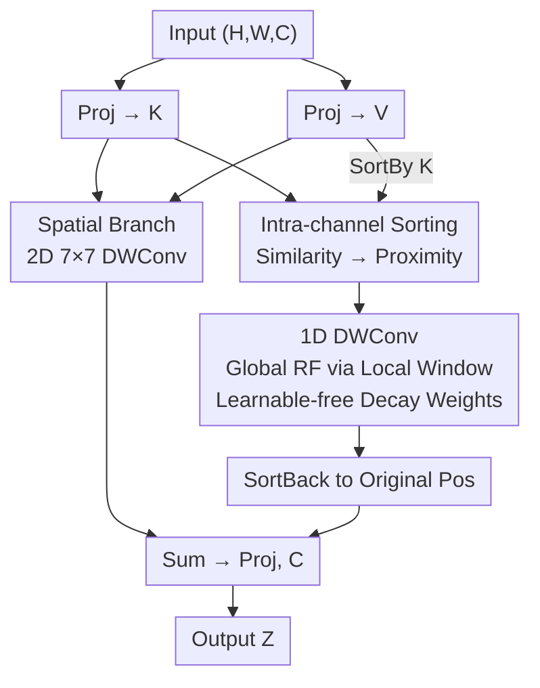

# Convolutional Neural Networks Driven by Content Similarity

**Conference**: CVPR 2026  
**Paper**: [CVF Open Access](https://openaccess.thecvf.com/content/CVPR2026/html/Zou_Convolutional_Neural_Networks_Driven_by_Content_Similarity_CVPR_2026_paper.html)  
**Code**: https://github.com/essenceoftheworld/ego  
**Area**: CNN Architecture / Backbone  
**Keywords**: Convolutional Neural Networks, Content Similarity, Gated Convolution, Intra-channel Sorting, Token Mixer  

## TL;DR
By performing "intra-channel sorting" on features to align tokens with high similarity in adjacent positions and then aggregating them using 1D depthwise convolution, the proposed pure CNN model, Ego, enables "content-driven aggregation" similar to self-attention. Ego outperforms Transformers and advanced CNNs of reached scales in classification, segmentation, and detection with lower computational costs.

## Background & Motivation
**Background**: Following the success of ViT, the CNN camp has been incorporating Transformer-inspired designs to regain competitiveness. MetaFormer abstracted the architecture into a general framework, while models like VAN, Conv2Former, HorNet, and MogaNet utilized large-kernel convolutions and gating mechanisms to approach or exceed strong baselines. Gated convolution has become a mainstream building block for CNN token mixers in the post-ViT era.

**Limitations of Prior Work**: Although CNNs have adopted the "form" of Transformers, the "essence" of convolution remains unchanged—it aggregates features based on the **relative spatial/temporal positions** of elements. In contrast, the core logic of self-attention is modeling global correlations based on **feature similarity**. This fundamental difference limits CNNs in modeling "long-range, content-dependent" interactions, making them less flexible than attention models.

**Key Challenge**: Is it possible to let convolutions aggregate information based on "content similarity" rather than "fixed relative positions" without introducing the $O(N^2)$ pairwise interactions of attention or explicit graph construction (GNNs)?

**Key Insight**: The authors revisit gated convolution from the perspective of attention pooling, interpreting convolution parameters as "attention weights obtained by querying relative positions." This leads to a crucial hypothesis: if the relative positions of elements themselves reflect their feature similarity (closer proximity equals higher similarity), then convolution parameters naturally become equivalent to attention weights generated by similarity.

**Core Idea**: Use a **sorting operation** to translate "feature similarity" into "relative position." By rearranging similar tokens to adjacent positions, a standard convolution is indirectly transformed into a "content-similarity-driven" aggregation mode.

## Method

### Overall Architecture
Ego follows the four-stage hierarchical meta-architecture typical of ConvNeXt or Swin. Each stage consists of stacked Ego blocks (block = token mixer + FFN), with standard convolutions used for downsampling between stages. The innovation lies entirely in the token mixer, named **SpatialEgo**.

SpatialEgo is a **dual-branch gated convolution**. The input is projected into shared features $K$ and $V$. One path is the **spatial branch**, which applies a standard 2D 7×7 depthwise convolution to aggregate by spatial position. The other is the **content similarity branch**, which sorts tokens by their $K$ values within each channel to bring similar elements together, aggregates them using a 1D depthwise convolution on the sorted sequence, and finally restores them to their original positions. The outputs of both branches are summed and passed through a linear layer. This mechanism introduces no learnable convolution weights (weights are analytically generated) while achieving an implicit global receptive field within a local window, maintaining a complexity of $O(N \log N)$.

### Key Designs

**1. Reinterpreting Gated Convolution as "Position-Driven Attention": Finding the Interface**

This is the pivot of the paper. Standard gated convolution is written as $V=\text{Conv}_{pw1}(X)$, $A=\text{Conv}_{dw}(\text{Conv}_{pw2}(X))$, and $Z=V\odot A$. To align it with self-attention, the authors redefine it: let $K=\text{Conv}_{pw1}(X)$ and $V=\text{Conv}_{pw2}(X)$. The output can then be unified into an attention form:

$$Z_{i,j,c}=\sum_{\forall p,q}\varphi(K_{i,j,c},K_{p,q,c})\,V_{p,q,c},\quad \varphi(K_{i,j,c},K_{p,q,c})=\begin{cases}K_{i,j,c}W_{i,j,p,q,c}, & (p,q)\in\Omega_{i,j}\\ 0, & (p,q)\notin\Omega_{i,j}\end{cases}$$

Here, $\Omega_{i,j}$ is a local window centered at $(i,j)$, and $W$ is the convolution parameter matrix. This rewrite reveals the **only essential difference** between gated convolution and self-attention: for different $V_{p,q,c}$, $K_{i,j,c}$ is a shared factor, and the difference in attention weights is determined solely by $W_{i,j,p,q,c}$, which **only depends on relative position** and is independent of the content of $K$. Thus, gated convolution is "position-driven," while self-attention is "content-driven."

**2. Intra-channel Sorting: Translating "Feature Similarity" to "Position Proximity"**

The authors add a parallel branch centered on three depthwise (per-channel) sorting operators:

$$K'=\text{Sort}_{dw}(K),\quad V'=\text{SortBy}_{dw}(V,K'),\quad Z'_{i,j,c}=\text{SortBack}_{dw}\!\Big(\sum_{\forall b}\psi(K'_{a,c},K'_{b,c})\,V'_{b,c}\Big)$$

The steps are: $\text{Sort}_{dw}$ sorts $K$ in ascending order within each channel; $\text{SortBy}_{dw}$ rearranges $V$ according to the new order of $K$; $\text{SortBack}_{dw}$ restores elements to their original spatial positions after aggregation. By sorting, elements with similar $K$ values are placed adjacently, mapping "content similarity" to "relative position." This effectively transforms a 1D convolution into a content-aware global aggregator without explicit graphs or $O(N^2)$ calculations.

**3. Global Receptive Field via Local Windows: Avoiding Quadratic Complexity**

Sorting ensures that elements spatially far apart but similar in content become neighbors. Consequently, **even a small 1D window can capture a global receptive field**. The authors set the sliding window size to $2\alpha\lfloor\ln N\rfloor+1$ (where $N=H\times W$ and $\alpha$ is a positive integer). This logarithmic growth adapts to the input scale while maintaining $O(N \log N)$ complexity without requiring FFT. They found $\alpha=12$ yields performance comparable to a global convolution.

**4. Learnable-free Distance-Decay Convolution Weights**

In the sorted sequence, relative distance reflects similarity, so weights should naturally decay with distance. The authors use a logspace sequence to define weights:

$$W'_{a,b,c}=\frac{\text{base}^{\frac{\text{steps}-|b-a|}{\text{steps}}}}{\sum_{d\in\Theta_a}\text{base}^{\frac{\text{steps}-|d-a|}{\text{steps}}}}$$

With $\text{base}=10$ and $\text{steps}=12\lfloor\ln N\rfloor+1$, the weights are shared across all positions and channels, introducing zero learnable parameters. Experiments showed that the decay prior itself is more critical than the specific function form (logspace vs. linspace).

### Loss & Training
For ImageNet-1K classification, the setting follows MetaFormer: 300 epochs, 224×224 resolution, batch size 4096, AdamW optimizer, learning rate 4e-3 with cosine decay, 20-epoch warmup, and weight decay 0.05. Standard augmentations (RandAugment, Mixup, CutMix, etc.) are used. All Ego variants use **standard FFNs**.

## Key Experimental Results

### Main Results (ImageNet-1K Classification, 224×224)
| Model | Type | Params(M) | FLOPs(G) | Top-1(%) |
|------|------|-----------|----------|----------|
| Swin-T | Attn | 28 | 4.5 | 81.5 |
| ConvNeXt-T | Conv | 29 | 4.5 | 82.1 |
| Conv2Former-T | Conv | 27 | 4.4 | 83.2 |
| MogaNet-S | Conv | 25 | 5.0 | 83.4 |
| **Ego-T** | Conv | 27 | **3.8** | **84.0** |
| OverLock-T | Conv | 33 | 5.5 | 84.2 |
| **Ego-S** | Conv | 39 | 7.4 | **84.8** |
| **Ego-B** | Conv | 57 | 12.6 | **85.1** |

Ego-T achieves 84.0% with only 3.8 GFLOPs, outperforming Conv2Former-T and MogaNet-S by 0.6–0.8%. Ego-S matches the performance of the much larger OverLock-S. Downstream tasks also show leads: Ego-B achieves 52.3 mIoU on ADE20K and 53.3 AP$^b$ on COCO.

### Ablation Study (Ego-T, ImageNet-1K)
| Configuration | Top-1(%) | Note |
|------|----------|------|
| Ego-T (Full) | 84.0 | Window $24\lfloor\ln N\rfloor+1$ + logspace |
| Window → $6\lfloor\ln N\rfloor+1$ | 83.7 | Suboptimal window size |
| Window → $2N-1$ (Global) | 84.0 | Matches default; local window is sufficient |
| Remove 1D Branch | 83.5 | **-0.5%**; core value of similarity branch |

### Key Findings
- **Content branch is the primary performance driver**: Removing the sorting + 1D convolution branch results in the largest performance drop (0.5%).
- **Local window equals global receptive field**: Increasing the window size to global does not improve accuracy, confirming sorting successfully compresses global information.
- **Decay prior outweighs function form**: Logspace and linspace perform similarly, suggesting the distance-decay prior is the essential factor.
- **Effective Receptive Field (ERF)**: Visualization shows Ego-T has a significantly larger influence area in early layers compared to variants without the 1D branch.

## Highlights & Insights
- **Sorting as a minimalist mapping**: It translates "content similarity" into "relative position" for convolutions without explicit graphs or pairwise interactions, introducing zero additional learnable parameters.
- **Unified Perspective**: By reframing gated convolution as attention, the "content-driven" deficiency was identified and directly addressed.
- **Efficiency**: Achieving global modeling in $O(N \log N)$ complexity without resorting to FFT or $O(N^2)$ attention is architecturally elegant.

## Limitations & Future Work
- **Theoretical Grounding**: The sorting mechanism lacks rigorous theoretical proof explaining why local windows in sorted space perfectly approximate global relations.
- **Temporal Data**: Sorting disrupts temporal order and might cause "information leakage" from future frames, requiring masked or time-aware sorting for video tasks.
- **Sorting Overhead**: The paper does not provide detailed benchmarks for the GPU latency of the sorting operation, which can be hardware-unfriendly.
- **Detection Configuration**: Due to high VRAM usage, the authors used smaller batches for COCO, potentially underestimating Ego's true potential in detection.

## Related Work & Insights
- **vs. Self-attention**: Both model global aggregation; however, Ego avoids $O(N^2)$ pairwise relationships by using sorting and 1D convolution, serving as a lightweight alternative.
- **vs. GNN**: Ego avoids the overhead of explicit graph construction and adjacency matrix maintenance.
- **vs. Advanced CNNs (VAN, HorNet, etc.)**: While these models use large kernels or gating, they remain position-driven. Ego differentiates itself by introducing content-driven aggregation.

## Rating
- Novelty: ⭐⭐⭐⭐⭐ (Elegant unification of similarity and position via sorting)
- Experimental Thoroughness: ⭐⭐⭐⭐ (Solid results across tasks, though lacks sorting latency analysis)
- Writing Quality: ⭐⭐⭐⭐ (Clear logical flow from derivation to design)
- Value: ⭐⭐⭐⭐ (Provides a "sort-then-conv" paradigm for CNNs)

<!-- RELATED:START -->

## Related Papers

- [\[CVPR 2026\] Content-Aware Frequency Encoding for Implicit Neural Representations with Fourier-Chebyshev Features](content-aware_frequency_encoding_for_implicit_neural_representations_with_fourie.md)
- [\[CVPR 2026\] Robust Spiking Neural Networks by Temporal Mutual Information](robust_spiking_neural_networks_by_temporal_mutual_information.md)
- [\[CVPR 2026\] On the Role of Temporal Granularity in the Robustness of Spiking Neural Networks](on_the_role_of_temporal_granularity_in_the_robustness_of_spiking_neural_networks.md)
- [\[CVPR 2026\] ID-Sim: An Identity-Focused Similarity Metric](id-sim_an_identity-focused_similarity_metric.md)
- [\[CVPR 2026\] Neural Differentiation in Deep Networks: A Theoretical Framework for Expressivity and Representational Diversity](neural_differentiation_in_deep_networks_a_theoretical_framework_for_expressivity.md)

<!-- RELATED:END -->
