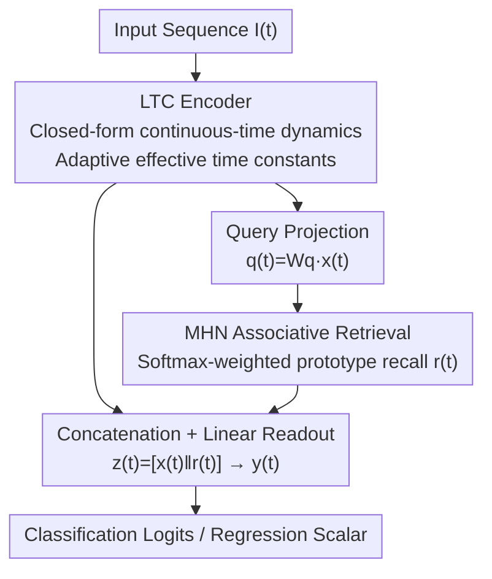

# Coupling Liquid Time-Constant Encoders with Modern Hopfield Memory

**Conference**: CVPR 2026  
**Paper**: [CVF Open Access](https://openaccess.thecvf.com/content/CVPR2026/html/Swain_Coupling_Liquid_Time-Constant_Encoders_with_Modern_Hopfield_Memory_CVPR_2026_paper.html)  
**Code**: None (Authors state it will be open-sourced after publication)  
**Area**: Neural Architecture / Time-series Modeling  
**Keywords**: Liquid Neural Networks, Continuous-time, Modern Hopfield, Associative Memory, Loss Surface

## TL;DR
This work attaches an external Modern Hopfield associative memory module to Liquid Time-Constant (LTC) networks to decouple "real-time encoding" from "long-term memory" within a single hidden state. It theoretically demonstrates that this coupling maintains bounded stability while contracting upstream gradients and depressing the Hessian trace, smoothing the training surface and yielding an average accuracy gain of 2.3% across six time-series benchmarks.

## Background & Motivation

**Background**: Time-series modeling has evolved from MLP $\rightarrow$ RNN/LSTM/GRU $\rightarrow$ Neural ODE to Liquid Neural Networks (LNN). The LTC (Liquid Time-Constant) unit is a compelling branch of continuous-time modeling: it characterizes continuous-time evolution using closed-form neuronal dynamics (rather than iterative numerical solvers like Neural ODE). Each neuron possesses an "input-dependent effective time constant," making inference lightweight, naturally supporting multi-scale dynamics, and providing inherent bounded stability guarantees.

**Limitations of Prior Work**: LTC suffers from a structural flaw—it employs a **single hidden state** $x(t)$ to simultaneously perform two tasks: encoding fast-changing input fluctuations and storing slowly accumulating long-term context. Squashing these two roles into one vector leads to "information interference," where fast inputs overwrite or disrupt the accumulated context, hindering LTC's performance in sequence reasoning tasks requiring long-range dependencies.

**Key Challenge**: This is essentially a "representation bottleneck"—online processing (fast) and long-term storage (slow) share the same evolving state, naturally competing for capacity. Biological neural systems solve this via **functional separation**: the prefrontal cortex handles real-time sequence control, while the hippocampus manages episodic memory through associative mechanisms.

**Goal**: Equip a continuous-time encoder with an explicit, content-addressable long-term memory under three constraints: maintaining LTC’s bounded stability, avoiding significant computational overhead, and delivering measurable optimization benefits.

**Key Insight**: The authors observe that Modern Hopfield Network (MHN) retrieval rules are mathematically equivalent to scaled dot-product attention, offering exponential storage capacity. Under proper constraints, the retrieval mapping can be **non-expansive (L-Lipschitz with $L \le 1$)**. This "non-expansive" property serves as the key link to preserve LTC's stability while regularizing gradients.

**Core Idea**: Connect an associative memory to the LTC using a serial pipeline: "Project to query $\rightarrow$ MHN memory retrieval $\rightarrow$ Concatenate with liquid state $\rightarrow$ Linear readout." This physically separates real-time encoding from associative recall while leveraging non-expansive retrieval to theoretically lower curvature and smooth the loss surface.

## Method

### Overall Architecture

The methodology is remarkably "lightweight": rather than modifying LTC internals, it introduces a memory bypass at the output of the LTC hidden state. Given an input sequence, the LTC layer encodes the temporal structure into a hidden state trajectory $x(t)$. At each timestep, $x(t)$ is linearly projected into a query $q(t)$ and fed to the MHN for associative retrieval, yielding a memory vector $r(t)$. Finally, $x(t)$ and $r(t)$ are **concatenated** into $z(t)$, which passes through a linear readout for the final prediction. The entire path is a single-pass forward process without additional non-linearities or recurrent retrieval. Gradients flow directly back to both LTC and MHN, while temporal and memory contributions remain separable in the feature space.

### Key Designs

**1. LTC Encoder: Continuous-time Encoding via Closed-form Dynamics**

This serves as the foundation for efficient continuous-time encoding without the numerical pitfalls of Neural ODE solvers. The LTC hidden state evolves according to:

$$\frac{dx(t)}{dt} = -\left(\frac{1}{\tau} + f_\theta(x(t), I(t))\right) x(t) + f_\theta(x(t), I(t))\,A$$

where $\tau>0$ is a base time constant, $A\in\mathbb{R}^n$ is a learnable bias vector, and $f_\theta(\cdot)\ge 0$ is a non-negative gating function. This induces an **input-dependent effective time constant** $\tau_{\text{eff}}(t)=\frac{\tau}{1+\tau f_\theta(x(t),I(t))}$, allowing neurons to adjust their response speed based on current input/state—the source of "liquid" multi-scale dynamics. Critically, it possesses explicit boundedness: if $0\le f_\theta\le f_{\max}$, $\|x(t)\|$ is bounded by a function that decays exponentially toward the norm of the bias vector $\|A\|$, ensuring no explosions. This boundedness is the prerequisite for "safely" attaching the memory module.

**2. MHN Associative Memory Coupling: Decoupling Long-term Memory**

This core design addresses the representation bottleneck. The MHN is a content-addressable, energy-driven memory storing $N$ patterns $\{\xi_j\}$. The energy function is $E(q)=-\frac{1}{\beta}\log\big(\sum_{j=1}^{N}e^{\beta q^\top \xi_j}\big)$, and its retrieval mapping is equivalent to scaled dot-product attention:

$$h_\beta(q)=\sum_{i=1}^{N}\alpha_i(q)\,\xi_i,\quad \alpha_i(q)=\frac{\exp(\beta q^\top \xi_i)}{\sum_j \exp(\beta q^\top \xi_j)}$$

The coupling involves three steps: **Query construction** $q(t)=W_q x(t)$ (projecting the $n$-dimensional liquid state into an $M$-dimensional memory space); **Memory retrieval** $r(t)=h_\beta(q(t))$, where $\beta>0$ controls sharpness; and **Fusion readout** $z(t)=[x(t)\,\|\,r(t)]$ following by $y(t)=W_o z(t)+b_o$. This approach is "transparent and separable": real-time temporal information stays in $x(t)$, while associative recall resides in $r(t)$. Concatenation ensures they do not overwrite each other, mirroring the functional separation of the prefrontal cortex vs. hippocampus.

**3. Non-expansive Retrieval $\rightarrow$ Gradient Contraction $\rightarrow$ Curvature Reduction**

The authors explain why this coupling stabilizes training through a three-ring theoretical chain. First, **Bounded Stability (Theorem 1)**: if $\|\xi_i\|\le R$, since $\|r(t)\|\le R$ and $\|x(t)\|$ converges to $\|A\|$, the concatenated state $z(t)$ satisfies $\|z(t)\|\le\sqrt{\|A\|^2+R^2}$, independent of $N$ or $\beta$. Second, **Gradient Contraction (Lemma 2)**: for upstream parameters $\theta$ (LTC and $W_q$) affecting only the query, the chain rule gives $\nabla_\theta r(t)=J_{h_\beta}\nabla_\theta q(t)$. Non-expansivity implies $\|J_{h_\beta}\|\le L\le 1$, so $\|\nabla_\theta r(t)\le L\,\|\nabla_\theta q(t)\|$; retrieval contracts rather than amplifies gradients. Third, **Hessian Trace Reduction (Theorem 2)**: accumulating these Jacobian bounds over timesteps leads to $\mathrm{tr}(\nabla_\theta^2 \mathcal{L}_{\text{LTC-MHN}})\le \mathrm{tr}(\nabla_\theta^2 \mathcal{L}_{\text{LTC}})$. Thus, the curvature at upstream parameters is no greater than in a standalone LTC. This explains the smoother loss surfaces observed in practice. ⚠️ Note: Theorem 2 in the original text is a qualitative "no greater than" bound based on Lipschitz and second-derivative assumptions.

### Loss & Training

Standard task-specific losses are used: Cross-Entropy for classification and MSE for regression (Power dataset). Implemented in PyTorch on a single RTX A6000 using Adam ($\beta_1=0.9, \beta_2=0.999$), a fixed learning rate of 0.001, and a batch size of 32. Hyperparameters are minimal: LTC hidden state $x(t)\in\mathbb{R}^{32}$, $W_q\in\mathbb{R}^{32\times32}$, MHN stores $N=16$ vectors in $\mathbb{R}^{32}$, inverse temperature $\beta=0.25$, and 4 attention heads.

## Key Experimental Results

### Main Results

LTC-MHN was compared against LSTM, CT-RNN, Neural ODE, CT-GRU, and LTC across six time-series benchmarks. LTC-MHN outperformed the others in 5 out of 6 tasks (4 classification + 1 anomaly detection F1), with an average gain of 2.3%.

| Dataset | Metric | LTC (Base) | Strongest Rival | LTC-MHN | Gain |
|--------|------|------------|----------|---------|------|
| Gesture | Acc↑ | 68.45% | 66.86%(CT-GRU) | **71.23%** | +2.78 |
| Occupancy | Acc↑ | 93.66% | 92.57%(CT-RNN) | **95.77%** | +2.11 |
| Activity | Acc↑ | 94.51% | 94.19%(Neural ODE) | **96.86%** | +2.35 |
| Seq. MNIST | Acc↑ | 95.36% | 96.01%(CT-GRU) | **97.30%** | +1.29 |
| Ozone | F1↑ | 0.304 | 0.278(LSTM) | **0.321** | +0.017 |
| Power | MSE↓ | 0.592 | **0.579**(CT-GRU) | 0.629 | Lower than best |

The most significant gains occurred in classification: the memory layer reduced misclassifications in sparse asynchronous event streams (Gesture) and periodic retrieval mitigated long-range gradient decay in Sequential MNIST (+1.9%).

### Ablation Study

To prove gains stem from "retrieval dynamics" rather than "parameter count," six variants were compared using accuracy, Hessian trace, and Gradient Noise Scale (GNS).

| Variant | #Params | Acc↑ | CE Loss↓ | Hessian Trace↓ | GNS | Description |
|------|-------|---------|----------|-------------|-----|------|
| LTC | 1653 | 87.99 | 0.267 | $1.6\times10^{-2}$ | 4.48 | Base liquid model |
| LTC match | 6037 | 88.47 | 0.258 | $4.02\times10^{-3}$ | 5.14 | LTC scaled to MHN params |
| **LTC-MHN** | 6053 | **90.42** | **0.197** | **$1.55\times10^{-3}$** | 3.35 | Full model (learnable MHN) |
| LTC-MHN(frozen) | 6053 | 88.03 | 0.291 | $4.07\times10^{-3}$ | 4.87 | MHN frozen at init |
| LTC-MHN($\beta_0$) | 6053 | 82.21 | 0.392 | $7.02\times10^{-3}$ | 3.91 | Uniform average ($\beta=0$) |
| LTC-MHN(shuffle) | 6053 | 80.26 | 0.425 | $3.92\times10^{-3}$ | 0.98 | Shuffled memory indices |

### Key Findings
- **Retrieval dynamics, not parameter count, drive performance**: Scaling LTC parameters (LTC match) only improved accuracy from 87.99 to 88.47 without significant curvature reduction. Full LTC-MHN reduced the Hessian trace by an order of magnitude (to $1.55\times10^{-3}$) and reached 90.42% accuracy. Freezing or shuffling the memory reverted gains to baseline levels.
- **Surface and representational evidence**: Loss surface visualizations show LTC-MHN has broader, flatter basins with fewer NaNs. PCA embeddings reveal tighter, more separable clusters, suggesting associative retrieval acts as a "denoising prior" for the hidden space, simplifying the linear decision boundary.
- **Regression is a weakness**: MHN stores discrete prototypes. Retrieval "pulls" the state toward the nearest prototype, which fits discrete labels but causes step-like corrections or overshooting in continuous targets (regression), reflected in the higher variance on the Power dataset.

## Highlights & Insights
- **Non-expansive retrieval as a dual-purpose mechanism**: The same $L \le 1$ Lipschitz property simultaneously proves bounded stability and derives gradient contraction and Hessian trace reduction.
- **Minimalist architecture with high analyticity**: By avoiding new non-linearites, every step allows for closed-form norm/gradient bounds. This "transparent design" philosophy enables the theoretical analysis.
- **Transferable design**: The strategy of decoupling "fast online states + slow associative memory" is applicable to any RNN/SSM-like encoder to potentially smooth training.

## Limitations & Future Work
- **Discrete memory bias in regression**: Prototype attraction causes overshooting; interpolation-based retrieval or residual corrections are suggested for the future.
- **Sensitivity to temperature $\beta$ and staleness**: A fixed $\beta$ was used throughout; memory patterns only update via MBP and may become stale in non-stationary environments.
- **Comparison scale**: The work primarily compares against RNN/continuous-time baselines and lacks SOTA Time-series Transformers or SSMs. The paper focuses more on mechanism analysis than benchmark leaderboard climbing.

## Related Work & Insights
- **vs. Standard LTC [8]**: This work acknowledges the capacity bottleneck of a single hidden state and introduces a bypass to decouple signals, trading a small increase in parameters for a massive reduction in Hessian curvature.
- **vs. Neural ODE**: Both handle continuous time, but Neural ODE relies on iterative solvers with stability issues. LTC/LTC-MHN uses closed-form dynamics for speed and stability.
- **vs. Memory Networks [6,18]**: While providing external memory, they lack the computational efficiency and stability guarantees of liquid models. This work's MHN retrieval is attention-equivalent with exponential capacity and explicit gradient bounds.

## Rating
- Novelty: ⭐⭐⭐⭐ The components exist, but the principled coupling of continuous-time encoding and associative memory under explicit stability constraints to derive optimization benefits is novel.
- Experimental Thoroughness: ⭐⭐⭐ Good variety of benchmarks and diagnostic metrics, though lacks SOTA SSM/Transformer baselines.
- Writing Quality: ⭐⭐⭐⭐ Clear chain from motivation to theory to results.
- Value: ⭐⭐⭐⭐ Provides a concise, analytical paradigm for adding memory to RNN/SSM encoders and explaining its optimization gains.

<!-- RELATED:START -->

## Related Papers

- [\[ICML 2025\] Nonparametric Modern Hopfield Models](../../ICML2025/others/nonparametric_modern_hopfield_models.md)
- [\[ICML 2025\] Modern Methods in Associative Memory](../../ICML2025/others/modern_methods_in_associative_memory.md)
- [\[CVPR 2026\] DREAM: Document Recognition with Explicit Adaptive Memory](dream_document_recognition_with_explicit_adaptive_memory.md)
- [\[CVPR 2026\] Neural Collapse in Test-Time Adaptation](neural_collapse_in_test-time_adaptation.md)
- [\[CVPR 2026\] PhysSkin: Real-Time and Generalizable Physics-Based Skin Simulation](physskin_real-time_and_generalizable_physics-based_animation_via_self-supervised.md)

<!-- RELATED:END -->
