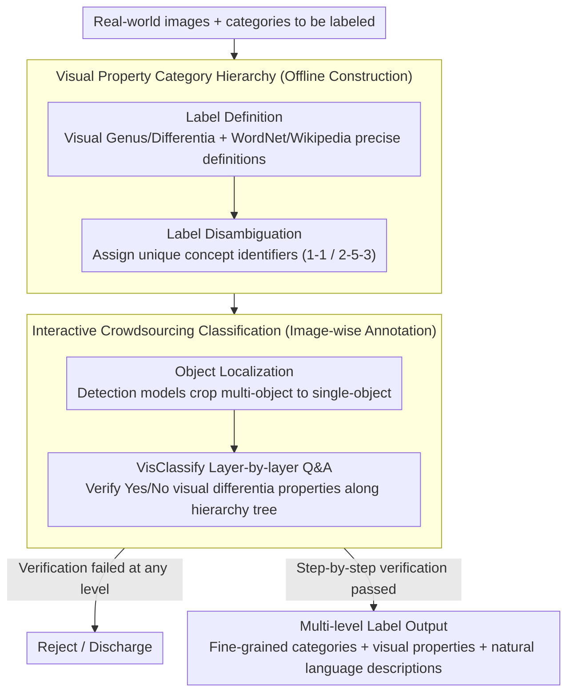

# Crowdsourcing of Real-world Image Annotation via Visual Properties

**Conference**: CVPR 2026  
**arXiv**: [2604.14449](https://arxiv.org/abs/2604.14449)  
**Code**: None  
**Area**: Dataset Construction/Annotation Methodology  
**Keywords**: image annotation, crowdsourcing, visual properties, semantic gap, object hierarchy

## TL;DR

Proposes an image annotation methodology based on visual property constraints, constructing an object category hierarchy via knowledge representation combined with an interactive crowdsourcing framework, utilizing visual genus and visual differentia to guide the annotation process and reduce annotator subjectivity and semantic gap issues.

## Background & Motivation

The construction process of existing image datasets (e.g., ImageNet, Open Images) suffers from subjectivity: annotators match images to predefined categories based on personal understanding, leading to many-to-many mapping and annotation inconsistency. For instance, the same image in ImageNet might be labeled with three different granularities, or distinctly different images (real objects, toys, cartoons, figurines) are labeled as the same "brown bear" category. The root cause is the Semantic Gap Problem (SGP) introduced by the complexity and ambiguity of natural language.

## Method

### Overall Architecture

This effort presents an annotation methodology aimed at solving many-to-many mapping and inconsistency (e.g., one image labeled with multiple granularities, or real/toy/cartoon confusion) caused by annotators subjectively forcing images into abstract category names in datasets like ImageNet and Open Images. It decomposes annotation into a four-step pipeline categorized into three tasks: **Offline construction** of the visual property hierarchy—first defining precise visual properties for each category based on knowledge bases (Label Definition), then assigning unique concept identifiers to each label for disambiguation (Label Disambiguation); **Image-wise annotation**—first identifying and cropping individual objects (Object Localization), then having annotators verify visual properties layer-by-layer along the hierarchy tree (Visual Classification, driven by the VisClassify algorithm); finally **Outputting** multi-level labels. The core idea is replacing "matching abstract names" with "verifying concrete visual properties."

### Key Designs

**1. Visual Property Category Hierarchy: Replacing abstract names with visual genus/differentia**

To address the subjectivity caused by annotators directly matching abstract category names, the hierarchy uses visual genus as parent class shared properties (e.g., the visual genus of a "Goldfinch" is "Finch") and visual differentia as properties distinguishing sibling categories (e.g., "crimson face and yellow-black wings"). Annotation requires verifying these specific visual properties rather than judging abstract class membership by impression, thereby reducing subjectivity at the source. This hierarchy is constructed offline in two steps: Label Definition precisely defines visual properties for each category via knowledge bases like WordNet and Wikipedia to eliminate ambiguity; Label Disambiguation assigns unique concept identifiers (e.g., "1-1", "2-5-3") to each label to resolve polysemy. This results in a hierarchy tree $H$ that allows for layer-by-layer questioning.

**2. Interactive Crowdsourcing Q&A (VisClassify): Transforming classification into binary questions**

To reduce the cognitive load and error rates associated with freely judging category names, Object Localization is performed before annotating each image: object localization models automatically crop multi-object images into single-object images to eliminate ambiguity. Subsequently, VisClassify (Algorithm 1) performs recursive Q&A based on the hierarchy tree $H$, starting from the root node. Questions at each branch are generated from knowledge-base-predefined visual differentia properties, and annotators only need to determine "whether the object possesses a specific visual differentia." A "No" answer leads to an immediate Discharge (discarding the image); a "Yes" answer records the label of the current level and continues traversing child nodes until it reaches a leaf or the annotator denies all child differentia. For example, to distinguish a "Goldfinch" from a "Greenfinch," the annotator only needs to answer whether it has a "crimson face."

**3. Multi-level Label Output: Single annotation producing multi-granularity supervision**

To address the limited information content of single category labels, VisClassify records labels at every layer while traversing the hierarchy tree. Consequently, each image yields multi-level labels: fine-grained category labels at different granularities, visual property labels, and natural language descriptions of visual features. This allows the dataset to simultaneously support various tasks such as object recognition, fine-grained classification, zero-shot learning, and image captioning.

### Loss & Training

Ours is an annotation methodology and does not involve model training.

## Key Experimental Results

### Main Results

The effectiveness of the method is verified through crowdsourcing experiments, and annotator feedback discusses directions for optimizing crowdsourcing setups. Compared to unconstrained free labeling, constrained annotation based on visual properties significantly improves annotation consistency and accuracy. In experiments, annotators labeled bird images (e.g., distinguishing "Goldfinch" from "Greenfinch" by verifying the "crimson face" differentia) by answering hierarchical visual property questions. Results show that annotators from different backgrounds achieved higher consistency under the guidance of visual properties. The resulting dataset contains multi-granularity labels, visual property labels, and natural language descriptions, which can directly serve multi-task learning.

### Key Findings

- Visual property constraints effectively reduce subjectivity differences between annotators.
- The hierarchical Q&A process reduces the cognitive load of annotation tasks.
- Multi-level labels provide richer supervision signals for various downstream tasks.

## Highlights & Insights

- Systematically redesigns the annotation process starting from the Semantic Gap Problem, providing a strong conceptual foundation.
- The conceptual design of visual genus/differentia possesses philosophical depth.
- Multi-level label outputs increase the versatility of the dataset.
- Each category is precisely defined via knowledge bases like WordNet and Wikipedia, eliminating ambiguity from natural language polysemy.
- Label Disambiguation assigns unique identifiers (e.g., "1-1" and "2-5-3") to each label to solve polysemy issues.
- Object Localization uses detection models to automatically crop images, eliminating object ambiguity in multi-target scenes.

## Limitations & Future Work

- Constructing the predefined visual property hierarchy requires domain experts, leading to high expansion costs.
- Currently tailored for object recognition; applicability to scene understanding or action recognition is limited.
- The experimental scale is relatively small and has not been fully validated on million-scale datasets.
- The definition of visual differentia relies on taxonomic canons, and its adaptability to annotators from different cultural backgrounds remains to be verified.
- Possible integration with automated annotation tools (e.g., MLLM-assisted annotation) has not been explored.

## Related Work & Insights

- The systematic analysis of annotation quality issues in existing benchmarks is valuable.
- The idea of visual property-guided annotation can be integrated into active learning and human-in-the-loop annotation frameworks.
- The hierarchical labeling scheme provides guidance for building higher-quality datasets.
- Specific case analyses of ImageNet and Open Images reveal systematic flaws in current annotation practices.

## Rating

5/10 — The problem definition is valuable, but the work lacks large-scale experimental validation and quantitative improvement metrics.

The four-step strategy (Label Definition → Label Disambiguation → Object Localization → Visual Classification) in the annotation methodology reflects a complete process design from knowledge representation to crowdsourcing execution.

<!-- RELATED:START -->

## Related Papers

- [\[CVPR 2026\] Clair Obscur: an Illumination-Aware Method for Real-World Image Vectorization](clair_obscur_an_illumination-aware_method_for_real-world_image_vectorization.md)
- [\[CVPR 2026\] UniMERNet: A Universal Network for Real-World Mathematical Expression Recognition](unimernet_a_universal_network_for_real-world_mathematical_expression_recognition.md)
- [\[CVPR 2026\] Event-based Visual Deformation Measurement](event-based_visual_deformation_measurement.md)
- [\[CVPR 2026\] Modeling the Visual Ambiguity of Human Sketches](modeling_the_visual_ambiguity_of_human_sketches.md)
- [\[CVPR 2026\] Towards Stable Federated Continual Test-Time Adaptation in Wild World](towards_stable_federated_continual_test-time_adaptation_in_wild_world.md)

<!-- RELATED:END -->
