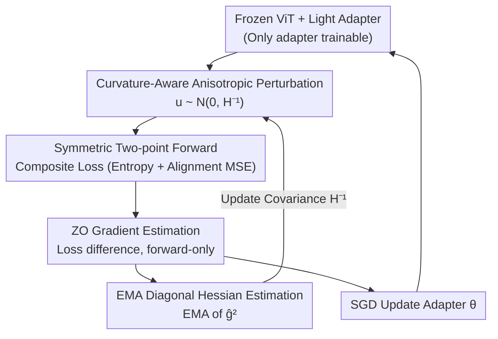

# Curvature-Aware Zeroth-Order Optimization for Memory-Efficient Test-Time Adaptation

**Conference**: CVPR 2026  
**Paper**: [CVF Open Access](https://openaccess.thecvf.com/content/CVPR2026/html/Zhang_Curvature-Aware_Zeroth-Order_Optimization_for_Memory-Efficient_Test-Time_Adaptation_CVPR_2026_paper.html)  
**Code**: https://github.com/Hollyming/CAZO  
**Area**: Model Compression / Test-Time Adaptation  
**Keywords**: Zeroth-Order Optimization, Test-Time Adaptation, Curvature-Aware, Low-Rank Hessian, Memory-Efficient  

## TL;DR
For memory-constrained on-device Test-Time Adaptation (TTA), this paper utilizes **forward-only, backpropagation-free** Zeroth-Order (ZO) optimization to fine-tune a lightweight adapter. Observing that the Hessian remains low-rank and changes slowly during TTA, the authors replace isotropic random perturbations with **curvature-aware anisotropic perturbations**. This significantly reduces the variance of ZO gradient estimates, achieving a SOTA 69.0% on ImageNet-C while saving approximately 70% VRAM compared to BP-based methods.

## Background & Motivation
**Background**: Test-Time Adaptation (TTA) allows pre-trained models to adapt to distribution shifts online using unlabeled test data during inference, serving as a mainstream paradigm for handling OOD data on edge devices. Most TTA methods (e.g., TENT, CoTTA, SAR) rely on Backpropagation (BP) to fine-tune weights using entropy minimization or self-supervised losses.

**Limitations of Prior Work**: BP requires storing activations for the backward pass, leading to massive memory overhead. Empirically, TENT requires 6,404 MB and CoTTA requires 17,773 MB (due to data augmentation), making them unsuitable for memory-constrained edge deployment. Consequently, BP-free TTA (sampling-based or heuristic) is highly desirable, with Zeroth-Order (ZO) optimization being a representative approach—it **estimates gradients using only function value (loss) differences**, requiring no computation graph and consuming memory nearly equal to a single forward pass.

**Key Challenge**: The inherent flaw of ZO is **extremely high gradient estimation variance**. The variance of standard Random Gradient Estimation (RGE) is proportional to the parameter dimension $d$, i.e., $O(d/k)$. Theoretically, naive ZO-SGD requires $O(d)$ times more iterations than first-order methods to reach the same accuracy. In high-dimensional neural networks, this variance causes convergence to be too slow for practical TTA. Thus, reducing ZO variance without introducing BP is critical.

**Key Insight**: By observing the curvature of the loss landscape during TTA, the authors found that the Hessian matrix **remains low-rank and its principal curvature directions change slowly** throughout the adaptation process. The top-20 eigenvalues account for over 96% of the variance, with an effective rank of only 0.22% of the total dimensions. The projection ratio of principal subspaces between adjacent steps remains stable at approximately 0.9. This implies that only a few directions are truly "steep," while most dimensions reside in flat regions.

**Core Idea**: Since curvature is concentrated in a few stable directions, isotropic random perturbations should be replaced by a covariance $\tilde H^{-1}$. This applies **smaller perturbations in steep directions and larger perturbations in flat directions**, suppressing ZO gradient variance with "information-dense" sampling. This approach is termed Curvature-Aware Zeroth-Order (CAZO).

## Method

### Overall Architecture
CAZO transforms TTA into a **forward-only online optimization loop**: all weights of a pre-trained ViT-B/16 are frozen, and a lightweight adapter is inserted at the 3rd layer as the trainable parameter $\theta_{\text{adapt}}$. In each adaptation step, symmetric two-point perturbations $\theta\pm\epsilon u$ are applied for forward passes to calculate a composite loss and estimate the ZO gradient via loss differences. The key modification is that the perturbation vector $u$ is sampled from $\mathcal N(0,\tilde H_t^{-1})$ instead of standard Gaussian. $\tilde H_t$ is a diagonal Hessian approximation maintained online via Exponential Moving Average (EMA) of element-wise squared ZO gradients. The estimated gradient updates the adapter via SGD and updates the Hessian estimate simultaneously.

The composite loss follows forward-friendly designs: unsupervised entropy loss on test data plus MSE loss for feature alignment using clean data statistics.

### Key Designs

**1. Observation of Low-Rank and Slowly Varying Hessian: Foundation for Anisotropic Sampling**

This empirical step supports the entire approach. The authors calculated the empirical Hessian of adapter parameters on ImageNet-C (Gaussian noise, severity-5) at steps 0, 25, 50, and 99. They observed two properties: (i) **Persistent Low-Rankness**—top-20 eigenvalues consistently account for >96% of variance, and the effective rank is only 0.22% of total dimensions. (ii) **Slowly Varying Principal Subspace**—using the top-$r$ eigenvectors $U_t^{(r)}$ to construct a projection matrix $P_t=U_t^{(r)}(U_t^{(r)})^\top$, the projection ratio between adjacent steps:

$$\rho_t^{(r)}=\frac{\|P_t H_{t+1}\|_F}{\|H_{t+1}\|_F},$$

remains stable near 0.9 for $r\in\{5,10,15,20\}$. Low-rankness indicates only a few directions are worth perturbing, while slow variation justifies online estimation via EMA without recomputing from scratch.

**2. Curvature-Aware Anisotropic Perturbation Sampling: Relocating Variance from Steep Directions**

Standard ZO (RGE) uses isotropic perturbations $\mathcal N(0,I)$, wasting effort on flat, uninformative directions while under-sampling steep ones. CAZO changes the sampling distribution to a preconditioned Gaussian: $u_i\sim\mathcal N(0,\tilde H_t^{-1})$, where the gradient estimate becomes:

$$\hat g(\theta_t)=\frac1k\sum_{i=1}^k\frac{\mathcal L(\theta_t+\epsilon u_i)-\mathcal L(\theta_t-\epsilon u_i)}{2\epsilon}u_i,\quad u_i\sim\mathcal N(0,\tilde H_t^{-1}).$$

Intuitively, $\tilde H^{-1}$ **shrinks perturbations in high-curvature (steep) directions and expands them in low-curvature (flat) directions**, directly reducing variance. Since computing $\tilde H^{-1}$ for high-dimensional networks is infeasible, the authors use a diagonal approximation $\Sigma=\tilde H^{-1}=\mathrm{diag}(\sigma_1^2,\dots,\sigma_d^2)\succ0$, keeping storage/computation proportional to parameter dimensions. Theoretically, a convergence rate of $O(1/\sqrt T)$ is provided under non-convex smooth assumptions, where the constant depends on curvature bounds $\beta_l, \beta_u$, making it smaller than isotropic ZO when curvature conditions are favorable.

**3. EMA Diagonal Hessian Estimation: Tracking Curvature via Forward Gradients**

To track $\tilde H_t$ online without second-order derivatives, CAZO uses the **element-wise square** of the ZO gradient estimate $\hat g$ via EMA:

$$D_t=(1-\nu)D_{t-1}+\nu\,\hat g^2(\theta_{t-1}),\qquad \tilde H_t=\mathrm{diag}\!\left(\frac{D_t}{1-(1-\nu)^t}\right),$$

where $\nu\in[0,1]$ is the EMA coefficient, and the denominator is a bias correction term. This reuses ZO gradients as a by-product for second-order information with zero additional BP cost. EMA "memory" matches the slow variation of the principal subspace, enabling robust tracking of curvature shifts.

### Loss & Training
Composite loss = Unsupervised entropy loss on test data + Feature alignment MSE loss (following FOA). The optimizer is standard SGD with ZO gradients. The adapter is inserted at layer 3 with a down-sampling ratio of 384, perturbation count $k=20$, and EMA coefficient $\nu=0.8$.

## Key Experimental Results

### Main Results (ImageNet-C severity-5, ViT-B/16, reset per corruption)
CAZO achieves 69.0% average accuracy, outperforming both BP-free and BP-based methods.

| Method | Is BP | Avg. Acc.(%) | Notes |
|------|---------|-------------|------|
| NoAdapt | × | 55.5 | Baseline |
| T3A | × | 56.9 | BP-free |
| FOA | × | 65.8 | CMA-ES evolved prompt |
| ZOA | × | 67.5 | ZO + Domain knowledge bank |
| TENT | ✓ | 59.8 | Entropy minimization |
| SAR | ✓ | 62.7 | |
| CoTTA | ✓ | 61.9 | Teacher-student + Augmentation |
| DeYO | ✓ | 64.7 | |
| EATA | ✓ | 66.8 | |
| **CAZO** | × | **69.0** | +3.2/1.5 over FOA/ZOA, +6.3/7.1 over SAR/CoTTA |

In Continual TTA (CTTA), CAZO leads with 65.3%, outperforming LCoTTA / ETA / SAR by +3.0 / +3.6 / +3.7. On ImageNet-R/V2/Sketch, it averages 63.5%.

### Memory & Runtime (Table 4, 50,000 samples, H20 GPU)
| Method | Is BP | Acc.(%) | Time(s) | Memory(MB) |
|------|---------|---------|---------|----------|
| TENT | ✓ | 59.8 | 210 | 6,404 |
| CoTTA | ✓ | 61.9 | 961 | 17,773 |
| FOA (p=28) | × | 65.8 | 2,885 | 1,553 |
| ZOA | × | 67.5 | 398 | 1,660 |
| ZO (k=20) | × | 62.9 | 3,166 | 1,695 |
| CAZO (k=2) | × | 65.2 | 417 | 1,693 |
| CAZO (k=8) | × | 67.9 | 1,260 | 1,695 |
| **CAZO (k=20)** | × | **69.0** | 3,127 | **1,695** |

VRAM is only 1/4 to 1/10 of BP methods. Due to the diagonal proxy and adapter, **memory remains constant regardless of perturbation count $k$**. Compared to vanilla ZO, curvature-aware sampling improves accuracy from 62.9% to 69.0% under the same forward budget.

### Ablation Study (Fig. 6 / Table 4)
| Configuration | Key Metric | Description |
|------|---------|------|
| Adapter at Layer 3 | Peak Acc | Low-layer features favor fast domain alignment |
| Ratio=384 | Optimal Balance | Smaller ratios lead to parameter explosion without gain |
| $k$: 2→6 | 59.3%→62.1% | ECE drops; marginal gains after $k=6$; $k=20$ is default |
| EMA $\nu=0.8$ | 69.0% Optimal | $\nu=1.0$ (no smoothing) causes instability |

### Key Findings
- **Curvature awareness drives performance**: Replacing isotropic perturbations with $\mathcal N(0,\tilde H^{-1})$ boosts accuracy from 62.9% to 69.0% (+6.1%).
- **Memory efficiency via diagonal proxy**: Memory usage does not scale with $k$, allowing for higher precision via more perturbations without VRAM increases.
- **Larger adapter ≠ better**: Gains come from better sampling geometry, not increased capacity; overly large adapters can degrade performance.

## Highlights & Insights
- **Incorporate second-order info into ZO sampling**: While second-order optimization usually requires Hessian storage, this approach uses graduate squares (from forward passes) for EMA diagonal approximation with zero BP overhead.
- **Observation-driven design**: Quantifying the "slow-varying principal subspace" via $\rho_t^{(r)}$ validates the use of EMA for online curvature estimation.
- **Transferability**: Curvature-aware anisotropic sampling is not limited to TTA; it can be applied to any high-dimensional forward-only ZO scenario (black-box attacks, LLM forward tuning, etc.).

## Limitations & Future Work
- **Diagonal Approximation**: Ignores off-diagonal coupling between directions; diagonal proxies may be sub-optimal when the Hessian subspace is not axis-aligned.
- **Runtime**: At $k=20$, it takes 3,127s, significantly slower than ZOA (398s). Accuracy and speed are in a trade-off.
- **Convergence Assumptions**: The theoretical condition $\beta_l^2>\beta_u$ might not always hold in practice; further sensitivity analysis on curvature proxies is needed.

## Related Work & Insights
- **vs. ZO / RGE**: Both use forward-only loss differences. CAZO uses curvature preconditioning $\mathcal N(0,\tilde H^{-1})$ instead of $\mathcal N(0,I)$, gaining +6.1% accuracy.
- **vs. FOA**: FOA uses CMA-ES to evolve segments (p=28 requires 28 forwards). CAZO uses symmetric ZO + diagonal Hessian for higher accuracy (69.0% vs. 65.8%) with similar memory.
- **vs. BP-based (TENT/CoTTA/SAR)**: These rely on backward gradients and consume 4~10× more memory, yet CAZO achieves superior accuracy in forward-only mode.

## Rating
- Novelty: ⭐⭐⭐⭐ Uses "Hessian low-rank variation" observations for ZO curvature preconditioning; innovative and self-consistent.
- Experimental Thoroughness: ⭐⭐⭐⭐ Covers various TTA types, 4 datasets, memory/runtime, quantization, and extensive ablations.
- Writing Quality: ⭐⭐⭐⭐ Clear progression from observation to method to theory.
- Value: ⭐⭐⭐⭐ Achieves BP-level accuracy in forward-only TTA while saving 70% memory; high potential for edge deployment.

<!-- RELATED:START -->

## Related Papers

- [\[CVPR 2026\] Neural Collapse in Test-Time Adaptation](neural_collapse_in_test-time_adaptation.md)
- [\[CVPR 2026\] Back to Source: Open-Set Continual Test-Time Adaptation via Domain Compensation](back_to_source_open-set_continual_test-time_adaptation_via_domain_compensation.md)
- [\[CVPR 2026\] WiTTA-Bench: Benchmarking Test-Time Adaptation for WiFi Sensing](witta-bench_benchmarking_test-time_adaptation_for_wifi_sensing.md)
- [\[CVPR 2026\] Towards Stable Federated Continual Test-Time Adaptation in Wild World](towards_stable_federated_continual_test-time_adaptation_in_wild_world.md)
- [\[ECCV 2024\] MemBN: Robust Test-Time Adaptation via Batch Norm with Statistics Memory](../../ECCV2024/others/membn_robust_test-time_adaptation_via_batch_norm_with_statistics_memory.md)

<!-- RELATED:END -->
