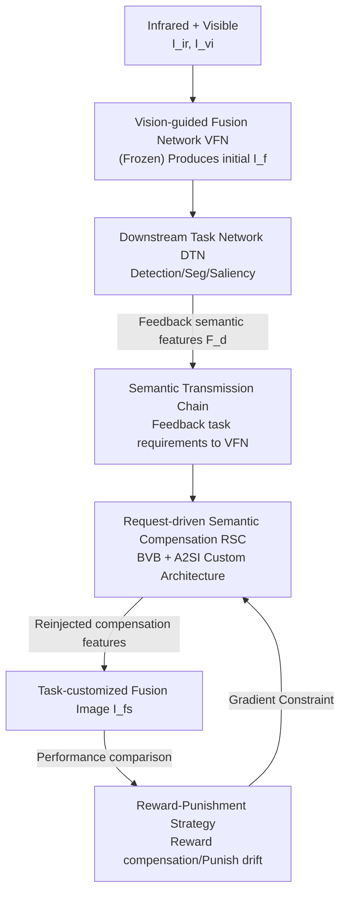

# Customized Fusion: A Closed-Loop Dynamic Network for Adaptive Multi-Task-Aware Infrared-Visible Image Fusion

**Conference**: CVPR 2026  
**arXiv**: [2604.08924](https://arxiv.org/abs/2604.08924)  
**Code**: https://github.com/YR0211/CLDyN (Available)  
**Area**: Infrared-Visible Image Fusion / Multi-Task Adaptation / Dynamic Networks  
**Keywords**: Image Fusion, Closed-Loop Optimization, Task-Adaptive, Dynamic Convolution, Semantic Compensation

## TL;DR
This paper proposes CLDyN, a closed-loop dynamic network that enables a frozen fusion network to adapt to downstream tasks (detection/segmentation/saliency) without retraining. By utilizing a "Request-driven Semantic Compensation (RSC)" module with only 0.46M parameters, the system receives semantic feedback and dynamically customizes convolutional structures for task-specific compensation. It maintains high fusion quality while achieving superior multi-task adaptability on M3FD, FMB, and VT5000 datasets.

## Background & Motivation
**Background**: Infrared-Visible Image Fusion (IVIF) synthesizes thermal targets from infrared and texture details from visible images to support high-level vision tasks like detection, segmentation, and salient object detection. Existing "task-aware fusion" methods generally follow two paradigms: **loss-driven** (e.g., SeAFusion, TDAL, MetaFusion, TDFu), which design task-related losses to guide the fusion network during training; and **task-semantic guided** (e.g., DetFusion, UAAFusion, MRFS, SAGE), which directly inject task features into the fusion process.

**Limitations of Prior Work**: Both paradigms solidify "task preferences" into **static network weights**. Consequently, fusion networks perform well only on downstream task networks (DTNs) seen during training. Performance drops significantly when faced with untrained DTNs because the fixed architecture and parameters cannot be readjusted to meet new semantic requirements.

**Key Challenge**: The semantic requirements of different tasks are often conflicting. For instance, detection requires prominent thermal regions, segmentation demands clear boundary structures, and saliency detection focuses on complete salient regions. Attempting to satisfy these diverse needs with a **single set of static weights** leads to task bias, while training separate models for each task is computationally prohibitive.

**Goal**: To enable a **single** fusion network to adjust itself "on-the-fly" based on the current semantic needs of any downstream task without retraining, effectively covering multiple tasks with one set of modules.

**Key Insight**: Drawing inspiration from **closed-loop feedback** in control theory, the authors propose that information should not only flow unidirectionally from fusion to task networks. Instead, semantic features fed back from the task network should serve as "error signals" to refine fusion features. Task adaptation is essentially providing "task-specific semantic compensation" on intermediate features of a frozen fusion network.

**Core Idea**: Replace "weight-fixed task preference" with a "closed-loop optimization mechanism + RSC module." This allows the fusion network's architecture to be dynamically customized based on task demands, achieving multi-task adaptation without retraining.

## Method

### Overall Architecture
CLDyN consists of two stages. In the **first stage**, a **Vision-guided Fusion Network (VFN)** is trained. $I_{ir}$ and $I_{vi}$ pass through $L$ Feature Extraction Blocks (FEB) to produce $\{F^l_{ir/vi}\}$, and a Fusion Reconstruction Block (FRB) generates an initial fusion image $I_f$ using pixel and gradient losses. In the **second stage**, the VFN is frozen, and a closed-loop mechanism is introduced. $I_f$ is fed into the $n$-th DTN to obtain prediction $\hat{y}^n_f$ and feedback semantic features $F^n_d$. The **RSC module** then uses $F^n_d$ to perform task-specific compensation on VFN's intermediate features, producing $F^{l,n}_{ir_s/vi_s}$, which are reinjected back into VFN to reconstruct a task-customized fusion image $I^n_{fs}$. The entire loop (VFN → DTN → RSC → VFN) is treated as a "semantic transmission chain" constrained by a "reward-punishment strategy" based on task performance changes. RSC is trained once and shared across tasks; during inference, it requires no gradient updates, adding only 0.46M parameters and 174.06G FLOPs.

### Key Designs

**1. Closed-loop Feedback: Feeding Downstream Semantic Needs back to Fusion**
To address the inability of static weights to adapt to unseen tasks, the authors convert the unidirectional "fusion → task" pipeline into a closed loop. As per Eqs. (2)-(5), the frozen VFN generates $\{F^l_{ir/vi}\}$. $I_f$ enters task network $\phi_n$ to retrieve $(\hat{y}^n_f, F^n_d)$, where $F^n_d$ encodes preferences for structure, texture, or saliency. RSC compensates these as $F^{l,n}_{ir_s/vi_s} = \mathrm{RSC}(\{F^l_{ir/vi}\}, F^n_d; \Psi)$. These compensated features **replace** original features in VFN to generate $I^n_{fs}$. Consequently, the adaptation resides entirely in the learnable compensation module, allowing one network to produce different fusion results for different tasks (e.g., highlighting thermal areas for detection or edges for segmentation).

**2. Reward-Punishment Strategy: Anchor Semantic Compensation to Performance**
Without guidance, RSC might suffer from "semantic drift" toward a specific task during multi-task training. The authors introduce a strategy anchoring compensation quality to task performance: the reward term $\ell^n_r = c_n(\hat{y}^n_{fs}, y^n_{GT})$ encourages predictions to align with Ground Truth after compensation; the punishment term $\ell^n_p = \max(0,\ c_n(\hat{y}^n_{fs}, y^n_{GT}) - c_n(\hat{y}^n_f, y^n_{GT}))$ is activated only if the compensation makes the task performance worse than the initial fusion. The total objective is $\ell^n_{cl} = \ell^n_r + \alpha\,\ell^n_p$, where $\alpha$ controls punishment intensity. CAGrad is used to resolve multi-task gradient conflicts.

**3. RSC: Architecturally Customizing Convolutions via BVB and A2SI**
This component translates "task requirements" into "network operations." It consists of a **Base Vector Bank (BVB)** and $2(L-1)$ **Architecture-Adaptive Semantic Injection (A2SI)** blocks. Since a single receptive field cannot handle diverse task semantics, each A2SI contains $M$ semantic extraction branches. Within each branch, convolutional configurations are selected based on $F^l_{ir/vi}$ and $F^n_d$. Four orthogonal convolution prototypes $p=[p_{1,1}, p_{3,1}, p_{3,2}, p_{3,3}]$ (combinations of kernel size $k$ and dilation $d$) are defined. The configuration selection matrix is $S = \mathrm{Softmax}(p\,\mathrm{Resh}(\mathrm{Proj}_3([\mathrm{Proj}_1(F^l_{ir/vi}); \mathrm{Proj}_2(F^n_d)])))$.

After determining the structure, the **convolutional parameters themselves** are predicted by the BVB. The BVB contains four sub-banks corresponding to the four configurations, each with 32 learnable base vectors. Following Eq. (9), cosine similarity $s_i$ between aggregated features and base vectors $r^{k,d}_{ir/vi,i}$ is calculated to select the most similar vector $\tilde{r}_m$, which is then passed through a prediction block $\mathrm{Pred}^{k,d}$ to generate the kernel $W^{k,d}_m$. This two-step process allows the network architecture to be reassembled on-the-fly.

### Loss & Training
- **Phase 1 (VFN Training)**: Fusion loss $\ell_f = \|I_f - \max(I_{ir}, I_{vi})\|_1 + \lambda\|\nabla I_f - \max(\nabla I_{ir}, \nabla I_{vi})\|_1$, where $\nabla$ is the Sobel gradient.
- **Phase 2 (RSC Training)**: VFN is frozen. Only RSC is trained using the closed-loop objective $\ell^n_{cl} = \ell^n_r + \alpha\ell^n_p$ with CAGrad.
- **Settings**: $L=2$, $\alpha=5$, $M=4$. Optimized via Adam with learning rates of $1 \times 10^{-3} / 1 \times 10^{-2}$. Downstream networks: YOLOv5s, SegFormer (mit-b2), and CTDNet-18.

## Key Experimental Results

### Main Results

**Comparison of Fusion Quality** (Metrics MI, $Q_{AB/F}$, $Q_{CB}$, $Q_C$ higher is better; $Q_{CV}$ lower is better):

| Dataset | Metric | Ours | Runner-up (Typical) | Note |
|:---:|:---:|:---:|:---:|:---:|
| M3FD | $Q_{AB/F}$ ↑ | **0.6900** | 0.6601 (SMiF) | Leading gradient quality |
| M3FD | $Q_{CV}$ ↓ | **472.62** | 488.67 (SMiF) | Lowest error |
| FMB | MI ↑ | **2.6219** | 2.4035 (TIMF) | Highest mutual info |
| VT5000 | $Q_{AB/F}$ ↑ | **0.6519** | 0.5249 (SAGE) | Significant lead |

**Multi-Task Adaptability — vs. Task-Specific Retraining** (OD: mAP$_{50\to95}$, Seg: mIoU, SOD: mF/$E_m$):

| Method | OD mAP ↑ | Seg mIoU ↑ | SOD mF ↑ | Params(M) | FLOPs(G) |
|:---|:---:|:---:|:---:|:---:|:---:|
| IRFS | 0.6306 | 59.43 | 0.8114 | — | — |
| TIMF | 0.6166 | 60.86 | 0.7985 | 46.52 | 183.82 |
| **Ours** | 0.6304 | **60.34** | **0.8129** | **0.46** | **174.06** |

Ours achieves state-of-the-art or near-SOTA performance across multiple tasks using **minimal trainable parameters (0.46M, ~1% of TIMF)** and the lowest computational cost.

### Ablation Study

| Configuration | OD mAP ↑ | Seg mIoU ↑ | SOD mF ↑ | Note |
|:---|:---:|:---:|:---:|:---|
| Model I (No closed-loop) | 0.6272 | 60.15 | 0.8136 | Significant task bias |
| Model II (No penalty $\ell^n_p$) | 0.6276 | 60.18 | 0.8134 | Biased toward SOD |
| **Full model** | **0.6304** | **60.34** | 0.8129 | Most balanced performance |

**Generalization across Detectors** (Frozen RSC, changing detector):
- **DETR**: VFN (0.5610) → VFN+RSC (**0.5810**)
- **YOLOv5**: VFN (0.6076) → VFN+RSC (**0.6304**)

## Highlights & Insights
- **Introduction of Control Theory Loop**: Using task network feedback as "error signals" to refine fusion features is highly novel. It decouples visual fidelity (Frozen VFN) from task adaptation (pluggable RSC).
- **"Degradation-Triggered" Punishment**: The term $\ell^n_p = \max(0, \text{after} - \text{before})$ acts as a safeguard, penalizing only negative drift without suppressing positive gains. This is a robust alternative to standard task losses.
- **Dual-Layer Dynamic Adaptation**: A2SI handles structural selection via orthogonal prototypes, while BVB handles parameter selection via orthogonal base vectors. The architecture effectively reconfigures itself based on task semantics.
- **Extreme Efficiency**: Achieving multi-task adaptability with only 0.46M parameters is a significant breakthrough for resource-constrained deployments.

## Limitations & Future Work
- **Fixed Task Set**: RSC is currently trained and shared within a **predefined task set**. Zero-shot extension to entirely new task types was not specifically verified.
- **Dependency on Differentiable Feedback**: The system relies on semantic features $F^n_d$ from the DTN, which might not be accessible in black-box task scenarios.
- **Supervised Training Requirement**: The reward-punishment mechanism requires Ground Truth, meaning the RSC still needs labeled data for the target tasks during its single training phase.

## Related Work & Insights
- **Contrast with Loss-driven Methods**: Instead of "burning" semantics into static weights (which fails when tasks change), CLDyN uses external learnable compensation that can be reused across tasks.
- **Contrast with Instruction-Tuning (IDF-TDDT)**: Unlike methods using Large Language Models to encode instructions (which are computationally heavy), CLDyN uses direct semantic feedback for structural customization, resulting in better efficiency and performance.

## Rating
- **Novelty**: ⭐⭐⭐⭐⭐ High novelty in applying closed-loop feedback and dual-dynamic (architecture + parameter) customization to image fusion.
- **Experimental Thoroughness**: ⭐⭐⭐⭐ Comprehensive testing across three datasets and three tasks; however, validation on open task sets is missing.
- **Writing Quality**: ⭐⭐⭐⭐ Clear framework and logic; mathematical notations for BVB/A2SI are dense but well-explained.
- **Value**: ⭐⭐⭐⭐⭐ The extremely lightweight nature (0.46M parameters) makes it highly practical for real-world deployment.

<!-- RELATED:START -->

## Related Papers

- [\[CVPR 2026\] MMVIP: A Visible-infrared Paired Dataset for Multi-weather Marine Vision](mmvip_a_visible-infrared_paired_dataset_for_multi-weather_marine_vision.md)
- [\[CVPR 2026\] More Than Meets the Eye: A Unified Image Fusion Framework via Semantic-Pixel Entropy Trade-off for Zero-Shot Generalization](more_than_meets_the_eye_a_unified_image_fusion_framework_via_semantic-pixel_entr.md)
- [\[ICCV 2025\] Revisiting Image Fusion for Multi-Illuminant White-Balance Correction](../../ICCV2025/others/revisiting_image_fusion_for_multi-illuminant_white-balance_correction.md)
- [\[CVPR 2026\] DF²-VB: Dual-level Fuzzy Fusion with View-specific Boosting for Multi-view Multi-label Classification](df2-vb_dual-level_fuzzy_fusion_with_view-specific_boosting_for_multi-view_multi-.md)
- [\[NeurIPS 2025\] Depth-Supervised Fusion Network for Seamless-Free Image Stitching](../../NeurIPS2025/others/depth-supervised_fusion_network_for_seamless-free_image_stitching.md)

<!-- RELATED:END -->
## Related Papers

- [\[CVPR 2026\] RegionFuse: Region-Adaptive Pixel Distribution Learning for Infrared and Visible Image Fusion](regionfuse_region-adaptive_pixel_distribution_learning_for_infrared_and_visible_.md)
- [\[CVPR 2026\] Bridging Human Evaluation to Infrared and Visible Image Fusion](bridging_human_evaluation_to_infrared_and_visible_image_fusion.md)
- [\[CVPR 2026\] Degradation-Robust Fusion: An Efficient Degradation-Aware Diffusion Framework for Multimodal Image Fusion in Arbitrary Degradation Scenarios](degradation-robust_fusion_an_efficient_degradation-aware_diffusion_framework_for.md)
- [\[CVPR 2026\] Beyond Strict Pairing: Arbitrarily Paired Training for High-Performance Infrared and Visible Image Fusion](beyond_strict_pairing_arbitrarily_paired_training_for_high-performance_infrared_.md)
- [\[CVPR 2026\] DRFusion: Degradation-Robust Fusion via Degradation-Aware Diffusion Framework](drfusion_degradation_robust_fusion_via_degradation_aware_diffusion_framework.md)

<!-- RELATED:END -->
