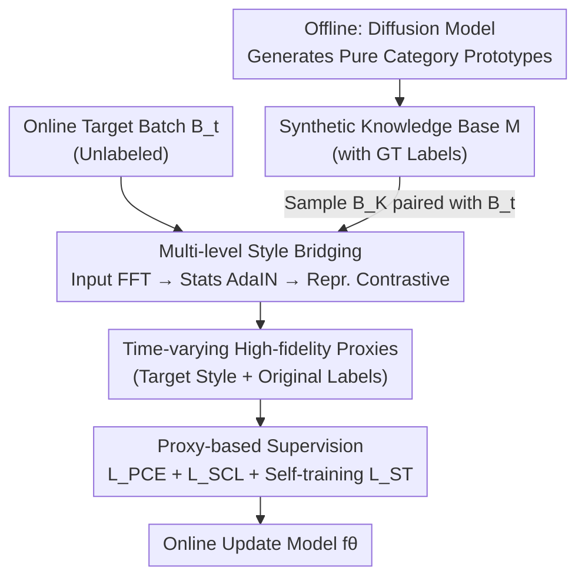

# Dance Across Shifts: Forward-Facilitation Continual Test-Time Adaptation through Dynamic Style Bridging

**Conference**: CVPR 2026  
**arXiv**: [2605.18608](https://arxiv.org/abs/2605.18608)  
**Code**: https://github.com/z1358/DAS (Available)  
**Area**: Test-Time Adaptation / Continual Learning / Domain Generalization  
**Keywords**: Continual Test-Time Adaptation (CTTA), Forward-Facilitation, Synthetic Knowledge Base, Style Bridging, Diffusion Models

## TL;DR
To address the long-standing issue of "sparse and unreliable supervision" in Continual Test-Time Adaptation (CTTA), this paper pivots from the traditional "backward-alignment" (forcing shifting test data toward static source anchors). Instead, it proposes a "forward-facilitation" approach: generating semantically pure category exemplars offline via diffusion models and dynamically "coloring" them with the current target domain style online (via input/statistics/representation bridging). This produces reliable on-demand supervision with ground-truth labels aligned to the current distribution, reducing average error rates on ImageNet-C / CIFAR100-C / CIFAR10-C to 44.1% / 29.8% / 9.1%, with significantly lower memory and latency compared to diffusion-based TTA methods.

## Background & Motivation
**Background**: CTTA requires a deployed model to adapt online to a sequence of continuously changing target domains (e.g., various image corruptions) without access to source data or labels. The prevailing paradigm is **backward-alignment**: creating a "supervision proxy" from source knowledge (e.g., parameter regularization in EATA, representation alignment in RMT, or denoising inputs back to a synthetic domain in SDA) and forcing the evolving model to align with this proxy.

**Limitations of Prior Work**: These proxies are weak approximations of true supervision and act as **static anchors**. As the target distribution drifts, forcing the model's current state (derived from unlabeled data) to align with stale, noisy anchors leads to error accumulation and catastrophic forgetting. Diffusion-based methods (e.g., SDA) suffer from massive latency and memory overhead (SDA latency is 1719x the source model) and introduce generation bias.

**Key Challenge**: The fundamental flaw of backward-alignment is the direction—it forces dynamic target data to accommodate static old knowledge. CTTA lacks **trustworthy supervision aligned with the current context**. There is an inherent tension between static anchors and evolving distributions.

**Goal**: (1) Find a semantic foundation more reliable than source proxies; (2) Allow this foundation to "evolve with the data stream" in real-time to produce aligned supervision.

**Key Insight**: Instead of backward constraints, use **forward-facilitation**—actively evolve reliable knowledge into the current context. Generative models can provide "semantically pure category exemplars," which only need effective bridging to adapt to the current domain.

**Core Idea**: Construct a semantically pure synthetic knowledge base offline (with ground-truth labels). During test-time, use multi-level style bridging to "color" these prototypes into the target domain style (altering style while preserving semantics). These high-fidelity proxies provide on-demand supervision, transforming prior knowledge from a "static constraint" into a "dynamic asset."

## Method

### Overall Architecture
The method, named **Dynamic Style Bridging (DAS)**, transforms prior knowledge into a time-varying supervision source. The pipeline consists of two phases: **One-time offline phase** to build a compact synthetic knowledge base (a few pure category exemplars with ground-truth labels) using a diffusion model; **Online batch phase** where synthetic samples $B_K$ are sampled and paired with the current target batch $B_t$. Through input-level FFT style injection, shallow statistical alignment, and representation-level contrastive bridging, these samples are "colored" into the target style to serve as aligned proxies for supervision via proxy cross-entropy ($\mathcal{L}_{PCE}$) and self-training.

### Key Designs

**1. Forward-Facilitation Paradigm + Offline Synthetic Knowledge Base: A Reliable Semantic Base**
Backward-alignment lacks a reliable semantic anchor. This paper reverses the process: **before deployment**, a pre-trained diffusion model (e.g., Stable Diffusion 1.5) generates $M$ "semantically pure" prototypes per category using prompts like "a realistic, clear photo of [CLS], on a clean background." This results in a knowledge base $\mathcal{M}=\{(x_i^K, y_i^K)\}_{i=1}^{C\times M}$. Key advantages: (1) **Semantic Purity**: Each image serves as an ideal anchor without real-world clutter; (2) **Computational Efficiency**: Pre-generation avoids calling diffusion models during adaptation, bypassing the immense overhead of methods like SDA.

**2. Multi-level Style Bridging: Evolving Knowledge with Target Distribution**
Pure synthetic samples carry **generation bias** and differ stylistically from corrupted target images. DAS activey "colors" the synthetic knowledge into the current batch style using three levels:

- **Input Level (FFT Amplitude Swap)**: Fourier transform decouples style (amplitude spectrum $\mathcal{F}^{\mathcal{A}}$) and content (phase spectrum $\mathcal{F}^{\mathcal{P}}$). For each pair $(x_i^K, x_j^t)$, the synthetic image's amplitude is replaced by the target's:
$$\tilde{x}_i^K = \mathcal{F}^{-1}\big([\mathcal{F}^{\mathcal{A}}(x_j^t),\ \mathcal{F}^{\mathcal{P}}(x_i^K)]\big)$$
This grants the synthetic sample target-like appearance before encoding.

- **Statistical Level (AdaIN Alignment)**: In shallow feature maps $z$, instance-level mean $\mu$ and standard deviation $\sigma$ are calculated spatially. Synthetic features are aligned to target statistics:
$$\tilde{z}(\tilde{x}_i^K) = \sigma_j^t \left(\frac{z(\tilde{x}_i^K)-\tilde{\mu}_i^K}{\tilde{\sigma}_i^K}\right) + \mu_j^t$$

- **Representation Level (Supervised Contrastive)**: Supervised contrastive learning $\mathcal{L}_{SCL}$ is applied to the joint batch using ground-truth labels for synthetic samples and pseudo-labels for target samples, clustering same-class samples across domains.

**3. Proxy-based Supervision: Clean Supervision via Styled Proxies**
The bridged proxies $\tilde{x}_i^K$ match the target style while retaining **ground-truth labels** $y_i^K$. They can be used directly for supervised training via **proxy cross-entropy ($\mathcal{L}_{PCE}$)**:
$$\mathcal{L}_{PCE} = -\sum_{c=1}^{C} y_{i,c}^K \log p_{i,c},\quad p_i = \text{softmax}(f_\theta(\tilde{x}_i^K))$$
Unlike self-training on noisy pseudo-labels, $\mathcal{L}_{PCE}$ provides unbiased semantic signals. The total loss combines this with a teacher-student self-training loss $\mathcal{L}_{ST}$:
$$\mathcal{L} = \mathcal{L}_{PCE} + \mathcal{L}_{SCL} + \mathcal{L}_{ST}$$

## Key Experimental Results

### Main Results
The backbone is ViT-B/16. DAS is evaluated on three CTTA benchmarks (severity level 5, sequential adaptation across 15 corruption domains).

| Dataset | Metric | Ours | Prev. SOTA | Gain |
|--------|------|------|----------|------|
| ImageNet-to-ImageNet-C | Avg. Error % | **44.1** | 47.6 (DPCore) | Rel. ↓7.3% |
| ImageNet-C vs. Diffusion | Avg. Error % | **44.1** | 55.8 (SDA) | Rel. ↓20.9% |
| CIFAR100-to-CIFAR100-C | Avg. Error % | **29.8** | 33.7 (RMT) | Rel. ↓30.5% (vs SDA 42.9) |
| CIFAR10-to-CIFAR10-C | Avg. Error % | **9.1** | 11.1 (REM) | ↓2.0 |

### Ablation Study (ImageNet-C)

| Configuration | Avg. Error ↓ | Description |
|------|---------|------|
| $Ex_1$ Self-training only | 50.0 | Baseline without reliable supervision |
| $Ex_2$ + KB ($\mathcal{L}_{PCE}$, no bridging) | 47.4 | Explicit semantic injection, still biased |
| $Ex_3$ + Input-level FFT | 45.8 | Appearance injection |
| $Ex_4$ + Statistical-level | 45.4 | Feature statistics alignment |
| $Ex_5$ + Repr.-level $\mathcal{L}_{SCL}$ | 46.5 | Semantic alignment |
| $Ex_7$ Full Model | **44.1** | Synergistic optimal |

### Key Findings
- **Synthetic KB is critical**: Adding $\mathcal{L}_{PCE}$ alone (47.4 vs 50.0) highlights the value of explicit semantic anchors.
- **Efficiency**: SDA requires 95.8 GiB VRAM and 1719x latency. DAS requires ~20 GiB VRAM and 9x latency, achieving much better accuracy.
- **Small KB Efficiency**: Performance is robust even with 1 prototype per class; 2 per class is used as default.
- **Generator Robustness**: Performance improves with stronger generators (SD 3.0 > SD 1.5 > BigGAN).

## Highlights & Insights
- **Paradigm Flip**: Shifting from "data follows knowledge" to "knowledge evolves for data" addresses the core supervision gap in CTTA.
- **Bridging Strategy**: Using FFT and AdaIN to "style" samples while preserving labels is a clever way to obtain high-fidelity, labeled proxies online.
- **Cost Transfer**: Moving the diffusion burden to the offline phase allows for high accuracy without the prohibitive online costs of generative TTA.
- **Ground-Truth Supervision**: While most TTA methods rely on noisy pseudo-labels, DAS provides a path to real labeled signals in a source-free setting.

## Limitations & Future Work
- **Dependency on Text-to-Image**: Effectiveness depends on the diffusion model's ability to generate accurate prototypes for fine-grained or non-describable categories.
- **Structural Shifts**: Style bridging (FFT/AdaIN) might struggle with corruptions that destroy content structure (e.g., severe elastic transformations).
- **Batch Pairing**: Current batch-level pairing is simple; more sophisticated matching (e.g., class-based) could be explored.
- **Task Expansion**: Evaluation is focused on classification; future work should explore dense prediction tasks like segmentation.

## Related Work & Insights
- **vs. SDA/DDA**: These methods project data backward via denoising, which is slow and biased. DAS facilitates knowledge forward via bridging, which is faster and cleaner.
- **vs. OBAO**: OBAO buffers high-confidence target samples, but buffers introduce noise. DAS uses clean, ground-truth labeled synthetic samples.
- **vs. RMT/EATA**: These use static source proxies. DAS provides time-varying supervision that evolves alongside the distribution drift.

## Rating
- Novelty: ⭐⭐⭐⭐⭐ 
- Experimental Thoroughness: ⭐⭐⭐⭐ 
- Writing Quality: ⭐⭐⭐⭐⭐ 
- Value: ⭐⭐⭐⭐⭐

<!-- RELATED:START -->

## Related Papers

- [\[CVPR 2026\] Towards Stable Federated Continual Test-Time Adaptation in Wild World](towards_stable_federated_continual_test-time_adaptation_in_wild_world.md)
- [\[CVPR 2026\] Back to Source: Open-Set Continual Test-Time Adaptation via Domain Compensation](back_to_source_open-set_continual_test-time_adaptation_via_domain_compensation.md)
- [\[CVPR 2026\] Neural Collapse in Test-Time Adaptation](neural_collapse_in_test-time_adaptation.md)
- [\[CVPR 2026\] WiTTA-Bench: Benchmarking Test-Time Adaptation for WiFi Sensing](witta-bench_benchmarking_test-time_adaptation_for_wifi_sensing.md)
- [\[CVPR 2026\] Curvature-Aware Zeroth-Order Optimization for Memory-Efficient Test-Time Adaptation](curvature-aware_zeroth-order_optimization_for_memory-efficient_test-time_adaptat.md)

<!-- RELATED:END -->
