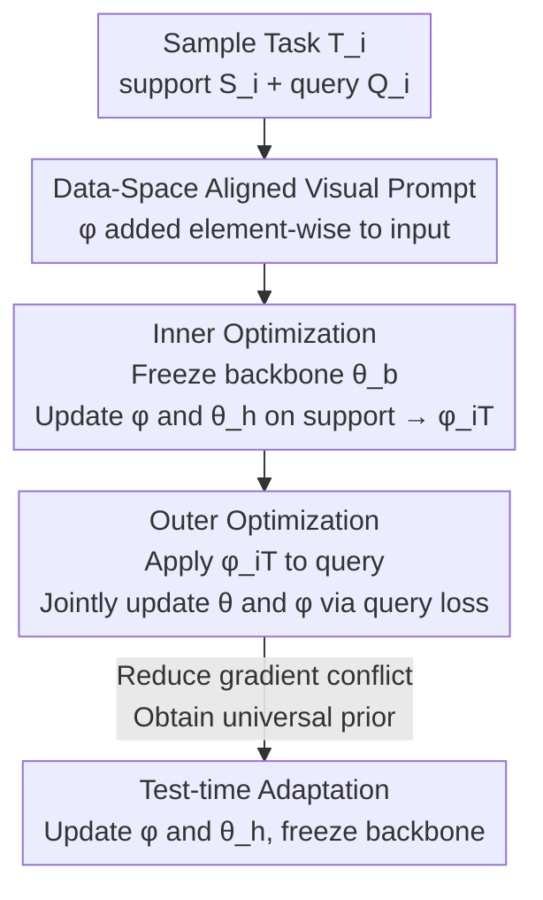

# Data-Centric Meta-Learning for Robust Few-Shot Generalization

**Conference**: CVPR 2026  
**Paper**: [CVF Open Access](https://openaccess.thecvf.com/content/CVPR2026/html/Lim_Data-Centric_Meta-Learning_for_Robust_Few-Shot_Generalization_CVPR_2026_paper.html)  
**Code**: None  
**Area**: Few-Shot Meta-Learning  
**Keywords**: Optimization-based meta-learning, few-shot cross-domain generalization, visual prompt, gradient conflict, bi-level optimization  

## TL;DR
Addressing the generalization collapse of optimization-based meta-learning in cross-domain few-shot scenarios, this work elevates "learnable visual prompts" from test-time auxiliaries to a core mechanism throughout the meta-training process. By aligning task inputs in the data space to reduce gradient direction conflicts, Ours learns more universal prior knowledge and enables efficient adaptation by updating only the prompts and classification heads during inference.

## Background & Motivation
**Background**: Optimization-based meta-learning (represented by MAML) utilizes a bi-level optimization framework to acquire "prior knowledge" across tasks: the inner loop performs few-step gradient adaptation for each task, while the outer loop aggregates learning signals to update shared initial parameters $\theta$. Subsequent works (GAP for geometric adaptive preconditioning, Meta-AdaM for adaptive learning rates) mostly improve adaptation rules in the **parameter space**.

**Limitations of Prior Work**: When test task distributions significantly deviate from training distributions (cross-domain few-shot), these methods degrade significantly. The authors attribute this to "the inability to learn generalizable prior knowledge," rooted in **gradient discrepancies**—diverse task distributions in meta-training cause massive variations in task-specific gradient directions calculated in the inner loop.

**Key Challenge**: The outer loop averages these conflicting task gradients into a meta-gradient, causing signals to cancel out and resulting in ineffective outer-loop optimization. The authors support this empirically: on 5-way 5-shot miniImageNet, the cosine similarity between MAML's meta-gradient and individual task gradients is low, with large $\ell_2$ distances. Crucially, despite a non-trivial meta-gradient norm, the "parameter shift" from the initial point is limited, indicating that updates are indeed canceling each other out.

**Key Insight**: Since the root cause is the misalignment of **input distributions** with the shared prior, rather than complex modulation in the parameter space (e.g., task embedding modulation in MMAML or gradient attenuation in L2F), a **data-centric perspective** is adopted: directly transform the input data space of each task to fit the shared prior.

**Core Idea**: A **meta-learnable visual prompt $\phi$** is introduced and added element-wise to task inputs, **integrating it throughout the entire inner and outer meta-training loops**. The prompt "pulls" task inputs into a distribution that the shared prior can explain, thereby inducing consistent gradient directions. This is fundamentally different from previous approaches that use visual prompts only as test-time adaptation tools.

## Method

### Overall Architecture
DCML (Data-Centric Meta-Learning) introduces two modifications to the standard MAML bi-level optimization framework: ① The backbone network $\theta^{\text{b}}$ is frozen throughout; ② A shared learnable visual prompt $\phi$ is introduced and added element-wise to input images. The process is: sample a batch of tasks $\to$ Inner loop adds $\phi$ to support images and updates only $\phi$ and the classification head $\theta^{\text{h}}$ to obtain task-specific prompt $\phi_{i,T}$ $\to$ Outer loop adds $\phi_{i,T}$ to query images and uses the aggregated query loss to **jointly update prior $\theta$ and prompt $\phi$**. Crucially, the task-specific prompt from the inner loop is reused for queries in the outer loop, aligning input distributions to the shared prior and reducing directional conflicts in the meta-gradient. During testing, efficient adaptation is achieved by updating only the lightweight $\phi$ and $\theta^{\text{h}}$ while freezing the backbone.

The model is denoted as $f_\theta(\cdot) = f_{\theta^{\text{h}}}(f_{\theta^{\text{b}}}(\cdot))$, where $\theta = \{\theta^{\text{b}}, \theta^{\text{h}}\}$ represent the backbone and classification head parameters respectively.

### Key Designs

**1. Data-Centric Perspective: Injecting learnable visual prompts throughout meta-learning to align input distributions rather than modulating parameters**

This is the fundamental redefinition of this work. Traditionally, Visual Prompts involve adding a learnable padding/patch in pixel space to let a **frozen model** complete downstream tasks, usually only during **inference**. This paper does the opposite: it treats the prompt $\phi$ as the **core mechanism for acquiring generalizable prior knowledge**, actively involving it in meta-training. Intuitively, gradient conflict arises because task input distributions are inconsistent and do not fit the shared prior; instead of complex parameter modulation, applying a "patch" in **data space** shifts inputs to a region unified by the shared prior, naturally producing consistent gradients. Prompt templates (padding / fixed patch / random patch) and size $p$ are flexible, with parameter counts calculated as $Cp^2$ for patches or $2Cp(H+W-2p)$ for padding. Padding with $p=5$ is the default.

**2. Inner Optimization: Freezing the backbone and adapting the prompt and classification head to the current task using the support set**

Unlike MAML, which adapts the entire $\theta$ in the inner loop, Ours **freezes the backbone $\theta^{\text{b}}$** and adds the prompt $\phi$ element-wise to support images, updating only the prompt and head. The support loss at step $t$ is the cross-entropy on prompt-aligned inputs:

$$\mathcal{L}^{\text{support}}_{\mathcal{T}_i} := -\log p\left(y_i^s \mid f_{\theta^{\text{h}}_{i,t}}\left(f_{\theta^{\text{b}}}(\mathbf{x}_i^s + \phi_{i,t})\right)\right)$$

The joint inner update for the prompt and head (initial values $\theta_{i,0}=\theta, \phi_{i,0}=\phi$) is:

$$(\phi_{i,t+1}, \theta^{\text{h}}_{i,t+1}) = (\phi_{i,t}, \theta^{\text{h}}_{i,t}) - \alpha_t \nabla_{(\phi_{i,t}, \theta^{\text{h}}_{i,t})} \mathcal{L}^{\text{support}}_{\mathcal{T}_{i,t}}$$

After $T$ steps, task-specific $\phi_{i,T}$ and $\theta^{\text{h}}_{i,T}$ are obtained while $\theta^{\text{b}}$ remains fixed. Freezing the backbone forces the prompt to handle "input alignment" rather than making the backbone accommodate individual tasks. The inner learning rate $\alpha_t$ is per-step learnable to stabilize training.

**3. Outer Optimization: Reusing task-specific prompts on queries and jointly updating prior knowledge and prompts to reduce gradient conflict**

The outer loop is where data-space alignment takes effect. DCML adds the task-specific prompt $\phi_{i,T}$ from the inner loop to the **query set of that task**. Since $\phi_{i,T}$ has learned on the support set how to align task inputs with the shared prior, its reuse on queries pulls different tasks into the same representation region, making query gradient directions more consistent. The query loss is:

$$\mathcal{L}^{\text{query}}_{\mathcal{T}_i} := -\log p\left(y_i^q \mid f_{\theta^{\text{h}}_{i,T}}\left(f_{\theta^{\text{b}}}(\mathbf{x}_i^q + \phi_{i,T})\right)\right)$$

Subsequently, a meta-gradient update is performed **simultaneously** on the prior $\theta$ and the prompt $\phi$ using the aggregated query loss:

$$(\theta, \phi) \leftarrow (\theta, \phi) - \beta \nabla_{(\theta, \phi)} \mathbb{E}_{\mathcal{T}_i \sim p(\mathcal{T})}\left[\mathcal{L}^{\text{query}}_{\mathcal{T}_i}\right]$$

This joint optimization allows $\theta$ to learn a more universal prior while $\phi$ learns "how to align diverse task distributions to shared knowledge." By participating in both loops, the prompt becomes a core component guiding meta-training rather than a post-hoc test-time patch.

### Loss & Training
- Cross-entropy loss for both loops; no additional regularization. Outer loop uses joint meta-gradient descent for $(\theta, \phi)$.
- Inner steps $T=5$, inner learning rate $\alpha=0.01$ (per-step learnable), outer learning rate $\beta=0.0001$.
- 4-CONV or ResNet-12 backbones trained on a single RTX 4090. Complete procedure in original Algorithm 1.

## Key Experimental Results

### Main Results
Five standard few-shot classification benchmarks (miniImageNet / tieredImageNet / CIFAR-FS / FC100 / CUB), 4-CONV backbone, 5-way setting.

**In-domain Accuracy (%)**:

| Dataset / Setting | MAML | GAP (Previous SOTA) | DCML (Ours) |
|--------------|------|----------------|--------------|
| miniImageNet 1-shot | 48.70 | 54.86 | **55.52** |
| miniImageNet 5-shot | 63.11 | 71.55 | **73.31** |
| tieredImageNet 5-shot | 67.48 | 74.90 | **75.96** |
| CIFAR-FS 5-shot | 70.10 | 78.53 | **80.32** |
| FC100 5-shot | 47.58 | 55.53 | **56.36** |

**Cross-domain Accuracy (miniImageNet train → Transfer, 5-way 5-shot, %)**:

| Method | →CUB | →CIFAR-FS |
|------|------|-----------|
| MAML | 52.70 | 55.82 |
| GAP (Prev. SOTA) | 64.88 | 65.27 |
| **DCML (Ours)** | **66.14** | **67.33** |

DCML consistently leads across all datasets, with a more pronounced **Gain** in cross-domain scenarios (e.g., +1.26 over GAP for →CUB and +2.06 for →CIFAR-FS), validating the core claim that data-space alignment enhances generalization.

### Ablation Study

**Ablation on Prompt Usage Phases** (miniImageNet, accuracy %):

| Prompt Configuration | 1-shot | 5-shot | Note |
|-------------|--------|--------|------|
| Test-time ONLY | 46.40 | 65.10 | Equivalent to traditional prompt usage; worst performance |
| Training ONLY | 50.44 | 72.97 | Significant gain just by training participation |
| Full (DCML) | **55.52** | **73.31** | Optimal with full integration |

**Comparison of Test-time Learnable Components and Params (4-CONV)**:

| Method | Backbone θ_b | Head θ_h | Prompt φ | Adaptation Params |
|------|---------|-----------|-----------|-----------|
| MAML | ✓ | ✓ | – | $4.62\times10^5$ |
| ANIL | – | ✓ | – | $0.16\times10^5$ |
| BOIL | ✓ | – | – | $4.46\times10^5$ |
| **DCML** | – | ✓ | ✓ | $0.21\times10^5$ |

During testing, DCML only updates the head and prompt ($0.21\times10^5$ parameters, similar to ANIL and ~1/22 of MAML), yet outperforms others in both in-domain and cross-domain settings.

### Key Findings
- **Prompt value derives from "training participation" rather than "test-time adaptation"**: Using the prompt only at test time (46.40 / 65.10) is worse than MAML, but using it only during training reaches 50.44 / 72.97, supporting the redefinition of prompts for prior acquisition.
- **Data space is indeed aligned**: Using MMD to measure inter-task feature distribution distance, MAML shows increasing MMD (tasks diverging), while DCML consistently reduces MMD while maintaining non-zero variance, preserving necessary task distinctiveness.
- **Improved optimization dynamics**: Compared to MAML, DCML’s meta-gradients show higher cosine similarity and lower $\ell_2$ distance to task gradients. Though the meta-gradient norm is smaller, the parameter shift is larger, indicating "smaller but more stable steps."
- **Fast adaptation**: Reducing inner steps from 5 to 1 still yields 68.40 (5-shot) and 54.31 (1-shot); results are robust to prompt template/size variations.
- **Grad-CAM Visualization**: In miniImageNet→CUB cross-domain transfer, MAML often attends to background or partial objects, whereas DCML focuses consistently on class-relevant regions.

## Highlights & Insights
- **Gradient conflict as a tangible proxy**: The authors quantify degradation using cosine similarity, $\ell_2$ distance, and parameter shift rather than just qualitative descriptions, creating a closed loop between diagnosis and method.
- **Redefining visual prompts**: Shifting the role from "test-time frozen-model auxiliary" to a "core mechanism for acquiring universal priors" is a simple yet counter-intuitive and impactful perspective shift.
- **Data-centric vs. Parameter-centric roadmap**: While MMAML/L2F use complex parameter-space modulations, DCML achieves better cross-domain results with lower parameter overhead using pixel-level patches, suggesting that "modifying inputs is more efficient and stable than modifying models."
- **Extreme parameter efficiency**: Updating only $0.21\times10^5$ parameters (prompt + head) makes it suitable for real-world few-shot scenarios with constrained data/computation.

## Limitations & Future Work
- **Ours**: The current prompt uses a **shared design** (same initial $\phi$ for all tasks). Future work plans to explore task-adaptive prompts conditioned on task embeddings to further mitigate gradient conflicts.
- **Observation**: ① Main results rely heavily on 4-CONV; ResNet-12 advantages are less detailed in the main text. ② Cross-domain experiments cover limited paths (miniImageNet→CUB/CIFAR-FS), lacking validation on extreme shifts (e.g., natural to medical/satellite images). ③ The theoretical mechanism of why "aligning to prior" doesn't sacrifice inter-class discriminability relies on indirect MMD variance evidence rather than direct formal proof.
- **Improvement Idea**: Replacing shared prompts with conditional prompts generated from support features or explicitly adding a regularization term in the outer loop to encourage task gradient consistency might address gradient conflict more directly.

## Related Work & Insights
- **vs. MAML / ANIL / BOIL**: These allocate adaptation across parameter sets. DCML follows ANIL’s "freeze backbone, update head" logic but shifts "alignment" from parameters to inputs for better cross-domain stability.
- **vs. GAP / Meta-AdaM**: These improve **update rules** (preconditioners / learning rates), remaining parameter-centric. DCML uses input changes to reduce conflict with an order of magnitude fewer adaptation parameters.
- **vs. MMAML / L2F**: Both target "distribution diversity." MMAML uses task embeddings, and L2F attenuates irrelevant priors via extra networks. DCML replaces this with a lightweight pixel patch, demonstrating the "data-centric" path is simpler and more effective.
- **vs. Traditional Visual Prompting (VP)**: VP usually involves a learnable patch for frozen models in downstream tasks at test time; DCML pulls the prompt into both meta-training loops to participate in "prior acquisition."

## Rating
- Novelty: ⭐⭐⭐⭐ Redefining visual prompts as meta-training mechanisms rather than test-time auxiliaries is a novel entry into gradient management.
- Experimental Thoroughness: ⭐⭐⭐⭐ Covers 5 benchmarks, in-domain/cross-domain, and multi-dimensional analysis (MMD/gradients/Grad-CAM), though cross-domain paths are limited.
- Writing Quality: ⭐⭐⭐⭐ Clear diagnosis-to-verification logic with well-integrated formulas and figures.
- Value: ⭐⭐⭐⭐ Parameter-efficient and transferable idea, providing a lightweight data-centric path for optimization-based meta-learning.

<!-- RELATED:START -->

## Related Papers

- [\[CVPR 2026\] Graph Attention Prototypical Network for Robust Few-Shot Classification](graph_attention_prototypical_network_for_robust_few-shot_classification.md)
- [\[ICML 2025\] Provably Improving Generalization of Few-Shot Models with Synthetic Data](../../ICML2025/others/provably_improving_generalization_of_few-shot_models_with_synthetic_data.md)
- [\[CVPR 2026\] Hyperbolic Defect Feature Synthesis for Few-Shot Defect Classification](hyperbolic_defect_feature_synthesis_for_few-shot_defect_classification.md)
- [\[CVPR 2026\] Language Does Matter for Cross-Domain Few-Shot Visual Feature Enhancement](language_does_matter_for_cross-domain_few-shot_visual_feature_enhancement.md)
- [\[CVPR 2026\] Basis-Oriented Low-rank Transfer for Few-Shot and Test-Time Adaptation](basis-oriented_low-rank_transfer_for_few-shot_and_test-time_adaptation.md)

<!-- RELATED:END -->
