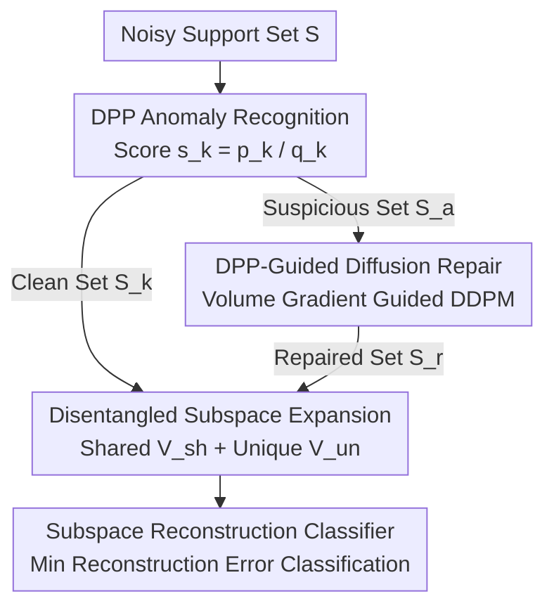

# DDSF: Robust Few-Shot Learning via Disentangled Subspaces with Determinantal Point Process

**Conference**: CVPR 2026  
**Paper**: [CVF Open Access](https://openaccess.thecvf.com/content/CVPR2026/html/Ye_DDSF_Robust_Few-Shot_Learning_via_Disentangled_Subspaces_with_Determinantal_Point_CVPR_2026_paper.html)  
**Code**: https://github.com/24sleeping90/DDSF  
**Area**: Few-Shot Learning  
**Keywords**: Robust Few-Shot Learning, Determinantal Point Process (DPP), Subspace Disentanglement, Diffusion Repair, Prototypical Networks  

## TL;DR
To address prototype drift caused by noise/hard positive contamination in few-shot support sets, DDSF utilizes the Determinantal Point Process (DPP) to unify a "Filter-Repair-Expand" pipeline: first, suspicious samples are identified via DPP probabilistic inference rather than being discarded; second, they are "repaired" into effective features using a DPP volume-gradient-guided diffusion process; finally, class representations are expanded from fragile mean points into disentangled shared/unique subspaces. On the Meta-Dataset with OOD contamination, DDSF improves accuracy from the Prev. SOTA of 47.0% to 61.6% under 70% noise.

## Background & Motivation
**Background**: The mainstream of Few-Shot Learning (FSL) is prototype-based metric learning, represented by Prototypical Networks. These methods average the support sample features of each class to obtain a "prototype point," and query samples are classified based on their distance to these prototypes. It is simple, effective, and remains a long-term benchmark.

**Limitations of Prior Work**: Prototypical methods implicitly assume that the support set is clean and representative. However, real-world data collection inevitably involves label noise or OOD samples. Since the support set contains only a few images, a few bad samples can pull the mean point away, causing "prototype drift." To combat noise, current mainstream approaches follow a "Filter-Compress" route: either explicit filtering (e.g., DETA++ uses outlier detection to discard suspicious samples) or implicit filtering (e.g., TraNFS uses attention to downweight suspicious samples) to purify the data before compressing it into a single prototype point.

**Key Challenge**: The authors point out two intertwined structural flaws in this route. The first is **Representation Confusion**, where prototypical networks mix high-variance, non-discriminative "shared features" (e.g., common background textures) with low-variance, discriminative "unique features" (key for class differentiation) into a single mean point. The second is **Information Destruction**, a side effect of "filtering as discarding": in data-scarce scenarios, true noise and "hard positives" are nearly indistinguishable. Filtering modules often discard hard positives alongside noise to maintain purity, losing critical discriminative information and allowing the remaining prototype to be dominated by high-variance shared features, which exacerbates representation confusion.

**Goal**: Construct class representations that are robust to contaminated support sets while simultaneously solving the problems of "information loss from discarding-based filtering" and "representation confusion in mean points."

**Key Insight**: The authors discovered that the Determinantal Point Process (DPP)—a probabilistic model characterizing both "quality" and "diversity"—can unify three tasks: locating anomalies via marginal probabilities, guiding repair via volume maximization, and constructing diverse subspaces via volume expansion. Thus, "filtering" is redefined as "locating samples to be repaired" rather than "discarding."

**Core Idea**: Propose a "Filter-Repair-Expand" paradigm unified by DPP theory: **locate** anomalies without discarding them, **repair** anomalies into effective features, and **expand** class representations from a single point into disentangled shared + unique subspaces.

## Method

### Overall Architecture
DDSF sequentially processes a noisy support set $S=\{x_i\}_{i=1}^{K}$ through three synergistic modules to output robust class subspaces for classification. The entire pipeline is grounded in DPP theory: given a kernel matrix $L$ (Gram matrix of features $L=FF^{T}$), the probability of sampling a subset $Y$ is $P(Y)=\det(L_Y)/\det(L+I)$. Geometrically, $\det(L_Y)$ equals the squared volume of the parallelotope spanned by the feature vectors in $Y$—where "large volume" implies "both high quality and high diversity."

The three stages are: **① DPP Anomaly Recognition** calculates an anomaly score $s_k$ for each sample using dual-path marginal information from the DPP, splitting the support set into a "suspicious set $S_a$" and a "known clean set $S_k$"; **② DPP-Guided Repair** runs an inverse diffusion process guided by the DPP volume gradient on $S_a$, "pulling" contaminated features into effective features $S_r$ that contribute to diversity, then merged with $S_k$ into a purified set $S_f=S_k\cup S_r$; **③ Disentangled Subspace Expansion** feeds $S_f$ into two synergistic losses to learn a shared subspace $V_{sh}$ and class-specific unique subspaces $V_{un}^{(c)}$; finally, classification is performed using a subspace reconstruction error-based classifier.

### Key Designs

**1. DPP Probabilistic Anomaly Recognition: Distinguishing Noise from Hard Positives using "Diversity ÷ Quality"**

To address the issue where discarding-based filtering harms hard positives, this step avoids binary outlier removal and instead calculates a continuous anomaly score to identify "repair candidates." It extracts complementary information from the DPP kernel $L$: **Diversity** is measured by the DPP marginal probability $p_k=[L(L+I)^{-1}]_{kk}$ (anomalous samples are often orthogonal to the clean manifold, showing high uniqueness); **Quality/Cohesion** is measured by $q_k=\sum_{j\neq k}(L_{kj})^2$ (aggregate similarity with other samples of the same class; anomalies have low cohesion). The key lies in the fusion $s_k=p_k/q_k$: true noise exhibits "high diversity + low quality" → high $s_k$; for hard positives, while $p_k$ is high, they maintain real associations with the class, resulting in high $q_k$, which suppresses $s_k$. A global threshold $\tau$ enables data-driven partitioning. Ablations show that using $p_k$ or $q_k$ alone yields +2.3%/+2.4%, while the fused $s_k$ achieves +3.6%, confirming that "Quality × Diversity" fusion is more robust.

**2. DPP-Guided Diffusion Repair: Repairing Instead of Deleting Noise Features**

This is the core of the "Repair" paradigm. it employs a **parameter-free** inverse DDPM process (lightweight and flexible without extra large networks), but injects a DPP volume guidance at each denoising step. The guidance loss is defined as the negative log-volume of the repaired feature $f_{t-1}$ combined with the clean set $S_k$: $L_g(f_{t-1})=-\log\det(K_{\{f_{t-1}\}\cup S_k})$. It is implemented by modifying the mean of the inverse process:

$$\mu'(f_t,t)=\mu(f_t,t)-\gamma\Sigma_t\nabla_f L_g$$

where $\mu$ is the standard DDPM inverse mean, and $\nabla L_g$ is the gradient of the volume loss—pointing in a direction that "maximizes the collective diversity of this feature with $S_k$." This converts anomalies into effective features that contribute to a robust class representation. Ablations show repair brings the largest gain of +2.7% in this stage.

**3. Synergistic Disentangled Subspace Expansion: Expanding Mean Points via Opposing Objectives**

To address "representation confusion," class representations are upgraded from points to subspaces. Based on the disentanglement assumption $f=f_{sh}+f_{un}+\epsilon$, two learnable linear projections $P_{sh}$ and $P_{un}^{(c)}$ (MLPs) split features into a shared component $f_{sh}=P_{sh}f$ and a unique component $f_{un}=P_{un}^{(c)}f$. **Shared Reconstruction Loss** $L_{sh}=\frac{1}{|S_f|}\sum_{f\in S_f}\|f-P_{sh}f\|_2^2$ forces the shared subspace $V_{sh}$ to reconstruct commonalities across all classes (e.g., the general concept of "dog"), absorbing high-variance shared backgrounds. **Unique Volume Loss** $L_{un}$ takes the residual $f_{res}^{(c)}=f^{(c)}-P_{sh}f^{(c)}$ and maximizes the volume of its Gram matrix:

$$L_{un}=-\sum_{c=1}^{N}\log\det(G_{res}^{(c)}+\epsilon I)$$

Minimizing $L_{un}$ maximizes the volume spanned by the residuals, forcing each unique subspace $V_{un}^{(c)}$ to "expand" to accommodate remaining class-specific discriminative information. One "contracts" commonalities while the other "expands" uniqueness. Replacing standard orthogonal loss with DPP $L_{un}$ provides an additional +1.9% (noisy) / +2.0% (clean).

**4. Subspace Reconstruction Classifier: Replicating the Paradigm at Inference**

Since classes are represented as subspaces, classification uses reconstruction error instead of point-to-point distance. For a query $f_q$, the predicted class is the one whose basis reconstructs it with minimum error:

$$\hat{y}=\arg\min_{c\in\{1,\dots,N\}}\|f_q-(P_{sh}+P_{un}^{(c)})f_q\|_2^2$$

This evaluates "compatibility between query and class subspaces" rather than proximity. The total loss is $L_{total}=L_{cls}+\lambda_{sh}L_{sh}+\lambda_{un}L_{un}$.

## Key Experimental Results

### Main Results
On the OOD-contaminated Meta-Dataset (varied-way 10-shot, SwinT backbone), DDSF leads across all noise levels. Compared directly to DETA++:

| Noise Ratio | Ours (DDSF, SwinT) | DETA++ (SwinT) | Gain |
|-------------|-------------------|----------------|------|
| 0%          | **91.9** (±0.43)  | 86.5           | +5.4 |
| 10%         | **89.9** (±0.50)  | 80.9           | +9.0 |
| 30%         | **85.3** (±0.65)  | 77.3           | +8.0 |
| 50%         | **75.9** (±0.88)  | 64.2           | +11.7|
| 70%         | **61.6** (±1.09)  | 47.0           | +14.6|

From 0% to 50%, DETA++ drops 22.3 points, while DDSF only drops 16.0 points. DDSF is also consistent across five backbones (ResNet-50, ViT-S, ConvNeXt-B, CLIP).

### Ablation Study
Incremental ablation (30% noise, SwinT):

| Idx | Configuration | 0% | 30% | Notes |
|-----|---------------|----|-----|-------|
| A | No Filtering (Baseline) | 84.4 | 77.1 | Starting point |
| B | Diversity $p_k$ only | 86.3 | 79.4 | +2.3 |
| C | Quality $q_k$ only | 86.2 | 79.5 | +2.4 |
| D | Fusion score $s_k$ | 87.3 | 80.7 | Fusion +3.6 |
| E | D + DPP Repair | 89.9 | 83.4 | Repair +2.7 (Largest in stage) |
| F | E + Unique Volume $L_{un}$ | **91.9** | **85.3** | Expand +1.9 |

### Key Findings
- **Repair > Discard**: Transitioning from D to E (adding DPP repair) provides the largest gain (+2.7%) under noise, verifying that "repairing anomalies into effective features" is superior to "removal."
- **DPP Volume Expansion > Orthogonal Constraints**: Changing orthogonal loss to $L_{un}$ adds +1.9%, showing volume maximization expands unique subspaces more effectively.
- **Robust to Complex Noise**: Under Symmetric Label Swap (SLS) noise at 30%, DDSF reaches 83.2% (DETA++ 75.1%), indicating DPP recognition captures semantic inconsistency.
- **Hyperparameter Insensitivity**: High performance (>90%) is maintained across a wide range of $\lambda_{sh}$ and $\lambda_{un}$ values.

## Highlights & Insights
- **Unified Theory**: Using DPP "Quality × Diversity" for anomaly localization, repair guidance, and subspace expansion creates a mathematically elegant and cohesive framework.
- **Redefining "Filtering"**: Shifting from "deletion" to "localization + repair" avoids the deadlock of noise vs. hard positive inseparability in data-scarce scenarios.
- **$s_k=p_k/q_k$ Ratio**: A simple ratio separates "high-diversity true noise" from "high-diversity but cohesive hard positives."
- **Parameter-free Diffusion Repair**: Injecting a gradient guide into standard DDPM allows for a lightweight, plug-and-play repair module without training extra giant networks.

## Limitations & Future Work
- **DPP Complexity**: Determinant and inversion operations scale with set size. This is manageable for 10-shot FSL, but efficiency for larger sets requires more discussion.
- **Strong Disentanglement Assumption**: The linear additive assumption $f=f_{sh}+f_{un}+\epsilon$ may not hold for complex non-linear entanglement.
- **Threshold $\tau$ Sensitivity**: Extremely low values may cause over-detection, while extremely high values may miss noise.
- **Potential Hallucinations**: Diffusion-based repair might pull OOD samples into a class subspace incorrectly, creating plausible but false discriminative information.

## Related Work & Insights
- **vs DETA++ (Explicit Filtering)**: DETA++ uses weighted aggregation and discards noise; DDSF repairs it and upgrades point prototypes to subspaces, leading by 5-15 points under high noise.
- **vs TraNFS (Implicit Filtering)**: TraNFS downweights suspicious samples; DDSF actively converts them to useful features.
- **vs Subspace/Distributed Prototypes**: While others use Gaussians or low-rank subspaces, DDSF explicitly disentangles shared and unique components with DPP volume control.
- **vs Generative FSL (e.g., MetaDiff)**: Previous works use diffusion to "increase data quantity"; DDSF uses it to "purify existing noise."

## Rating
- Novelty: ⭐⭐⭐⭐⭐ (Unified DPP theory for Filter-Repair-Expand paradigm).
- Experimental Thoroughness: ⭐⭐⭐⭐ (Extensive noise/backbone tests, though efficiency is in Supp. Mat.).
- Writing Quality: ⭐⭐⭐⭐ (Clear paradigm and motivation).
- Value: ⭐⭐⭐⭐ (Significant SOTA improvement and generalizable "Repair vs Discard" logic).

<!-- RELATED:START -->

## Related Papers

- [\[CVPR 2026\] Data-Centric Meta-Learning for Robust Few-Shot Generalization](data-centric_meta-learning_for_robust_few-shot_generalization.md)
- [\[CVPR 2026\] Hyperbolic Defect Feature Synthesis for Few-Shot Defect Classification](hyperbolic_defect_feature_synthesis_for_few-shot_defect_classification.md)
- [\[CVPR 2026\] Language Does Matter for Cross-Domain Few-Shot Visual Feature Enhancement](language_does_matter_for_cross-domain_few-shot_visual_feature_enhancement.md)
- [\[ICLR 2026\] Neural Force Field: Few-shot Learning of Generalized Physical Reasoning](../../ICLR2026/others/neural_force_field_few-shot_learning_of_generalized_physical_reasoning.md)
- [\[CVPR 2026\] Affine Perspective-Three-Point Problem](affine_perspective-three-point_problem.md)

<!-- RELATED:END -->
