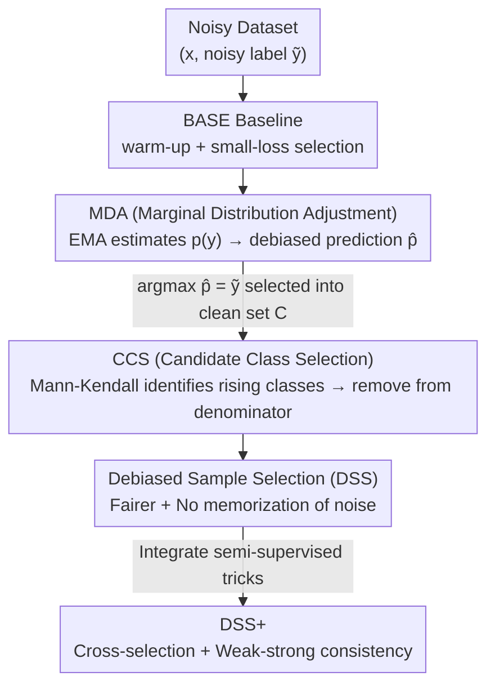

# Debiased Sample Selection for Learning with Noisy Labels

**Conference**: CVPR 2026  
**Paper**: [CVF Open Access](https://openaccess.thecvf.com/content/CVPR2026/html/Pan_Debiased_Sample_Selection_for_Learning_with_Noisy_Labels_CVPR_2026_paper.html)  
**Code**: https://github.com/Aliinton/DSS  
**Area**: Noise Label Learning  
**Keywords**: Noise Label Learning, Sample Selection, small-loss trick, confirmation bias, plug-and-play module

## TL;DR
This paper identifies two types of confirmation bias inherent in the "small-loss-is-clean" sample selection strategy dominant in noisy label learning: class-level bias (easy-to-learn classes are over-selected while hard-to-learn classes are neglected) and instance-level bias (mislabeled samples with pseudo-low losses are memorized as clean samples). It proposes two plug-and-play modules, MDA (Marginal Distribution Adjustment) and CCS (Candidate Class Selection), to eliminate these biases. Combined as DSS, the approach consistently improves various selectors and SOTA pipelines on CIFAR-10/100 synthetic noise and real-world noise datasets including CIFAR-N, Clothing1M, and WebVision.

## Background & Motivation
**Background**: The mainstream paradigm for Learning with Noisy Labels (LNL) is the small-loss trick. It leverages the "memorization effect" of DNNs—networks learn clean samples before over-fitting to noise. Thus, samples with low loss are considered clean and used for training, while high-loss samples are discarded or relabeled. Most implementations use a two-component Gaussian Mixture Model (GMM) to fit the loss distribution, treating the low-mean cluster as clean.

**Limitations of Prior Work**: The authors point out two overlooked confirmation biases in the small-loss trick. First is **class-level confirmation bias**: easy-to-learn classes naturally have lower losses, leading to their over-selection, while hard-to-learn classes are systematically under-sampled and under-fitted. Second is **instance-level confirmation bias**: some mislabeled samples exhibit "pseudo-low losses" because the image is weakly correlated with the wrong label, causing the model to memorize incorrect labels. Both biases **accumulate and amplify** during training, ultimately hindering generalization.

**Key Challenge**: The root cause lies in the fact that the "low loss" signal itself is biased—it is influenced by the marginal distribution $p(y)$ of classes (causing class-level bias) and can be forged by weakly correlated mislabeled samples (causing instance-level bias). Using it directly for selection allows the model's prejudice to self-reinforce.

**Goal**: To "dismantle" these two types of biases separately without rewriting the entire selection pipeline—one module to correct inter-class unfairness and another to prevent the memorization of mislabeled samples.

**Key Insight**: By decomposing the Bayesian posterior $p(y|x)=p(y)p(x|y)/p(x)$, the authors find that class-level bias is caused by the non-uniformity of $p(y)$. Leveraging "training dynamics"—where confidence in the true label consistently rises during training—they identify the "possible true label" behind mislabeled samples.

**Core Idea**: Use MDA to dynamically pull the predicted distribution toward uniformity (eliminating class-level bias) and use CCS to temporarily exclude "possible true labels" from the classification task rather than directly relabeling them (eliminating instance-level bias). Both are lightweight, plug-and-play modules that can be attached to any existing selector.

## Method

### Overall Architecture
The method is built upon a minimalist baseline **BASE**: after a few warm-up epochs with standard cross-entropy, samples where "the maximum predicted class equals the given label" are selected as clean set $C$ each epoch. Loss is only calculated for samples in $C$. Formulaically, the selection criterion is $C=\{(x_i,\tilde y_i)\mid \arg\max_y p_\theta(x_i)=\tilde y_i\}$. The authors found this simple baseline competitive with advanced selectors, using it as a clean "testbed" for the two debiasing modules.

MDA modifies "what prediction is used for selection" by replacing the original prediction $p_\theta$ with a debiased prediction $\hat p$. CCS modifies "how loss is calculated after selection" by removing "possible true labels" from the cross-entropy denominator. The two are orthogonal: MDA acts on selection signals to eliminate class-level bias, while CCS acts on supervision signals to eliminate instance-level bias. BASE+MDA+CCS constitutes **DSS**. Integrating DSS with semi-supervised techniques (dual-network cross-selection + weak-strong consistency regularization) yields **DSS+** for fair comparison with SOTA pipelines.

### Key Designs

**1. MDA (Marginal Distribution Adjustment): Pulling Predictions Toward Uniformity to Eliminate Class-level Bias**

To address the class-level bias where "easy classes have low loss → over-selected," MDA assumes bias stems from the non-uniform class marginal $p(y)$ in the posterior $p(y|x)=\frac{p(y)p(x|y)}{p(x)}$. The authors keep the class-conditional likelihood $p(x|y)$ unchanged but force the class marginal to a uniform distribution $\tfrac1k$, resulting in a reweighted posterior $\hat p(y|x)=\frac{p(x|y)\frac1k}{\sum_c p(x|c)\frac1k}$. Substituting $p(x|y)=p(y|x)p(x)/p(y)$, they arrive at a concise form:

$$\hat p(y|x)=\frac{p(y|x)/p'(y)}{\sum_{c\in Y} p(c|x)/p'(c)},$$

where $p'(y)$ is the class marginal dynamically estimated using the Exponential Moving Average (EMA) of predictions within a batch: $p'(y)=\lambda\, p'(y)+(1-\lambda)\tfrac{1}{|b|}\sum_{x\in b}p(y|x)$, initialized as a uniform distribution with momentum $\lambda=0.99$. The debiased prediction $\hat p$ then replaces $p_\theta$ for selection: $C=\{(x_i,\tilde y_i)\mid \arg\max_y \hat p(y|x_i)=\tilde y_i\}$. While similar to logit adjustment in long-tailed learning, MDA compensates for the **dynamic** over-selection of easy classes during training rather than a static dataset prior.

**2. CCS (Candidate Class Selection): Temporarily Removing "Possible True Labels" to Eliminate Instance-level Bias**

To address instance-level bias where "weakly correlated mislabeled samples have pseudo-low loss → memorized as clean," CCS avoids relabeling. Instead, it temporarily removes classes that "look like the true label" from the sample's classification task. 

First, it **identifies possible true labels** via training dynamics: if the confidence of a class consistently rises during training, it is likely the true label. The authors use the **Mann-Kendall trend test** (a non-parametric test robust to outliers) to determine if a class is in an upward trend, yielding a set of rising classes $I_i$ (the given label $\tilde y_i$ is always excluded). The AUROC/AUPRC for this identification exceeds 0.95 quickly, proving its reliability.

Second, it **excludes** these classes by shrinking the cross-entropy denominator from $k$ classes to $k-|I_i|$ classes:

$$\ell_{ccs}(\tilde y_i,f_\theta(x_i),I_i)=-\log\frac{\exp(f_\theta(x_i)_{\tilde y_i})}{\sum_{c\in Y\setminus I_i}\exp(f_\theta(x_i)_c)}.$$

Gradient analysis explains why this works: for a mislabeled sample where the true label $y_i\in I_i$, standard cross-entropy generates a gradient $\partial\ell_{ce}/\partial f_\theta(x_i)_{y_i}=p_\theta(x_i)_{y_i}>0$ that **suppresses** the true class. CCS sets this gradient to 0, allowing the true class confidence to continue rising. Furthermore, it converts "incorrect but weakly correlated" labels into **useful supervision**: for a plane labeled as "Bird," removing the "Airplane" class keeps useful constraints like "Bird > Cat" or "Bird > Ship." CCS **does not relabel**—it treats exclusion as temporary, creating a natural curriculum where similar classes are reintroduced once the model is ready.

**3. DSS+: Integrating Debiasing Modules into Advanced LNL Pipelines**

To enable fair comparison with SOTA pipelines, DSS is integrated with two common techniques: **Cross-selection** (following Co-teaching, using two networks to select clean labels for each other to reduce self-training bias) and **Weak-strong consistency regularization** (following ReMixMatch, using pseudo-labels from weak augmentations to supervise strong augmentations). This section serves as an engineering wrapper to isolate the gains of MDA/CCS under the same semi-supervised framework.

### Loss & Training
The overall loss follows the strategy of "calculate CCS loss for selected samples, zero for others": $L_x=\tfrac1n\sum_i \mathbb{I}((x_i,\tilde y_i)\in C)\,\ell_{ccs}(\tilde y_i,f_\theta(x_i),I_i)$. Training strategy (Algorithm 1): Initialize $p'_y=\tfrac1k$, $I_i=\varnothing$, $C=D$. After warm-up, update clean set $C$ using Eq.(9) and update $I_i$ using Mann-Kendall every epoch. Update $p'_y$ via EMA and calculate $\hat p$ within every minibatch. For CIFAR, PreActResNet-18 is trained for 150 epochs using SGD ($\lambda=0.99$, Mann-Kendall significance $\alpha=0.10$).

## Key Experimental Results

### Main Results
Comparison of sample selection methods across four noise types on CIFAR-10/100 (Test Accuracy %). DSS shows significant gains on asymmetric, instance-dependent (IDN), and real-world noise:

| Method \ Noise | C10 Sym50% | C10 IDN50% | C10 Real40% | C100 Asym40% | C100 IDN50% | C100 Real40% |
|------|------|------|------|------|------|------|
| BASE | 88.7 | 78.9 | 86.4 | 68.2 | 62.7 | 62.0 |
| BASE+MDA | 88.8 | **88.5** | 86.8 | 69.2 | 66.1 | 63.8 |
| DSS (BASE+MDA+CCS) | **89.3** | **90.1** | **87.9** | **70.0** | **67.1** | **64.5** |
| DIST+CT (Prev. SOTA) | 88.3 | 81.5 | 87.0 | 69.1 | 62.8 | 62.2 |

Comparison with SOTA pipelines on real-world noise (DSS+ leadership):

| Method | CIFAR-10N-Worst | CIFAR-100N-Noisy | Clothing1M | WebVision top1 | ILSVRC12 top1 |
|------|------|------|------|------|------|
| DivideMix | 92.56 | 71.13 | 74.76 | 77.32 | 75.20 |
| UNICON | 94.52 | 70.30 | 74.98 | 77.60 | 75.29 |
| LSL | 94.57 | 74.46 | - | 81.40 | 77.00 |
| DULC | 92.73 | 72.04 | 75.09 | 79.90 | 76.90 |
| **DSS+ (Ours)** | **94.74** | **74.67** | **75.13** | **82.40** | **78.48** |

### Ablation Study
Ablation of DSS+ components (Test ACC + Precision/Recall for clean selection, %):

| Config | C10N P | C10N ACC | C100N P | C100N ACC | Description |
|------|------|------|------|------|------|
| DSS+ Full | 94.32 | 94.74 | 85.86 | 74.67 | Full model |
| w/o MDA | 94.08 | 94.54 | 85.37 | 72.59 | Significant drop on 100 classes (heavier class bias) |
| w/o CCS | 89.29 | 92.67 | 80.84 | 72.84 | Selection precision and accuracy both drop |
| w/o Cross-selection | 94.25 | 94.15 | 85.47 | 72.89 | Self-training bias increases |
| w/o Weak-strong reg | 85.90 | 88.26 | 76.47 | 65.95 | Heaviest drop; limited to training on a small subset |

### Key Findings
- **CCS directly improves selection precision**: Removal of CCS causes Precision to drop from 94.32% to 89.29% (C10N), confirming its role in preventing the memorization of mislabeled samples.
- **MDA is more effective with more classes**: MDA's removal barely affects CIFAR-10N (10 classes) but significantly impacts CIFAR-100N (100 classes). It provides a 10% Gain on C10 IDN50% by rescuing hard classes from under-sampling.
- **Consistency regularization is the foundation of DSS+**: Removing it leads to the largest drop (94.74→88.26 on C10N), as the model overfits to the small selected subset without it.
- **Orthogonal and Plug-and-Play**: MDA/CCS provide consistent gains when attached to different selectors like GMM, DIST, and DIST+CT.

## Highlights & Insights
- **Decomposition of "Small-Loss Bias"**: Breaking the bias into class-level (marginal distribution) and instance-level (weak correlation) sub-problems allows for a "diagnosis-then-treatment" approach where components are perfectly orthogonal.
- **Exclusion instead of Relabeling**: CCS avoids the risk of introducing new noise through relabeling. By excluding candidate classes, it naturally exploits constraints like "Bird > Cat" even when labels are wrong.
- **Gradient Analysis**: The observation that standard CE suppresses the true label while CCS maintains a zero gradient provides a rigorous theoretical explanation for why memorization is avoided.
- **Transferability**: The MDA mechanism and CCS trend detection can be transferred to other domains like long-tailed learning or semi-supervised learning where selection bias exists.

## Limitations & Future Work
- **Class Imbalance**: Experiments focused on balanced benchmarks. In imbalanced scenarios, MDA would need to shift its target from uniform to specified class priors.
- **Dependence on Dynamics**: CCS relies on training history for Mann-Kendall tests; its performance under short training budgets or with insufficient warm-up is unknown.
- **Hyperparameter Sensitivity**: Parameters like $\lambda=0.99$ and $\alpha=0.10$ follow prior work; sensitivity analysis across different datasets is not extensively detailed.
- **Limited Gain on Symmetric Noise**: Gains are primarily concentrated on feature-dependent noise (asymmetric/IDN/real), where model memorization behavior is more distinct.

## Related Work & Insights
- **vs CT (Pan et al. 2025)**: Both use Mann-Kendall tests, but CT is a **sample selection** method to rescue "high-loss but clean" samples, while CCS is a **debiasing module** to prevent memorizing "low-loss but mislabeled" samples. They are complementary.
- **vs UNICON**: UNICON forces per-class sample balance; MDA uses a softer adjustment in the prediction space by dividing by the EMA marginal.
- **vs Logit Adjustment**: Logit adjustment compensates for static dataset frequency, while MDA eliminates dynamic class-level confirmation bias accumulated during training.

## Rating
- Novelty: ⭐⭐⭐⭐ Systematic decomposition of selection bias into two distinct levels with innovative "exclusion" design.
- Experimental Thoroughness: ⭐⭐⭐⭐⭐ Comprehensive coverage of synthetic and real-world noise with both selection-only and pipeline comparisons.
- Writing Quality: ⭐⭐⭐⭐⭐ Clear logic from motivation to gradient analysis; intuitive visualizations.
- Value: ⭐⭐⭐⭐ Practical, plug-and-play debiasing toolbox for the LNL community.

<!-- RELATED:START -->

## Related Papers

- [\[ICCV 2025\] Joint Asymmetric Loss for Learning with Noisy Labels](../../ICCV2025/others/joint_asymmetric_loss_for_learning_with_noisy_labels.md)
- [\[ECCV 2024\] Foster Adaptivity and Balance in Learning with Noisy Labels](../../ECCV2024/others/foster_adaptivity_and_balance_in_learning_with_noisy_labels.md)
- [\[CVPR 2026\] Bootstrapping Multi-view Learning for Test-time Noisy Correspondence](bootstrapping_multi-view_learning_for_test-time_noisy_correspondence.md)
- [\[CVPR 2026\] Learning What Helps: Task-Aligned Context Selection for Vision Tasks](learning_what_helps_task-aligned_context_selection_for_vision_tasks.md)
- [\[CVPR 2026\] A Debiased Reconstruction-based Framework for Training-Free Detection of AI-Generated Images](a_debiased_reconstruction-based_framework_for_training-free_detection_of_ai-gene.md)

<!-- RELATED:END -->
