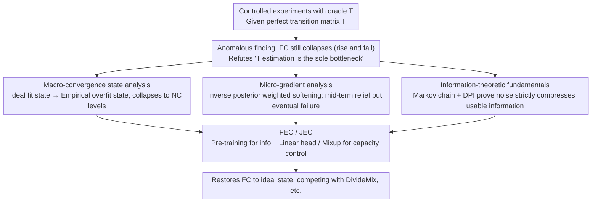

# Deconstructing the Failure of Ideal Noise Correction: A Three-Pillar Diagnosis

**Conference**: CVPR2026  
**arXiv**: [2603.12997](https://arxiv.org/abs/2603.12997)  
**Code**: To be confirmed  
**Area**: Others  
**Keywords**: Learning with Noisy Labels, Noise Transition Matrix, Forward Correction, Statistical Consistency, Information Theory

## TL;DR

This paper demonstrates through controlled experiments that Forward Correction (FC) still suffers from performance collapse in the late stages of training even given a perfect noise transition matrix $T$. It provides a systematic diagnosis of this failure from three perspectives: macro-convergence states, micro-optimization dynamics, and information theory.

## Background & Motivation

**Learning with Noisy Labels (LNL) is a fundamental challenge**: Manual or automatic labeling inevitably introduces label noise, which significantly offsets model training and impairs generalization.

**Theoretical advantages of statistically consistent methods**: Forward and backward correction methods based on the noise transition matrix $T$ theoretically guarantee asymptotic consistency, meaning they should converge to the optimal clean data classifier.

**Long-standing theory-practice paradox**: In practice, these theoretically elegant methods are often significantly outperformed by empirically-driven sample selection methods (e.g., Co-teaching, DivideMix).

**Traditional attribution: Inaccurate $T$ estimation**: The mainstream academic view has long attributed this to insufficient estimation accuracy of the noise transition matrix $T$, assuming that a perfect $T$ would restore the theoretical advantage.

**Key experimental findings of this paper**: Controlled experiments conducted under ideal conditions with an oracle $T$ (perfect transition matrix) reveal that FC still exhibits a "rise then fall" performance collapse—this fundamentally refutes the hypothesis that "estimating $T$ is the sole bottleneck."

**Diagnosis rather than patching**: The goal of this paper is not to propose new correction heuristics but to provide a comprehensive theoretical analysis that systematically explains why these principled methods fail even with perfect information.

## Method

### Overall Architecture

This paper does not propose a new method but diagnoses a long-standing paradox: why Forward Correction (FC), which is theoretically guaranteed to be asymptotically consistent, fails against empirical sample selection methods like Co-teaching and DivideMix. It first performs controlled experiments using an oracle $T$. Finding that FC still collapses even with a perfect $T$, it refutes the mainstream view. Subsequently, it dissects the root causes across three complementary pillars: macro-convergence, micro-gradients, and information theory. Finally, it provides two lightweight remedies, FEC and JEC, based on the diagnosis. The logical flow follows a "divergence-then-convergence" structure: "Anomalous experiment → Three-pillar diagnosis → Remedies."

### Key Designs

**1. Macro-convergence state analysis: Characterizing the final collapse of FC**

To explain the "rise and fall" of FC, one must examine its convergence states. In the ideal fit state (Theorem 4.2), FC achieves Bayes optimal accuracy $\text{ACC}(f_{FC}) = 1 - \mathbb{E}_X[\delta(X)]$ and is perfectly calibrated ($\text{ECE}=0$). The accuracy gap $\Delta$ between FC and Noisy Correction (NC) is confined to the error set $\mathcal{X}_{\text{error}}$ (regions where noise is strong enough to flip the optimal boundary) and $\Delta \geq 0$, explaining the early advantage. However, as high-capacity networks drive empirical risk to a global minimum, they enter the empirical overfit state (Theorem 4.3). FC collapses predictions to hard vertices $\hat{p}_{FC}(x) = \mathbf{e}_{k^*_{FC}(x)}$ (the column maximum of $T$). Under symmetric noise, it can be proven that $\Delta\text{ACC} \approx 0$, meaning both collapse to the same level, and calibration collapses to $\text{ECE} = 1 - \text{ACC}$—resulting in inaccurate and overconfident models.

**2. Micro-gradient analysis: Why it helps mid-term but fails eventually**

Beyond macro states, the paper examines per-sample dynamics during optimization. NC gradients push directly toward the noisy label direction $\partial \ell_{NC}/\partial f_k = \hat{p}_k - \mathbb{I}\{y^n=k\}$. FC gradients introduce inverse posterior weighting $\partial \ell_{FC}/\partial f_k = \hat{p}_k - q_k$, where $q_k$ is the inverse mapping probability from noisy to clean labels. This "softening effect" mitigates overfitting in the mid-training stage (corresponding to the early peak), but the final behavior is dominated by the global minimum identified in Theorem 4.3—softening is merely transient dynamics.

**3. Information-theoretic fundamentals: Proving information is lost to noise**

The first two pillars show FC will collapse; this layer explains why even a perfect $T$ cannot save it. The noise channel forms a Markov chain $M \to (X,Y) \to (X,Y^n)$, and the Data Processing Inequality (DPI) ensures $I_{\text{noisy}}(x) \leq I_{\text{clean}}(x)$. Theorem 4.4 further proves that under non-trivial noise, information compression holds strictly: $I_{\text{noisy}}(x) < I_{\text{clean}}(x)$. That is, overfitting occurs not just because the loss function allows it, but because the data itself lacks sufficient information to guide optimization to the correct solution.

**4. FEC / JEC: Lightweight remedies to restore FC**

Diagnosis points to "insufficient information + excessive capacity leading to overfitting." Consequently, pre-trained features are used to supplement information, while linear heads and Mixup control capacity. FEC (Feature-Enhanced Correction) freezes a pre-trained encoder + linear classifier + Mixup + FC. JEC (Joint-Enhanced Correction) jointly fine-tunes the encoder + linear classifier + Mixup + FC. Both use only lightweight components to pull FC back to performance levels competitive with complex methods like DivideMix.

## Key Experimental Results

### Main Results

| Method | CIFAR-10 Sym-50% | CIFAR-10 Sym-80% | CIFAR-10 Sym-90% | CIFAR-100 Sym-50% | CIFAR-100 Sym-80% | Clothing1M |
|------|:-:|:-:|:-:|:-:|:-:|:-:|
| CE (No correction) | 79.4 | 62.9 | 42.7 | 46.7 | 19.9 | 69.03 |
| Forward [Patrini17] | 79.8 | 63.3 | 42.9 | 46.6 | 19.9 | 69.84 |
| DivideMix | **94.6** | **93.2** | 76.0 | **74.6** | **60.2** | 74.76 |
| FEC (Ours) | 87.3 | 85.6 | **82.5** | 58.6 | 52.7 | 61.85 |
| JEC (Ours) | 88.8 | 78.5 | 68.5 | 64.9 | 50.1 | **72.24** |

### Ablation Study & Key Findings

- **Ideal state validation (Linear classifier + pre-trained features)**: FC significantly outperforms NC in both accuracy and ECE, with the advantage increasing at higher noise ratios—validating Theorem 4.2.
- **Multi-label information scaling experiment**: As the number of labels per sample increases, FC's accuracy steadily improves and approaches ideal sample selection—validating Theorem 4.4 (information is the key bottleneck).
- **Calibration advantage**: Even when FC does not lead in ACC, its ECE remains significantly lower than sample selection methods, indicating that noise correction has unique advantages in posterior quality (calibration).
- **Convergence merging under symmetric noise**: After prolonged training, FC and NC converge to the same poor performance, aligning perfectly with the theoretical predictions of Theorem 4.3.

## Highlights & Insights

- **Refuting a long-standing academic hypothesis**: Through oracle $T$ experiments, it convincingly proves that $T$ estimation accuracy is not the root cause of noise correction failure.
- **Deep and systematic three-layer diagnostic framework**: From macro to micro to information theory, it unfolds the paradox layer by layer, providing comprehensive insight.
- **Rigorous theoretical derivation without simplifying assumptions**: It abandons common class-conditional noise (CCN) and deterministic posterior assumptions; the conclusions apply to more general instance-dependent noise (IDN).
- **Simple regularization significantly boosts noise correction**: FEC/JEC uses only lightweight components (pre-training + Mixup) to compete with complex methods like DivideMix.
- **Emphasis on calibration metrics (ECE)**: Reminds the community that LNL methods should not be evaluated by ACC alone; calibration quality is equally important.

## Limitations & Future Work

- **FEC/JEC depends on the quality of the pre-trained encoder**: While the analysis is general, the actual effectiveness of the proposed solutions is limited by the representation power of pre-trained features.
- **Still assumes known or accurate $T$**: Although it proves perfect $T$ is insufficient, the proposed solutions still require an oracle $T$ and do not address behavior when $T$ estimation is inaccurate.
- **Lack of large-scale experimental validation**: Validation is limited to CIFAR and Clothing1M, without covering larger benchmarks like WebVision or ImageNet-N.
- **Missing comparisons with latest SOTA methods**: Recent methods from the past two years, such as PLS or SOP, are not included.
- **Diagnosis-oriented, solutions are preliminary**: FEC/JEC are positioned as "proofs of concept" and are still some distance from practical utility.

## Related Work & Insights

- **Noise transition matrix methods**: Forward Correction [Patrini17], Backward Correction, T-Revision [Xia19], DualT [Yao20], etc. This paper directly challenges the core assumptions of this direction.
- **Robust loss functions**: GCE, MAE, SCE, etc., bypass $T$ modeling through symmetry conditions but lack systematic analysis for IDN.
- **Sample selection methods**: Co-teaching, DivideMix, PropMix, etc. This paper proves that under ideal conditions, noise correction can be competitive.
- **Information-theoretic noise analysis**: Theorem 4.4 relates to the Data Processing Inequality, providing a new analytical paradigm for LNL.

## Rating

- Novelty: ⭐⭐⭐⭐⭐ — Refutes long-standing hypotheses; unprecedented three-pillar diagnostic framework.
- Experimental Thoroughness: ⭐⭐⭐⭐ — Comprehensive theoretical validation, though large-scale experiments are fewer.
- Writing Quality: ⭐⭐⭐⭐⭐ — Clear narrative structure; rigorous logic from paradox to diagnosis to validation.
- Value: ⭐⭐⭐⭐⭐ — Paradigm-shifting significance for the LNL community.

<!-- RELATED:START -->

## Related Papers

- [\[CVPR 2026\] Mitigating Instance Entanglement in Instance-Dependent Partial Label Learning](mitigating_instance_entanglement_in_instance-dependent_partial_label_learning.md)
- [\[CVPR 2026\] What Is Wrong with Synthetic Data for Scene Text Recognition? A Strong Synthetic Engine with Diverse Simulations and Self-Evolution](what_is_wrong_with_synthetic_data_for_scene_text_recognition_a_strong_synthetic_.md)
- [\[CVPR 2026\] Debiased Sample Selection for Learning with Noisy Labels](debiased_sample_selection_for_learning_with_noisy_labels.md)
- [\[CVPR 2026\] Affine Perspective-Three-Point Problem](affine_perspective-three-point_problem.md)
- [\[CVPR 2026\] DiffBMP: Differentiable Rendering with Bitmap Primitives](diffbmp_differentiable_rendering_with_bitmap_primitives.md)

<!-- RELATED:END -->
