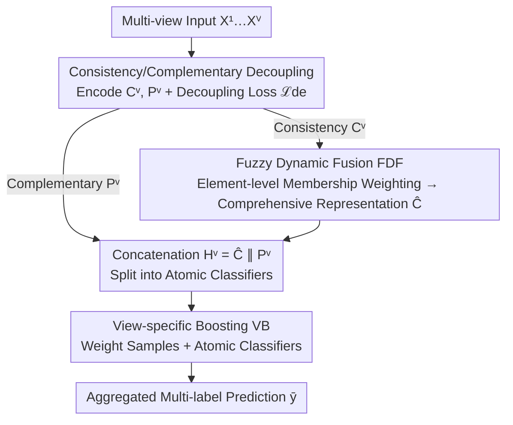

# DF²-VB: Dual-level Fuzzy Fusion with View-specific Boosting for Multi-view Multi-label Classification

**Conference**: CVPR 2026  
**Paper**: [CVF Open Access](https://openaccess.thecvf.com/content/CVPR2026/html/Lin_DF2-VB_Dual-level_Fuzzy_Fusion_with_View-specific_Boosting_for_Multi-view_Multi-label_CVPR_2026_paper.html)  
**Code**: Not disclosed  
**Area**: Multi-view Multi-label Classification  
**Keywords**: Multi-view Multi-label Classification, Fuzzy Set Theory, Feature-level Fusion, Decision-level Fusion, Boosting  

## TL;DR
To address the conflict in Multi-view Multi-label Classification (MVMLC) where "feature-level fusion is expressive but lacks supervision, while decision-level fusion is supervised but relies on weak representations," DF²-VB unifies both levels into a single framework. It utilizes fuzzy membership functions for dynamic element-level weighting of consistent features (FDF) and employs Boosting to adaptively measure the importance of samples and view-specific atomic classifiers (VB). This mutually reinforces expressiveness and discriminability, achieving new SOTA results across 6 public datasets.

## Background & Motivation
**Background**: Multi-view multi-label classification requires simultaneous processing of multiple heterogeneous views (e.g., different modalities in sentiment analysis) and multiple correlated labels. Current approaches are divided into two categories: **feature-level fusion**, which integrates view features into a unified space using view-level weighting to mitigate heterogeneity for expressive representations; and **decision-level fusion**, which aggregates predictions from individual view classifiers, interacting directly with label supervision for reliability.

**Limitations of Prior Work**: Both paradigms have significant drawbacks. Feature-level fusion focuses on representation "quality" but **underutilizes label supervision**, resulting in insufficient discriminability. Decision-level fusion follows supervision signals closely but **ignores the expressiveness of the underlying view representations**, which limits its performance ceiling. Furthermore, feature-level fusion typically operates at the **view-level**, failing to distinguish between important and redundant **elements** within a single view.

**Key Challenge**: There is a structural disconnection between expressiveness and discriminability—feature-level fusion lacks supervised guidance, while decision-level fusion lacks strong representation support. The two are naturally complementary: feature-level fusion can reduce inter-view conflict to build stronger representations, and decision-level fusion can leverage supervision to enhance discriminability.

**Goal**: To unify feature-level and decision-level fusion in a single framework where they compensate for each other's weaknesses. This involves solving three sub-problems: (1) disentangling consistent and complementary representations; (2) adaptively weighting feature importance at element-level rather than view-level; and (3) adaptively measuring sample difficulty and classifier reliability in multi-label scenarios.

**Core Idea**: Use **fuzzy set theory** to map consistent features into a more "compatible" fuzzy representation space to identify effective features at element-level granularity (FDF). Then, decompose multi-label predictions into multiple binary atomic classifiers and use **Boosting** to adaptively weight samples and classifiers (VB). FDF provides expressiveness while VB provides discriminability, forming a cycle of mutual enhancement.

## Method

### Overall Architecture
DF²-VB processes multi-view features through a three-stage pipeline: **Feature Extraction & Decoupling → Feature-level Fusion (FDF) → Decision-level Fusion (VB)**. First, each view is assigned a pair of encoders to extract consistency representations $C^v$ (similar across views) and complementary representations $P^v$ (view-specific), pushed apart by a decoupling loss $\mathcal{L}_{de}$. Next, FDF maps consistent features to a fuzzy space, calculating membership degrees as element-level importance to fuse them into a comprehensive consistency representation $\hat{C}$. Finally, $\hat{C}$ is injected back into each view's complementary representation to form the final view representation $H^v$. Each view classifier is decomposed into atomic classifiers (one per label), and VB dynamically weights samples and classifiers using Boosting to aggregate reliable predictions. The entire system is trained end-to-end via $\mathcal{L}=\mathcal{L}_{cls}+\alpha\mathcal{L}_{de}$.

### Key Designs

**1. Consistency/Complementary Disentanglement: Isolating information types**

Mixing consistency and complementary features directly is problematic: consistency requires cross-view similarity (easy to fuse but weak discriminability), while complementary features contain heterogeneous view-specific information (rich but disruptive to fusion). This study uses a decoupling loss to separate them statistically:

$$\mathcal{L}_{de} = -\frac{1}{V}\sum_{v=1}^{V}\log\frac{\ell_1^v}{\ell_1^v+\ell_2^v+\ell_3^v}$$

where $\ell_1^v=\sum_u e^{\vartheta(\bar{c}^v,\bar{c}^u)/\tau_{ind}}$ measures similarity between consistencies, $\ell_2^v$ measures consistency-complementary similarity, and $\ell_3^v$ measures complementarity-complementary similarity, with $\vartheta$ as cosine similarity. Minimizing this **increases statistical dependence between consistency representations** (numerator) while **minimizing dependence between consistency-complementary and complementary-complementary pairs** (denominators $\ell_2^v,\ell_3^v$). Theorem 3.1 provides the correspondence to the lower bound of mutual information. Beneficially, unlike standard instance-level decoupling ($O(V^2N^2)$), this uses mean pooling per view ($\bar{c}^v,\bar{p}^v$) first, reducing complexity to $O(V^2)$, independent of sample size.

**2. Fuzzy Dynamic Fusion (FDF): Element-level feature selection**

Traditional feature-level fusion only weights at the **view** level. FDF uses fuzzy set theory to move consistent features into a fuzzy space, which is considered more "generalized" and suitable for heterogeneous view fusion. Specifically, $K$ Gaussian membership functions calculate $K$ degrees for the $j$-th feature element $c_{i,j}^v$ of view $v$:

$$s_{i,j,k}^v = \exp\!\left(-\frac{(c_{i,j}^v - m_{j,k})^2}{2\delta_{j,k}^2}\right),\quad k=1,\dots,K$$

where $m_{j,k}, \delta_{j,k}$ are **learnable** parameters. The membership degree $s_{i,j,k}^v$ measures the importance of that element relative to the $k$-th fuzzy subspace. Max-pooling selects the most informative degree $\tilde{s}_{i,j}^v=\max_k\{s_{i,j,k}^v\}$, and views are fused:

$$\hat{C} = \mathrm{Norm}\!\left(\sum_{v=1}^{V}\tilde{S}^v\odot C^v\right)$$

where $\odot$ denotes the Hadamard product. Since weights are element-wise and learnable, FDF suppresses redundant elements. Theorem 3.2 proves that this element-level weighting achieves a **lower Rademacher complexity** than view-level weighting, implying better generalization.

**3. View-specific Boosting (VB): Sample and classifier reliability**

Complementary representations alone are "incomplete" for prediction after consistency info is stripped. VB injects the comprehensive consistency representation back: $H^v=\hat{C}\,\|\,P^v$, then decomposes "one multi-label classifier per view" into $L$ **atomic classifiers**, each handling one label $\tilde{o}_{i,j}^v$ and $\tilde{y}_{i,j}^v=\sigma(\tilde{o}_{i,j}^v)$.

VB dynamically weights classifiers and samples using a Boosting logic. Error rates $\epsilon_{j,t}^v$ for each atomic classifier are calculated on the mini-batch to update classifier weights:

$$\beta_{j,t+1}^v=\begin{cases}\frac{1}{2}\log\frac{1-\epsilon_{j,t}^v+\eta}{\epsilon_{j,t}^v+\eta}, & \epsilon_{j,t}^v<0.5\\[4pt] 0, & \epsilon_{j,t}^v\geq 0.5\end{cases}$$

Classifiers with error $>0.5$ are zeroed out (unreliable). Sample weights are updated to focus on "hard" samples (Eq. 11). Final predictions aggregate weighted logits: $\bar{y}_{i,j}=\sigma\!\left(\sum_v\tilde{\beta}_{j,T}^v\cdot\tilde{o}_{i,j}^v\right)$. This decision-level path reinforces the discriminability of the feature-level stage via supervision.

### Loss & Training
The total loss comprises Binary Cross Entropy (BCE) and the decoupling regularizer:

$$\mathcal{L}=\mathcal{L}_{cls}+\alpha\mathcal{L}_{de},\quad \mathcal{L}_{cls}=-\sum_{i=1}^{N}\sum_{j=1}^{L}\big[y_{i,j}\log\bar{y}_{i,j}+(1-y_{i,j})\log(1-\bar{y}_{i,j})\big]$$

The training process (Algorithm 1) involves feature extraction, decoupling, FDF weighting, $T$ iterations of Boosting for VB, and aggregated prediction backpropagation. During inference, atomic classifier weights are fixed for aggregation.

## Key Experimental Results

### Main Results
Evaluated on 6 MVMLC datasets (Emotions, Scene, Yeast, Corel5k, Pascal, Espgame) using five-fold cross-validation against 6 SOTA baselines (FIMAN, D-VSM, DIMC, ML-BVAE, VAMS, TMvML). Metrics include AP↑, MiF1↑, OE↓, RL↓, and Cov↓.

| Dataset | Metric | DF²-VB | Best Baseline | Note |
|--------|------|--------|---------------|------|
| Emotions | AP↑ / MiF1↑ | **0.840 / 0.724** | 0.835 / 0.700 (D-VSM) | Superior expressiveness + discriminability |
| Scene | OE↓ / RL↓ | **0.183 / 0.058** | 0.189 / 0.058 (D-VSM) | Better or equal to strongest baseline |
| Corel5k | AP↑ / MiF1↑ | **0.540 / 0.437** | 0.475 / 0.414 (D-VSM/TMvML) | AP lead of ~6.5 points |
| Espgame | AP↑ / Cov↓ | **0.375 / 82.39** | 0.364 / 86.75 (D-VSM) | Optimal on large label sets |

DF²-VB outperformed all baselines in 210 experimental settings, with Friedman and Bonferroni-Dunn tests (CD=3.290) ranking it first across all metrics at $p < 0.05$.

### Ablation Study
Comparison of four variants on Emotions/Scene (W/o FDF, W/o VB, W/o Both, W/o DL):

| Configuration | Emotions AP↑ | Emotions MiF1↑ | Scene AP↑ | Note |
|------|--------------|----------------|-----------|------|
| W/o FDF & VB | 0.828 | 0.595 | 0.884 | Mean consistency only (weakest) |
| W/o VB | 0.829 | 0.633 | 0.888 | FDF only, no supervised weighting |
| W/o FDF | 0.834 | 0.716 | 0.890 | VB only, weak expressiveness |
| W/o DL | 0.838 | 0.722 | 0.892 | No decoupling, minor drop |
| **DF²-VB (Full)** | **0.840** | **0.724** | **0.893** | Optimal performance with all components |

### Key Findings
- **Component Contributions**: Adding components sequentially monotonically increases performance. Decoupling is essential for refinement.
- **Fusion Hierarchy**: "W/o VB" (FDF only) generally outperforms "W/o FDF" (VB only), suggesting expressiveness from FDF is more fundamental.
- **Robustness**: Performance is stable across hyperparameter ranges for $K$ (fuzzy functions) and $\alpha$ (decoupling). Convergence occurs within 100 epochs.

## Highlights & Insights
- **Fuzzy Membership as Importance**: Using learnable Gaussian functions for element-level scoring is more refined than view-level weighting and comes with theoretical generalization guarantees (Rademacher complexity).
- **Efficient Decoupling**: The mean-pooling trick for contrastive decoupling reduces complexity from $O(V^2N^2)$ to $O(V^2)$, making it a cost-effective, reusable engineering trick for multi-view tasks.
- **Boosting for Multi-label**: Decomposing multi-label classifiers into atomic units for AdaBoost-style weighting allows the system to zero out unreliable classifiers, which is a rare but natural combination.
- **The "Aha" Moment**: FDF (expressiveness) and VB (discriminability) form a closed loop through shared $\hat{C}$ and supervised feedback, truly "neutralizing" the conflict between the two paradigms rather than just concatenating modules.

## Limitations & Future Work
- Code is not public, increasing reproduction difficulty. The overhead of $K$ fuzzy functions and $T$ Boosting iterations is higher than simple fusion.
- Experiments focus on traditional vectorized benchmarks; **effectiveness on raw high-dimensional image/text data is unverified**. Element-level memberships may struggle with extremely high dimensionality.
- Scaling costs for the atomic classifier split as the number of labels $L$ grows were not fully analyzed and could become a bottleneck.
- Future work: Plugging FDF into deep backbones for end-to-end learning or exploring lighter sample-weighting strategies.

## Related Work & Insights
- **vs. Feature-level Fusion (FIMAN / DIMC)**: These methods fuse views without sufficient label supervision. DF²-VB uses VB to incorporate supervision, leading to higher MiF1 scores.
- **vs. Decision-level Fusion (ML-BVAE / TMvML)**: These aggregate classifiers but ignore the underlying representation strength. DF²-VB uses FDF to strengthen the representation first.
- **vs. View-level Weighting**: Traditional methods weight entire views; DF²-VB operates at element-level granularity, which is theoretically and experimentally more effective.

## Rating
- Novelty: ⭐⭐⭐⭐ Unifying fuzzy element-level weighting with Boosting for MVMLC is novel and theoretically supported.
- Experimental Thoroughness: ⭐⭐⭐⭐ 6 datasets, 5 metrics, and significance tests, though limited to traditional benchmarks.
- Writing Quality: ⭐⭐⭐⭐ Clear logic from motivation to theory; formulas are dense but consistent.
- Value: ⭐⭐⭐⭐ High transferability of the element-level fuzzy weighting and efficient decoupling tricks for multi-view research.

<!-- RELATED:START -->

## Related Papers

- [\[CVPR 2026\] EXOTIC: External Vision-driven Incomplete Multi-view Classification](exotic_external_vision-driven_incomplete_multi-view_classification.md)
- [\[ICLR 2026\] Permutation-Consistent Variational Encoding for Incomplete Multi-View Multi-Label Classification](../../ICLR2026/others/permutation-consistent_variational_encoding_for_incomplete_multi-view_multi-labe.md)
- [\[CVPR 2026\] Prototype-based Causal Intervention for Multi-Label Image Classification](prototype-based_causal_intervention_for_multi-label_image_classification.md)
- [\[CVPR 2026\] Revisiting F-measure Optimization in Multi-Label Classification: A Sampling-based Approach](revisiting_f-measure_optimization_in_multi-label_classification_a_sampling-based.md)
- [\[CVPR 2026\] Multi-view Crowd Tracking Transformer with View-Ground Interactions Under Large Real-World Scenes](multi-view_crowd_tracking_transformer_with_view-ground_interactions_under_large_.md)

<!-- RELATED:END -->
