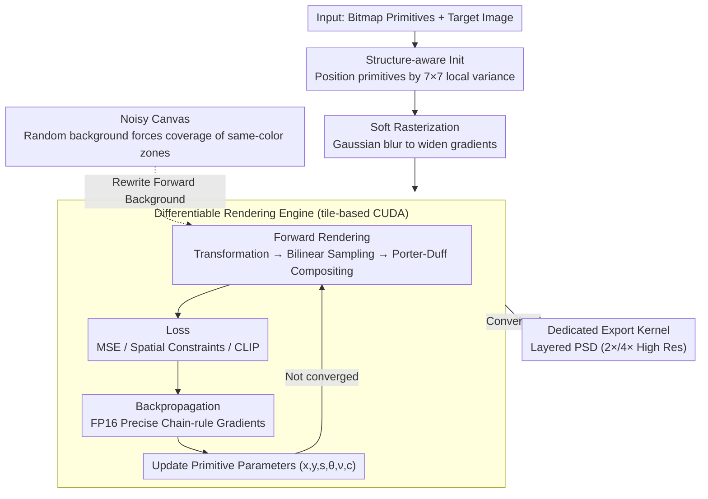

# DiffBMP: Differentiable Rendering with Bitmap Primitives

**Conference**: CVPR2026  
**arXiv**: [2602.22625](https://arxiv.org/abs/2602.22625)  
**Code**: [diffbmp.com](https://diffbmp.com)  
**Area**: others (Differentiable Rendering / Computer Graphics)  
**Keywords**: differentiable rendering, bitmap primitives, CUDA kernel, soft rasterization, alpha compositing, creative workflow

## TL;DR

Ours proposes DiffBMP—the first general-purpose differentiable rendering engine for **bitmap primitives**. It implements an efficient custom CUDA parallel pipeline to enable gradient optimization of position, rotation, scaling, color, and opacity for thousands of bitmap primitives, filling the gap where 2D differentiable rendering was previously restricted to vector graphics.

## Background & Motivation

**Core demand of differentiable rendering**: Large-scale optimization problems rely on first-order gradient methods, which require the rendering process to be differentiable with respect to scene parameters. While mature solutions exist in the 3D domain (NeRF, 3DGS), 2D rendering remains limited to vector graphics.

**Limitations of Prior Work (Vector Primitives)**: DiffVG and its successors perform excellently on vector paths, but the vast majority of real-world 2D assets are bitmaps, which cannot directly participate in gradient optimization.

**Key Challenge of bitmap differentiable rendering**: Bitmaps are discrete high-dimensional pixel arrays, leading to massive memory and computational overhead. Although STN introduced differentiable image sampling, it has not been generalized to universal bitmap composition optimization.

**Background of existing bitmap methods**: Reddy et al. made the only attempt at bitmap differentiable rendering, but it lacked transparency support and parallel acceleration, handling only narrow tasks like repeating opaque patterns.

**Limitations of vector approaches**: Experiments demonstrate that DiffVG suffers from sharp PSNR drops and dramatic increases in runtime when facing complex SVG curves; even pre-vectorizing before using DiffVG is infeasible.

**Goal**: To create a bitmap differentiable rendering tool capable of exporting optimization results as layered PSD files for seamless integration into creative workflows.

## Method

### Overall Architecture

DiffBMP addresses the long-standing void in 2D differentiable rendering where bitmap manipulation was impossible. The core is a custom tile-based CUDA **differentiable rendering engine**. Given a set of bitmap primitives and a target image, the system performs structure-aware initialization and applies soft rasterization blurring to primitives. It then enters an optimization loop: differentiable forward rendering (coordinate transformation + bilinear interpolation sampling + Porter-Duff alpha compositing) generates the rendered result $\to$ compute loss $\to$ backpropagation via CUDA for precise gradients $\to$ update primitive parameters $(x_i, y_i, s_i, \theta_i, \nu_i, \mathbf{c}_i)$. This loops until convergence, where a dedicated export kernel generates layered PSD files. Techniques like noisy canvases stabilize optimization by rewriting the forward background.

### Key Designs

**1. Differentiable Rendering Engine: A tile-based CUDA pipeline with full forward and backward differentiability**

Bitmaps are discrete high-dimensional pixel arrays; direct compositional rendering is typically non-differentiable and computationally expensive. DiffBMP's Core Idea is an end-to-end differentiable custom CUDA engine that solves forward, backward, and parallelization simultaneously. **Mechanism (Forward)**: For canvas pixels $(x,y)$, coordinates are mapped via rotation, translation, and scaling matrices to normalized coordinates $(u,v)\in[-1,1]^2$ (Eq.1), then converted to discrete coordinates $(U,V)$ for bilinear interpolation to obtain the primitive contribution $M_i(x,y)$, making spatial transformations fully differentiable. Each primitive's alpha is defined as $\alpha = \alpha_{\max} \cdot \sigma(\nu_i) \cdot M_i(x,y)$. Porter-Duff "over" compositing is used to accumulate transmittance $T_k$ and final color $I(x,y)$ (Eqs.3–5). **Mechanism (Backward)**: Gradients for position, scale, and rotation are precisely propagated from $I$ through $M_i$ and $(u,v)$ to each parameter via the chain rule (Eq.7) without approximations. **Mechanism (Parallelization)**: The canvas is divided into $T \times T$ tiles (default $T=32$). On the CPU, primitives are binned into tiles based on bounding boxes. On the GPU, each tile is processed by a thread block, with $T \times T$ threads performing pixel-level parallelization. Gradients are accumulated using FP16 (`__half2` packing + `atomicAdd`) to minimize bandwidth and VRAM. Additionally, a specialized export CUDA kernel renders editable layered PSDs at high resolution ($2\times/4\times$). An optional color constraint $\mu_{\text{blend}}$ (Eq.6) preserves original primitive colors for brand-sensitive scenarios like logo mosaics.

**2. Soft Rasterization: Widening sparse gradients**

Gradients from bilinear interpolation are only non-zero near primitive boundaries and essentially zero elsewhere. This sparsity often causes optimization to stall. DiffBMP applies Gaussian blurring to each primitive before optimization, smoothing edges and expanding the spatial reach of gradients. This step adds negligible computational cost while making gradients more continuous and informative, consistently improving PSNR in ablation studies (Tab.3).

**3. Structure-aware Init: Placing primitives by target complexity**

Random initialization often places primitives poorly, slowing convergence. DiffBMP uses the local variance of a $7\times7$ sliding window on the target image (normalized as $\mathrm{NLV}\in[0,1]$) to guide placement: high-variance (high-detail) areas receive dense, small primitives, while low-variance (flat) areas receive sparse, large primitives ($s_i$ scales inversely with NLV). Colors are initialized with the target pixel value plus noise $c_i\sim\mathcal{N}(I(x_i,y_i),\sigma_c^2)$, and opacity is fixed at $\nu_i=-2.0$ ($\approx 12\%$) to ensure gradient flow through all layers. This initial layout matches the target structure, providing another stable Gain in ablations.

**4. Noisy Canvas: Forcing primitives to cover same-colored areas**

When a target region matches the canvas background color, primitives may "lazy-out" and fail to cover the area, leaving holes. DiffBMP sets the background to uniform random noise $\mathbf{b}(x,y)\sim\mathcal{U}[0,1]^3$ and rewrites the forward compositing as $I_{\text{FG+BG}}=I_{\text{FG}}+T_N\odot\mathbf{b}$ (Eq.8). This forces primitives to cover regions even if they match the original background color. Compared to mesh-based methods that sample noise 5 times per iteration, Ours samples only once.

### Loss

- **Basic Loss**: $\| I - I^{\text{target}} \|_2^2$ (Pixel-level MSE).
- **Spatial Constraint Loss** (Eq. 9): $\mathcal{L} = \|(I_\alpha^{\text{target}} > 0) \odot (I - I^{\text{target}})\|_2^2 + \lambda_\alpha \|I_\alpha - I_\alpha^{\text{target}}\|_2^2$, used for foreground rendering to ensure primitives disappear in background regions.
- **CLIP Loss**: Can be combined with CLIP for text-driven bitmap composition.

## Key Experimental Results

### Main Results

| Implementation | Resolution 512² | Resolution 1024² (tile=32) | Resolution 2048² |
|---|---|---|---|
| PyTorch (RTX 3090) | 1360/2337 ms, 6.4 GB | 1393/2477 ms, 5.0 GB | 5405/9483 ms, 9.0 GB |
| CUDA-FP32 (RTX 3090) | 3.9/11.6 ms, 1.0 GB | 7.6/9.3 ms, 2.0 GB | 16.1/10.0 ms, 6.1 GB |
| CUDA-FP16 (RTX 3090) | **2.3/6.2 ms, 1.1 GB** | **4.3/5.5 ms, 1.6 GB** | **9.0/6.4 ms, 3.8 GB** |

> CUDA-FP16 is **~350–600× faster** than the PyTorch baseline, with VRAM usage reduced by **~2.5–6×**.

### Ablation Study

| Soft Rasterization | Structure-aware Init | Scenario 1 (PSNR) | Scenario 2 | Scenario 3 |
|---|---|---|---|---|
| ✗ | ✗ | 24.4 | 20.6 | 25.9 |
| ✓ | ✗ | 24.7 | 21.5 | 26.5 |
| ✗ | ✓ | 25.5 | 21.0 | 27.1 |
| ✓ | ✓ | **25.7** | **21.7** | **27.4** |

The combination of both techniques achieves the best PSNR across all scenarios.

### Key Findings

- **DiffVG failure on complex SVGs**: When handling vector primitives at bitmap-level complexity, DiffVG’s PSNR drops significantly and runtime spikes, proving the necessity of DiffBMP.
- **Dynamic Video**: Combining sequence initialization, removal of stuck primitives, and freezing of unchanged regions achieves the best temporal consistency (tOF=1.84) while maintaining competitive frame fidelity (PSNR=24.38) across 17 video segments.
- **Noisy Canvas Effectiveness**: Successfully eliminates holes in primitive coverage in same-colored regions.
- **Spatial Constraints**: Combining opacity loss with re-initialization of low-opacity primitives yields the cleanest foreground rendering results.

## Highlights & Insights

- **Novelty**: First general-purpose, high-efficiency differentiable rendering engine for arbitrary bitmap primitives; serves as the bitmap counterpart to DiffVG.
- **Engineering Excellence**: Custom tile-based CUDA kernels with FP16 mixed precision optimize thousands of primitives in under a minute on consumer-grade GPUs.
- **Value**: High practical utility with layered PSD export, Python interfaces, and CLIP-driven creation, allowing direct integration into professional designer workflows.
- **Novelty (Tricks)**: Soft rasterization, structure-aware initialization, and noisy canvases are all ablation-verified, with significant combined effects.
- **Diverse Applications**: Showcases brand logo mosaics, video modeling, foreground constrained rendering, and text-driven creative workflows.

## Limitations & Future Work

- **GPU Dependency**: Unlike DiffVG which can run on CPUs, DiffBMP is built on CUDA and requires NVIDIA GPUs.
- **Hyperparameter Sensitivity**: The general nature of the engine makes results sensitive to hyperparameter choices and initialization strategies, risking local optima without an auto-tuning mechanism.
- **Untapped Potential (RL/Autoregressive)**: While the paper notes that bitmap differentiable rendering could support autoregressive painting and reinforcement learning, these were not implemented.
- **Video Trade-offs**: Dynamic DiffBMP still faces a trade-off between anti-flicker stability and frame fidelity, which has yet to be perfectly balanced.

## Related Work & Insights

- **Vector Differentiable Rendering**: DiffVG [Li et al., 2020] and its extensions (vectorization, text-to-SVG); Bézier Splatting [Liu et al., 2025] is also limited to vectors.
- **Bitmap Differentiable Rendering**: STN [Jaderberg et al., 2015] introduced differentiable spatial transforms; Reddy et al. applied this to pattern composition but lacked parallelism and transparency.
- **3D Differentiable Rendering**: NeRF, 3DGS, and accelerated variants (Plenoxels, 3D Convex Splatting) provided references for the tile-based parallel architecture of DiffBMP.
- **Neural Painting**: Paint Transformer [Liu et al., 2021] and CLIPDraw [Frans et al., 2022] use RL or feed-forward networks; DiffBMP provides an alternative path via gradient optimization.

## Rating

- Novelty: ⭐⭐⭐⭐⭐ — Fills a clear void in bitmap differentiable rendering with a clean problem definition.
- Experimental Thoroughness: ⭐⭐⭐⭐ — Performance, ablations, and diverse applications are covered, though more quantitative comparisons with baselines would be beneficial.
- Writing Quality: ⭐⭐⭐⭐⭐ — Clear structure, complete mathematical derivations, and intuitive, rich visualizations.
- Value: ⭐⭐⭐⭐ — Establishes a new paradigm for bitmap gradient optimization; utility depends on community adoption of the tool.

<!-- RELATED:START -->

## Related Papers

- [\[CVPR 2025\] Locally Orderless Images for Optimization in Differentiable Rendering](../../CVPR2025/others/locally_orderless_images_for_optimization_in_differentiable_rendering.md)
- [\[CVPR 2026\] Lens Component Deletion based on Differentiable Ray Tracing](lens_component_deletion_based_on_differentiable_ray_tracing.md)
- [\[CVPR 2026\] Differentiable Stroke Planning with Dual Parameterization for Efficient and High-Fidelity Painting Creation](differentiable_stroke_planning_with_dual_parameterization_for_efficient_and_high.md)
- [\[ICML 2026\] DisjunctiveNet: Neural Symbolic Learning via Differentiable Convexified Optimization Layers](../../ICML2026/others/disjunctivenet_neural_symbolic_learning_via_differentiable_convexified_optimizat.md)
- [\[CVPR 2025\] TensoFlow: Tensorial Flow-based Sampler for Inverse Rendering](../../CVPR2025/others/tensoflow_tensorial_flow-based_sampler_for_inverse_rendering.md)

<!-- RELATED:END -->
