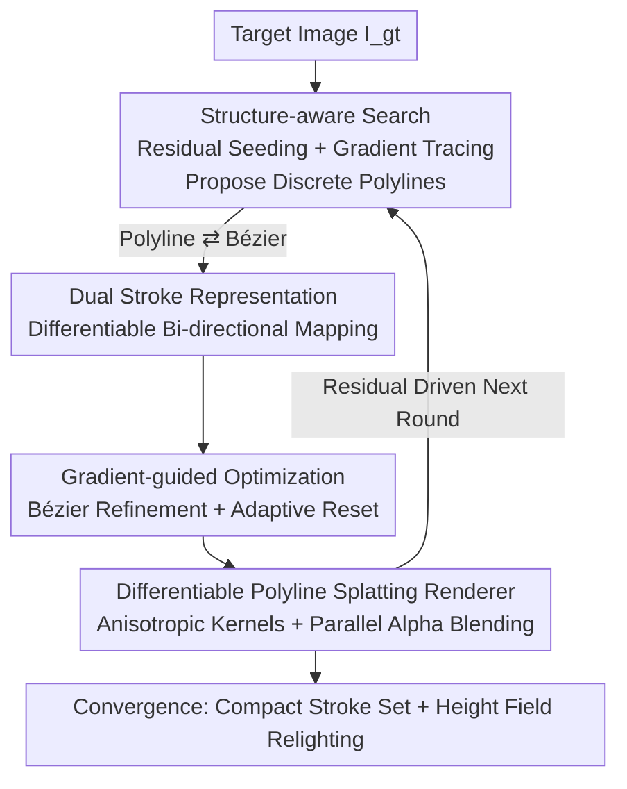

# Differentiable Stroke Planning with Dual Parameterization for Efficient and High-Fidelity Painting Creation

**Conference**: CVPR 2026  
**Paper**: [CVF Open Access](https://openaccess.thecvf.com/content/CVPR2026/html/Liu_Differentiable_Stroke_Planning_with_Dual_Parameterization_for_Efficient_and_High-Fidelity_CVPR_2026_paper.html)  
**Code**: None  
**Area**: Image Vectorization / Stroke-based Rendering  
**Keywords**: Stroke rendering, Dual parameterization, Differentiable rendering, Gaussian Splatting initialization, Non-photorealistic rendering  

## TL;DR
This work represents a single stroke simultaneously as a "discrete polyline" and a "continuous Bézier curve," enabling differentiable bi-directional conversion. A residual-guided discrete search handles global structure while gradient optimization performs pixel-level refinement. Coupled with a Gaussian-style differentiable polyline renderer that optimizes thousands of strokes in parallel, the method improves PSNR by 4–5 dB on complex textures while using 30–50% fewer strokes and being 30–40% faster than existing methods.

## Background & Motivation
**Background**: Stroke-based rendering (SBR), also known as image vectorization, aims to automatically translate a photograph into a set of editable strokes, producing non-photorealistic artistic images such as oil paintings or sketches. Existing methods are divided into two main camps: search-based methods that trace strokes along local pixel gradients (often using rectangular primitives) and optimization-based methods that use differentiable rendering for gradient descent to fit colors.

**Limitations of Prior Work**: Search-based methods often fall into local minima due to the discrete placement of strokes, resulting in fragmented structures and sensitivity to noise. They typically require tens of thousands of strokes to reconstruct an image, are slow to optimize, and often achieve a PSNR below 27 dB on complex textures. Optimization-based methods converge faster and more stably for each stroke but lack explicit structural priors. Driven by pixel-level loss, the resulting stroke layouts are often cluttered and fail to capture coherent image trends, leading to poor editability and local minima.

**Key Challenge**: Discrete search possesses "structural awareness" but lacks differentiable refinement, while continuous optimization allows for refinement but lacks "structural priors." These two paradigms hold complementary strengths but utilize incompatible representations, preventing synergy.

**Goal**: To enable discrete search and continuous optimization to work synergistically on the same stroke, allowing for both efficient exploration of large-scale structures and precise pixel-level fitting.

**Key Insight**: The authors observe that the strengths of discrete search and continuous optimization are complementary; the primary bottleneck is the "representational gap." By building a differentiable bi-directional bridge—allowing continuous gradients to flow back to modify discrete structures and feeding discrete structural proposals into continuous optimization—the two can leverage each other's advantages.

**Core Idea**: Use a **dual stroke representation** (Discrete Polyline $\leftrightarrow$ Continuous Bézier, with differentiable bi-directional mapping) to couple search and optimization into a two-stage iterative pipeline of "search for structure, gradients for details," utilizing Gaussian Splatting principles for parallel initialization and rendering.

## Method

### Overall Architecture
Given a target image $I_{\text{gt}}\in\mathbb{R}^{H\times W\times 3}$, the goal is to find a set of strokes $\mathcal{S}=\{s_i\}$ such that the rendered result $I$ minimizes the reconstruction loss $\mathcal{L}(I,I_{\text{gt}})$. The pipeline is an **iterative loop alternating between search and optimization**, built upon the dual stroke representation. Each iteration consists of two steps: ① Structural-aware search proposes new stroke structures in regions with high reconstruction error; ② Gradient-guided optimization refines the parameters of all current strokes. Both steps are supported by a differentiable polyline renderer that splats all strokes onto the canvas in parallel and propagates gradients back. The paper emphasizes that most structures are captured in the **first iteration**, with subsequent iterations performing progressive refinement; thus, it defaults to converging in only 3 iterations.

### Key Designs

**1. Dual Stroke Representation: A Differentiable Bridge between Discrete Search and Continuous Optimization**

This is the core of the paper, addressing the "representational gap." A stroke $s_i$ is simultaneously represented in two forms: a **discrete polyline** $\mathbf{P}_i=[\mathbf{p}_{i,0},\dots,\mathbf{p}_{i,M_i-1}]$ (a sequence of ordered vertices, intuitive for structural proposals and editing) and a **continuous Bézier curve** $\mathbf{C}_i=[\mathbf{c}_{i,0},\dots,\mathbf{c}_{i,K-1}]$ (a smooth parametric curve, suitable for differentiable refinement). The two are linked via a **differentiable bi-directional mapping** through shared parameterization.

Polyline $\to$ Bézier (Differentiable Fitting): First, use chord-length parameterization to assign a normalized parameter $t_{i,m}\in[0,1]$ to each vertex $\mathbf{p}_{i,m}$. The point at parameter $t$ on the Bézier curve is $\mathbf{B}(t;\mathbf{C}_i)=\sum_{k=0}^{K-1}\mathbf{c}_{i,k}\,B_{k,K-1}(t)$, where $B_{k,K-1}$ are Bernstein basis functions. The optimal control points are obtained via least squares:

$$\mathbf{C}_i^*=\underset{\mathbf{C}_i}{\arg\min}\sum_{m=0}^{M_i-1}\big\|\mathbf{p}_{i,m}-\mathbf{B}(t_{i,m};\mathbf{C}_i)\big\|_2^2.$$

As a convex problem with a **closed-form pseudoinverse solution**, the fitting process is naturally differentiable, allowing gradients to flow from the continuous curve back to the discrete polyline vertices. The Bézier $\to$ Polyline direction (Differentiable Sampling) is straightforward: sample the curve at fixed parameters $\mathbf{p}_{i,m}=\mathbf{B}(t_{i,m};\mathbf{C}_i)$, which is a linear combination of control points and is differentiable with respect to $\mathbf{C}_i$. This bi-directional bridge allows gradient signals from continuous optimization to refine the discrete structures proposed by search, optimizing global layout and local details simultaneously.

**2. Structure-aware Stroke Search: Tracing Polylines via Residual Gradient Fields**

To address the "fragmented structure" issue of search-based methods, this module does not trace along fixed-direction short segments. Instead, it allows polylines to "grow" along the gradient field of the reconstruction error. In each iteration $t$, the reconstruction residual and its gradient field are calculated: $R^t(\mathbf{x})=\|I^t(\mathbf{x})-I_{\text{gt}}(\mathbf{x})\|_2^2$, $\mathbf{G}^t(\mathbf{x})=\nabla R^t(\mathbf{x})$. **Non-Maximum Suppression (NMS)** is then used to sample seed points $\{\mathbf{x}_j\}$ from the residual distribution, ensuring strokes are prioritized in structurally significant, high-error regions.

Starting from a seed $\mathbf{p}_0=\mathbf{x}_j$, the stroke grows iteratively along the gradient flow $\mathbf{p}_{k+1}=\mathbf{p}_k+\eta\cdot\mathbf{d}_k$ with a differentiable step size $\eta$. The direction $\mathbf{d}_k$ performs gradient ascent on the residual field to drive the stroke toward high-error areas. To avoid noise, the direction is a weighted mixture of the "local gradient" and the "previous direction" to encourage smoothness:

$$\tilde{\mathbf{d}}_k=\frac{\mathbf{G}^t(\mathbf{p}_k)}{\|\mathbf{G}^t(\mathbf{p}_k)\|+\epsilon},\qquad \mathbf{d}_k=\lambda\,\tilde{\mathbf{d}}_k+(1-\lambda)\,\mathbf{d}_{k-1}.$$

Tracing stops when the stroke no longer reduces reconstruction loss or after a threshold of failures. The resulting polylines $S_{\text{search}}=\{\mathbf{P}_i\}$ are structurally coherent and optimized for loss reduction from the start, before being converted to Bézier curves for refinement.

**3. Gradient-guided Optimization + Differentiable Polyline Splatting Renderer**

After search establishes large-scale structures, this stage **refines all strokes in parallel** to pixel-level fidelity within the continuous Bézier domain $\{\mathbf{C}_i\}$. Control points are sampled into dense polylines $\tilde{\mathbf{P}}_i$. The entire set of strokes is rendered onto the canvas $I_{\text{render}}$ using a differentiable splatting kernel in a single forward pass, minimizing $\mathcal{L}=\|I_{\text{render}}-I_{\text{gt}}\|_2+\lambda_\ell\mathcal{L}_{\text{len}}+\lambda_w\mathcal{L}_{\text{width}}$. Gradients are propagated through geometry, color, opacity, and width.

The renderer approximates each stroke segment as a **soft anisotropic splat**, balancing computational cost with differentiability. The influence of a segment $e_{i,j}$ on pixel $\mathbf{x}$ is given by an anisotropic kernel based on the shortest distance $d_{i,j}(\mathbf{x})$:

$$k_{i,j}(\mathbf{x})=\frac{\sigma\!\big(\tfrac{w_i/2-d_{i,j}(\mathbf{x})}{\tau}\big)-\sigma\!\big(\tfrac{-w_i/2}{\tau}\big)}{1-2\sigma\!\big(\tfrac{-w_i/2}{\tau}\big)},$$, where $w_i$ is width, $\tau$ is softness, and $\sigma$ is the logistic function. Opacity is $\alpha_{i,j}(\mathbf{x})=\mathbf{o}_i\cdot\max(0,k_{i,j}(\mathbf{x}))$. All segments are combined via front-to-back alpha blending: $C(\mathbf{x})=\sum_{(i,j)\in\pi(\mathbf{x})}\alpha_{i,j}(\mathbf{x})\,\mathbf{c}_i\prod_{(p,q)<(i,j)}(1-\alpha_{p,q}(\mathbf{x}))$. **Learnable opacity** allows strokes to overlap smoothly, significantly reducing the required stroke count. Influenced by 3D Gaussian Splatting, this paradigm enables highly parallel rasterization and **Gaussian-style initialization**—distributing seed strokes based on image feature density to optimize thousands of strokes simultaneously from the first iteration. The optimization also employs adaptive resets: since strokes are long and structurally vital, splitting/pruning is avoided; instead, strokes with near-zero opacity and minimal loss reduction are reset and handed back to the search module. Additionally, a height value $h_i$ is regressed for each stroke (initialized via Depth Anything), allowing for relighting to simulate impasto oil painting effects.

### Loss & Training
The reconstruction objective is $\mathcal{L}=\|I_{\text{render}}-I_{\text{gt}}\|_2+\lambda_\ell\mathcal{L}_{\text{len}}+\lambda_w\mathcal{L}_{\text{width}}$. Implementation uses PyTorch on an RTX 4090 with 3 iterations. The search stage uses 7×7 NMS on the top 12% residual pixels, an adaptive step size starting at 1.2 pixels, and $\lambda=0.8$. Strokes grow up to 20 vertices and are accepted if they reduce loss by $\geq 0.01$. The optimization stage converts polylines to piecewise cubic Béziers, sampled at 10 points for rendering, using Adam for up to 4000 steps with a base learning rate of 0.01 (scaled for colors and widths).

## Key Experimental Results

### Main Results
Evaluated on DIV2K (1200×1200) and Im2Oil (600×800) against SOTA methods including Im2Oil, CNP, Paint Transformer, Learning to Paint, and SNP:

| Dataset | Method | PSNR↑ | SSIM↑ | LPIPS↓ | Time(s)↓ |
|--------|------|-------|-------|--------|----------|
| DIV2K | Im2Oil | 27.59 | 0.72 | 0.211 | 727.8 |
| DIV2K | CNP | 27.91 | 0.64 | 0.296 | 125.5 |
| DIV2K | Learning to Paint | 27.19 | 0.70 | 0.330 | 167.9 |
| DIV2K | SNP | 20.63 | 0.42 | 0.405 | 5837.2 |
| DIV2K | **Ours** | **32.16** | **0.93** | **0.076** | **87.6** |
| Gallery | Im2Oil | 28.54 | 0.71 | 0.204 | 392.8 |
| Gallery | Learning to Paint | 28.58 | 0.73 | 0.318 | 80.6 |
| Gallery | **Ours** | **32.53** | **0.86** | **0.192** | **42.7** |

Ours achieves ~4 dB higher PSNR than the strongest baseline. The significant SSIM gain indicates superior preservation of global structure and semantic coherence, while runtimes are notably lower. A 100-person user study ranked Ours first across structure, texture, color, and overall quality with a 4.35/5.00 score.

### Ablation Study
**Dual Representation Ablation** (DIV2K):

| Variant | PSNR↑ | SSIM↑ | LPIPS↓ | Time(s)↓ |
|------|-------|-------|--------|----------|
| Search-only | 27.8 | 0.76 | 0.227 | 57.2 |
| Polyline-only Optimization | 31.2 | 0.89 | 0.126 | 31.6 |
| Bézier-only Optimization | 30.4 | 0.86 | 0.138 | 3978.4 |
| Full model (**Ours**) | **32.16** | **0.93** | **0.076** | 87.6 |

**Search/Optimization Component Ablation**:

| Module | Variant | PSNR↑ | SSIM↑ | LPIPS↓ |
|------|------|-------|-------|--------|
| Search | w/o Residual Seeding | 26.6 | 0.68 | 0.263 |
| Search | w/o Gradient Tracing | 26.3 | 0.71 | 0.249 |
| Optimization | w/o any reinit | 28.1 | 0.83 | 0.173 |
| Optimization | Full optimization | 31.2 | 0.89 | 0.126 |

### Key Findings
- **Dual Representation is Essential**: Search-only lacks detail; Bézier-only is slow and lacks discrete guidance. The full model balances precision and stability.
- **Structural Success in One Round**: The first search-optimization iteration reaches 28.4 dB. Iteration 3 reaches 32.2 dB, providing the best trade-off.
- **Search Components**: Both residual seeding and gradient tracing are critical; removing either drops PSNR by ~1.5 dB.
- **Aesthetic Tuning**: Adjusting softness $\tau$ allows for a range from smooth realism ($\tau=0.7$) to sharp brushstrokes ($\tau=0.1$) with 3D relief.

## Highlights & Insights
- **The "Dual Representation" Bridge**: This is a novel way to couple paradigms. Using a closed-form pseudoinverse for differentiability allows continuous gradients to finally modify discrete structures.
- **Gaussian Splatting in Stroke Rendering**: Utilizing anisotropic soft kernels and parallel alpha blending allows for high-throughput optimization of thousands of strokes, driving the speed gains.
- **Efficiency through Learnable Opacity**: Overlapping strokes via learned transparency drastically reduces the necessary "stroke budget."

## Limitations & Future Work
- Height fields depend on a pre-trained monocular depth model (Depth Anything); errors in depth estimation can lead to relighting artifacts.
- Evaluation is focused on natural images and oil paintings; generalization to ink wash or technical drawings is unverified.
- High number of hyperparameters (NMS ratios, smooth factors) may require tuning for different datasets.

## Related Work & Insights
- **vs Search-based (Im2Oil, etc.)**: These methods trace short segments with fragmented results; Ours uses gradient tracing but refines via Bézier for coherence.
- **vs Optimization-based (SNP, CNP, etc.)**: These lack structural priors; Ours injects structure via search before refining.
- **vs Paint Transformer / Learning to Paint**: These rely on learned models; Ours is an optimization-based approach that generates highly editable vector strokes without requiring massive training data.

## Rating
- Novelty: ⭐⭐⭐⭐⭐ The dual differentiable representation is a breakthrough for paradigm fusion in SBR.
- Experimental Thoroughness: ⭐⭐⭐⭐ Solid benchmarks and user studies, though height field dependencies are not fully quantified.
- Writing Quality: ⭐⭐⭐⭐ Clear logic and figures, though some notation is slightly redundant.
- Value: ⭐⭐⭐⭐⭐ Real progress in high-fidelity rendering with significant speed and efficiency gains.

<!-- RELATED:START -->

## Related Papers

- [\[CVPR 2026\] RealAppliance: Let High-fidelity Appliance Assets Controllable and Workable as Aligned Real Manuals](realappiance_let_high-fidelity_appliance_assets_controllable_and_workable_as_ali.md)
- [\[CVPR 2026\] Lens Component Deletion based on Differentiable Ray Tracing](lens_component_deletion_based_on_differentiable_ray_tracing.md)
- [\[AAAI 2026\] Learning Compact Latent Space for Representing Neural Signed Distance Functions with High-fidelity Geometry Details](../../AAAI2026/others/learning_compact_latent_space_for_representing_neural_signed_distance_functions_.md)
- [\[ECCV 2024\] High-Fidelity 3D Textured Shapes Generation by Sparse Encoding and Adversarial Decoding](../../ECCV2024/others/high-fidelity_3d_textured_shapes_generation_by_sparse_encoding_and_adversarial_d.md)
- [\[CVPR 2026\] DiffBMP: Differentiable Rendering with Bitmap Primitives](diffbmp_differentiable_rendering_with_bitmap_primitives.md)

<!-- RELATED:END -->
