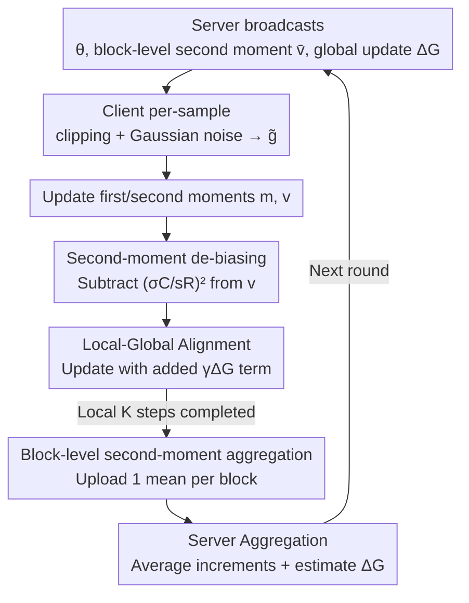

# DP-FedAdamW: An Efficient Optimizer for Differentially Private Federated Large Models

**Conference**: CVPR 2026  
**Paper**: [CVF Open Access](https://openaccess.thecvf.com/content/CVPR2026/html/Liu_DP-FedAdamW_An_Efficient_Optimizer_for_Differentially_Private_Federated_Large_Models_CVPR_2026_paper.html)  
**Code**: https://github.com/junkangLiu0/DP-FedAdamW  
**Area**: Optimizer / Federated Learning / Differential Privacy  
**Keywords**: Differentially Private Federated Learning, AdamW, second-moment bias correction, client drift, large model fine-tuning  

## TL;DR
This paper discovers that directly porting AdamW to Differentially Private Federated Learning (DPFL) fails, identifying three pathologies: "amplified second-moment variance, DP-induced second-moment bias, and intensified client drift." It proposes DP-FedAdamW, the first AdamW optimizer tailored for DPFL. By employing block-wise second-moment aggregation, explicit DP noise bias subtraction, and local update alignment with the global direction, it achieves a 5.83% improvement over SOTA on Tiny-ImageNet (Swin-Base, ε=1).

## Background & Motivation
**Background**: Federated Learning (FL) enables multiple clients to collaborate on training without sharing raw data. To provide formal privacy guarantees for parameter updates, Differentially Private Federated Learning (DPFL) applies clipping and Gaussian noise to local gradients (following the DP-SGD framework). However, the vast majority of DPFL algorithms are based on SGD (e.g., DP-FedAvg, DP-SCAFFOLD, DP-FedSAM).

**Limitations of Prior Work**: When models are replaced by large-scale architectures extremely sensitive to optimizers, such as Swin Transformer or RoBERTa, DP-SGD-style local updates (where clipping and noise severely distort gradients) amplify instability and slow down convergence. While naturally turning to AdamW, which is more powerful for large models, the authors' experiments found that directly applying AdamW in DPFL (denoted as DP-LocalAdamW) often yields results comparable to or even worse than SGD—for instance, performing worse than DP-FedAvg-LS on Swin-Tiny/CIFAR-100/α=0.1. AdamW suffers "maladaptation" in DPFL.

**Key Challenge**: The advantage of AdamW relies on its adaptive moment estimation (first moment $m$, second moment $v$) for coordinate-wise step size scaling. In DPFL, the joint effect of non-IID data and DP noise "pollutes" these moment statistics. The authors decompose the causes into three factors: (i) Non-IID data causes client gradients to diverge, and DP noise increases variance; their superposition amplifies the variance of second-moment estimates, making adaptive scaling unstable. (ii) Gradient clipping and noise introduce a systematic "additive bias" to the second moment, which originates differently from Adam's own initialization bias and cannot be removed by standard bias-correction (dividing by $1-\beta_2^k$). (iii) DP clipping and noise effectively reduce the effective sample size and amplify local overfitting, exacerbating existing client drift.

**Goal**: To restore the inherent convergence and generalization advantages of AdamW under the dual constraints of "non-IID data + privacy noise."

**Core Idea**: Instead of altering the external structure of AdamW, this work "repairs distorted moment statistics" along three complementary axes: aggregating second moments by parameter blocks to suppress variance, explicitly subtracting DP noise bias from the second moment, and adding an alignment term to local updates pointing toward the global descent direction.

## Method

### Overall Architecture
The framework of DP-FedAdamW follows the standard FL cycle of "broadcast-local steps-upload-aggregation," but incorporates DP-specific modifications in both local AdamW updates and server aggregation. In each communication round $t$: The server broadcasts the global model $\theta^t$, the block-level second moments $\bar v^t$ aggregated from the previous round, and the global update estimate $\Delta_G^t$ to $S$ selected clients. Clients initialize local second moments with $\bar v^t$ and perform $K$ local AdamW steps (applying per-sample clipping and noise per step to satisfy DP, while utilizing the de-biasing term and global alignment term in the update rule). After local training, clients upload only the model increment $\theta_i^{t,K}-\theta_i^{t,0}$ and the **block-averaged** second moments $\bar v_i$. The server averages the increments to update the global model, averages block-level second moments to obtain $\bar v^{t+1}$, and estimates the global update direction $\Delta_G^{t+1}$ based on the increments.

The three modifications correspond to the three identified pathologies: block-wise aggregation (addressing variance amplification), second-moment de-biasing (addressing DP bias), and local-global alignment (addressing client drift).

### Key Designs

**1. Block-wise Second-Moment Aggregation: Smoothing jittery preconditioners into block-shared step sizes**

Addressing Key Challenge (i)—the amplification of second-moment variance by non-IID data and DP noise. The paper establishes the mechanism of variance amplification: $v$ is an exponential moving average of squared noisy gradients $\tilde g\odot\tilde g$, where $\mathrm{Var}(v^t)\approx \frac{(1-\beta_2)^2}{1-\beta_2^2}\mathrm{Var}(\tilde g^t\odot\tilde g^t)$. Since $\tilde g\odot\tilde g$ amplifies squared noise and $\beta_2\approx 0.999$ slows down averaging, the variance of $v$ accumulates rapidly under DP and heterogeneity, dominating optimization noise.

The solution is to stop using coordinate-wise second moments and instead partition parameters into $B$ blocks based on network structure, sharing a single second-moment mean within each block: $\bar v_b=\frac{1}{|v_b|}\sum_{i\in v_b}v_i$. Partitioning aligns with model architecture—attention parameters are partitioned by head granularity (Q/K/V slices each count as a block), attn.proj and each MLP layer count as separate blocks, and Embedding/output layers form their own blocks. CNNs (ResNet) are partitioned by convolutional layers or residual blocks. Averaging within blocks smooths extreme coordinate-wise jitter caused by noise, providing stable adaptive scaling and reducing communication overhead from "parameter-sized vectors" to "$B$ block-level scalars," maintaining $1\times$ communication cost.

**2. Second-Moment De-biasing (BC): Explicitly removing the DP noise component from the denominator**

Addressing Key Challenge (ii)—DP noise injects an additive bias into the second moment that standard Adam bias-correction cannot eliminate. The paper derives a closed-form for this bias: since the variance of the injected Gaussian noise is $(\sigma C/sR)^2$, then $\mathbb{E}[\tilde g\odot\tilde g]=\mathbb{E}[\bar g\odot\bar g]+\sigma^2C^2/(sR)^2\,I$. Propagating this to the second moment yields $\mathbb{E}[v^{t,k}]=\mathbb{E}[v^{t,k}]_{\text{w/o DP}}+(1-\beta_2^k)\,\sigma^2C^2/(sR)^2\,I$. This is a constant "systematic bulge" that causes AdamW to suppress step sizes in all directions.

The correction is straightforward: when calculating the adaptive scaling $\vartheta$, the bias is subtracted from the denominator:

$$\vartheta_i^{t,k}=1\Big/\Big(\sqrt{\hat v_i^{t,k}-\big(\tfrac{\sigma C}{sR}\big)^2}+\tau\Big)$$

where $\hat v$ is the second moment after initialization bias correction and $\tau$ is the numerical stability term. This ensures adaptive step sizes are no longer systematically depressed by DP noise, restoring their proper scale.

**3. Local-Global Alignment: Pulling local AdamW toward the global descent direction**

Addressing Key Challenge (iii)—local adaptivity + DP noise drives clients toward disparate local optima, exacerbating drift. An alignment term is added to the local update rule:

$$\theta_i^{t,k+1}=\theta_i^{t,k}-\eta\big(\hat m_i^{t,k}\odot\vartheta_i^{t,k}-\lambda\theta_i^{t,k}+\gamma\Delta_G^t\big)$$

where $\Delta_G^t=\frac{-1}{SK\eta}\sum_{i=1}^S(\theta_i^{t,K}-\theta_i^{t,0})$ estimates the global update direction from the previous round's client increments, and $\gamma$ is the alignment strength. This term is "adaptive": it has minimal effect when a client's update aligns with the global trend but pulls the trajectory back when non-IID data or DP operations drive it astray, thereby tightening model dispersion and reducing inter-client variance during aggregation.

### Loss & Training
The optimization objective is the standard FL population risk $f(\theta)=\frac1N\sum_i f_i(\theta)$; privacy is accounted for using Rényi DP (RDP) for tight composition and subsampling bounds. Theoretically, the authors prove two points: (1) A convergence rate of $O\!\big(\sqrt{L\Delta\sigma_l^2/(SKT\tau^2)}+L\Delta/T+\sigma^2G_g^2/(s^2R^2)\big)$, which is faster than DP-LocalAdamW (lacking the $\sigma_g^2$ term) and **does not require bounded heterogeneity assumptions**—a result of the $\Delta_G$ alignment. (2) Sample-level $(\varepsilon, \delta)$ privacy guarantees. Hyperparameters: Transformers use $T{=}100, K{=}20$, batch size 16; ResNet-18 uses $T{=}300, K{=}50$, batch size 50; $\beta_1{=}0.9, \beta_2{=}0.999, \gamma{=}0.5, \lambda{=}0.01$, and noise multiplier $\sigma{=}1$ with cosine decay.

## Key Experimental Results

### Main Results
Evaluation covers 7 datasets (Vision: CIFAR-10/100, Tiny-ImageNet; Language: SST-2/QQP/QNLI/MNLI) and three architectures (GNResNet-18, ViT/Swin, RoBERTa), using Dirichlet(α) for non-IID simulation.

| Setup | Metric | DP-FedAdamW | Strongest Baseline | Gain |
|------|------|------------|----------|------|
| Tiny-ImageNet, Swin-Base, ε=1, α=0.1 | Acc(%) | 34.23 | 28.40 (DP-LocalAdamW) | +5.83 |
| CIFAR-10, Swin-Base, ε=1, α=0.1 | Acc(%) | 77.50 | 71.57 (DP-FedAvg-LS) | +5.93 |
| CIFAR-100, ResNet-18, α=0.1 | Acc(%) | 33.55 | 28.70 (DP-LocalAdamW) | +4.85 |
| CIFAR-100, Swin-Base, α=0.1 | Acc(%) | 50.76 | 48.08 (DP-FedSAM) | +2.68 |
| MNLI, RoBERTa-Base, α=0.8 | Acc(%) | 78.68 | 75.20 (DP-LocalAdamW) | +3.48 |

DP-FedAdamW achieves the highest accuracy across all settings and heterogeneity levels; its relative advantage increases as privacy constraints tighten (smaller ε).

### Ablation Study
Component ablation (Swin-Base, α=0.1, adding components to DP-LocalAdamW; Agg=Block Aggregation, BC=De-biasing, Align=Alignment):

| Configuration | CIFAR-100 | Tiny-ImageNet | Note |
|------|-----------|---------------|------|
| DP-LocalAdamW | 65.28 | 46.52 | Naive AdamW Baseline |
| w/o Agg | 66.41 | 47.35 | Removing Block Agg |
| w/o BC | 67.02 | 48.11 | Removing De-biasing |
| w/o Align | 66.37 | 47.82 | Removing Alignment |
| DP-FedAdamW (full) | 67.42 | 50.73 | All components enabled |

Aggregation strategy ablation shows that coordinate-wise aggregation (Agg-v) requires 11.4M communication, while block-mean aggregation (Agg-mean-v) uses only 5.7M to achieve nearly identical accuracy.

### Key Findings
- All three components contribute to performance, with their combination being optimal. On Tiny-ImageNet, the absence of Alignment causes the largest drop, confirming client drift is a bottleneck for large-model DPFL.
- Block-level mean aggregation achieves the benefits of coordinate-wise aggregation without increasing communication overhead.
- Directly applying DP to existing federated adaptive optimizers (DP-FedOpt, DP-FAFED, DP-FedLADA) yields limited gains, with DP-FedAdamW maintaining a lead of ~2.91% on Tiny-ImageNet.
- While DP-FedSAM is strong under equal noise levels, it consumes ~2× the privacy budget; under strict ε=1 constraints, it lags significantly.

## Highlights & Insights
- **Quantification of AdamW failures in DPFL**: The paper identifies three specific pathologies with mechanistic formulas rather than general observations—an exemplary "diagnose-then-prescribe" research structure.
- **Closed-form DP bias removal**: Since the variance of the injected Gaussian noise is deterministic, its contamination of the second moment is a calculable constant that can be subtracted at zero cost to restore adaptive scaling.
- **Two-birds-one-stone aggregation**: Block-level second-moment aggregation resolves both variance jitter and communication doubling.
- **Robust Convergence Proofs**: Eliminating the bounded heterogeneity assumption by utilizing $\Delta_G$ makes the theoretical results more broadly applicable than prior works.

## Limitations & Future Work
- The components depend on known quantities (noise multiplier σ, clipping norm C, batch size); if these are misestimated, the de-biasing term may introduce new errors.
- Block partitioning (by head or layer) is manually aligned with architecture; a universal rule for non-Transformer/CNN structures is not provided.
- The alignment coefficient γ is fixed at 0.5; adaptive adjustment based on rounds or heterogeneity remains an open question.
- Evaluation is focused on classification tasks; performance on generative LLM fine-tuning is not yet covered.

## Related Work & Insights
- **vs DP-SGD lineage**: These methods converge slowly on Transformers; DP-FedAdamW introduces adaptive optimization to DPFL and fixes its moment statistics.
- **vs DP-FedSAM**: SAM improves robustness but doubles the privacy budget; DP-FedAdamW maintains a 1× budget and performs better under strict privacy.
- **vs DP-LocalAdamW**: This is the "patient" architecture; the proposed three components specifically address its diagnosed pathologies.
- **vs DP-FedOpt/FedLADA**: These were not originally designed for DP noise; DP-FedAdamW is the first optimizer tailored for DPFL through explicit de-biasing.

## Rating
- Novelty: ⭐⭐⭐⭐⭐ First AdamW optimizer for DPFL with precise diagnosis and elegant bias removal.
- Experimental Thoroughness: ⭐⭐⭐⭐⭐ Comprehensive evaluation across 7 datasets and multiple architectures.
- Writing Quality: ⭐⭐⭐⭐ Clear structure; some notation density in theorems.
- Value: ⭐⭐⭐⭐⭐ Addresses a practical pain point for private large-model fine-tuning with ready-to-use code.

<!-- RELATED:START -->

## Related Papers

- [\[AAAI 2026\] Improved Differentially Private Algorithms for Rank Aggregation](../../AAAI2026/others/improved_differentially_private_algorithms_for_rank_aggregation.md)
- [\[CVPR 2026\] MSPT: Efficient Large-Scale Physical Modeling via Parallelized Multi-Scale Attention](mspt_efficient_large-scale_physical_modeling_via_parallelized_multi-scale_attent.md)
- [\[CVPR 2026\] FedSDR: Federated Graph Learning with Structural Noise Detection and Reconstruction](fedsdr_federated_graph_learning_with_structural_noise_detection_and_reconstructi.md)
- [\[CVPR 2026\] FedSST: Rethinking Fair Federated Graph Learning under Structural Shift](fedsst_rethinking_fair_federated_graph_learning_under_structural_shift.md)
- [\[CVPR 2026\] Bi-directional Autoregressive Diffusion for Large Complex Motion Interpolation](bi-directional_autoregressive_diffusion_for_large_complex_motion_interpolation.md)

<!-- RELATED:END -->
