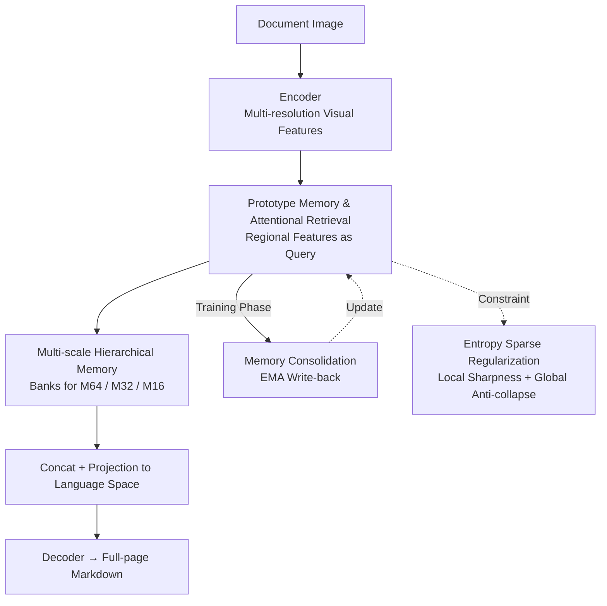

# DREAM: Document Recognition with Explicit Adaptive Memory

**Conference**: CVPR 2026  
**Paper**: [CVF Open Access](https://openaccess.thecvf.com/content/CVPR2026/html/Zhao_DREAM_Document_Recognition_with_Explicit_Adaptive_Memory_CVPR_2026_paper.html)  
**Code**: https://github.com/TianqiZhao-THU/DREAM  
**Area**: Document Recognition (OCR) / Multimodal VLM  
**Keywords**: Prototype Memory, Document Recognition, Cross-Attention, EMA Consolidation, Plug-and-Play

## TL;DR
DREAM equips document recognition models with an "explicit prototype memory"—compressing recurring layout structures and writing styles (margins, skewed text, table lines, etc.) from the training corpus into a set of retrievable prototype vectors. Regional features sparsely "read" these prototypes using cross-attention, which are then "written" back via EMA during training. Serving as non-parametric structural knowledge, these are integrated with visual features for the decoder, allowing a 0.6B parameter model to outperform Large Language Models (LLMs) dozens of times its size on datasets like Fox, DreamDoc, and SCUT-HCCDoc.

## Background & Motivation
**Background**: Current mainstream document parsing and recognition rely on Large Multimodal Models (LMMs, e.g., GOT, Monkey, InternVL, DeepSeek-VL). These models unify text, layout, and visual signals into end-to-end models that directly output Markdown.

**Limitations of Prior Work**: These models are entirely black-box parametric models—all knowledge is implicitly stored within network weights. This leads to three specific issues: first, **lack of interpretability**, as it is impossible to discern which spatial or stylistic factors contribute to the recognition result; second, **representation capability is tied to parameter count**, meaning improvements require scaling even with sufficient data; third, **expensive expansion and updates**, as fine-tuning is required for new styles or domains without a non-parametric memory mechanism.

**Key Challenge**: Visual representations of document regions are naturally "contaminated" by two types of information: the semantics of the text itself and the co-occurring layout structures (headers/footers, multi-column, tables, mixed graphics) and visual styles (tilt, blur, font size variations, edge transitions). Purely parametric models lack an explicit mechanism to disentangle these additive factors, leading to instability when encountering complex or unseen layouts.

**Key Insight**: The authors observe that documents differ from natural images in that they are governed by **finite, recurring structural patterns**. This inherent regularity makes them suitable for prototype clustering. Since layouts and styles follow "limited patterns," a set of prototypes can be learned to store them explicitly.

**Core Idea**: Complement the recognition model with "explicit, adaptive, multi-scale prototype memory" as corpus-level non-parametric structural knowledge. Mathematically, it is proven that the posterior responsibility of a Gaussian Mixture Model (GMM) can be precisely represented by cross-attention, enabling "memory retrieval" as a learnable attention-based read/write mechanism.

## Method

### Overall Architecture
DREAM is a **plug-and-play module** inserted between the encoder and decoder of any document recognition architecture. The encoder produces multi-resolution visual tokens, each corresponding to an independent prototype memory bank. Regional features serve as queries to "read" prototypes via attention. The retrieved structural factors are concatenated with the original visual features and projected into the language embedding space for the decoder. During training, the same attention weights "write" features back to the prototypes (EMA), allowing them to aggregate high-frequency patterns. This read/write process is constrained by entropy sparsity regularization.

### Key Designs

**1. Prototype Memory = GMM Centers, Retrieval = Cross-Attention (Theoretical Equivalence)**

To address the entanglement of visual representation and structural factors, DREAM models local features $\mathbf{x}$ as a weighted mixture of Gaussian components (GMM): $p(\mathbf{x})=\sum_{m=1}^{M}\pi_m\,\mathcal{N}(\mathbf{x}\mid\boldsymbol{\mu}_m,\boldsymbol{\Sigma}_m)$, where each prototype is the mean $\boldsymbol{\mu}_m$ of a sub-distribution. Retrieval weight is defined as the "responsibility," i.e., posterior probability $r_m(\mathbf{x})=p(z{=}m\mid\mathbf{x})$. By approximating the covariance as isotropic $\sigma^2\mathbf{I}$, the log scoring function simplifies to $s_m(\mathbf{x})=\frac{1}{\sigma^2}\boldsymbol{\mu}_m^\top\mathbf{x}-\frac{1}{2\sigma^2}\lVert\boldsymbol{\mu}_m\rVert^2+\log\pi_m+C$, resulting in $r_m(\mathbf{x})=\mathrm{softmax}_m(s(\mathbf{x}))$.

Critically, for cross-attention with bias $\mathrm{CA}(\mathbf{q},\mathbf{k},\mathbf{v})=\mathrm{softmax}\!\left(\frac{\mathbf{q}W_qW_k^\top\mathbf{k}^\top}{\sqrt{D}}+B\right)(\mathbf{v}W_v)$: if we let regional features be the query ($\mathbf{q}=\mathbf{x}$) and prototype means be both key and value ($\mathbf{k}_m=\mathbf{v}_m=\boldsymbol{\mu}_m$), the attention weight $\alpha_m(\mathbf{x})$ is isomorphic to the GMM responsibility. This provides a probabilistic foundation for using attention to retrieve memory. The read memory $\mathrm{M}(\mathbf{x})$ is a linear combination of prototypes: $\tilde{\mathbf{x}}=\mathrm{Proj}\,[\mathbf{x}\oplus\mathrm{M}(\mathbf{x})]$.

**2. Memory Consolidation: Routing + EMA Smooth Writing**

Prototypes must aggregate high-frequency patterns during training. The writing process requires **differentiable addressing** (tokens select targets based on responsibility) and **smooth updates** (to avoid catastrophic forgetting). The system reuses the retrieval attention weights $\alpha_m(\mathbf{x})$ for routing: for a batch of features $\{\mathbf{x}_{b,n}\}$, the update increment is $\Delta\boldsymbol{\mu}_m=\sum_{b}\sum_{n}\alpha_m(\mathbf{x}_{b,n})\,\mathbf{x}_{b,n}$. The update uses an exponential moving average (EMA):

$$\boldsymbol{\mu}_m^{(t+1)}=(1-\eta_t)\,\boldsymbol{\mu}_m^{(t)}+\eta_t\,\Delta\boldsymbol{\mu}_m,\quad \eta_t=\eta_0\,e^{-\kappa t}$$

**3. Multi-scale Hierarchical Memory**

Documents have hierarchical structures. DREAM builds independent prototype banks at three spatial resolutions—$M^{(64)}$ (64×64 pixel patches) for global layout, $M^{(32)}$ for mid-level patterns, and $M^{(16)}$ for fine-grained style. For handwriting recognition with extreme aspect ratios, a **cross-memory self-attention** mechanism is used to model global style across the entire line.

**4. Entropy Sparse Regularization: Local Sharpness + Global Anti-collapse**

To ensure the 2048 prototype slots learn distinct centers, sparsity is encouraged. **Local entropy loss** sharpens individual token attention: $\mathcal{L}_{\text{local\_entropy}}=\mathbb{E}_{b,n}\!\left[-\sum_{m}\alpha_{b,n,m}\log\alpha_{b,n,m}\right]$. To prevent tokens from collapsing onto a few prototypes, **global negative entropy loss** maximizes the entropy of the average attention $\mathbb{E}_{b,n}[\alpha_{b,n,m}]$ to ensure balanced utilization: $\mathcal{L}_{\text{global\_neg\_entropy}}=-\sum_{m}\mathbb{E}_{b,n}[\alpha_{b,n,m}]\log\mathbb{E}_{b,n}[\alpha_{b,n,m}]$.

### Loss & Training
The total objective combines recognition cross-entropy and multi-scale sparse regularization: $\mathcal{L}=\mathcal{L}_{\text{CE}}+\lambda\sum_s\mathcal{L}^{(s)}_{\text{sparse}}$, with $\lambda=0.1$. Prototype count $M=2048$, $\eta_0=1\times10^{-5}$. The model uses **partial freezing**—the visual encoder is frozen, training only the projection layers, memory modules, and the decoder.

## Key Experimental Results

### Main Results
On the Fox dataset (212 complex pages), DREAM (0.6B) outperforms 7B~100B+ models:

| Dataset/Lang | Method | Params | Edit Dist↓ | F1↑ | BLEU↑ |
|--------------|--------|--------|-----------|-----|-------|
| Fox-EN       | Vary | 7B | 0.092 | 0.918 | 0.885 |
| Fox-EN       | Qwen-VL-Plus | >100B | 0.096 | 0.931 | 0.893 |
| Fox-EN       | **DREAM** | 0.6B | **0.082** | **0.939** | **0.909** |

### Ablation Study
Breakdown on Fox (EN Edit Distance):

| Configuration | EN Edit↓ | EN F1↑ | Note |
|---------------|---------|--------|------|
| Baseline | 0.107 | 0.925 | No Memory |
| Single-scale Memory + $\mathcal{L}_{\text{sparse}}$ | 0.097 | 0.941 | No multi-scale |
| Multi-scale Memory (No Reg) | 0.096 | 0.919 | No sparse constraint |
| **Multi-scale + $\mathcal{L}_{\text{sparse}}$ (Full)** | **0.082** | **0.939** | Full Model |

### Key Findings
- **Global Anti-collapse is Critical**: Removing $\mathcal{L}_{\text{global\_neg\_entropy}}$ causes attention collapse, significantly degrading performance compared to the full model.
- **Multi-scale > Single-scale**: Hierarchical libraries correspond to the inherent document hierarchy, providing consistent gains across languages.
- **Interpretability**: Visualization shows that patches along table borders share dominant prototypes, while white spaces activate others, proving prototypes learn distinct structural patterns.

## Highlights & Insights
- The **theoretical equivalence between GMM responsibility and attention** provides a formal probabilistic basis for memory retrieval rather than empirical design.
- **Shared attention for read/write** is an elegant, self-consistent design that avoids extra write heads while satisfying differentiable addressing.
- **Corpus-level memory** differs from instance-level context by distilling high-frequency patterns across the entire training set into reusable non-parametric knowledge.
- The 0.6B model beating 100B+ models demonstrates the leverage of non-parametric memory, allowing representation capability to scale without massive parameters.

## Limitations & Future Work
- **Slow EMA updates**: Momentum-based writing has limited speed in adapting to new data distributions, creating friction with the goal of "flexible expansion."
- **Black-box integration**: While retrieval helps, the exact mechanism the decoder uses to integrate these representations remains opaque.
- **Incremental gains elsewhere**: The gain on DreamDoc was smaller than on Fox, suggesting performance depends on the overlap between the prototype library and test distribution.

## Related Work & Insights
- **vs LMMs (GOT, InternVL)**: While LMMs store knowledge implicitly, DREAM uses explicit non-parametric memory that is retrievable and interpretable.
- **vs Neural Turing Machines (NTM)**: DREAM specializes memory for documents using GMM prototypes, making it more prior-driven for structural patterns.
- **vs Video Memory Networks**: DREAM extends memory from "within-sample context" to "dataset-level prototype abstraction."

## Rating
- Novelty: ⭐⭐⭐⭐ (Solid theoretical foundation)
- Experimental Thoroughness: ⭐⭐⭐⭐ (Diverse tasks, though some incremental gains are small)
- Writing Quality: ⭐⭐⭐⭐ (Clear motivation and derivation)
- Value: ⭐⭐⭐⭐ (Effective plug-and-play solution)

<!-- RELATED:START -->

## Related Papers

- [\[CVPR 2026\] Smart Replay: Adaptive Scheduling of Memory Rehearsal for Computational Resource-Aware Incremental Learning](smart_replay_adaptive_scheduling_of_memory_rehearsal_for_computational_resource-.md)
- [\[CVPR 2026\] Adaptive Data Augmentation with Multi-armed Bandit: Sample-Efficient Embedding Calibration for Implicit Pattern Recognition](adaptive_data_augmentation_with_multi-armed_bandit_sample-efficient_embedding_ca.md)
- [\[AAAI 2026\] Axis-Aligned Document Dewarping](../../AAAI2026/others/axis-aligned_document_dewarping.md)
- [\[CVPR 2026\] Confusion-Aware Spectral Regularizer for Long-Tailed Recognition](confusion-aware_spectral_regularizer_for_long-tailed_recognition.md)
- [\[CVPR 2026\] Coupling Liquid Time-Constant Encoders with Modern Hopfield Memory](coupling_liquid_time-constant_encoders_with_modern_hopfield_memory.md)

<!-- RELATED:END -->
