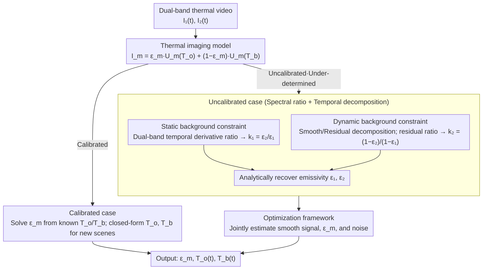

# Dual-Band Thermal Videography: Separating Time-Varying Reflection and Emission Near Ambient Conditions

**Conference**: CVPR 2026  
**arXiv**: [2509.11334](https://arxiv.org/abs/2509.11334)  
**Code**: [dual-band-thermal.github.io](https://dual-band-thermal.github.io)  
**Area**: Others (Computational Imaging)  
**Keywords**: Thermal imaging, Dual-band, Reflection-emission separation, Thermal radiation, Emissivity estimation

## TL;DR

A dual-band Long-Wave Infrared (LWIR) video analysis framework is proposed. By jointly utilizing spectral cues (constant dual-band emissivity ratio) and temporal cues (smooth object radiation vs. abrupt background radiation changes), the method achieves pixel-wise separation of reflection and emission components in dynamic scenes near ambient temperature for the first time, while recovering object emissivity and temperature fields.

## Background & Motivation

Long-Wave Infrared (LWIR, 8-14 µm) radiation captured by thermal cameras consists of two components:

**Emission component**: Thermal radiation determined by the object's own temperature and emissivity.

**Reflection component**: Reflection of background radiation from the surrounding environment.

Separating these two components is a long-standing challenge in thermal imaging, with the core difficulties being:

- **Under-constrained problem**: Even with multiband data, the problem remains ill-posed without prior knowledge of emissivity.
- **Near-ambient conditions**: When the object temperature is close to the ambient temperature, the emission and reflection signals are comparable in magnitude, making separation extremely difficult.
- **Strong existing assumptions**: Industrial scenarios assume background radiation is negligible (object is much hotter than environment); controlled environments assume spatio-temporally uniform backgrounds; or the gray-body assumption (emissivity is constant within the LWIR band) is used.

Two key insights from this paper break these limitations:

**Spectral cues**: While an object's emissivity may vary with wavelength in LWIR sub-bands (violating the gray-body assumption), the emissivity ratio $k_1 = \epsilon_2/\epsilon_1$ between two bands remains a fixed constant.

**Temporal cues**: Object temperature is governed by heat conduction and changes smoothly, whereas background reflections can change abruptly due to the movement of people or objects.

## Method

### Overall Architecture

This paper addresses a long-standing under-constrained problem in thermal imaging—LWIR radiation contains both the object's own emission and environmental reflections, which are comparable and difficult to separate near ambient temperature. Given two spectral band thermal videos $\{I_m^1, \ldots, I_m^N\}$ ($m \in \{1,2\}$), the goal is to output three quantities: per-band emissivity $\epsilon_m$, time-varying object temperature $T_o(t)$, and time-varying effective background temperature $T_b(t)$. The method solves this using two physical insights: a constant dual-band emissivity ratio (spectral cue) and smooth object radiation versus potentially abrupt background radiation (temporal cue). The pipeline first uses a **thermal imaging model** to express pixel radiation as a linear mixture of emission and reflection. It then bifurcates based on the availability of temperature priors: the **calibrated case** allows for a direct closed-form solution, while the **uncalibrated case** supplements constraints using the spectral ratio $k_1$ and temporal decomposition $k_2$ to analytically recover emissivity, followed by an **optimization framework** for stable joint estimation from noisy signals.

### Key Designs

**1. Thermal Imaging Model: Linear mixture of emission and reflection**

To separate the two components, an imaging equation must explicitly represent them. Each pixel's radiation is constrained by Kirchhoff's Law $\epsilon(\lambda) + \tau(\lambda) + r(\lambda) = 1$. After gain/offset correction, pixel intensity is expressed as $I_m(t) = \epsilon_m U_m(T_o(t)) + (1-\epsilon_m) U_m(T_b(t))$, where $U_m(T)$ is the Sakuma-Hattori model. Near ambient temperature, this can be linearly approximated as $U_m(T) = a_m T + b_m$. This formulation reduces the problem to a linear mixture, facilitating further constraints.

**2. Calibrated Case: Direct closed-form solution with known temperatures**

If temperatures can be pre-measured, the under-determined problem can be avoided. Using thermocouples for surface temperature and a blackbody at a known temperature as the background, emissivity is calculated analytically as $\epsilon_m = \frac{I_m - U_m(T_b)}{U_m(T_o) - U_m(T_b)}$. In new scenes, $T_o$ and $T_b$ are solved via a dual-band system of linear equations.

**3. Uncalibrated Case: Supplemental constraints via spectral ratio + temporal decomposition (Core Contribution)**

Without calibration, the system $\mathbf{I} = \mathbf{E}\mathbf{T}$ is nearly degenerate near ambient temperature (as Sakuma-Hattori functions are near-linear), requiring additional constraints. The paper provides two: **static background constraint**—at pixels with constant background radiation, the ratio of dual-band temporal derivatives yields the constant $k_1 = \epsilon_2/\epsilon_1$; and **dynamic background constraint**—signals are decomposed into a smooth component $\tilde{I}_m(t)$ (emission-dominated) and a residual (reflection), where the ratio of residuals yields the constant $k_2 = (1-\epsilon_2)/(1-\epsilon_1)$. With $k_1$ and $k_2$, emissivity is recovered as $\epsilon_1 = \frac{k_2-1}{k_2-k_1}$ and $\epsilon_2 = k_1 \cdot \frac{k_2-1}{k_2-k_1}$.

**4. Optimization Framework: Joint estimation of smooth signals, emissivity, and noise**

Real signals are noisy, requiring a stable implementation of the above constraints. The framework jointly optimizes four sets of variables: $\tilde{I}_1(t)$ (smooth signal), $\tilde{I}_2(0)$ (offset), $\epsilon_m$ (emissivity), and $I_m^\epsilon(t)$ (noise model). The $k_1$ constraint is used to recursively construct the smooth signal $\tilde{I}_2(t) = \tilde{I}_2(t-1) + k_1 \frac{a_2}{a_1}(\tilde{I}_1(t) - \tilde{I}_1(t-1))$, while $k_2$ is used for the reconstructed signal $\hat{I}_2(t) = \tilde{I}_1(t) + k_2 \frac{a_2}{a_1}(\ddot{I}_1(t) - \tilde{I}_1(t))$.

### Loss & Training

This is a non-learning method using traditional optimization (not a neural network):

$$\arg\min \; \gamma_1 \mathcal{L}_{smooth} + \gamma_2 \mathcal{L}_{Huber} + \gamma_3 \mathcal{L}_{MSE} + \gamma_4 \mathcal{L}_{noise}^{L2} + \gamma_5 \mathcal{L}_{noise}^{M}$$

- $\mathcal{L}_{smooth}$: Second-order smoothness prior $\|\tilde{I}_m(t-1) - 2\tilde{I}_m(t) + \tilde{I}_m(t+1)\|^2$.
- $\mathcal{L}_{Huber}$: Normalized Huber loss (robust to background transients).
- $\mathcal{L}_{MSE}$: Mean Squared Error between reconstruction and observation.
- $\mathcal{L}_{noise}$: Noise model regularization (L2 + zero-mean constraint).

**Hardware Setup**:
- Two FLIR Boson thermal cameras (≤40 mK / ≤20 mK NETD), 640×512 resolution.
- Spectral filters: 8.5/9.5/10.6/12.1 µm, mounted on FW103H/M motorized filter wheels.
- Ground truth: TC-08 data logger + Type-T thermocouples.

## Key Experimental Results

### Main Results

**Simulation (Temperature Recovery Error)**:

| Method | Description | Temperature Error |
|------|------|---------|
| BCP | Blackbody Channel Prior | Large (fails for cold objects) |
| Dual-wavelength pyrometry | Ignores background radiation | Degrades at high noise |
| Naive LS | Least squares (best of 5 random initializations) | Unstable |
| **Ours** | Dual-band + Temporal constraints | **Significantly outperforms all baselines at moderate noise** |

**Real Scene Temperature Estimation**:

| Scene | Ours (uncalib) | Ours (calib) | BCP | Naive | Description |
|------|-------------|------------|-----|-------|------|
| Wineglass | **1.72%** | 5.04% | 14.6% | 31.68% | Peak 63.6°C |
| Coffee Pot | 5.34% | **0.36%** | 6.62% | 45.5% | Peak 63.1°C |

**Emissivity Calibration Comparison**:

| Material | Reference | Reflector Plate Method | Ours |
|------|-------|---------|---------|
| Chrome Ball | 0.10 | 0.43 | **0.12** |
| Al. Cup | 0.05 | 0.16 | **0.10** |
| Blue Paint | 0.87 | 0.88 | **0.88** |
| Glass Jar | 0.95 | 0.93 | **0.93** |
| Wineglass | 0.95 | 0.97 | **0.96** |

Ours significantly outperforms the FLIR-recommended reflector plate method for low-emissivity materials.

### Ablation Study

| Loss Term | Increase in Temp Error when Removed | Description |
|-----------|-------------------------------------|-------------|
| Reconstruction $\mathcal{L}_{MSE}$ | 90.10% | Most critical |
| Smoothness $\mathcal{L}_{smooth}$ | 56.73% | Importance of temporal prior |
| Huber Loss | 11.31% | Robustness to transients |
| Noise Term | 11.64% | Useful at high noise levels |

### Key Findings

1. **Uncalibrated method achieves only 1.72% error in the wineglass scene**, nearing practical utility.
2. **Superior performance on low-emissivity materials** (e.g., chrome balls, aluminum cups) where existing methods fail severely.
3. **Spectral filter selection**: The 9.5 µm filter provides the highest condition number, making it most suitable for pairing with the full band.
4. **Separation of visually invisible thermal signals**: E.g., thermal dissipation of fingerprints on glass vs. finger reflections; coffee pot cooling vs. moving person reflections.

## Highlights & Insights

1. **Elegant physical modeling**: Does not rely on neural networks; instead, it utilizes thermal radiation physics to constrain an under-determined problem using dual-band and temporal priors.
2. **Dual-mode framework**: Offers high accuracy in calibrated mode and full automation in uncalibrated mode, covering diverse use cases.
3. **First-time separation in dynamic near-ambient scenes**: No previous method worked effectively when reflection and emission intensities were comparable.
4. **Reveals rich information in thermal imaging**: Uncovers scene data in dimensions completely imperceptible to the human eye or visible light cameras.
5. **Explicit noise modeling**: Compensates for the SNR reduction caused by spectral filtering, improving robustness through per-pixel/per-frame noise models.

## Limitations & Future Work

1. **Assumption of uncorrelated background/object temperature**: Fails if the entire room heats up uniformly.
2. **Sensitivity limits of low-cost microbolometers + filters**: Small temperature differences on low-emissivity objects are hard to detect.
3. **Hardware complexity**: Requires two cameras; does not use beam splitters (to avoid SNR loss), introducing parallax issues.
4. **Restricted to LWIR**: Extension to MWIR or multispectral bands could further improve accuracy.
5. **Not real-time**: Computational efficiency of the optimization framework was not addressed.

## Related Work & Insights

- **BCP (Blackbody Channel Prior)**: Recent CV reflection removal method, but assumes local brightest pixels are near-blackbody, failing on cold objects.
- **Dual-wavelength Pyrometry**: Traditional industrial method assuming gray-body and ignoring background.
- **Shape from Heat Conduction (ECCV 2024)**: Recovers shape from heat conduction; this work complements it by handling reflections.
- Insight: Reflection/emission separation in thermal imaging is analogous to diffuse/specular separation in visible light, but adds heat conduction—a cross-disciplinary junction of light and heat transport.

## Rating

- Novelty: ⭐⭐⭐⭐⭐ — The combination of dual-band and temporal constraints is a fresh approach that elegantly solves a legacy under-constrained problem.
- Experimental Thoroughness: ⭐⭐⭐⭐ — Comprehensive simulations, real experiments, and comparisons; however, the variety of real-world scenes is somewhat limited.
- Writing Quality: ⭐⭐⭐⭐⭐ — Rigorous physical derivation; logic flows seamlessly from imaging models to constraints and optimization.
- Value: ⭐⭐⭐⭐ — Opens a new analytical dimension for thermal imaging, informing fields like computational thermography, non-contact sensing, and thermal NLOS.

<!-- RELATED:START -->

## Related Papers

- [\[CVPR 2026\] Inter-Photon-Limited Videography](inter-photon-limited_videography.md)
- [\[ACL 2025\] Learning to Reason Over Time: Timeline Self-Reflection for Temporal Reasoning](../../ACL2025/others/tiser_timeline_self_reflection_temporal.md)
- [\[CVPR 2026\] Differentiable Stroke Planning with Dual Parameterization for Efficient and High-Fidelity Painting Creation](differentiable_stroke_planning_with_dual_parameterization_for_efficient_and_high.md)
- [\[CVPR 2026\] Neural Collapse in Test-Time Adaptation](neural_collapse_in_test-time_adaptation.md)
- [\[CVPR 2026\] Global Underwater Geolocation from Time-Lapse Polarization Imagery](global_underwater_geolocation_from_time-lapse_polarization_imagery.md)

<!-- RELATED:END -->
