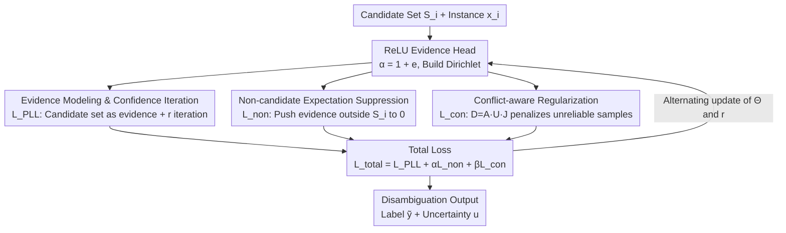

# Evidential Deep Partial Label Learning to Quantify Disambiguation Uncertainty

**Conference**: CVPR 2026  
**Paper**: [CVF Open Access](https://openaccess.thecvf.com/content/CVPR2026/html/Fan_Evidential_Deep_Partial_Label_Learning_to_Quantify_Disambiguation_Uncertainty_CVPR_2026_paper.html)  
**Code**: TBD  
**Area**: Weakly Supervised Learning  
**Keywords**: Partial Label Learning, Evidential Deep Learning, Disambiguation Uncertainty, Dirichlet Distribution, Conflict-aware Regularization  

## TL;DR
This work introduces Evidential Deep Learning (EDL) into Partial Label Learning (PLL) by using a Dirichlet distribution to model candidate label sets as "evidence" for disambiguation trustworthiness. Equipped with non-candidate label suppression and intra-class conflict-aware regularization, the proposed approach identifies ground-truth labels from ambiguous candidates while providing uncertainty estimates for each prediction. It serves as a plug-and-play loss function for various deep networks.

## Background & Motivation
**Background**: Partial Label Learning (PLL) is a form of weak supervision where each instance is assigned a candidate label set $S_i$ containing exactly one ground-truth label. The goal is to identify the ground-truth from the candidate set and train a classifier. Mainstream approaches are divided into Non-Deep Disambiguation Strategies (NDS, relying on KNN/low-rank/EM/SVM to refine label confidence) and Deep Disambiguation Strategies (DDS, utilizing regularization, data augmentation, and adaptive loss weighting).

**Limitations of Prior Work**: Both NDS and DDS typically use a softmax layer for final classification and minimize prediction loss for disambiguation. However, softmax scores are essentially **point estimates** of the predictive distribution, often leading to overconfident outputs even when predictions are incorrect. In PLL, where candidate sets are inherently noisy, model overconfidence in incorrect labels results in overfitting to noise and treating erroneous disambiguation as truth.

**Key Challenge**: Existing PLL methods can "predict a class" but **cannot evaluate the trustworthiness of the disambiguation**. In real-world applications (e.g., healthcare, decision-making), a confident but incorrect disambiguation can lead to severe consequences. The root cause is the lack of explicit modeling for predictive reliability.

**Key Insight**: Evidential Deep Learning (EDL) enables a model to output both class probabilities and uncertainty in a single forward pass by treating neural network outputs as the evidence vector of a Dirichlet distribution. This naturally provides a measure of "how sure the model is." However, EDL is designed for supervised learning. Applying it to PLL is challenging because **ground-truth is missing**, making it difficult to obtain a reasonable evidence vector.

**Core Idea**: The ambiguous candidate label set is **reinterpreted as "evidence regarding label hypotheses."** Belief and uncertainty mass are used to guide disambiguation, adapting EDL for PLL to provide both disambiguated labels and confidence scores (ED-PLL).

## Method

### Overall Architecture
ED-PLL maintains the network structure but replaces the softmax head with a ReLU activation (to ensure non-negativity). This output is treated as an evidence vector $\mathbf{e}=[e_1,\dots,e_Q]$, defining the Dirichlet concentration parameters as $\boldsymbol{\alpha}=\mathbf{1}+\mathbf{e}$. Based on Dempster-Shafer theory and Subjective Logic, the belief for each class is $b_c=e_c/K$ and the overall uncertainty is $u=Q/K$, where $K=\sum_c \alpha_c$ is the Dirichlet strength. The class probability is $p_c=\alpha_c/K$. This allows a single forward pass to yield both the "predicted class" and "uncertainty level."

The method combines three components into a total loss: ① Primary disambiguation using internal evidence of the candidate set and iterative label confidence updates ($\mathcal{L}_{PLL}$); ② Suppression of evidence for non-candidate labels using Dirichlet expectations ($\mathcal{L}_{non}$); ③ Intra-class conflict-aware regularization to penalize unreliable samples with "high conflict and low uncertainty" ($\mathcal{L}_{con}$). The total loss $\mathcal{L}_{total}$ is weighted, and the model parameters $\Theta$ and label confidence weights $\mathbf{r}$ are updated alternately. Final predictions are given by $\tilde{y}=\arg\max((1+\mathbf{e})/K)$ with uncertainty $u$.

### Key Designs

**1. Evidence Modeling + Iterative Label Confidence Update: Candidate Sets as Evidence**

To address overconfidence from softmax point estimation, ED-PLL interprets candidate label sets as "evidence supporting label hypotheses" and models opinions via Dirichlet distributions using a specialized PLL Bayesian risk loss:

$$\mathcal{L}_{PLL}(\Theta)=\sum_{j\in S_i} r_{ij}\,y_{ij}\big(\psi(K_i)-\psi(\alpha_{ij})\big)$$

where $\psi(\cdot)$ is the digamma function and $r_{ij}$ is the confidence weight of label $j$ being the ground-truth. Unlike standard EDL cross-entropy risk, the summation occurs only within the candidate set $S_i$ and uses dynamic weights $r$. Weights are updated iteratively:

$$\mathbf{r}_i^{t}=\begin{cases}\frac{1}{k+1}\big(\mathbf{y}_i+\sum_{j\in\mathcal{N}_i}\mathbf{y}_j\big) & t=0\\[4pt]\mathrm{softmax}(\mathbf{r}_i^{t-1}\boldsymbol{\alpha}_i/K+\mathbf{y}_i) & \text{otherwise}\end{cases}$$

At $t=0$, weights are initialized using $k$-nearest neighbors $\mathcal{N}_i$, following the manifold consistency hypothesis. Subsequently, the weights are updated by multiplying the previous weights with current Dirichlet probabilities and normalizing. Due to the "memory effect" of neural networks, evidence gradually concentrates on true labels.

**2. Non-candidate Label Expectation Suppression: Exploiting Complementary Information**

The authors leverage the information of "which labels are definitely not ground-truth" to refine disambiguation. Since EDL outputs Dirichlet distributions rather than probabilities, the expected loss of non-candidate labels is approximated via Taylor expansion:

$$\mathcal{L}_{non}(\Theta)=-\sum_{j\notin S_i}\mathbb{E}_{\boldsymbol{p}_j\sim\mathrm{Dir}(\boldsymbol{\alpha}_j)}\big[\log(1-\boldsymbol{p}_j)\big]\approx\sum_{j\notin S_i}\Big[\frac{\boldsymbol{\alpha}_j}{K}+\frac{1}{2}\cdot\frac{\boldsymbol{\alpha}_j(\boldsymbol{\alpha}_j+1)}{K(K+1)}\Big]$$

Minimizing this encourages the evidence $e_{ic} \to 0$ for all non-candidate labels $y_c \notin S_i$, effectively raising the relative probability of labels within the candidate set.

**3. Conflict-aware Regularization: Penalizing "High Conflict, Low Uncertainty" Samples**

Instances of the same true class should yield similar predictive distributions. High conflict combined with low uncertainty indicates unreliable disambiguation. The conflict degree $\mathbf{D}^c$ is defined as the element-wise product of three matrices:

- **Opinion Distance Matrix** $\mathbf{A}_{ij}^c=\sum_{k=1}^{Q}\frac{|p_{ik}-p_{jk}|}{2}$: Smaller values indicate more consistent distributions.
- **Uncertainty Matrix** $\mathbf{U}_{ij}^c=u_i\cdot u_j$: Larger values indicate conflicting predictions between pairs.
- **Jaccard Similarity Matrix** $\mathbf{J}_{ij}^c$: Measures candidate set overlap to assess if instances likely belong to the same class.

The consistency loss $\mathcal{L}_{con}(\Theta)$ averages these conflicts across all classes. Minimizing this forces consistency among intra-class samples and reduces the negative impact of unreliable high-conflict samples.

### Loss & Training
The total loss is a weighted sum:

$$\mathcal{L}_{total}(\Theta)=\mathcal{L}_{PLL}+\alpha\,\mathcal{L}_{non}+\beta\,\mathcal{L}_{con}$$

Default values are $\alpha=0.8$ and $\beta=0.5$. Training follows Algorithm 1: initialize $\mathbf{r}^0$, compute $\mathcal{L}_{total}$, update $\Theta$, and then update $\mathbf{r}^t$ per epoch. The framework is also interpreted from an EM perspective (Appendix A.3). Implementation uses SGD (momentum 0.9), batch size 64, learning rate 0.005, and MLP/ConvNet backbones for 200/500 epochs.

## Key Experimental Results

### Main Results
Accuracy comparison on real-world PLL datasets (candidate labels from real annotation ambiguities):

| Dataset | RC | CAVL | PiCO | DIRK | **ED-PLL** |
|--------|------|------|------|------|------------|
| Lost | 75.89% | 63.11% | 65.33% | 74.26% | **76.78%** |
| MSRCv2 | 58.28% | 52.84% | 49.14% | 44.61% | **59.85%** |
| BirdSong | 60.52% | 70.50% | 61.29% | 71.28% | **74.94%** |
| Soccer Player | 53.92% | 54.27% | 55.13% | 53.37% | **58.23%** |
| Yahoo!News | 63.11% | 63.86% | 68.71% | 61.38% | 62.34% |

ED-PLL significantly outperforms baselines in **94.2%** of experimental settings, achieving state-of-the-art results on Lost, MSRCv2, BirdSong, and Soccer Player.

On benchmark datasets (synthetic candidate sets, where $q$ is the probability of including a distractor), the gains from replacing losses in PiCO/DIRK are notable:

| Dataset | $q$ | PiCO | **PiCO-ED** | DIRK | **DIRK-ED** |
|--------|-----|------|------|------|------|
| CIFAR-10 | 0.3 | 92.29% | **92.90%** | 92.14% | **93.47%** |
| CIFAR-10 | 0.5 | 91.35% | **92.08%** | 91.34% | **92.64%** |
| K-MNIST | 0.1 | 97.68% | **98.35%** | 97.13% | **99.11%** |
| F-MNIST | 0.1 | 93.36% | **94.49%** | 93.71% | **95.58%** |

### Ablation Study
Ablation on MNIST ($q=0.3$) and MSRCv2:

| Config | LP/LL | Lnon | Lcon | MNIST | MSRCv2 | Note |
|------|------|------|------|--------|--------|------|
| ED-PLL-w/o-A | ✗ | ✗ | ✗ | 97.93% | 49.71% | Vanilla EDL loss |
| ED-PLL-w/o-NC | ✓ | ✗ | ✗ | 98.08% | 54.28% | With iterative disambiguation |
| ED-PLL-w/o-N | ✓ | ✗ | ✓ | 98.64% | 56.57% | Missing non-candidate suppression |
| ED-PLL-w/o-C | ✓ | ✓ | ✗ | 98.91% | 57.04% | Missing conflict regularization |
| **ED-PLL** | ✓ | ✓ | ✓ | **99.16%** | **59.85%** | Full model |

### Key Findings
- **Vanilla EDL fails when directly applied to PLL**: w/o-A shows poor performance on MSRCv2, highlighting the difficulty of extracting valid evidence from noisy candidates. Iterative disambiguation is the most significant contributor to performance.
- **Complementary contributions**: Both non-candidate suppression and conflict regularization independently improve performance, and their combination yields the best results.
- **Uncertainty identifies incorrect disambiguation**: Samples with low uncertainty $u$ exhibit significantly higher accuracy. The risk–coverage curve confirms that rejecting high-uncertainty predictions consistently reduces risk.
- **Better Calibration**: ED-PLL achieves the lowest Expected Calibration Error (ECE), indicating that predictive confidence aligns well with true accuracy.

## Highlights & Insights
- **Cognitive Shift**: Treating the candidate label set as "evidence" rather than just noisy labels is the key conceptual shift, allowing Dirichlet uncertainty mechanisms to be integrated into weak supervision.
- **Taylor Approximation for Dirichlet**: The use of Taylor expansion to handle non-candidate suppression in the absence of log-probabilities is an elegant solution for Dirichlet-based optimization.
- **Multi-signal Gating**: The conflict degree $\mathbf{A}\cdot\mathbf{U}\cdot\mathbf{J}$ combines distribution, uncertainty, and set similarity, providing a robust signal for identifying unreliable samples.
- **Engineering Friendliness**: As a plug-and-play loss that does not alter network architecture, it can easily enhance existing SOTA frameworks like PiCO and DIRK.

## Limitations & Future Work
- The method relies on $k$NN for initial confidence weights, which is sensitive to feature space quality in early training stages.
- The computational complexity of the conflict matrix $\mathbf{D}^c$ involves pairwise terms $N\cdot B\cdot Q$, which may become a bottleneck for very large datasets or large numbers of classes.
- The Taylor approximation for non-candidate suppression is limited to second-order; higher-order errors for large $\boldsymbol{\alpha}$ are not quantified.
- Validation on large-scale datasets (e.g., ImageNet-level) is still needed.

## Related Work & Insights
- **vs. Loss-based DDS (PRODEN, CAVL)**: Unlike these methods that output point estimates via softmax, ED-PLL provides Dirichlet-based uncertainty and explicit non-candidate suppression.
- **vs. Structural PLL (PiCO, DIRK)**: These rely on complex structures like contrastive learning. ED-PLL is a loss-level improvement that is orthogonal and can be combined with them.
- **vs. Supervised EDL**: While supervised EDL requires ground-truth for evidence, ED-PLL bridges the gap for weakly supervised scenarios using iterative weights and conflict-aware constraints.

## Rating
- Novelty: ⭐⭐⭐⭐
- Experimental Thoroughness: ⭐⭐⭐⭐
- Writing Quality: ⭐⭐⭐⭐
- Value: ⭐⭐⭐⭐

<!-- RELATED:START -->

## Related Papers

- [\[NeurIPS 2025\] Uncertainty Estimation by Flexible Evidential Deep Learning](../../NeurIPS2025/others/uncertainty_estimation_by_flexible_evidential_deep_learning.md)
- [\[CVPR 2026\] Mitigating Instance Entanglement in Instance-Dependent Partial Label Learning](mitigating_instance_entanglement_in_instance-dependent_partial_label_learning.md)
- [\[CVPR 2026\] Revisiting Sparsity Constraint Under High-Rank Property in Partial Multi-Label Learning](revisiting_sparsity_constraint_under_high-rank_property_in_partial_multi-label_l.md)
- [\[ICML 2026\] Possibilistic Predictive Uncertainty for Deep Learning](../../ICML2026/others/possibilistic_predictive_uncertainty_for_deep_learning.md)
- [\[CVPR 2026\] RaUF: Learning the Spatial Uncertainty Field of Radar](rauf_learning_the_spatial_uncertainty_field_of_radar.md)

<!-- RELATED:END -->
