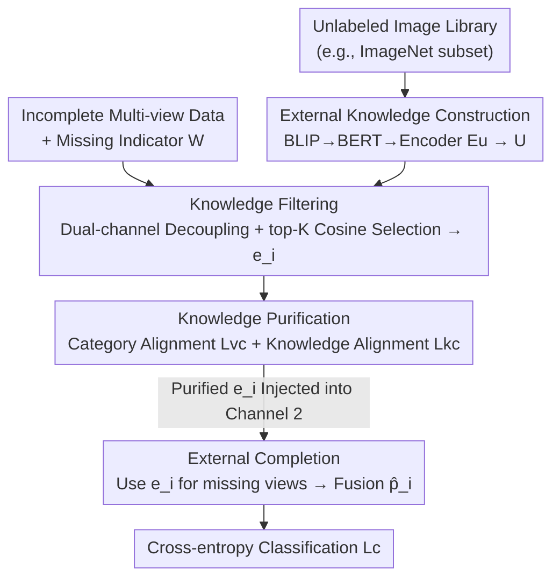

# EXOTIC: External Vision-driven Incomplete Multi-view Classification

**Conference**: CVPR 2026  
**Paper**: [CVF Open Access](https://openaccess.thecvf.com/content/CVPR2026/html/Xu_EXOTIC_External_Vision-driven_Incomplete_Multi-view_Classification_CVPR_2026_paper.html)  
**Code**: https://github.com/sstaree/EXOTIC  
**Area**: Multi-view Learning / Incomplete Multi-view Classification  
**Keywords**: Incomplete Multi-view Classification, External Visual Knowledge, Missing View Completion, Knowledge Purification, Dual-channel Decoupling

## TL;DR
EXOTIC introduces an "external visual knowledge base" to Incomplete Multi-view Classification (IMVC) for the first time. It utilizes pre-trained vision-language models to transform unlabeled image collections into semantic priors. After filtering and purification, these priors are used to complete missing views, breaking the performance ceiling inherent in "internal-only supervision" methods—showing particularly significant improvements at high missing rates (e.g., 80.0% vs. 72.1% second-best on LandUse21 at MR=0.1).

## Background & Motivation
**Background**: Multi-view data in the real world often suffers from partial missingness due to sensor failures or occlusions, making IMVC a critical research area. Prevailing approaches follow two paths: "imputation-based" (reconstructing missing features via latent graphs, prototypes, or autoencoders) and "imputation-free" (learning a shared subspace using only available views).

**Limitations of Prior Work**: Regardless of the approach, these methods **only mine semantics from within the incomplete data**. Available information is inherently limited; as the missing rate increases, internal supervision becomes sparser, leading to an intrinsic "performance ceiling." This paper observes that a vast amount of **external knowledge** useful for classification is being overlooked.

**Key Challenge**: Utilizing external knowledge is not straightforward. Existing works using external knowledge (e.g., SIC, TAC) rely on **structured text descriptions** like WordNet, which are often hard to obtain or lack coverage. Furthermore, external knowledge sources are heterogeneous and semantically biased. If external knowledge conflicts with sample labels or internal representations, it introduces "semantic noise," damaging label distributions and weakening discriminative power. The core difficulty lies in **constructing an accessible, high-quality external knowledge source and reconciling it with internal representations**.

**Key Insight**: Image resources are abundant, accessible on the internet, and semantically rich. The authors substitute "textual libraries" with a "visual library" as the external knowledge source. Since visual libraries are unlabeled and noisy, they must be filtered and purified before being used for imputation.

**Core Idea**: Utilize a pre-trained VLM to convert an unlabeled image library into semantic representations to serve as "external supervision." After **filtering (selecting relevant units)** and **purification (aligning to remove conflicts)**, this knowledge is used to **complete** missing views—marking the first time external visual knowledge serves as a supervisory signal for IMVC.

## Method

### Overall Architecture
Given a dataset $\{X^v\in\mathbb{R}^{N\times d_v}\}_{v=1}^V$ with $V$ views and a missing indicator matrix $W\in\{0,1\}^{N\times V}$ (where zero denotes missingness), the goal is to learn a robust classifier. EXOTIC consists of four components organized in a **dual-channel decoupled** structure: the first channel focuses on "filtering and purification of external knowledge," while the second channel focuses on "representation learning + view completion via purified knowledge + classification." This separation prevents mutual interference.

Data flow: Unlabeled image library → BLIP generates descriptions → BERT encoding → Knowledge encoder yields external representation $U$. Simultaneously, multi-view data enters the first channel for encoding into internal representation $z$. Cosine similarity is used to select top-$K$ external knowledge $e_i$ from $U$. Two alignment losses purify $e_i$ to be consistent with internal representations and labels. Finally, the second channel uses $e_i$ to fill missing views for cross-entropy classification.

### Key Designs

**1. External Visual Knowledge Construction: Translating Unlabeled Images to Semantic Priors**

Textual knowledge bases (like WordNet) are difficult to obtain and narrow in coverage, whereas images are ubiquitous. The authors select a diverse set of unlabeled images (e.g., a subset of ImageNet with 50,000 images across 1,000 categories) as general external knowledge. The key step is "vision-to-language" translation: BLIP generates textual descriptions for each image, which are then encoded by BERT into vectors $M$. This lifts raw pixels to the "semantic" level, making them suitable for alignment with multi-view tasks. A knowledge encoder $E_u:M\to U$ produces the final representation $U$. The process requires **no manual annotation** and is highly scalable.

**2. Knowledge Filtering + Dual-channel Decoupling: Task-Relevant Selection without Interference**

To prevent the noise and bias of the visual library from polluting the completion process, the filtering module adaptively selects semantically aligned external knowledge. Mechanism: the first-channel encoder $E_c^v$ generates representations for available views, which are weighted and averaged to form the internal fused representation $z_i=\sum_{v} c_i^{(v)}W_{i,v}/\sum_{v}W_{i,v}$. Cosine similarity $S(u_i,z_j)=\frac{u_i z_j^\top}{\|u_i\|\|z_j\|}$ is calculated between $z_i$ and each $u$, and the top-$K$ candidates are averaged to obtain sample-specific knowledge $e_i=\frac{1}{K}\sum_{k=1}^{K}u_{i,k}$.

The **dual-channel decoupling** is a critical design: Channel 1 $\{E_c^v:X^v\to C^v\}$ is dedicated to filtering/refining external knowledge, while Channel 2 $\{E_p^v:X^v\to P^v\}$ handles representation learning and classification. This prevents the two disparate objectives—filtering and classification—from competing for the same representation space, leading to more stable training and higher completion quality.

**3. Knowledge Purification: Reconciling External Knowledge via Dual Alignment Losses**

Selected knowledge $e_i$ may still contain task-irrelevant information. The purification module employs two losses. The **Category Alignment Loss** $L_{vc}$ is a supervised contrastive form:

$$L_{vc}=-\log\frac{\sum_{i}\sum_{j\neq i}\mathbb{I}[\gamma]\cdot\exp(S(z_i,z_j)/\tau)}{\sum_{i}\sum_{j\neq i}\exp(S(z_i,z_j)/\tau)}$$

where $\mathbb{I}[\gamma]$ is 1 if $z_i, z_j$ share the same label. This forces the filtered knowledge to remain task-relevant. The **Knowledge Alignment Loss** $L_{kc}$ maximizes consistency between external knowledge $e_i$ and view-specific representations $c_i^v$ with a power $q$ penalty:

$$L_{kc}=\sum_{v=1}^{V}\frac{1}{\log(q+1)}\left(1-\frac{\sum_i W_{i,v}\exp(S(e_i,c_i^v)/\tau)}{\sum_i\sum_j W_{i,v}\exp(S(e_i,c_j^v)/\tau)}\right)^{q}$$

This aligns external and internal information, preventing external semantics from biasing the model. Together, they ensure the external knowledge is safe for completion.

**4. External Completion: Imputing Missing View Positions**

Completion occurs in Channel 2. The encoder $E_p^v$ produces representations $p_i^v$. Purified knowledge $e_i$ is injected based on the missing indicator:

$$\hat{p}_i=\sum_{v=1}^{V}\big(W_{i,v}\cdot p_i^v+(1-W_{i,v})\cdot e_i\big)$$

If a view exists ($W_{i,v}=1$), the real representation $p_i^v$ is used; if missing ($W_{i,v}=0$), $e_i$ acts as a substitute. The fused $\hat{p}_i$ is passed to a softmax layer for classification via cross-entropy $L_c=-\frac{1}{N}\sum_i y_i\log p(\hat{p}_i)$. t-SNE visualizations confirm that external knowledge completion produces clearer inter-class boundaries compared to zero or mean imputation.

### Loss & Training
The total loss is a weighted sum: $L_{all}=L_c+\alpha\cdot L_{kc}+\beta\cdot L_{vc}$. View and knowledge encoders are fully connected networks with ReLU (structure: $d_{in}\text{-}1024\text{-}1024\text{-}1500\text{-}d_{out}$). Training uses SGD with a batch size of 128 for 100 epochs. Hyperparameters are empirically set to $\alpha=30, \beta=1, q=0.3$.

## Key Experimental Results

### Main Results
Evaluation on 7 datasets (Caltech101, Scene15, LandUse21, HW, Fashion, NUSWIDE, CUB) against 10 IMVC methods across missing rates MR $\in \{0.1, 0.3, 0.5, 0.7, 0.9\}$. Accuracy (%) are averaged over 5 runs.

| Missing Rate | Dataset | EXOTIC | Second Best | Gain |
|--------------|---------|--------|-------------|------|
| 0.1 | Caltech101 | 94.33 | 91.41 (LMVCAT) | +2.9 |
| 0.1 | LandUse21 | 80.00 | 72.14 (DCP) | +7.9 |
| 0.1 | NUSWIDE | 53.26 | 46.82 (DICNET) | +6.4 |
| 0.9 | Caltech101 | 88.16 | 81.88 (LMVCAT) | +6.3 |
| 0.9 | LandUse21 | 55.24 | 44.29 (DIMC) | +10.9 |
| 0.9 | HW | 94.05 | 92.20 (DICNET) | +1.9 |

Key Conclusions: (1) EXOTIC leads even at low missing rates (MR=0.1); (2) It ranks first on all datasets for high missing rates (MR≥0.3); (3) Performance degradation is minimal as missing rates increase, demonstrating strong robustness.

### Ablation Study
Conducted at 0.9 missing rate (EXOTIC-1: w/o $L_{kc}$; EXOTIC-2: w/o $L_{vc}$; EXOTIC-3: w/o both losses; EXOTIC-4: w/o external completion).

| Configuration | Caltech101 | LandUse21 | HW | Description |
|---------------|------------|-----------|----|-------------|
| EXOTIC (Full) | 88.16 | 55.24 | 94.20 | Full model |
| EXOTIC-1 | 85.47 | 54.14 | 93.95 | w/o knowledge alignment |
| EXOTIC-2 | 84.31 | 51.05 | 92.80 | w/o category alignment |
| EXOTIC-3 | 86.13 | 53.38 | 93.10 | w/o both alignment losses |
| EXOTIC-4 | 85.38 | 54.43 | 93.30 | w/o external completion |

### Key Findings
- **Impact of $L_{vc}$**: Category alignment loss is most critical; removing it significantly drops performance (e.g., LandUse21 55.24 → 51.05).
- **Scale and Source**: Performance improves with larger knowledge base sizes (ImageNet 100→500→50k on Caltech101: 75.98→87.41→88.16). Cross-domain sources (e.g., iCartoonFace) also produce competitive results.
- **Hyperparameter Sensitivity**: Increasing $\alpha, \beta$ initially improves quality but excessive values introduce redundant task-irrelevant information. $q$ should not be too large to avoid overly sharp penalties.

## Highlights & Insights
- **Visual vs. Textual Libraries**: Replacing WordNet with unlabeled images circumvents data acquisition bottlenecks. The "vision-to-language" translation lifts knowledge to a semantic level suitable for any task lacking supervision.
- **Dual-channel Decoupling**: Separating "knowledge selection" from "knowledge utilization" is a simple but effective architectural solution to prevent objective conflict.
- **Cross-domain Utility**: The fact that cartoon images can complete natural image data suggests that global semantic priors, rather than pixel-level matching, are the primary drivers of performance.

## Limitations & Future Work
- Construction of external knowledge relies on an offline BLIP+BERT pipeline, incurring preprocessing costs not explicitly reported.
- Ablation results on Scene15 showed anomalies where versions without alignment losses occasionally outperformed the full model, suggesting alignment is not monotonically beneficial for all distributions.
- Top-$K$ selection and library scale require dataset-specific tuning.
- The framework is currently validated only for classification; extension to multi-view clustering or retrieval is pending.

## Related Work & Insights
- **Comparison to Internal-only IMVC (DIMC, DICNET, etc.)**: These methods are limited by the structural information bound of the incomplete data. EXOTIC breaks this ceiling via external priors.
- **Comparison to External Textual Knowledge (SIC, TAC)**: These typically focus on unsupervised clustering and face difficulties in obtaining descriptions. EXOTIC uses accessible visual libraries and specific purification steps to handle semantic noise in supervised settings.

## Rating
- Novelty: ⭐⭐⭐⭐⭐ First to use external visual knowledge as a supervisory signal in IMVC.
- Experimental Thoroughness: ⭐⭐⭐⭐ Extensive datasets and comparisons, though some ablation anomalies are unexplained.
- Writing Quality: ⭐⭐⭐⭐ Clear multi-component structure and well-aligned diagrams.
- Value: ⭐⭐⭐⭐ The paradigm of using unlabeled images as external knowledge is highly transferable.

<!-- RELATED:START -->

## Related Papers

- [\[CVPR 2026\] Cross-View Distillation and Adaptive Masking for Incomplete Multi-View Multi-Label Classification](cross-view_distillation_and_adaptive_masking_for_incomplete_multi-view_multi-lab.md)
- [\[CVPR 2026\] Imbalanced View Contribution Evaluation and Refinement for Deep Incomplete Multi-View Clustering](imbalanced_view_contribution_evaluation_and_refinement_for_deep_incomplete_multi.md)
- [\[CVPR 2026\] DF²-VB: Dual-level Fuzzy Fusion with View-specific Boosting for Multi-view Multi-label Classification](df2-vb_dual-level_fuzzy_fusion_with_view-specific_boosting_for_multi-view_multi-.md)
- [\[CVPR 2026\] Plug-and-Play Incomplete Multi-View Clustering via Janus-Faced Affinity Learning with Topology Harmonization](plug-and-play_incomplete_multi-view_clustering_via_janus-faced_affinity_learning.md)
- [\[CVPR 2026\] Multi-Hierarchical Contrastive Spectral Fusion for Multi-View Clustering](multi-hierarchical_contrastive_spectral_fusion_for_multi-view_clustering.md)

<!-- RELATED:END -->
