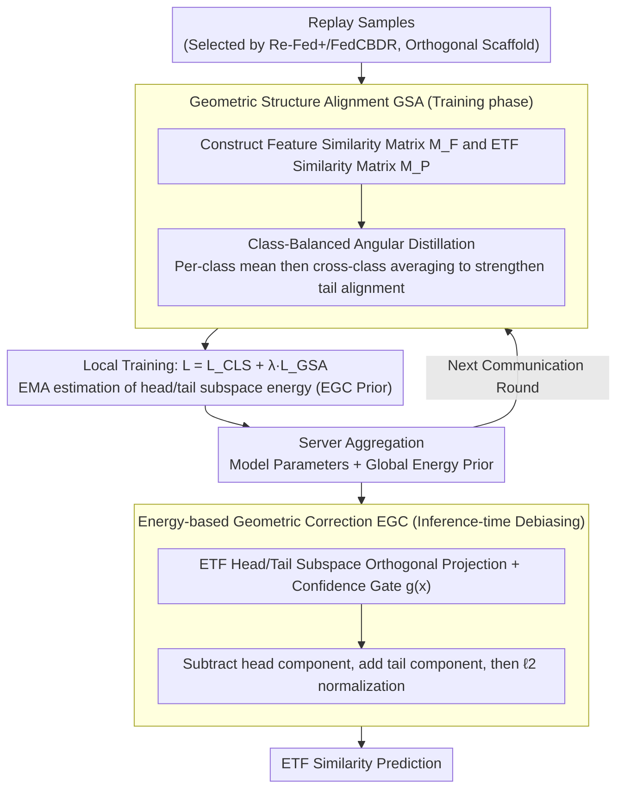

# FEAT: Federated Geometry-Aware Correction for Exemplar Replay under Continual Dynamic Heterogeneity

**Conference**: CVPR 2026  
**arXiv**: [2604.08617](https://arxiv.org/abs/2604.08617)  
**Code**: None  
**Area**: Others  
**Keywords**: federated continual learning, exemplar replay, equiangular tight frame, geometric correction, class imbalance

## TL;DR

The FEAT method is proposed to address the underutilization of replay samples in federated continual learning. It mitigates cross-client heterogeneity and task-level data imbalance through geometric structure alignment (angular distillation based on ETF prototypes) and energy-based geometric correction (inference-time debiasing).

## Background & Motivation

In Federated Continual Learning (FCL), exemplar replay is a mainstream strategy to mitigate catastrophic forgetting. Existing research primarily focuses on how to select representative samples (e.g., Re-Fed, FedCBDR) but neglects how to effectively utilize these limited samples. Replay introduces two persistent challenges: (1) replay data exacerbates cross-client heterogeneity; (2) severe distribution imbalance between historical tasks (tail classes) and the current task (head classes) causes tail-class features to drift toward head classes.

Although ETF classifiers encourage globally consistent class directions, the cross-client feature alignment for tail classes remains significantly weaker than that for head classes under continual dynamic heterogeneity.

## Method

### Overall Architecture

FEAT addresses a neglected problem in FCL: while research focuses on "how to select replay samples" (Re-Fed, FedCBDR), the question of "how to utilize limited replay samples effectively" remains under-explored. It proposes two modules orthogonal to sample selection strategies: **Geometric Structure Alignment (GSA)** during training and **Energy-based Geometric Correction (EGC)** during inference. These can be directly integrated into existing replay methods like Re-Fed+ and FedCBDR to alleviate cross-client heterogeneity amplified by replay and the feature drift of tail classes toward head classes caused by task imbalance. Both modules revolve around a set of **globally shared, fixed ETF (Equiangular Tight Frame) prototypes**: GSA aligns the angular structure of local features to ETF prototypes during training, while EGC subtracts head-class directional components using head/tail subspaces partitioned by ETF prototypes during inference.

### Key Designs

**1. Geometric Structure Alignment (GSA): Aligning Tail Classes with Class-Balanced Angular Distillation**

While ETF classifiers encourage globally consistent class directions, cross-client feature alignment for tail classes (historical tasks) remains weaker than for head classes (current tasks) under dynamic heterogeneity. GSA distills the "angular relationships between features" into the "angular relationships between ETF prototypes": within each mini-batch, a feature cosine similarity matrix $M_F$ and a corresponding ETF prototype similarity matrix $M_P$ are constructed (both $B\times B$ with identical row/column order). After row-wise softmax normalization into distributions $P_F$ and $P_P$, the KL divergence is calculated. The **class-balanced aggregation** is critical—averaging KL divergence within each class first, then across classes (rather than a simple global average). This prevents tail classes from being overwhelmed by head-class samples, ensuring sufficient geometric supervision. The total loss is $L = L_{CLS} + \lambda \cdot L_{GSA}$, where $L_{CLS}$ uses the similarity between features and ETF prototypes $z_i=\langle f, w_i\rangle$ as logits for cross-entropy.

**2. Energy-based Geometric Correction (EGC): Removing Head-biased Components during Inference**

Even with GSA, limited replay leaves a long-tail distribution, causing tail-class features to systematically drift toward head classes and making the model overconfident in head classes. EGC provides a zero-training-cost correction via a three-step process:

- **ETF Subspace Partitioning**: Treating current task classes as head classes and historical classes as tail classes, orthogonal projection operators $P_H$ and $P_T$ are constructed via the Moore–Penrose pseudoinverse of respective ETF prototypes. This allows arbitrary features to be projected into head/tail subspaces to measure energy.
- **Tail Prior Accumulation during Training**: For replayed tail-class samples, EMA is used to online estimate their rank-normalized energy in head/tail subspaces. Clients **upload only two scalar statistics** to the server, which are aggregated by sample count into global priors $\bar{e}_H^{G}$ and $\bar{e}_T^{G}$ (preserving communication efficiency and privacy).
- **Inference-time Debiasing**: For each feature, head/tail subspace energies $e_H$ and $e_T$ are calculated. A confidence gate $g(\tilde x)=\max\{(e_H-\bar{e}_H^{G})/(e_H+e_T+\varepsilon),\,0\}$ is computed based on the deviation from global tail priors. When a feature is significantly biased toward head classes ($g$ is large), the feature is corrected as $\tilde x' = \tilde x - g\,P_H\tilde x + g\,P_T\tilde x$ (subtracting the head component and reinforcing the tail component), followed by normalization and ETF similarity prediction.

This correction is triggered only during inference without increasing training overhead, effectively reducing overconfidence in majority classes and increasing sensitivity to minority classes.

### Loss & Training

A phased optimization strategy is employed: for the first task ($t=1$), only classification loss $L = L_{CLS}$ is used. For subsequent tasks ($t>1$), the GSA distillation loss is added: $L = L_{CLS} + \lambda \cdot L_{GSA}$, where $L_{CLS}$ utilizes the similarity between ETF prototypes and features as cross-entropy logits. After each communication round, the server aggregates model parameters and global energy statistics. EGC is applied only during inference, incurring no additional training cost.

## Key Experimental Results

### Main Results

| Dataset | Heterogeneity | FEAT | Prev. SOTA | Gain |
|--------|--------|------|---------|------|
| CIFAR-100 (α=0.1) | High | Best | Various | Consistent Top-1 improvement |
| Tiny-ImageNet | Medium | Best | Various | Consistent improvement |
| Mini-ImageNet | Low | Best | Various | Consistent improvement |

### Ablation Study

| Configuration | Top-1 Accuracy | Description |
|------|-----------|------|
| Baseline (No FEAT) | Lower | Severe tail-class drift |
| + GSA | Improved | Improved cross-client alignment |
| + EGC | Further Improved | Effective inference debiasing |
| + Combination | Best | Complementary effects |

### Key Findings

- GSA effectively improves cross-client feature consistency for tail classes.
- EGC’s inference-time debiasing significantly boosts tail-class accuracy without increasing training costs.
- FEAT is orthogonal to sample selection strategies, showing improvements when combined with both Re-Fed+ and FedCBDR.

## Highlights & Insights

- Fills a research gap by focusing on "how to use" replay samples rather than "how to select" them.
- GSA’s class-balanced KL distillation ensures tail classes receive fair alignment supervision.
- EGC serves as a zero-cost inference post-processing step with high practical utility.
- The orthogonal design allows the method to be widely applicable across different replay strategies.

## Limitations & Future Work

- The number of ETF prototypes grows with the number of classes, which may face challenges in high-dimensional spaces.
- EGC energy statistics rely on priors collected during training, which may become inaccurate under significant distribution shifts.

## Rating

- Novelty: ⭐⭐⭐⭐ — New perspective on replay utilization.
- Technical Depth: ⭐⭐⭐⭐ — Complete design involving ETF, angular distillation, and energy correction.
- Experimental Thoroughness: ⭐⭐⭐⭐ — Validated across three datasets and multiple heterogeneity levels.
- Value: ⭐⭐⭐⭐ — Plug-and-play with zero-cost inference debiasing.

<!-- RELATED:START -->

## Related Papers

- [\[CVPR 2026\] Exemplar-Free Continual Learning for State Space Models](exemplar-free_continual_learning_for_state_space_models.md)
- [\[CVPR 2026\] HAD: Heterogeneity-Aware Distillation for Lifelong Heterogeneous Learning](had_heterogeneity-aware_distillation_for_lifelong_heterogeneous_learning.md)
- [\[CVPR 2026\] Towards Stable Federated Continual Test-Time Adaptation in Wild World](towards_stable_federated_continual_test-time_adaptation_in_wild_world.md)
- [\[CVPR 2026\] AdaPrior: Bayesian-Inspired Adaptive Prior Correction for Long-Tailed Continual Learning](adaprior_bayesian-inspired_adaptive_prior_correction_for_long-tailed_continual_l.md)
- [\[CVPR 2026\] Smart Replay: Adaptive Scheduling of Memory Rehearsal for Computational Resource-Aware Incremental Learning](smart_replay_adaptive_scheduling_of_memory_rehearsal_for_computational_resource-.md)

<!-- RELATED:END -->
