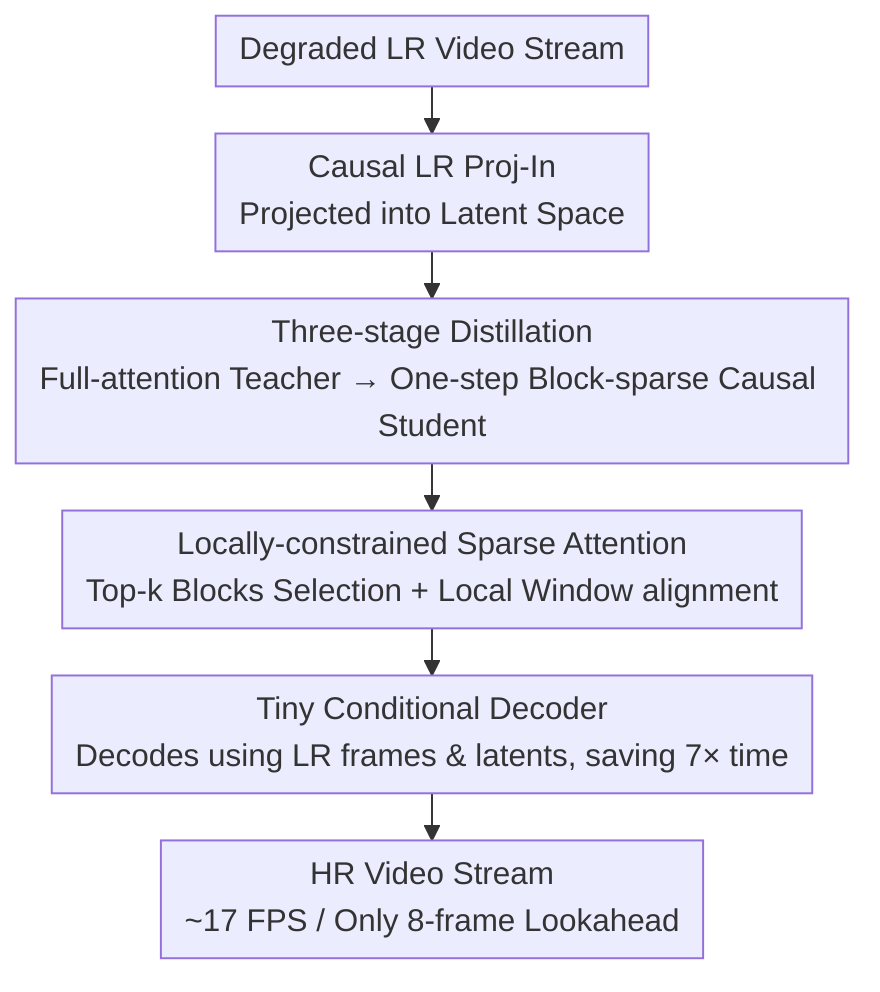

# FlashVSR: Towards Real-time Diffusion-Based Streaming Video Super Resolution

**Conference**: CVPR 2026  
**Paper**: [CVF Open Access](https://openaccess.thecvf.com/content/CVPR2026/html/Zhuang_FlashVSR_Towards_Real-time_Diffusion-Based_Streaming_Video_Super_Resolution_CVPR_2026_paper.html)  
**Code**: https://zhuang2002.github.io/FlashVSR/ (Project page, committed to open-sourcing code/models/datasets)  
**Area**: Video Super-Resolution / Image & Video Restoration  
**Keywords**: Video Super-Resolution, Diffusion Models, One-step Distillation, Sparse Attention, Streaming Inference

## TL;DR
FlashVSR is the first to establish a "one-step + streaming" framework for diffusion-based video super-resolution (VSR). It compresses a full-attention teacher into a single-step block-sparse causal student via a three-stage distillation pipeline, eliminates the training/inference resolution gap using locally-constrained sparse attention, and introduces a tiny conditional decoder that leverages low-resolution (LR) frames as conditions to bypass the 3D VAE decoding bottleneck (which usually consumes 70% of the runtime). This achieves a processing speed of approximately 17 FPS for $768\times1408$ videos on a single A100 GPU (11.8× faster than the fastest one-step diffusion VSR), while generating stable reconstructions at 1440p resolutions.

## Background & Motivation
**Background**: Video super-resolution aims to recover high-quality frames from degraded videos, which is highly demanded in mobile photography, live streaming, and AIGC content. Recently, video diffusion models (e.g., Upscale-A-Video, STAR, SeedVR, DOVE) have significantly elevated the visual quality of VSR by exploiting video diffusion priors and powerful 3D spatio-temporal attention to ensure temporal consistency.

**Limitations of Prior Work**: However, the four-fold objective of "high resolution + high visual quality + real-time + arbitrary length" remains far from being solved for diffusion-based VSR. The authors identify three major obstacles: (1) **High lookahead latency**: due to GPU memory limitations, long videos have to be split into overlapping segments and processed independently, which is highly redundant and introduces a lookahead latency equal to the segment length (around 80 frames); (2) **Prohibitively expensive dense 3D attention**: full spatio-temporal attention scales quadratically with spatial resolution, making it computationally unaffordable for high-resolution/long videos; (3) **Training-testing resolution gap**: attention models trained on medium resolutions experience severe degradation on high resolutions like 1440p, requiring spatial tiling during inference, which introduces further computational redundancy.

**Key Challenge**: The superb visual quality of diffusion VSR stems from "dense 3D attention + multi-step denoising + segment-wise processing," while efficiency, real-time performance, and scalability are severely bottlenecked by these exact designs—representing a sharp trade-off between output quality and practical deployability. More subtly, the authors find that the root cause of the resolution gap lies not in network capacity, but in the **periodicity of RoPE position embeddings**: when the inference spatial range far exceeds the trained range, certain RoPE dimensions begin to repeat their patterns, contaminating the self-attention and leading to repetitive textures and blurriness.

**Goal**: To simultaneously address these three obstacles: reducing multi-step to a single step, shifting from segment-wise to streaming processing, replacing dense attention with sparse attention, and generalizing to ultra-high resolutions without relying on spatial tiling.

**Key Insight**: The authors exploit a critical observation that distinguishes VSR from video generation: **VSR is strongly conditioned on the LR inputs**. While video generation requires clean historical frames to maintain plausible motion, the motion information in VSR is already inherently encoded in the LR inputs. Therefore, "clean historical latents" are not strictly necessary for VSR. This observation allows the framework to bypass the computationally expensive "frame-by-frame serial unrolling" of autoregressive generation, enabling fully parallel frame training.

**Core Idea**: A three-stage distillation pipeline ("full-attention teacher -> block-sparse causal student -> one-step student"), coupled with locally-constrained sparse attention to align training/inference positional ranges and a tiny conditional decoder that utilizes LR conditions, resulting in a streaming, near-real-time, and ultra-high-resolution-ready deployment-friendly system.

## Method

### Overall Architecture
FlashVSR is built upon the Wan 2.1-1.3B video diffusion model (fine-tuned using LoRA rank 384). The entire pipeline consists of three complementary innovations: a **three-stage distillation pipeline** to progressively compress the expensive teacher into a single-step streaming student; a **locally-constrained sparse attention** mechanism to reduce attention computation while aligning the training/inference position embedding ranges to eliminate the resolution gap; and a **tiny conditional decoder (TC Decoder)** replacing the 3D VAE decoder, which becomes the new bottleneck after adopting the single-step DiT. The training data comes from the custom-built VSR-120K dataset (comprising 120k video clips and 180k images).

During inference, the degraded LR video stream is projected into the latent space via a causal LR Proj-In layer. The single-step Sparse-Causal DiT processes the inputs using block-sparse causal attention and KV-cache to produce clean latents in a streaming fashion. Finally, the TC Decoder reconstructs the latents back to HR frames by combining the latent features with the corresponding LR frames, incurring an overall lookahead latency of only 8 frames.

### Key Designs

**1. Three-stage Distillation Pipeline: Progressively compressing the expensive teacher into a parallel-trainable single-step streaming student**

Directly training a single-step, sparse, causal, and streaming VSR model is highly unstable. Thus, the authors decompose the task into three progressive stages. **Stage 1 (Joint Video-Image SR Training)**: Adapt the pre-trained Wan2.1 video diffusion model into a super-resolution teacher. Images are treated as single-frame videos ($f=1$) and unified into the 3D attention mechanism. A block-diagonal segment mask restricts attention within individual segments, with attention weights computed as:

$$\alpha_{ij}=\frac{\exp\!\big(q_i k_j^\top/\sqrt{d}\big)\,\mathbb{1}[\mathrm{seg}(i)=\mathrm{seg}(j)]}{\sum_l \exp\!\big(q_i k_l^\top/\sqrt{d}\big)\,\mathbb{1}[\mathrm{seg}(i)=\mathrm{seg}(l)]}$$

**No block-sparse constraint is applied** in this stage to allow the teacher to fully retain its spatio-temporal priors. A lightweight LR Proj-In layer is introduced to directly project LR inputs into the latent space (bypassing the VAE encoder) under standard flow matching loss. **Stage 2 (Block-Sparse Causal Attention Adaptation)**: Adapt the full-attention DiT into a Sparse-Causal DiT by adding causal masks (each latent only attends to current and past frames) and upgrading the LR Proj-In layer to support streaming. The attention mechanism is replaced with a block-sparse design (see Design 2), and flow matching training continues block-sparsely utilizing only video data. **Stage 3 (Distribution Matching One-step Distillation)**: Extract the Stage 2 student into a single-step model $G_{one}$ using the Distribution Matching Distillation (DMD) framework, where the Stage 1 full-attention DiT acts as the real teacher $G_{real}$, and its copy $G_{fake}$ models the fake latent distribution. The student takes only LR frames + Gaussian noise as inputs under a unified timestep trained with block-sparse causal masks.

The key advantage of this design is **fully parallel training across frames**: unlike prior autoregressive video diffusion models that rely on student forcing (which requires sequential "predict previous frame -> serial unroll" training, resulting in low throughput and slow optimization), FlashVSR does not require clean historical latents (since motion is already in the LR frames). Consequently, all frames can be trained in parallel, while temporal consistency is refined locally by subsequent layers via KV-cache. This ensures highly efficient training and eliminates the training-inference discrepancy. The total loss combines distribution matching distillation, flow matching, and pixel reconstruction ($\lambda=2$):

$$L=\underbrace{L_{DMD}(z_{pred},G_{one},G_{real},G_{fake})}_{\text{distribution matching distillation}}+\underbrace{L_{FM}(z_{pred},G_{fake})}_{\text{flow matching}}+\underbrace{\|x_{pred}-x_{gt}\|_2^2+\lambda L_{lpips}(x_{pred},x_{gt})}_{\text{decoded reconstruction}}$$

**2. Block-Sparse Causal Attention: Reducing dense 3D attention cost to 10-20% without sacrificing performance**

The quadratic scaling of dense 3D self-attention with resolution is the primary efficiency bottleneck. FlashVSR partitions the query/key tensors into non-overlapping $(2,8,8)$ blocks and reshapes them to $(B,\text{block\_num},128,C)$ (where $\text{block\_num}=L/128$). Average pooling is performed within each block to obtain compact block-level features, which are first used to compute a coarse "block-to-block" attention map. Full $128\times128$ attention (using original $Q,K,V$) is computed only for the **top-k most relevant block pairs**. This reduces the attention cost to 10-20% of the dense baseline with negligible performance loss—recognizing that the vast majority of interactions in spatio-temporal attention are redundant. The cheap coarse filter isolates relevant regions, ensuring expensive calculations are only spent where they matter. To the authors' knowledge, this is **the first work to adopt sparse attention in diffusion-based VSR**.

**3. Locally-Constrained Sparse Attention: Aligning positional encoding ranges with local windows to eliminate the ultra-high resolution gap**

This directly addresses why high resolutions degrade. The authors analyze and discover that models trained on medium resolutions collapse (showing repeated textures and blurring) at 1440p due to the **periodicity of RoPE**: when the inference spatial range far exceeds the trained range, certain RoPE dimensions repeat their patterns, contaminating self-attention. Since RoPE acts as a relative positional encoding, restricting each query's attention **within a local spatial neighborhood** during inference naturally aligns the effective positional range with that of the training phase, completely eliminating the resolution gap without needing spatial tiling. The authors propose two local window rules: **Boundary-Preserved** (offering better fidelity) and **Boundary-Truncated** (offering slightly better perceptual quality). The final sparse attention mask is computed within these local masks. This technique enables FlashVSR to produce highly detailed outputs at extreme resolutions like $2688\times1536$.

**4. Tiny Conditional Decoder (TC Decoder): Conditioning on LR frames to reduce VAE decoding time by 7×**

With the DiT speedup to a single step, the causal 3D VAE decoder emerges as the new bottleneck—accounting for nearly 70% of the inference time at $768\times1408$. Simply downscaling the original VAE decoder drastically hurts visual quality. The authors' master stroke is the realization that **LR frames already carry rich high-frequency structural information**. Thus, the TC Decoder takes both the HR latents and the LR frames (which are processed via pixel-shuffle) as conditional inputs. This approach greatly simplifies the task of HR reconstruction, allowing the use of a far more compact network. The training combines pixel-level supervision and distillation from the original Wan decoder:

$$L=\|x_{pred}-x_{gt}\|_2^2+\lambda L_{LPIPS}(x_{pred},x_{gt})+\|x_{pred}-x_{wan}\|_2^2+\lambda L_{LPIPS}(x_{pred},x_{wan})$$

As a result, the decoding process is sped up by approximately 7×, while delivering visual quality nearly identical to the original Wan decoder. Under the same parameter budget, this conditional design consistently outperforms an unconditional tiny decoder counterpart, proving that conditioning on the LR frames is highly effective and not just a trivial model compression.

### Loss & Training
The model is trained entirely on the VSR-120K dataset, with LR-HR pairs synthesized using the RealBasicVSR degradation pipeline. Training was conducted on 32 A100-80G GPUs (while evaluation is performed on a single A100). The batch size for all three stages is 32, requiring approximately 2, 1, and 2 days respectively. Stage 1 uses 89-frame video segments ($768\times1280$) alongside paired images, whereas Stages 2 and 3 utilize video data exclusively. The optimizer is AdamW with a learning rate of $1\times10^{-5}$ and a weight decay of 0.01. The TC Decoder is trained independently on 61-frame $384\times384$ segments for approximately 2 days.

## Key Experimental Results

### Main Results
FlashVSR is evaluated across five datasets, incorporating both synthetic (YouHQ40, REDS, SPMCS) and real-world (VideoLQ, AIGC30) scenarios. It achieves leading performance across perceptual metrics (such as MUSIQ, CLIPIQA, DOVER). While fidelity metrics (PSNR/SSIM) are slightly lower, the authors point out that such pixel-level metrics inherently favor smoother outputs, whereas visually, FlashVSR delivers demonstrably sharper and more realistic textures.

| Dataset | Metric | SeedVR2-3B (Strongest One-step Baseline) | DOVE | Ours-Tiny |
|---|---|---|---|---|
| YouHQ40 | CLIPIQA ↑ | 0.4909 | 0.4437 | **0.5221** |
| YouHQ40 | MUSIQ ↑ | 62.31 | 61.60 | **66.63** |
| REDS | MUSIQ ↑ | 61.83 | 65.51 | **67.43** |
| VideoLQ | CLIPIQA ↑ | 0.2593 | 0.2906 | **0.3601** |
| AIGC30 | CLIPIQA ↑ | 0.4767 | 0.4665 | **0.5087** |

Efficiency is the key selling point (evaluated on a 101-frame $768\times1408$ video):

| Metric | STAR | DOVE | SeedVR2-3B | Ours-Full | Ours-Tiny |
|---|---|---|---|---|---|
| Peak Memory (GB) | 24.86 | 25.44 | 52.88 | 18.33 | **11.13** |
| Runtime (s) / FPS | 682.5 / 0.15 | 72.8 / 1.39 | 70.6 / 1.43 | 15.5 / 6.52 | **5.97 / 16.92** |
| Parameters (M) | 2492.9 | 10548.6 | 3391.5 | 1780.1 | **1752.2** |

This translates to an 11.8× speedup compared to the fastest one-step model, SeedVR2-3B, using only 1/5 of the GPU memory. The lookahead latency is just 8 frames (compared to 32 frames for STAR, and 101 frames for others).

### Ablation Study

| Configuration | Key Metrics | Description |
|---|---|---|
| 13.6% Sparse vs Full Attention (REDS) | PSNR 24.11 vs 24.65; MUSIQ 67.43 vs 65.77 | Sparse attention performance is practically on par or perceptually better, while reducing computation by ~7.4× |
| TC Decoder vs Wan vs Unconditional (PSNR) | 31.08 vs 32.58 vs 29.96 | Conditional decoder consistently outperforms the unconditional counterpart and approaches the original Wan |
| Local Attention: Global vs Boundary-Truncated vs Boundary-Preserved | PSNR 24.21 / 24.60 / 24.87 | Both local spatial windows outperform global attention across all metrics, ensuring more robust generalization on ultra-high resolutions |

### Key Findings
- **Sparse attention is almost free**: A 13.6% sparsity level drops the 8-frame inference time from 1.105s to 0.355s (a 3.1× speedup) on $768\times1408$ resolutions with negligible quality degradation, confirming that most interactions in spatio-temporal attention are indeed redundant.
- **TC Decoder is the critical piece to unlock real-time performance**: After accelerating DiT to one step, the decoder consumed 70% of the runtime. TC Decoder reduces this decoding time from 11.13s to 1.60s (~7× speedup), and the "LR conditioning" consistently outperforms "purely downscaling the model size", demonstrating that the efficiency gain stems from intelligent conditional design rather than trivial parameter shedding.
- **Local windows cure the ultra-high-resolution collapse**: On tests with $1536\times2688$, average 305-frame videos, both local window variants thoroughly outperform global attention, validating the diagnosis that the resolution gap originates from RoPE periodicity and can be resolved via local constraints.

## Highlights & Insights
- **The observation that "VSR does not need clean historical latents" is highly valuable**: This insight liberates VSR from the slow serial unrolling inherent to autoregressive video diffusion, enabling parallel frame-wise training. This is the fundamental prerequisite for achieving a one-step, streaming framework—and can be naturally extended to any video restoration or translation task that is strongly conditioned on input frames.
- **Attributing the high-resolution collapse to RoPE periodicity is a rare, root-cause diagnosis**: While most works resort to heavy spatial tiling as a workaround, FlashVSR addresses this directly using a zero-cost local window constraint. The approach is conceptually clean and highly computation-efficient.
- **The three innovations directly target separate bottlenecks, stacked complementarily**: The distillation pipeline targets the multi-step bottleneck, sparse attention targets the 3D attention cost, and the TC Decoder addresses the decoding bottleneck. This is a textbook example of "profile first to pinpoint bottlenecks, then conquer them individually," an engineering methodology highly worth replicating.
- **TC Decoder enables the LR frames to play a dual role**: The LR frames serve as both the super-resolution input and the decoding condition. This effectively reuses the existing high-frequency structural information twice, facilitating HR reconstruction practically for free.

## Limitations & Future Work
- **Systematically lower fidelity metrics (PSNR/SSIM)**: Although the authors show this is due to a perception-distortion trade-off where the visual quality is superior, it may still be less competitive in scenarios requiring strict pixel-level fidelity (e.g., medical or forensics).
- **Complexity and dependency of the training workflow**: Training relies on the massive, custom VSR-120K dataset and requires 32 GPUs, presenting a non-trivial barrier for replication. The distillation pipeline remains dependent on the specific teacher quality and the degradation synthesis pipeline (RealBasicVSR).
- **Heuristic-based hyperparameters**: Parameters like top-k sparsity and local window size ($1152\times1152$) are fixed. Whether these values remain optimal under more extreme resolutions or rapid motions, or if adaptive parameters are required, has not been fully explored in the paper.
- **Future Directions**: Generalizing local window sizes and sparsity dynamically according to input resolution and motion magnitude; exploring the application of "conditional decoding" to other diffusion-based restoration tasks (e.g., deblurring, denoising, and compression artifact reduction).

## Related Work & Insights
- **vs SeedVR2-3B / DOVE (One-step Diffusion VSR)**: Although they are already one-step models, they still employ segment-wise processing with dense 3D attention, leading to high latency and memory consumption. FlashVSR integrates streaming, block-sparse attention, and a tiny conditional decoder, achieving an 11.8× speedup with only 1/5 of the memory, while reducing lookahead latency from 101 frames down to 8 frames.
- **vs STAR / Upscale-A-Video (Multi-step Diffusion VSR)**: They require multi-step denoising with chunked inference, dragging the speed down to 0.1–0.15 FPS. FlashVSR's single-step streaming pipeline is 114–136× faster.
- **vs Diffusion Forcing-style Streaming Video Generation**: Designed primarily for generation, these approaches rely on teacher/student forcing to mitigate error accumulation and require sequential frame-by-frame unrolling. FlashVSR leverages the strong conditioning of VSR on the LR frames to utilize parallel frame training, significantly improving training throughput.

## Rating
- Novelty: ⭐⭐⭐⭐⭐ First one-step, streaming diffusion-based VSR; highly insightful RoPE periodicity diagnosis and local window solution.
- Experimental Thoroughness: ⭐⭐⭐⭐⭐ Evaluation across five datasets + comprehensive efficiency metrics + three distinct ablation groups covering synthetic, real-world, AIGC, and ultra-high resolution settings.
- Writing Quality: ⭐⭐⭐⭐⭐ The mapping from three key obstacles to three innovations is extremely clear, backed by solid quantitative bottleneck analysis.
- Value: ⭐⭐⭐⭐⭐ Pushes diffusion VSR to deployable near-real-time rates, with the bonus of open-sourcing the VSR-120K dataset.

<!-- RELATED:START -->

## Related Papers

- [\[CVPR 2026\] PhysSkin: Real-Time and Generalizable Physics-Based Skin Simulation](physskin_real-time_and_generalizable_physics-based_animation_via_self-supervised.md)
- [\[ACL 2026\] Qayyem: A Real-time Platform for Scoring Proficiency of Arabic Essays](../../ACL2026/others/qayyem_a_real-time_platform_for_scoring_proficiency_of_arabic_essays.md)
- [\[CVPR 2026\] VideoMaMa: Mask-Guided Video Matting via Generative Prior](videomama_mask-guided_video_matting_via_generative_prior.md)
- [\[ECCV 2024\] Real-Data-Driven 2000 FPS Color Video from Mosaicked Chromatic Spikes](../../ECCV2024/others/real-data-driven_2000_fps_color_video_from_mosaicked_chromatic_spikes.md)
- [\[CVPR 2026\] Bi-directional Autoregressive Diffusion for Large Complex Motion Interpolation](bi-directional_autoregressive_diffusion_for_large_complex_motion_interpolation.md)

<!-- RELATED:END -->
