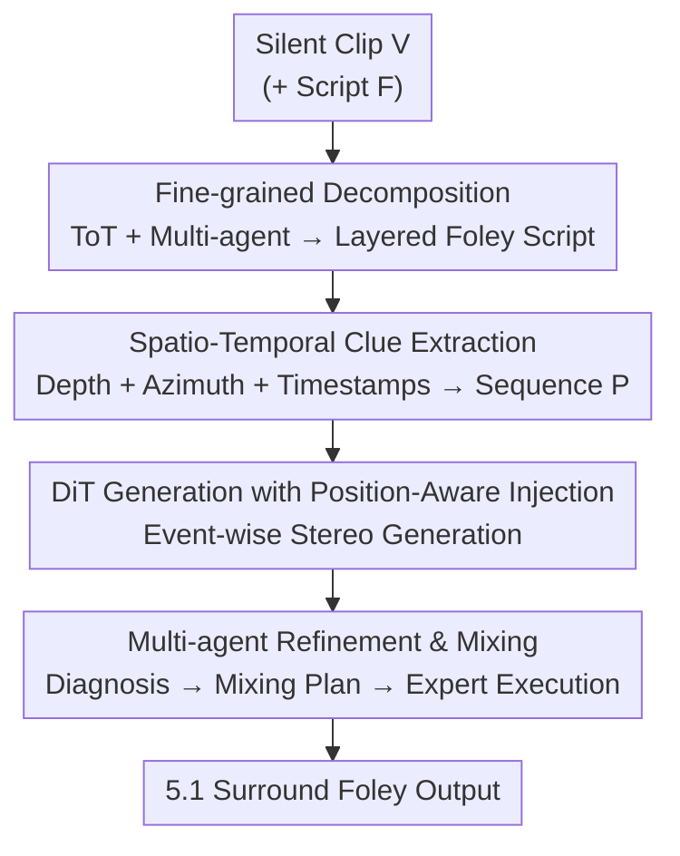

# FoleyDesigner: Immersive Stereo Foley Generation with Precise Spatio-Temporal Alignment for Film Clips

**Conference**: CVPR 2026  
**Paper**: [CVF Open Access](https://openaccess.thecvf.com/content/CVPR2026/html/Li_FoleyDesigner_Immersive_Stereo_Foley_Generation_with_Precise_Spatio-Temporal_Alignment_for_CVPR_2026_paper.html)  
**Code**: https://gekiii996.github.io/FoleyDesigner/ (Project Page)  
**Area**: Audio Generation / Multimodal  
**Keywords**: Stereo Foley, Spatio-Temporal Alignment, Diffusion Transformer, Multi-Agent, Tree-of-Thought

## TL;DR
FoleyDesigner mimics the workflow of professional Foley artists by decomposing silent film clips into layered sound events. It uses "depth + azimuth" spatio-temporal clues extracted from visual tracking to drive a DiT diffusion model for frame-level aligned stereo generation. Finally, a multi-agent system handles post-mixing and upmixing to 5.1 surround sound, outperforming existing baselines in spatio-temporal alignment and cinematic Foley quality.

## Background & Motivation

**Background**: Foley (manually creating sound effects for visual frames) is central to cinematic immersion. However, current audio generation methods fall into three categories, none of which can directly perform cinematic stereo Foley: monaural generation (AudioLDM2, Tango2, Make-an-Audio2) provides high quality but lacks spatial dimensions; stereo generation (Stable Audio, SpatialSonic, See2Sound) can produce stereo sound but lacks precise spatial positioning or frame-level temporal alignment; mono-to-stereo conversion (Sep-Stereo, Mono-to-Binaural) depends on existing monaural sources, limiting flexibility.

**Limitations of Prior Work**: Cinematic Foley is hindered by three technical challenges. First, **densely overlapping sound events**—multiple sound sources in movie scenes overlap simultaneously in spectrum and time, which single-pass generative models cannot decouple, resulting in incomplete or blurry outputs. Second, **lack of spatio-temporal grounding**—textual conditions only provide coarse direction descriptions like "left" or "far," failing to specify continuous spatial trajectories and frame-level timing; image conditions lack temporal information and cannot capture the dynamic movement of sound sources. Third, **substandard professional acoustic quality**—generated audio often suffers from mismatched reverb, spectral masking in overlapping bands, and loudness imbalance, burying key sound effects and breaking cinematic immersion.

**Key Challenge**: General audio generation treats the sound field as a monolithic entity for "one-shot" generation. In contrast, the essence of professional Foley is "decompose first, then place precisely, and finally harmonize as a whole." This workflow of layering + spatial grounding + post-mixing is precisely what end-to-end generative models lack.

**Goal**: To generate cinematic-standard stereo Foley directly from silent movie clips, addressing the three difficulties: layered generation of dense sound fields, controllable frame-level spatio-temporal alignment, and professional acoustic consistency.

**Key Insight**: The authors "translate" the real workflow of professional Foley artists into three serial modules (Decomposition → Generation → Refinement), allowing each stage to solve a specific challenge.

**Core Idea**: An automated cinematic Foley pipeline utilizing "Tree-of-Thought multi-agent decomposition + spatio-temporal clues from visual tracking injected into DiT + multi-agent professional mixing," accompanied by FilmStereo, the first cinematic stereo dataset with spatial metadata.

## Method

### Overall Architecture
FoleyDesigner converts silent clips $V$ (optionally with script $F$) into cinematic 5.1 surround sound Foley through a three-stage pipeline: **① Fine-grained Decomposition**—using Tree-of-Thought reasoning + multi-agent validation to split the scene into a layered Foley script with foreground/background annotations; **② Spatio-Temporal Foley Generation**—extracting depth, azimuth, and timestamps from keyframes for each sound event, encoding them into spatio-temporal clues to condition a DiT diffusion model via position-aware injection blocks to generate frame-aligned stereo; **③ Foley Refinement & Professional Mixing**—multiple diagnostic and expert agents identify acoustic issues, determine reverb/EQ/dynamic parameters, and finally upmix to 5.1 channels per ITU-R BS.775.

### Key Designs

**1. Fine-grained Decomposition: Layering Dense Sound Fields via Tree-of-Thought Multi-Agent**

To address the failure of single-pass models to decouple dense sound fields, the authors decompose the scene into layers. This involves two modules. **FilmScribe** converts video $V$ into a structured script $T$: a generator agent produces an initial script $T^{(0)}$, and a validator agent checks for accuracy and completeness, iterating as $T^{(k+1)} = \mathrm{Generator}(V, \mathrm{Feedback}(T^{(k)}, V))$ until $\mathrm{Validator}(T, V)\to\mathrm{True}$. **FoleyScriptWriter** then merges script $F$ with $T$ to produce a layered script $S=\{(e_i, l_i)\}$, where $e_i$ is the $i$-th sound event and $l_i\in\{fg, bg\}$ denotes foreground/background. Visuals capture physical events, while scripts add narrative-driven sounds not visible on screen.

Decomposition uses Tree-of-Thought search on a directed graph $G=(N,E)$: (i) **Expand**—from the root $(V,F)$, agents generate candidate script nodes based on Foley principles (narrative separation, visual alignment, emotional modulation). (ii) **Score**—each candidate is scored via $\mathrm{Score}(S,V,F)=w_1 s_{align}+w_2 s_{layer}+w_3 s_{emotion}$ for visual-audio correspondence, layering, and tone consistency. (iii) **Optimization**—search terminates if $\mathrm{Score}(S,V,F)>\tau$; otherwise, refinement or regeneration occurs, keeping the top-$b$ nodes at each level.

**2. Spatio-Temporal Clue Extraction: Visual Tracking to "Depth + Azimuth + Activation" Sequences**

To solve the lack of continuous trajectories in text/image conditions, spatial information is quantified from frames. From $N$ keyframes $K=\{I_1,\dots,I_N\}$, a VLM identifies bounding boxes $B=\{b_i\}$. A depth estimation model computes $d_i$ as the average depth within the box. The azimuth $\theta_i$ is derived from the box's horizontal center $x_i\in[0,W]$:

$$\theta_i = \arctan\!\left(\frac{x_i - W/2}{d_i}\right)\cdot\frac{180^\circ}{\pi} + 90^\circ$$

The spatial sequence $X=\{x_i=(d_i,\theta_i)\}$ is interpolated to the frame rate as $\{x_t\}_{t=1}^T$ and masked by a binary activation vector $c=\{c_t\}\in\{0,1\}^T$ (indicating if an event occurs at frame $t$):

$$p_t = c_t\cdot x_t,\quad P=\{p_t\}_{t=1}^T$$

**3. Position-Aware Injection: Feeding Spatio-Temporal Clues into DiT Diffusion**

To condition the DiT (based on Stable Audio Open), text $c_{text}$ follows the original channel, while $P$ is processed via position-aware injection. Fourier feature transformation is applied: $\gamma(p_t)=[\cos(2\pi Bp_t);\sin(2\pi Bp_t)]\in\mathbb{R}^{2m}$. It is then modulated by the activation mask: $\tilde\gamma(p_t)=c_t\cdot\gamma(p_t)+\epsilon\cdot\gamma(p_t)$, where $\epsilon=0.1$ maintains weak position signals for inactive frames to avoid abrupt changes. A convolutional encoder downsamples the features to match the audio latent's temporal rate $r$, yielding position embeddings $E_{pos}\in\mathbb{R}^{T'\times d_{emb}}$. Injection blocks are placed after every 4 standard DiT blocks at layers $\ell\in\{3,7,11,15,19,23\}$ using cross-attention.

**4. Multi-agent Refinement & Mixing: Diagnosis-Planning-Expert Execution Pipeline**

To resolve inconsistent reverb and spectral masking, a multi-agent post-processing system mimics a professional team. **Foley Analysis** agent extracts composite features $f_i=[f_{sem},f_{spec},f_{rev},f_{loud}]$. **Mixing Planner** then generates a plan $\Pi=\{(i,O_i)\}$, where $O_i\subseteq\{reverb, eq, dyn\}$. Three **Expert Agents** (Reverb, EQ, Dynamics) execute the plan based on scene geometry, spectral overlap, and relative loudness. Finally, **5.1 Upmixing** maps stereo $s_L, s_R$ to Front Left/Right, derives Center/Surround via weighted mixing, and generates $s_{LFE}(t)=\mathrm{LPF}(s_{mix}(t), 120\,\mathrm{Hz})$ following ITU-R BS.775.

### Loss & Training
Training proceeds in two stages: (1) Training the stereo Mel-spectrogram VAE; (2) Training the DiT diffusion model with spatio-temporal injection. Both use the FilmStereo dataset with a learning rate of $3\times10^{-5}$ and batch size of 8 on NVIDIA A6000 GPUs. FilmStereo contains 166 hours of cinematic stereo audio across 8 categories, with spatial metadata generated via gpuRIR and captions generated via GPT-4 CoT.

## Key Experimental Results

### Main Results

Audio Quality (Monophonic metrics after stereo-to-mono):

| Method | IS ↑ | KL ↓ | FAD ↓ | CLAP ↑ |
|------|------|------|-------|--------|
| Stable Audio | 10.50 | 1.86 | 2.37 | 0.594 |
| SpatialSonic | 13.79 | **1.37** | 1.93 | 0.672 |
| **Ours** | 12.36 | 1.40 | **1.88** | **0.679** |

Spatio-Temporal Alignment (Stereo metrics):

| Method | GCC ↓ | CRW ↓ | FSAD ↓ | IoU ↑ |
|------|-------|-------|--------|-------|
| Stable Audio | 61.17 | 51.44 | 0.343 | 24.5 |
| See2Sound | 60.03 | 51.17 | 0.291 | 21.3 |
| SpatialSonic | 49.20 | 36.87 | 0.163 | 27.8 |
| **Ours** | **48.79** | **34.23** | **0.138** | **32.2** |

Foley Quality (evaluated on film clips):

| Method | IB ↑ | SRS ↑ | CCS ↑ | AV-Sync ↑ |
|------|------|-------|-------|-----------|
| Stable Audio | 0.216 | 5.31 | 5.8 | 0.512 |
| See2Sound | 0.105 | 3.03 | 3.0 | 0.601 |
| SpatialSonic | 0.251 | 5.91 | 4.5 | 0.545 |
| **Ours** | **0.402** | **8.27** | **6.2** | **0.726** |

ImageBind Score (0.402) and AV-Sync (0.726) are 60.2% and 33.2% higher than SpatialSonic, respectively. SRS (Sound Richness Score) and CCS (Cinematic Clarity Score) were assessed by an audio-capable MLLM.

### Ablation Study

| Configuration | GCC ↓ | CRW ↓ | FSAD ↓ | FAD ↓ |
|------|-------|-------|--------|-------|
| w/o STC | 62.02 | 55.89 | 0.297 | 2.14 |
| **Full Model** | **48.79** | **34.23** | **0.138** | **1.88** |

Adding Spatio-Temporal Clues (STC) reduced GCC by 21.3% and CRW by 38.8%, proving its criticality for spatial alignment.

### Key Findings
- **STC is the lifeline of alignment**: Removing STC caused CRW spatial correlation errors to skyrocket by 38.8%, proving that visual tracking-derived depth/azimuth injection—rather than text—is the source of alignment.
- **Decomposition vs. Refinement**: Higher SRS comes from fine-grained decomposition (splitting dense scenes), while higher CCS comes from multi-agent mixing (harmonizing reverb/spectrum), validating the three-stage pipeline.
- **Human Preference**: In tests, emotional alignment (61% preference) and immersion (58% preference) led, showing STC enhances cinematic narrative.

## Highlights & Insights
- **Compiling Professional Workflow into Modules**: The 1:1 mapping of professional Foley artist stages to algorithmic modules (Decomposition → Generation → Refinement) is a robust design paradigm.
- **Geometric Azimuth Definition**: Calculating azimuth via $\arctan$ from bounding boxes and depth provides precise quantitative spatial conditions compared to "left/right" text descriptors.
- **Soft Mask Trick**: The $\epsilon=0.1$ coefficient in the activation mask avoids "hard" jumps in the latent space, a technique transferable to other time-activated conditional generation tasks.
- **Multi-Agent Post-Mixing**: Structuring domain knowledge (reverb, EQ, dynamics) into agents automates professional audio engineering expertise.

## Limitations & Future Work
- Performance degrades in **densely concurrent events** (e.g., simultaneous footsteps and ambient noise), occasionally leading to spatial errors.
- Subjective metrics (SRS/CCS) lack rigorous correlation validation with human annotations.
- The azimuth formula only models the frontal plane ($0^\circ$–$180^\circ$); true 3D spatial audio (overhead/behind) is not yet covered.
- Heavy dependency on external models (VLM, depth estimation, audio-LLM) increases engineering complexity and inference costs.

## Related Work & Insights
- **vs SpatialSonic / See2Sound**: While they improve spatial accuracy, they lack frame-level temporal alignment and professional post-processing. FoleyDesigner achieves higher IoU/AV-Sync and native 5.1 support.
- **vs Monoaural Models**: Previous SOTAs focus on audio quality without spatial dimensions; this work adds spatial control while maintaining generation quality.
- **Insight**: When a generative task has a mature professional human workflow, it is more effective to decompose the task into matching modules rather than pursuing a black-box end-to-end approach.

## Rating
- Novelty: ⭐⭐⭐⭐ Automating professional Foley workflows with frame-level spatio-temporal alignment is highly innovative.
- Experimental Thoroughness: ⭐⭐⭐⭐ Comprehensive metrics, though individual ablations for decomposition/mixing modules are missing.
- Writing Quality: ⭐⭐⭐⭐ Clear mapping between challenges and methods.
- Value: ⭐⭐⭐⭐ FilmStereo fills a dataset gap; high potential for cinema and VR applications.

<!-- RELATED:START -->

## Related Papers

- [\[ACL 2025\] A Spatio-Temporal Point Process for Fine-Grained Modeling of Reading Behavior](../../ACL2025/others/a_spatio-temporal_point_process_for_fine-grained_modeling_of_reading_behavior.md)
- [\[CVPR 2026\] ImmerIris: A Large-Scale Dataset and Benchmark for Off-Axis and Unconstrained Iris Recognition in Immersive Applications](immeriris_a_large-scale_dataset_and_benchmark_for_off-axis_and_unconstrained_iri.md)
- [\[CVPR 2026\] Progressive Neural Architecture Generation](progressive_neural_architecture_generation.md)
- [\[CVPR 2026\] Zero-shot Detection of AI-Generated Image via RAW-RGB Alignment](zero-shot_detection_of_ai-generated_image_via_raw-rgb_alignment.md)
- [\[CVPR 2026\] Bidirectional Query-Driven Generation of Parametric CAD Sketch](bidirectional_query-driven_generation_of_parametric_cad_sketch.md)

<!-- RELATED:END -->
