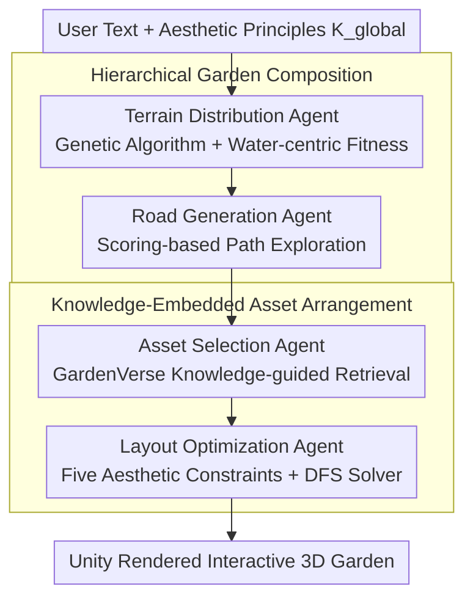

# GardenDesigner: Encoding Aesthetic Principles into Jiangnan Garden Construction via a Chain of Agents

**Conference**: CVPR 2026  
**arXiv**: [2604.01777](https://arxiv.org/abs/2604.01777)  
**Code**: [https://github.com/monad-cube/GardenDesigner](https://github.com/monad-cube/GardenDesigner)  
**Area**: Scene Generation / Cultural Heritage  
**Keywords**: Jiangnan Garden, Chain of Agents, Procedural Modeling, Aesthetic Constraints, Layout Optimization

## TL;DR
The GardenDesigner framework is proposed to encode the aesthetic principles of Jiangnan gardens into computable constraints via a Chain of Agents (Terrain Distribution → Road Generation → Asset Selection → Layout Optimization). Combined with the expert-annotated GardenVerse dataset, it enables non-professional users to automatically construct Jiangnan gardens that comply with aesthetic standards within one minute via text input.

## Background & Motivation
1. **Background**: Jiangnan gardens are a significant school of Chinese classical gardens, holding immense potential for applications in digital tourism, film, and game production. Traditional digital modeling of these gardens depends on expert experience, typically requiring 3-4 designers and 3-4 weeks to complete.
2. **Limitations of Prior Work**: Existing learning-based scene generation methods are restricted by the domain of training data and have limited generalization capabilities. Procedural modeling methods combined with LLMs/VLMs primarily focus on indoor spaces or unstructured natural scenes, failing to handle the sophisticated spatial compositions unique to Jiangnan gardens.
3. **Key Challenge**: Jiangnan gardens involve three unique challenges—(1) complex water-centric terrain and spatial layouts, (2) difficulty in encoding abstract aesthetic principles into computational constraints, and (3) a lack of garden datasets with cultural annotations.
4. **Goal**: How to transform the implicit aesthetic rules of Jiangnan gardens (water-centricity, winding paths, miniature symbolism, and asymmetrical balance) into an optimizable procedural generation workflow.
5. **Key Insight**: Decomposing garden construction into four sequentially dependent sub-tasks executed by a Chain of Agents, with aesthetic constraints embedded within each agent.
6. **Core Idea**: Driving procedural modeling with Chain-of-LLM agents and encoding aesthetic principles into the fitness functions of genetic algorithms and loss functions for layout optimization.

## Method

### Overall Architecture
GardenDesigner aims to solve the following problem: allowing non-professional users to automatically generate a 3D scene that conforms to Jiangnan garden aesthetics using only a single text prompt. The difficulty lies in the fact that aesthetic rules (water-centric, winding paths, asymmetrical balance) are implicit humanistic experiences that cannot be directly handled by learning-based models nor reasoned out of thin air by general LLMs.

The approach decomposes "garden making" into four **sequentially dependent** sub-tasks, each assigned to a specialized agent where the output of the previous agent serves as the input for the next: Terrain Distribution $\mathcal{A}_T$ first establishes a water-centric skeleton on a grid; Road Generation $\mathcal{A}_R$ draws winding paths along this skeleton; Asset Selection $\mathcal{A}_S$ retrieves culturally adaptive buildings and plants from the GardenVerse knowledge base; and Layout Optimization $\mathcal{A}_C$ finally places these assets according to aesthetic constraints. The paper categorizes the first two as "Hierarchical Garden Composition" and the latter two as "Knowledge-Embedded Asset Arrangement." The key to this chain is that the LLM is only responsible for translating vague natural language into computable parameters for each stage, while spatial correctness is guaranteed by procedural algorithms and aesthetic constraint functions embedded in each agent—thus "compiling" humanistic knowledge into fitness and loss functions.

### Key Designs

**1. Genetic Algorithm-driven Water-centric Terrain Generation: Encoding "Water as the Skeleton" into the Fitness Function**

Traditional procedural terrain algorithms tend to lay out plots uniformly, resulting in scattered ponds and unorganized ground that fails to capture the "water-governed space" logic of Jiangnan gardens. This agent first directs the LLM to translate user text into genetic algorithm parameters (existence, quantity, total coverage, and single-area coverage of various terrains), then performs crossover, mutation, and evolution on four terrain types: Outside / Waterbody / Land / Ground on a 2D grid. The "water-centric" fitness term that drives this evolution is:

$$L_{\text{terrain}} = f \cdot \max\left(1 - \frac{\sum c(T,(x_i,y_i))}{\phi}, 0\right)$$

where $\sum c(T,(x_i,y_i))$ measures the deviation of terrain units from the water core and $\phi$ is a tolerance threshold—the further from water, the greater the penalty. Consequently, evolutionary pressure pushes the water body to the spatial organization core, causing stones and land plots to naturally distribute around the water rather than in isolation.

**2. Scoring-based Exploratory Road Generation: Replacing "Shortest Path" with Three Aesthetic Rules**

Once the terrain is set, roads must be drawn. However, existing pathfinding algorithms pursue geometric efficiency or uniform coverage, resulting in straight shortcuts that contradict the Jiangnan garden experience of "changing scenes with every step and finding seclusion through winding paths." The road agent extracts parameters from instructions (number of entrances, mandatory waypoints, main road width, road complexity) and selects paths on the grid boundary based on a scoring function $R = \mathcal{A}_R(\mathcal{S}(T, e_{i,j}), U, K_{\text{global}})$. The scoring rules quantify three aesthetic requirements: the path must reach most areas, prioritize wrapping around boundaries (to lengthen the tour route and reveal scenery gradually), and penalize the two extremes of excessive curvature and excessive straightness. Thus, the selected path is not the shortest, but an exploratory route that leads visitors around to observe the scenery while walking.

**3. Knowledge-guided Asset Retrieval: Attaching a "Garden Lexicon" to the LLM**

General LLMs do not know what a rockery should lean against or the relationship between a pavilion and the water surface; directly choosing assets results in large empty spaces or cultural misplacements. The Asset Selection agent $\mathcal{A}_S$ first encodes expert-annotated garden knowledge $K_a$ from GardenVerse (visual attributes, spatial composition relationships, seasonal adaptation, etc.) into a vector database $\mathcal{V}(K_a)$, then uses the LLM to perform retrieval queries combined with contextual information $I_{\text{area}}$ for each region:

$$O_s = \mathcal{A}_S\big(\mathcal{Q}(\mathcal{V}(K_a), o_i, U),\ I_{\text{area}}\big)$$

The query returns a set of culturally consistent assets $O_s$ for each area (halls, pavilions, rockeries, seasonal flora, etc.), effectively providing the model with an external "Garden Lexicon." Asset selection is no longer based on the LLM's imagination but is constrained by expert knowledge, which is the root of the gains brought by the GardenVerse dataset.

**4. Layout Optimization with Five Aesthetic Constraints: Defining "Correct Placement" as Loss for DFS Solving**

Once assets are selected, they must be placed correctly. However, relationships such as "rockeries against mountains and facing water, pavilions near water, and plants arranged in staggered patterns" cannot be expressed by general methods. The Layout Optimization agent $\mathcal{A}_C$ decomposes spatial aesthetics into eight constraints merged into five semantic categories, each with a corresponding loss term: Global (edge vs. center), Position (surrounding / backing relationships), Distance (proximity), Alignment, and Rotation, weighted into a total objective:

$$\mathcal{L}_{\text{opt}} = \lambda_1 \mathcal{L}_{\text{glo}} + \lambda_2 \mathcal{L}_{\text{pos}} + \lambda_3 \mathcal{L}_{\text{dis}} + \lambda_4 \mathcal{L}_{\text{ali}} + \lambda_5 \mathcal{L}_{\text{rot}}$$

With weights set at $\lambda = \{2.0, 0.5, 1.8, 0.5, 0.5\}$, it is evident that global position and relative distance are prioritized. Instead of continuous gradient descent, Depth-First Search (DFS) is used to find feasible layouts in a discrete placement space: each asset is described by $(x, y, l, w, \text{rotation})$, with rotation restricted to four discrete angles (0/90/180/270), and hard constraints like "no collisions" and "no boundary crossing" are applied. The feasible solution with the lowest loss after 100 iterations is chosen—since asset position and orientation are discrete choices, DFS is more natural than gradient-based methods.

### A Complete Example
Using the prompt "Build a small water-front Jiangnan garden, containing a main hall and a walkway around the water" as an example: $\mathcal{A}_T$ translates this into genetic parameters (Waterbody existence, ~30% coverage, single continuous block), evolving a central water body as the skeleton; $\mathcal{A}_R$ takes this terrain map and selects a path along the shore and boundaries based on scoring, resulting in a winding walkway that circles half the water before leading to the hall; $\mathcal{A}_S$ reads "main hall" and "water-front," retrieving matching halls, waterside platforms, and seasonal bamboo and flora from the knowledge base; finally, $\mathcal{A}_C$ uses the five loss categories to place the hall facing the water with its back to the mountains, the platform flush with the shore, and plants staggered around them. DFS searches for the feasible solution, which is then rendered by Unity into an interactive 3D garden. Through this chain, implicit aesthetic principles like "water-centricity" and "winding paths" are automatically filled in by the constraints of the preceding agents.

### Loss & Training
The entire pipeline requires no training: the LLM uses GPT-5 for parameter translation and asset querying; the terrain stage is driven by a water-centric fitness function via genetic search; the layout stage utilizes five spatial constraint losses (weights $\{2.0, 0.5, 1.8, 0.5, 0.5\}$) solved by DFS; and Unity serves as the visualization and interaction platform.

## Key Experimental Results

### Main Results

| Method | Path-S ↑ | Class-Div | FD | CLIP-S ↑ |
|------|----------|-----------|-----|----------|
| Liu et al. (baseline) | 0 | 21.8±1.6 | 1.42±0.1 | 27.4±0.1 |
| **GardenDesigner** | **8.1±2.5** | **68.3±5.6** | **1.36±0.1** | **27.6±0.1** |

| Method | CLIP-A ↑ | VLM-S ↑ | QA-Quality ↑ |
|------|----------|---------|--------------|
| Liu et al. | 52.9±1.0 | 24.9±1.2 | 43.8±2.5 |
| **GardenDesigner** | **54.2±2.0** | **32.5±2.3** | **53.8±3.1** |

### Ablation Study

| Configuration | FD | CLIP-S ↑ | VLM-S ↑ |
|------|-----|----------|---------|
| GardenDesigner w/o Asset Arrange. | 1.27±0.1 | 27.4±0.1 | 31.6±1.1 |
| **Full GardenDesigner** | **1.36±0.1** | **27.6±0.1** | **32.5±2.3** |

### Key Findings
- Path-S increased from 0 to 8.1, indicating that the baseline could not generate reasonable road-building relationships, whereas GardenDesigner's roads can connect to important scenic spots.
- Asset diversity (Class-Div) increased by more than 3 times (21.8 → 68.3), expanding from 26 to 71 types of assets.
- FD=1.36 is close to the fractal dimension range of real Jiangnan gardens (1.123-1.329), suggesting a more natural spatial structure.
- In human evaluations, 11 garden experts and 32 general users preferred GardenDesigner across all dimensions, particularly in the cultural atmosphere dimension.
- The inclusion of the GardenVerse dataset itself significantly improved baseline quality, highlighting the importance of high-quality domain-specific datasets.

## Highlights & Insights
- **Chain of Agents Decomposition is Clever**: Decomposing complex garden construction into four sub-tasks with clear dependencies utilizes LLM language understanding while ensuring precise spatial constraints through procedural algorithms.
- **Computationalization of Aesthetic Principles**: Bridging abstract aesthetic concepts like "water-centricity" and "winding paths" into fitness and loss functions is a transferable strategy for other cultural heritage digitization scenarios.
- **Expert Annotation in GardenVerse**: Annotations extend beyond basic info to include domain-specific knowledge (seasonal fitness, cultural context), providing necessary domain grounding for the LLM.

## Limitations & Future Work
- Diversity remains limited by the 132 assets in GardenVerse, which does not cover all Jiangnan garden elements.
- Evaluation metrics rely heavily on VLM scores and human assessment, lacking professional garden design metrics such as visibility analysis or spatial accessibility.
- Errors in the Chain of Agents propagate—if terrain generation is unreasonable, all subsequent steps are affected.
- Currently specific to Jiangnan styles; the framework's extensibility to other styles (e.g., Royal gardens, Japanese gardens) needs validation.

## Related Work & Insights
- **vs. Liu et al. (LLM for landscape)**: They use LLMs for generalized landscapes but lack professional knowledge and cultural constraints, resulting in layouts with significant empty spaces. GardenDesigner addresses this through expert knowledge embedding and aesthetic loss functions.
- **vs. Infinigen**: Infinigen focuses on procedural generation of natural scenes without cultural constraints. GardenDesigner's Chain of Agents + Aesthetic Encoding paradigm can be extended to other cultural scenes.
- This paper demonstrates the possibility of **computationalizing humanistic knowledge**, inspiring ways to encode expert experience from other fields into optimizable constraints.

## Rating
- Novelty: ⭐⭐⭐⭐ Encoding Jiangnan garden aesthetic principles into a computational framework is a unique entry point, though the technical layer consists mainly of combining existing methods.
- Experimental Thoroughness: ⭐⭐⭐⭐ Includes quantitative comparisons, human evaluation, and ablations, though only one baseline is used.
- Writing Quality: ⭐⭐⭐⭐ The structure is clear, and the formal description of aesthetic principles is well-executed.
- Value: ⭐⭐⭐⭐ Cultural heritage digitization is an important direction, and the GardenVerse dataset has independent value.

<!-- RELATED:START -->

## Related Papers

- [\[CVPR 2026\] Content-Aware Frequency Encoding for Implicit Neural Representations with Fourier-Chebyshev Features](content-aware_frequency_encoding_for_implicit_neural_representations_with_fourie.md)
- [\[NeurIPS 2025\] A Differentiable Model of Supply-Chain Shocks](../../NeurIPS2025/others/a_differentiable_model_of_supply-chain_shocks.md)
- [\[ICML 2025\] Practical Principles for AI Cost and Compute Accounting](../../ICML2025/others/practical_principles_for_ai_cost_and_compute_accounting.md)
- [\[ICML 2026\] Markov Chain Monte Carlo without Evaluating the Target: An Auxiliary Variable Approach](../../ICML2026/others/markov_chain_monte_carlo_without_evaluating_the_target_an_auxiliary_variable_app.md)
- [\[ECCV 2024\] ADMap: Anti-disturbance Framework for Vectorized HD Map Construction](../../ECCV2024/others/admap_anti-disturbance_framework_for_vectorized_hd_map_construction.md)

<!-- RELATED:END -->
