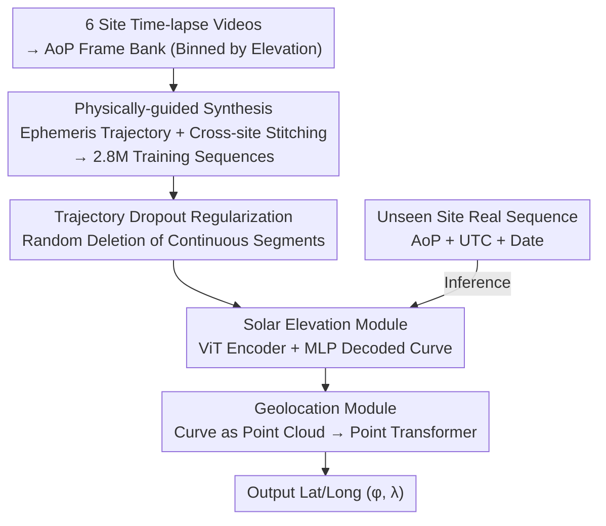

# Global Underwater Geolocation from Time-Lapse Polarization Imagery

**Conference**: CVPR 2026  
**Paper**: [CVF Open Access](https://openaccess.thecvf.com/content/CVPR2026/html/Aghajanzadeh_Global_Underwater_Geolocation_from_Time-Lapse_Polarization_Imagery_CVPR_2026_paper.html)  
**Code**: None (The paper states a new benchmark dataset will be released)  
**Area**: Underwater Vision / Polarization Imaging / Geolocation  
**Keywords**: Underwater Geolocation, Sky Polarization, Solar Elevation, Physically-guided Synthesis, Transformer  

## TL;DR
By using a single underwater polarization camera to capture a time-lapse sequence looking up at the sky with UTC timestamps, this work employs "physically-guided synthesis of 2.8 million training sequences + a two-stage Transformer to first reconstruct the solar elevation curve and then regress latitude and longitude." This reduces the median cross-site (unseen waters) localization error from the SOTA of approximately 3000 km to approximately 500 km, an improvement of nearly 8x.

## Background & Motivation

**Background**: Underwater agents (autonomous underwater vehicles, marine monitoring platforms) have almost no way of knowing their location—GPS signals disappear within centimeters of entering the water, and acoustic baselines or terrain-matching sonar require expensive pre-deployment and are limited to "instrumented" small areas on the scale of 10 km. An infrastructure-independent cue is the sky: the polarization pattern formed by sunlight passing through the water surface implicitly contains the solar elevation angle. Combining "the curve of solar altitude changes over a day" with a clock allows for the reversal of the observer's latitude and longitude (the principle used by animals for navigation via sky polarization).

**Limitations of Prior Work**: Inferring the solar altitude from polarization images is extremely difficult (Fig. 4: under the same elevation angle, exposure, clouds, turbidity, and passing marine life can make images look completely different). More critically, the data is "dense yet sparse"—vast amounts of frames can be captured at a single site (dense observation), but there are very few actual collection points (sparse locations). Existing deep methods (RI-ResNet-RDM, SecTran-MIM) can achieve approximately 400 km on seen training sites, but the median error explodes to approximately 3000 km once moved to unseen waters.

**Key Challenge**: The "geographic diversity" required for generalization and the reality of being "limited to collecting at a few locations" are fundamentally incompatible—it is impractical to deploy data collection points on a 100 km grid across the ocean. Furthermore, the various nuisances (water turbidity, weather, biologicals) that affect "inferring elevation from images" are strongly correlated with location, causing models to collapse when moving to new sites.

**Key Insight**: The authors identify a first-order optical law—the dominant factor of the underwater sky Angle of Polarization (AoP) pattern is only the solar elevation; local water optics (turbidity, color) only scale the contrast, and the solar azimuth (heading) only causes a rigid rotation of the entire image without changing its radial structure. Since the patterns for "same elevation, different location/water/orientation" collapse into the same radial curve after aligning the azimuth, real frames collected from a few sites can be used as "building blocks" to reassemble training sequences for any location or date according to physically valid solar trajectories.

**Core Idea**: Instead of directly tackling the extremely difficult task of "single frame → elevation," this work uses physically-guided synthesis to expand real time-lapse frames from 6 sites into 2.8 million "solar elevation-aligned" sequences covering various latitudes/seasons/water types. Water, weather, and biologicals are treated as nuisances to be randomized and averaged out in the synthesis. Then, a compact two-stage Transformer is used to first reconstruct the complete solar elevation curve from the sequence and then regress the latitude and longitude.

## Method

### Overall Architecture

The system consists of two parts: "Offline Physically-guided Synthesis of Training Set" and a "Two-stage Polar Transformer." The input is an underwater upward-looking AoP polarization sequence of 64 frames (each with a UTC timestamp and capture date), and the output is the camera's latitude $\hat\varphi$ and longitude $\hat\lambda$. Internally, the sequence is first restored to a 64-point solar elevation curve $\hat s$, and the geographic coordinates are then solved from this curve (i.e., the "arc of the sun in a day")—because for a given date, the trajectory of solar elevation over time (peak height, symmetry, slope) uniquely corresponds to a geographic location.

Training data is synthesized rather than collected globally: time-lapse videos from 6 optically diverse sites are converted into AoP frames and indexed into a database by elevation angle. For random "location + date" samples on a global grid, the minute-by-minute solar elevation trajectory is calculated using ephemeris. Real frames with matching elevations are then selected from the database to assemble sequences, intentionally mixing frames from different sites and randomizing orientations so that water and weather are "averaged" into noise.

### Key Designs

**1. Physically-guided Synthesis: Stitching Real Frames from Few Sites into a Global Training Set**

This step addresses the "generalization collapse due to location sparsity." Instead of using a full radiative transfer solver for rendering, the authors stitch real time-lapse frames from 6 optically diverse sites (ranging from Lake Ohrid in North Macedonia with visibility >10 m to Champaign, Illinois, with turbidity as low as ~0.3 m). To synthesize a sequence: a location and date are first selected on a global grid using Arvo’s area-preserving sampler to map points uniformly onto spherical triangles (avoiding oversampling at high latitudes); random days are chosen within 4-day bins to ensure adjacent trajectories differ by no more than 7 days. Astropy (IAU standard algorithm) is then used to calculate the minute-by-minute solar elevation from sunrise to sunset. The trajectory is sampled at 64 equally spaced points (avg. 10min interval), and for each step, one frame is randomly selected from the top 5 closest elevation matches in the frame bank. The diversity comes from **randomly choosing different orientations for the same elevation** (moving sun-glint patches) and **mixing frames from different water types** (preventing the network from memorizing a single optical environment). This results in 2.8 million sequences covering latitude, season, and water types. When a site is used for cross-site testing, its entire frame bank is excluded from synthesis, training, and validation.

**2. Two-stage Polar Transformer: Reconstructing the Solar Curve then Regressing Coordinates**

To address the unreliability of "guessing elevation frame-by-frame," this work uses attention mechanisms to allow each point in the sequence to attend to all others, performing joint reasoning on the global properties of the solar arc (peak, symmetry, slope). For input encoding, each frame first passes through a shallow CNN to obtain a spatial descriptor $h_i=\mathrm{CNN}(x_i)\in\mathbb{R}^H$. The UTC time within the frame is normalized to $\tilde t_i=\text{seconds after midnight}/86400\in[0,1]$, and the date (season) is encoded as a periodic 2D vector $e(d)=(\sin(2\pi\tilde d),\cos(2\pi\tilde d))$, where $\tilde d=\text{day of year}/D$. These are concatenated into a token $z_i=[h_i;\tilde t_i;e(d)]\in\mathbb{R}^{H+3}$, and fed into the model with 64-position embeddings.

The first "Solar Elevation Module" uses a ViT encoder $T_\theta$ to process the tokens into a global summary state, then an MLP decodes each frame's feature along with this state into a smooth elevation curve $\hat s=(\hat s_1,\dots,\hat s_{64})$. The second "Geolocation Module" treats the predicted curve $\hat s$ and temporal context $[\tilde t_i;e(d)]\in\mathbb{R}^3$ as a "64-point cloud," fed into a Point Transformer $P_\varphi$ to regress coordinates. The Point Transformer is used rather than an MLP because coordinates depend on the global shape of the trajectory, and self-attention between points provides a stable global reference. The end-to-end loss is the weighted sum of elevation MSE and coordinate cosine loss:

$$L = \lambda_{\text{elev}}\cdot\frac{1}{64}\sum_{i=1}^{64}\lVert s^{gt}_i-\hat s_i\rVert_2^2 \;+\; \lambda_{\text{geo}}\,\bigl(1-\langle \hat c, c\rangle\bigr)$$

where $\hat c, c$ are unit-norm Cartesian coordinate vectors.

**3. Trajectory Dropout Regularization: Bridging the "Complete Synthesis vs. Partial Reality" Gap**

Synthesized training sequences always cover sunrise to sunset, but real-world deployments often capture incomplete sequences (e.g., only morning/afternoon or missing frames). Models trained only on complete sequences fail on partial inputs. Thus, "trajectory dropout" randomly deletes **continuous segments** during training, forcing the model to work robustly even with missing time periods. This regularization, combined with deliberate "morning-only/afternoon-only" variants in the synthesizer, improves robustness to partial solar arcs.

### Loss & Training
The model is trained end-to-end with the total loss being the weighted sum of the elevation MSE term and the coordinate cosine loss term. Each site's frame bank is split 85%/15% chronologically for training/validation. For cross-site evaluation, the tested site's entire database is excluded. The training scale is 2.8 million sequences with a fixed length of 64 frames.

## Key Experimental Results

### Main Results

Median/Average geodesic error (km) for cross-site (leave-one-site-out) and same-site settings:

| Setting | Metric | Polar Transformer (ours) | SecTran-MIM | RI-ResNet-RDM |
|------|------|--------------------------|-------------|---------------|
| Cross-site (Florida Keys held out) | Median Geodesic Error | **465 km** | 1,733 km | 2,786 km |
| Cross-site (Avg. 6 sites) | Site-avg Median Error | **513 km** | 2,394 km* | 3,971 km* |
| Same-site (Avg. 6 sites) | Avg. Geodesic Error | **9 km** | 427 km* | 530 km* |

\* Baselines were only evaluated on their 4 reported sites. Ours achieves an 8x improvement in cross-site scenarios. In the same-site setting, even training on purely synthesized sequences (variant c) matches performance with real-frame training (variant a), proving optical diversity in synthesis replaces the need for local collection.

Solar elevation curve reconstruction accuracy (RMSE, lower is better):

| Setting | Polar Transformer (ours) | RI-ResNet-RDM | SecTran-MIM |
|------|--------------------------|---------------|-------------|
| Same-site (Avg. 6 sites) | **1.3°** | 3.8° | 4.7° |
| Cross-site (Avg. 6 sites) | **4.5°** | 18° | 13° |

### Ablation Study

Cross-site on Champaign site, changing one component at a time:

| Index | Configuration | Elevation RMSE | Median Geodesic Error | Description |
|-------|------|-------------|--------------|------|
| 1 | Baseline (AoP frames + Time emb.) | 6.5° | — | Starting point |
| 2 | + Day-of-year token | 5.2° | — | Seasonal encoding |
| 3 | Point Transformer with Abs. Attention | 2.47° | 845 → 567 km | ~33% gain |
| 4 | + Trajectory Dropout Reg. | 2.2° | 466 km | Final configuration |
| 5 | Sequence Length 64 → 128 | 3° | Slight gain | Diminishing returns |
| 6 | Remove ViT Encoder | Increase | Decrease (w/ outliers) | Loss of global context |
| 7 | Replace Point Transformer with MLP | — | >620 km | Proves self-attention is key |

### Key Findings
- Three major designs—date encoding, absolute attention on elevation sampling, and trajectory dropout—are indispensable; removing any increases error. Absolute attention provides the largest gain (~33%).
- Doubling sequence length provides almost no benefit, suggesting 64 frames are sufficient for capturing the daily solar arc.
- The "location diversity" of physical synthesis is more valuable than "real frames from the target site."
- Cross-site median errors range from 300–800 km per site, with an average of 513 km.

## Highlights & Insights
- **Stitching instead of collecting via physical invariance**: By leveraging the law that AoP patterns are dominated by solar elevation, the work turns a sparse data problem into a combinatorial synthesis problem.
- **Two-stage decomposition**: Solving "Image → Physical Quantity → Task Quantity" makes intermediate results interpretable and easier to diagnose.
- **Curve-as-Point-Cloud**: Treating the 64-point predicted curve as an ordered point set for regression is a clever reuse of Point Transformer architectures.
- **Addressing Sim-to-Real gap via Trajectory Dropout**: Specifically targeting the mismatch between "full synthesis" and "partial reality" is more effective than generic data augmentation.

## Limitations & Future Work
- The simulation prior begins to decay when the area exceeds $2\times10^6\ \text{km}^2$; larger models and denser sampling may be needed for broader coverage.
- Median error of 513 km is still too coarse for many navigation tasks (the 9 km same-site error is what is truly practical).
- High dependence on accurate UTC timestamps and dates; clock drift immediately contaminates trajectory inversion.
- Requires upward-looking deployment poses away from obstructions like hulls or heavy marine life.

## Related Work & Insights
- **vs. Powell et al.**: They use analytical physical models yielding ~2000 km errors, which degrade in murky water. Ours uses data-driven synthesis, reaching ~500 km with better turbidity robustness.
- **vs. Deep Baselines**: Previous methods suffer from "site-memorization." This work uses physical synthesis to force "location diversity" and sequence-level attention for joint reasoning.
- **Insight**: For problems where "real data is dense but labels are sparse," known physical/geometric invariances can be used to reassemble existing real samples into synthetic sets that cover the sparse label dimensions.

## Rating
- Novelty: ⭐⭐⭐⭐⭐ 
- Experimental Thoroughness: ⭐⭐⭐⭐ 
- Writing Quality: ⭐⭐⭐⭐⭐ 
- Value: ⭐⭐⭐⭐ 

<!-- RELATED:START -->

## Related Papers

- [\[CVPR 2026\] AVGGT: Rethinking Global Attention for Accelerating VGGT](avggt_rethinking_global_attention_for_accelerating_vggt.md)
- [\[CVPR 2026\] Beyond Global Similarity: Multi-Conditional Retrieval for Fine-Grained Cross-Modal Understanding](beyond_global_similarity_multi-conditional_retrieval_for_fine-grained_cross-moda.md)
- [\[CVPR 2026\] Neural Collapse in Test-Time Adaptation](neural_collapse_in_test-time_adaptation.md)
- [\[CVPR 2026\] ViT3: Unlocking Test-Time Training in Vision](vit3_unlocking_test_time_training_in_vision.md)
- [\[ICLR 2026\] The Invisibility Hypothesis: Promises of AGI and the Future of the Global South](../../ICLR2026/others/the_invisibility_hypothesis_promises_of_agi_and_the_future_of_the_global_south.md)

<!-- RELATED:END -->
