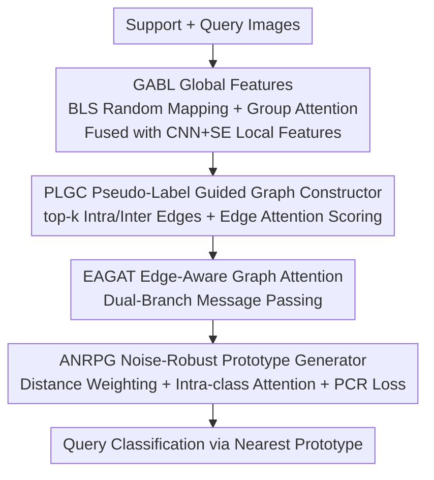

# Graph Attention Prototypical Network for Robust Few-Shot Classification

**Conference**: CVPR 2026  
**Paper**: [CVF Open Access](https://openaccess.thecvf.com/content/CVPR2026/html/Liu_Graph_Attention_Prototypical_Network_for_Robust_Few-Shot_Classification_CVPR_2026_paper.html)  
**Code**: Not open-sourced (No code link provided in paper)  
**Area**: Few-Shot Learning / Graph Neural Networks  
**Keywords**: Few-shot classification, Label noise, Prototypical networks, Graph attention, Robust learning

## TL;DR
To address the "prototype shift" problem where Prototypical Networks experience sharp accuracy drops due to mislabeled samples in the support set, GAPNet introduces a four-step pipeline: "Global+Local Dual Features → Pseudo-label Guided Graph Construction → Edge-Aware Graph Attention → Adaptive Noise-Robust Prototype Generation." By explicitly modeling intra/inter-class relationships and dynamically suppressing noise sample weights, it outperforms the SOTA by 3%~8% on 5-way 5-shot tasks across four datasets and exhibits significantly slower decay under 40% label noise.

## Background & Motivation
**Background**: In Few-Shot Learning (FSL), metric-based methods represent a strong baseline. Prototypical Networks (ProtoNet) are the most straightforward, computing "class prototypes" by averaging support sample features and classifying queries based on proximity to these prototypes.

**Limitations of Prior Work**: This approach is **extremely sensitive to label noise** in the support set. Since FSL only provides $K$ samples per class (e.g., 5-shot), a single mislabeled sample pulls the class prototype toward the wrong feature center—a phenomenon the paper terms "prototype shift." This shift distorts decision boundaries, leading to misclassification. The issue intensifies with higher noise ratios: 40% noise means 2 out of 5 samples are mislabeled.

**Key Challenge**: Most existing robust methods target large-scale datasets, relying on large sample sizes to "wash out" noise, which fails in FSL scenarios. While graph-based FSL can leverage manifold structures (more reliable than labels), they typically **construct graphs using nominal labels or fixed k-NN rules**. This incorrectly connects noise samples to their nominal classes (erroneous edges) or forces connections between distant samples of the same nominal class (redundant edges), further damaging true intra/inter-class relationships.

**Goal**: Given label noise in the support set, the objective is to extract discriminative features from limited samples, construct a reliable relationship graph that preserves only truly similar connections, and actively suppress the contribution of noise samples during prototype generation.

**Key Insight**: The property that "intra-class samples have smaller feature distances, and noise samples are far from clean samples of their nominal class" is more trustworthy than labels. Thus, instead of relying on labels, one should trust feature similarity for graph construction and weighting.

**Core Idea**: A tripartite system consisting of "Pseudo-label guided class-aware graph + Edge reliability scoring + Distance-adaptive prototype weighting" is used to weaken noise in both relationship modeling and prototype generation, fundamentally preventing prototype shift.

## Method

### Overall Architecture
GAPNet (Graph Attention Prototypical Network) is a serial pipeline that takes an episode of support set $S$ and query set $Q$ images to output category predictions. It is comprised of three core modules: **Feature Extraction** (CNN+SE for local features, GABL for global features, fused via attention), **Dynamic Class-Aware Relationship Modeling** (PLGC for graph construction + EAGAT for edge-aware graph attention with dual intra/inter-class paths), and **ANRPG** for generating noise-robust prototypes from refined features. Categorization is performed via softmax over negative Euclidean distances.

### Key Designs

**1. GABL: Robust Global Features via Broad Learning and Group Attention**

Under label noise, local features from ConvNet-4 often suffer from "feature sparsity" and insufficient discriminative power. GABL (Group Attention Broad Learning) provides an auxiliary path for global features. Based on the Broad Learning System (BLS)—a flat, low-parameter network—local features $\mathbf{F}_{\text{local}}$ are mapped through fixed random weights into $p$ groups of "feature mapping nodes" $\mathbf{Z}_i = \varphi_i(\mathbf{F}_{\text{local}}\mathbf{W}_f^i + \beta_f^i)$, then expanded into $q$ groups of "enhancement nodes" $\mathbf{H}_j = \phi_j(\mathbf{Z}\mathbf{W}_e^j + \beta_e^j)$. Two modifications adapt it for FSL: First, the ratio of trainable to fixed weights is controlled by $\gamma$ to balance capacity and overfitting risk. Second, group-level attention $\mathbf{a}_f^i = \mathcal{F}_{GA}(\mathbf{Z}_i)$ dynamically amplifies useful nodes while suppressing noise, resulting in $\mathbf{F}_{\text{global}} = [\mathbf{a}_f^1\mathbf{Z}_1, \cdots, \mathbf{a}_e^q\mathbf{H}_q]\mathbf{W}_{\text{bls}}$. Local and global features are fused into $\mathbf{F}_{\text{ff}}$ via a softmax attention module.

**2. PLGC: Reliable Graph Construction via Pseudo-labels and Edge Attention**

Relationship modeling is difficult under noise because nominal classes may not reflect reality. PLGC (Pseudo-Label Guided Graph Constructor) ignores labels initially. It assigns **pseudo-labels** $\hat{y}_q^i = \arg\max_c \mathcal{A}(\mathbf{f}_q^i, \mathbf{p}_c)$ to query samples based on distance to initial support prototypes ($\mathcal{A}(x,y)=x^\top y$). To avoid connecting noise samples, it **constructs edges only for the top-k most similar samples** ($\eta_{\text{intra}}=\eta_{\text{inter}}=5$), yielding adjacency matrices $\mathbf{R}_{\text{intra}}$ and $\mathbf{R}_{\text{inter}}$. Furthermore, an edge attention module calculates reliability by concatenating endpoint features $\mathbf{E}_f^t = [\mathbf{F}_{\text{ff}}(I_{\text{src}}^t) \mid \mathbf{F}_{\text{ff}}(I_{\text{tgt}}^t)]$ with an edge type embedding. A high $\alpha$ value indicates a reliable relationship, while a low $\alpha$ suggests a noise edge.

**3. EAGAT: Dual-Branch Message Passing with Edge Reliability**

Standard GAT ignores the fundamental difference between intra-class edges (stressing consistency/smoothing) and inter-class edges (stressing discriminability/boundaries). EAGAT (Edge-Aware Graph Attention) injects reliability $\alpha_t$ and class-aware matrices $\mathbf{R}_t$ into a standard GAT structure using **parallel branches** to ensure reliable edges dominate message passing: $\mathbf{F}_{\text{gf}}^t = \text{ReLU}(\text{LN}(\text{GAT}(\mathbf{F}_{\text{ff}}, \mathbf{R}_t, \alpha_t) + \mathbf{F}_{\text{ff}}))$. A fusion module then weights the two branches to balance intra-class similarity and inter-class difference signals.

**4. ANRPG: Triple-Defense Against Prototype Shift**

To prevent residual noise from biasing prototypes, ANRPG (Adaptive Noise-Robust Prototype Generator) employs three strategies. First, **distance-adaptive weighting**: samples closer to the initial class mean $\mathbf{p}_c^{\text{init}}$ receive higher weights via $\varpi_i = \exp(-\kappa d_i / d_{\max})$, where $\kappa$ controls decay. Second, **intra-class attention aggregation**: each sample feature is restructured as $\dot{\mathbf{f}}_i = \sum_{\mathbf{f}_j \in \mathcal{S}_c} \text{Softmax}(\mathcal{A}(\mathbf{f}_i, \mathbf{f}_j))\,\mathbf{f}_j$, allowing clean samples to dominate. Finally, **Prototype Contrastive Regularization (PCR) loss** encourages prototype separability:

$$\mathcal{L}_{\text{PCR}} = -\frac{1}{C}\sum_{c=1}^C \log \frac{\exp(\mathcal{A}(\mathbf{p}_c^*, \mathbf{p}_c^*)/\tau)}{\sum_{k=1}^C \exp(\mathcal{A}(\mathbf{p}_c^*, \mathbf{p}_k^*)/\tau)}$$

(Note: The numerator uses self-similarity $\mathcal{A}(\mathbf{p}_c^*,\mathbf{p}_c^*)$ as per the original paper to reinforce semantic distinctiveness despite noise.)

### Loss & Training
The total loss is $\mathcal{L} = \mathcal{L}_{\text{CE}} + \lambda \mathcal{L}_{\text{PCR}}$, with $\lambda=0.01$. Training utilizes AdamW (weight decay 0.02, initial LR $10^{-4}$) for 300 epochs, with 200 random episodes per epoch. Evaluation is standard 5-way 5-shot with 15 queries. Noise is categorized into three types: IE (Intra-episode mislabeling), OOE (Out-of-episode from same dataset), and OOD (Out-of-distribution), injected at 20%/40% ratios.

## Key Experimental Results

### Main Results
Performance on clean datasets (Acc.%):

| Dataset | ProtoNet | APPN | BiFRN | GAPNet | Gain (vs second best) |
|--------|----------|------|-------|--------|------|
| CIFAR-FS | 68.62 | 71.21 | 70.56 | **75.71** | +4.5% |
| miniImageNet | 60.01 | 58.45 | 63.15 | **65.16** | +1.99% |
| tieredImageNet | 63.62 | 66.82 | 67.58 | **69.22** | +2.4% |
| CUB-200-2011 | 71.51 | 76.67 | 80.02 | **80.63** | +0.41% |

Performance under label noise (5-way 5-shot, IE-40% Acc.%):

| Noise Setting | ProtoNet | APPN | GAPNet |
|----------|----------|------|--------|
| CIFAR-FS · IE-40% | 44.76 | 50.49 | **58.04** |
| miniImageNet · IE-40% | 40.57 | 43.73 | **47.33** |
| CUB-200-2011 · IE-40% | 48.80 | 52.96 | **64.26** |

GAPNet outperforms ProtoNet by 13.28% in the CIFAR-FS 40% IE noise scenario. Using the robustness score $\zeta(R)=\text{Acc}(R)/\text{Acc}(0)$, GAPNet achieves 79.70% on CUB 40% IE, compared to 68.24% for ProtoNet, showing significantly higher resilience.

### Ablation Study
Ablation on CIFAR-FS (Acc.%, Clean / IE-20%):

| Configuration | Clean | IE-20% | Insight |
|------|-------|--------|------|
| Full model | 75.71 | 72.04 | Full performance |
| w/o GABL | 62.98 | 69.37 | >12% drop on clean data (overfitting) |
| w/o ANRPG | 75.57 | 70.92 | ~1% drop in noise scenarios |
| w/o PLGC+EAGAT | 65.96 | 61.84 | Largest drop; relationship modeling is vital |

### Key Findings
- **Relationship modeling is the primary defense**: Removing PLGC+EAGAT results in the largest performance decline, indicating that explicit modeling of reliable intra/inter-class relations is the core of GAPNet.
- **GABL prevents overfitting**: Removing GABL causes a >10% drop on clean data, suggesting global features mitigate feature sparsity in FSL.
- **Noise impact order**: IE > OOE > OOD. IE noise is most destructive as it shares the same distribution and domain, easily misleading decision boundaries.

## Highlights & Insights
- **"Trust features over labels" philosophy**: From PLGC's top-k edges to ANRPG's distance weighting, the design treats labels as weak signals and feature geometry as strong signals.
- **Dual-branch processing**: Treating intra-class (smoothing) and inter-class (discriminability) edges separately via EAGAT is more theoretically sound than standard monolithic GAT.
- **Multi-layer noise suppression**: Addressing noise at three distinct levels (Feature, Relationship, Prototype) provides a robust paradigm for metric-based learning.

## Limitations & Future Work
- **Backbone constraints**: Experiments were limited to ConvNet-4; the benefits with stronger backbones like ResNet or Large Vision Models are unverified.
- **Hyperparameter complexity**: The pipeline introduces multiple hyperparameters ($\gamma, \kappa, \eta, \lambda, \tau$), making tuning potentially costly.
- **Extreme low-shot settings**: 1-shot scenarios, where intra-class weighting is impossible, were not covered.

## Related Work & Insights
- **vs ProtoNet**: ProtoNet's simple averaging is highly vulnerable; GAPNet adds graph refinement and weighted aggregation, yielding 13.28% higher accuracy in high-noise CIFAR-FS settings.
- **vs APPN**: While APPN uses label propagation, it is still easily misled by nominal labels; GAPNet's edge reliability scores provide a superior filter.
- **vs TraNFS/RNNP**: These methods modify prototypes via medians or feature mixing; GAPNet provides a more comprehensive "Feature-Relationship-Prototype" joint defense.

## Rating
- Novelty: ⭐⭐⭐⭐ Systematic combination of pseudo-label construction, edge scoring, and adaptive weighting specialized for FSL noise.
- Experimental Thoroughness: ⭐⭐⭐⭐ Extensive coverage of noise types and ratios, though limited by backbone choices.
- Writing Quality: ⭐⭐⭐⭐ Clear motivation and module definitions.
- Value: ⭐⭐⭐⭐ Strong robustness gains for a practical FSL challenge.

<!-- RELATED:START -->

## Related Papers

- [\[CVPR 2026\] Hyperbolic Defect Feature Synthesis for Few-Shot Defect Classification](hyperbolic_defect_feature_synthesis_for_few-shot_defect_classification.md)
- [\[CVPR 2026\] Data-Centric Meta-Learning for Robust Few-Shot Generalization](data-centric_meta-learning_for_robust_few-shot_generalization.md)
- [\[CVPR 2026\] NAF: Zero-Shot Feature Upsampling via Neighborhood Attention Filtering](naf_zero-shot_feature_upsampling_via_neighborhood_attention_filtering.md)
- [\[ICCV 2025\] Is Meta-Learning Out? Rethinking Unsupervised Few-Shot Classification with Limited Entropy](../../ICCV2025/others/is_meta-learning_out_rethinking_unsupervised_few-shot_classification_with_limite.md)
- [\[CVPR 2026\] Language Does Matter for Cross-Domain Few-Shot Visual Feature Enhancement](language_does_matter_for_cross-domain_few-shot_visual_feature_enhancement.md)

<!-- RELATED:END -->
