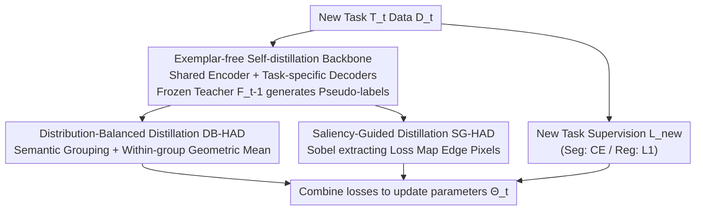

# HAD: Heterogeneity-Aware Distillation for Lifelong Heterogeneous Learning

**Conference**: CVPR 2026  
**Paper**: [CVF Open Access](https://openaccess.thecvf.com/content/CVPR2026/html/Zhang_HAD_Heterogeneity-Aware_Distillation_for_Lifelong_Heterogeneous_Learning_CVPR_2026_paper.html)  
**Code**: https://github.com/Deexaa/HAD  
**Area**: Continual Learning / Lifelong Learning / Dense Prediction  
**Keywords**: Lifelong Learning, Catastrophic Forgetting, Heterogeneous Tasks, Self-distillation, Dense Prediction

## TL;DR
This paper extends lifelong learning from "homogeneous task streams" to "heterogeneous task streams" (LHL) and instantiates it in dense prediction scenarios (LHL4DP). It proposes HAD (Heterogeneity-Aware Distillation), an exemplar-free method that utilizes a frozen teacher to generate pseudo-labels for self-distillation. Two complementary terms, Distribution-Balanced HAD (DB-HAD) and Saliency-Guided HAD (SG-HAD), are introduced to alleviate category/numerical imbalance in pseudo-labels and the loss of boundary information. The method significantly outperforms existing lifelong learning approaches on CityScapes, NYUv2, and Taskonomy.

## Background & Motivation
**Background**: The goal of lifelong learning (also known as continual learning or incremental learning) is to enable a model to learn a sequence of new tasks over time without forgetting old ones. The primary challenge is "catastrophic forgetting." However, most existing methods assume tasks are **homogeneous**—either all classification or all segmentation—with consistent output space structures.

**Limitations of Prior Work**: In the real world, tasks are often **heterogeneous**. For example, autonomous driving agents require a single model to simultaneously perform segmentation (discrete category labels), depth estimation (continuous depth maps), and surface normal estimation (continuous 3D vectors). When these tasks are learned sequentially, old classification and regression experiences have completely different structures, causing existing homogeneous-assumption methods to fail. For instance, Continual Semantic Segmentation (CSS) relies on class labels/probabilities which do not exist in regression, and domain-aware designs in Incremental Depth Estimation (IDE) cannot be transferred to segmentation.

**Key Challenge**: Heterogeneous task streams require the simultaneous preservation of **structurally distinct heterogeneous knowledge** (semantic structure for segmentation vs. 3D scene understanding for depth). Furthermore, due to privacy and temporal inconsistencies in data collection, historical data cannot be stored for joint training. The tension between "preserving heterogeneous knowledge" and "storing no old data" has not been addressed by traditional lifelong learning. The authors demonstrate (Fig.1) that naive sequential training in LHL4DP leads to catastrophic forgetting for all tasks, regardless of the task order.

**Goal**: ① Formally define this broader setting—Lifelong Heterogeneous Learning (LHL)—and instantiate it as LHL4DP; ② Design an exemplar-free method to preserve heterogeneous knowledge.

**Key Insight**: Although old data cannot be stored, all tasks **share the same input domain**. Thus, the "teacher" model trained in the previous stage can generate pseudo-labels on current new task data, "projecting" old task knowledge onto new data for self-distillation. The problem is that dense prediction pseudo-labels are naturally **imbalanced in distribution** (a few categories/numerical intervals occupy the vast majority of pixels), and the most informative boundary pixels constitute a tiny fraction, meaning naive distillation is overwhelmed by the majority pixels.

**Core Idea**: Replace naive pixel-wise distillation with two complementary distillation losses—distribution balancing and saliency guidance—to address pixel distribution imbalance and boundary information preservation, respectively.

## Method

### Overall Architecture
HAD addresses LHL4DP: a sequence of heterogeneous dense prediction tasks $\{T_t\}_{t=1}^T$ arrives sequentially, sharing an input space $X$, but each task has its own output space $Y_t$ (discrete classes / continuous depth / continuous normals). The model uses a **task-shared encoder** $f_{\omega_t}$ to extract fine-grained features and **task-specific decoders** $\{g_{\varepsilon_t^i}\}$ for mapping to respective outputs.

The workflow for the $t$-th training stage is: parameters $\Theta_t$ are initialized from $\Theta_{t-1}$, and a new task decoder $\varepsilon_t^t$ is expanded. A task-specific supervision loss $L_{new}$ (L1 for depth, Cross-Entropy for segmentation) is used to learn the new task $T_t$. Simultaneously, the frozen old learners $\{F_j^{t-1}\}$ from the previous stage act as **teachers** to generate pseudo-labels for each old task $T_j$ on the new task data $D_t$. Two heterogeneity-aware distillation losses (DB-HAD + SG-HAD) align student predictions with these pseudo-labels to preserve old knowledge. The total loss is:

$$L = \frac{\lambda}{2(t-1)}\sum_{j=1}^{t-1} L_{had,j} + L_{new}, \qquad L_{had,j} = \mathbb{E}_{x\in D_t}\big[L_{db,j}(x) + L_{sg,j}(x)\big].$$.

### Key Designs

**1. Exemplar-free Self-distillation Framework: Projecting old knowledge via shared input domain**

To address the challenge of "no old data but preserving heterogeneous knowledge," HAD stores no old samples (exemplar-free). Instead, it exploits the shared input domain across all tasks: on the data $D_t$ of new task $T_t$, the frozen old learner $F_j^{t-1}$ directly generates pseudo-labels for each old task, which the student $F_j^t$ is then trained to align with. The shared encoder accumulates cross-task features, while task-specific decoders handle heterogeneous outputs. When a new task arrives, only one decoder is expanded; the rest are initialized from $\Theta_{t-1}$. Ablations (Tab.3) compare several paradigms—updating only old decoders, learning the new task before patching old decoders, or updating only the new decoder—and show that "simultaneous learning and self-distillation (DIS)" is superior for maintaining shared representations.

**2. DB-HAD Distribution-Balanced Distillation: Semantic grouping + Within-group geometric mean**

The issue with naive distillation is the extreme imbalance in pseudo-label pixel distributions (Fig.3: a few classes dominate pixels in segmentation; certain numerical ranges dominate in depth). Pixel-wise losses from majority classes dominate optimization, drowning out rare but critical semantics. DB-HAD first partitions pseudo-labels into $C_j$ **semantic groups**: in classification, one group equals one class (using indicator functions to build binary masks $M_{c,j}^x[m,n]=\mathbb{I}(F_j^{t-1}(x)[m,n]=c)$); in regression, channels are averaged to a scalar, min-max normalized to $[0,1]$, and binarized into foreground/background groups using threshold $\delta$. Within each group, the **geometric mean** (rather than arithmetic mean) is used to smooth the pixel-wise distillation loss, suppressing the influence of pseudo-label noise/outliers. The groups are then arithmetically averaged to ensure equal contribution:

$$L_{db,j}(x) = \sum_{c=1}^{C_j}\frac{1}{C_j}\Big(\prod_{(m,n)\in I_{c,j}(x)} L_{dis,j}\big(F_j^t(x),F_j^{t-1}(x)\big)[m,n]\Big)^{\frac{1}{|I_{c,j}(x)|}}.$$

Ablations show: removing DB-HAD drops performance by 2.84%, and replacing the geometric mean with an arithmetic mean drops it by 6.29% (validating the robust noise-resistance of the geometric mean). For regression, the foreground/background binary split also outperforms uniform fixed-width binning (5/10/15 bins).

**3. SG-HAD Saliency-Guided Distillation: Identifying boundary pixels via Sobel on loss maps**

The most informative signals in dense prediction are concentrated at **semantic boundaries / numerical discontinuities**, but these pixels are sparse and can be diluted by flat regions even with DB-HAD. SG-HAD's insight is to identify edges not on the prediction map, but on the **teacher-student pixel-wise distillation loss map** $I_j(x)=L_{dis,j}(F_j^t(x),F_j^{t-1}(x))$. Using a Sobel operator (horizontal kernel $G_h$, vertical kernel $G_v$), it calculates gradient magnitude $G_j(x)=\sqrt{(G_h*I_j)^2+(G_v*I_j)^2}$, and selects salient pixels $P_j(x)=\{(m,n)\mid G_j(x)[m,n]>k\}$ where $k$ is a threshold. Loss is only accumulated on these significant pixels: $L_{sg,j}(x)=\sum_{(m,n)\in P_j(x)}\frac{1}{|P_j(x)|}I_j(x)[m,n]$. Comparison between "loss map gradients" and "prediction map gradients" (Fig.5) shows the former provides clearer edges for boundary localization. Removing SG-HAD drops performance by 1.27%, confirming it as an effective complement to DB-HAD.

### Loss & Training
The total objective is summarized in the Overall Architecture section: for each old task $T_j$, the distillation term $L_{had,j}=L_{db,j}+L_{sg,j}$ is summed over $t-1$ tasks, weighted by $\frac{\lambda}{2(t-1)}$, and combined with $L_{new}$. The backbone uses DeepLabV3+ (ResNet-18/-50 with dilated convolutions as the shared encoder and ASPP as task-specific decoders). $\lambda$ controls distillation intensity, while $\delta$ and $k$ control grouping and boundary selection.

## Key Experimental Results

### Main Results
All methods use the DeepLabV3+ architecture. Two metrics are used: **Mean Relative Gain** $\Delta_v^m$ relative to naive training (aggregated across tasks and metrics, higher is better) and **Mean Rank** (MR, lower is better).

| Dataset / #Tasks | Encoder | Metric | HAD | Best Baseline | Joint (Upper Bound) |
|------|------|------|------|----------|-------------|
| NYUv2 / 3 Tasks | ResNet-18 | $\Delta_v^m$↑ | **+32.74%** | LwF +24.74% | +40.83% |
| NYUv2 / 3 Tasks | ResNet-50 | $\Delta_v^m$↑ | **+35.71%** | LwF +32.94% | +44.36% |
| Taskonomy / 10 Tasks | ResNet-18 | $\Delta_v^m$↑ | **+10.90%** | iCaRL +8.47% | +44.57% |

Baselines include EWC, LwF, iCaRL, DER, SPG, SGP, along with Naive Sequential Training (lower bound) and Joint Training (upper bound). HAD achieves the highest $\Delta_v^m$ and best/second-best MR across different architectures and task counts. On Taskonomy (10 tasks), it achieves an MR of 3.50 (best among all lifelong learning methods) and the lowest test loss on the majority of individual tasks.

### Ablation Study
| Configuration | $\Delta_v^m$ (Relative to full HAD) | Description |
|------|------|------|
| HAD (Full) | +0.00% | Full model, MR 1.00 |
| w/o SG-HAD | -1.27% | Remove saliency boundary loss |
| w/o DB-HAD | -2.84% | Remove distribution balancing loss |
| w/ Arithmetic | -6.29% | Replace geometric mean with arithmetic mean |
| $\hat{C}_j=5/10/15$ | -3.64% / -5.43% / -9.72% | Use fixed-width binning for regression instead of foreground/background |

### Key Findings
- **DB-HAD contributes more than SG-HAD**: Removing DB-HAD (-2.84%) results in a larger drop than removing SG-HAD (-1.27%), indicating pixel distribution imbalance is the primary issue in dense prediction distillation.
- **Geometric mean is the core of DB-HAD**: Replacing it with an arithmetic mean causes a 6.29% drop—worse than using no grouping at all—confirming its value in resisting pseudo-label noise.
- **Coarse grouping is better for regression**: Uniformly splitting into 5/10/15 groups monotonically worsens performance (-3.64% to -9.72%), as fine grouping leads to fewer samples per group and unstable geometric means.
- **LHL4DP provides additional benefits**: Compared to training separate models for each task, the shared encoder saves 172.23% in additional parameter overhead (ResNet-18/10 tasks) and shows task positive transfer (e.g., gains of 1.38% / 5.2% / 9.87% on segmentation/depth/normals for NYUv2).

## Highlights & Insights
- **Contribution at the setting level**: Extending lifelong learning to heterogeneous tasks (LHL/LHL4DP) is a major contribution. While previous works focused on class-incremental or domain-incremental tasks, this paper is the first to directly tackle "heterogeneous task types (classification + regression mixing)" with structurally different output spaces.
- **Ingenious use of Sobel on loss maps**: Directly calculating gradients on the prediction map captures all texture edges. By calculating gradients on the teacher-student distillation loss map, the method specifically identifies pixels where the "teacher and student disagree most," unifying "saliency" with "knowledge to be preserved."
- **Robustness of Geometric Mean**: Using geometric means for intra-group smoothing of pixel-wise losses is a lightweight, reusable trick that could benefit other pseudo-label self-training tasks.

## Limitations & Future Work
- **Reliance on Appendix**: Many details, such as $L_{new}$ formulations, sequence robustness analysis, and sensitivity analyses, are relegated to the Appendix, making it harder to judge task-order sensitivity from the main text.
- **Shared input domain assumption**: The pseudo-label generation assumes all tasks share the same input image domain. If input distributions vary significantly across tasks (e.g., cross-modal), teacher pseudo-label quality may degrade.
- **Hyperparameter sensitivity**: Thresholds $\delta, k$ and weight $\lambda$ require tuning for different task combinations, which may increase deployment costs.
- **Future directions**: Exploring adaptive grouping counts, extending saliency guidance to temporal/video dense prediction, or combining with parameter-isolation methods to further reduce forgetting.

## Related Work & Insights
- **vs. EWC / SPG / SGP (Regularization)**: These methods constrain old knowledge via parameter importance regularization. HAD constrains outputs via pseudo-label distillation, achieving significantly higher $\Delta_v^m$ in heterogeneous settings.
- **vs. iCaRL / DER (Replay)**: Replay methods store historical samples/predictions. HAD is exemplar-free and outperforms them (10.90% vs. 8.47% for iCaRL), making it more suitable for privacy-sensitive scenarios.
- **vs. LwF (Distillation)**: HAD improves upon classic LwF by replacing naive distillation with distribution-balanced and saliency-guided components tailored for dense prediction.
- **vs. CSS / IDE (Task-specific CL)**: Unlike task-specific methods tied to segmentation or depth, HAD's heterogeneity-aware losses are uniformly applicable to both discrete and continuous outputs.

## Rating
- **Novelty**: ⭐⭐⭐⭐⭐ First formalization of Lifelong Heterogeneous Learning (LHL/LHL4DP).
- **Experimental Thoroughness**: ⭐⭐⭐⭐ Solid results across three datasets, though much robustness analysis is in the Appendix.
- **Writing Quality**: ⭐⭐⭐⭐ Clear motivation and derivations; main text is slightly constrained by page limits.
- **Value**: ⭐⭐⭐⭐ Aligns well with real-world needs in autonomous driving and robotics; exemplar-free nature is easy to deploy.

<!-- RELATED:START -->

## Related Papers

- [\[CVPR 2026\] Anti-Degradation Lifelong Multi-View Clustering](anti-degradation_lifelong_multi-view_clustering.md)
- [\[CVPR 2026\] FEAT: Federated Geometry-Aware Correction for Exemplar Replay under Continual Dynamic Heterogeneity](feat_federated_geometry_aware_correction_for_exemplar_replay_under_continual_dynamic_heterogeneity.md)
- [\[CVPR 2026\] Cluster-aware Anchor Learning for Multi-View Clustering](cluster-aware_anchor_learning_for_multi-view_clustering.md)
- [\[CVPR 2026\] Cross-View Distillation and Adaptive Masking for Incomplete Multi-View Multi-Label Classification](cross-view_distillation_and_adaptive_masking_for_incomplete_multi-view_multi-lab.md)
- [\[CVPR 2026\] PAF: Perturbation-Aware Filtering for Open-Set Semi-Supervised Learning](paf_perturbation-aware_filtering_for_open-set_semi-supervised_learning.md)

<!-- RELATED:END -->
