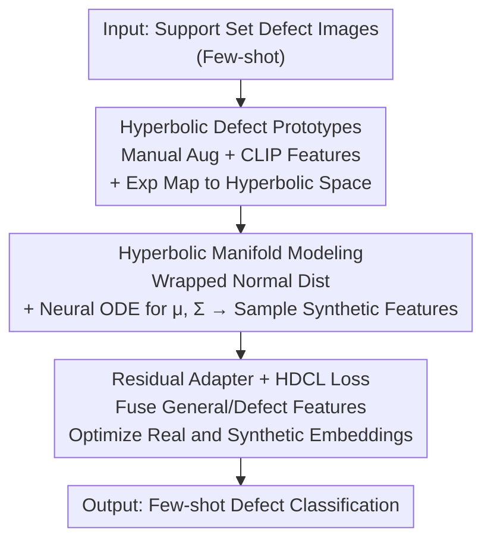

# Hyperbolic Defect Feature Synthesis for Few-Shot Defect Classification

**Conference**: CVPR 2026  
**Paper**: [CVF Open Access](https://openaccess.thecvf.com/content/CVPR2026/html/Li_Hyperbolic_Defect_Feature_Synthesis_for_Few-Shot_Defect_Classification_CVPR_2026_paper.html)  
**Code**: TBD  
**Area**: Industrial Defect Classification / Few-Shot Learning / Hyperbolic Representation Learning  
**Keywords**: Hyperbolic Space, Defect Feature Synthesis, Few-Shot Classification, Prototype Modeling, Contrastive Learning

## TL;DR
This paper proposes HypDFS, which shifts defect feature synthesis from Euclidean space to **hyperbolic space**. By modeling defect distributions with sparse hyperbolic prototypes, sampling synthetic features, and employing a residual adapter with hierarchical defect contrastive losses, HypDFS leverages the inherent "tree-like hierarchy" of industrial defects. It significantly outperforms Euclidean baselines on MVTec-FS and MTD few-shot benchmarks.

## Background & Motivation

**Background**: Industrial production is shifting from "large-batch single-product" to "small-batch multi-product" cycles, where defect classification often suffers from extremely limited samples. Defect synthesis is a major strategy to address few-shot classification, categorized into: manual rule augmentation (rotation/flip/noise), AIGC generation (GAN/Diffusion), and **feature-level synthesis** (generating features directly in the feature space). Feature-level synthesis provides a balanced trade-off between computational efficiency and performance.

**Limitations of Prior Work**: Existing feature-level defect synthesis methods (e.g., SimpleNet using pre-trained features + noise) **operate entirely in Euclidean space**. However, Euclidean space is "flat" and struggles to capture the complex structural relationships of defect data—specifically the natural tree-like hierarchy of defects (e.g., "leather" defects branching into "glue," "fold," and "color," with "color" further branching by shade or size).

**Key Challenge**: There is a mismatch between the "flatness" of Euclidean space and the "exponential growth" of defect hierarchies. The number of tree nodes grows exponentially with depth, while Euclidean volume only grows polynomially with radius, leading to squeezed or distorted hierarchical representations. Quantitatively, the "leather" category in MVTec-FS exhibits an average branching factor of 9.3 at tree depth 3, reflecting exponential growth characteristics.

**Goal**: Extend defect feature synthesis into hyperbolic space to allow synthetic features to preserve and enhance hierarchical semantics, leading to more generalized representations and improved few-shot classification.

**Key Insight**: Hyperbolic space (a Riemannian manifold with constant negative curvature) expands exponentially in volume relative to its radius, making it naturally suited for embedding tree-structured data. Given the hierarchical nature of defect semantics, their distributions should be modeled in hyperbolic space.

**Core Idea**: Model latent defect distributions using sparse "hyperbolic defect prototypes" to sample synthetic features, then optimize both real and synthetic embeddings using a "hyperbolic distance-driven hierarchical defect contrastive loss."

## Method

### Overall Architecture
HypDFS takes a few defect images from the support set as input and outputs a classifier capable of assigning query images to the correct defect class. During training, three modules operate in sequence: (1) extracting global and cropped features using pre-trained CLIP and applying an exponential map to obtain **hyperbolic defect prototypes**; (2) modeling the manifold of each defect class via a wrapped normal distribution combined with a neural ODE to sample **synthetic defect features**; (3) training a **residual adapter** to dynamically fuse general and defect-specific features, optimized by a **hierarchical defect contrastive loss** (HDCL). During evaluation, query images are classified into support set categories guided by the trained adapter.

### Key Designs

**1. Hyperbolic Defect Prototypes: Euclidean Feature Extraction followed by Exponential Mapping**

The primary challenge is the scarcity of samples, which biases distribution estimation. The authors expand defect images $I_{hd}=\mathrm{AUG}(I)$ using manual augmentations (rotation/translation/scaling) and extract features $f_{hd}=\mathrm{CLIP}(I_{hd})$ as prototype sources. Euclidean prototypes $f$ sampled from $f_{hd}$ are mapped to the Poincaré ball using the exponential map: $h=\exp_u^c(f)=u\oplus_c\big(\tanh(\sqrt{c}\tfrac{\lambda_u^c\lVert f\rVert}{2})\tfrac{f}{\sqrt{c}\lVert f\rVert}\big)$, where $c$ is the curvature, $\lambda_u^c=2/(1+c\lVert u\rVert^2)$ is the conformal factor, and $u$ is the origin 0. $\oplus_c$ denotes the Möbius addition in hyperbolic space (Eq. 1). The hyperbolic distance $d_{\mathbb{D}_c}$ is defined using $\mathrm{arctanh}$ (Eq. 2), which recovers Euclidean distance as $c \to 0$. This ensures that "prototypes," the core carriers of few-shot learning, are embedded in a hierarchy-aware geometry.

**2. Hyperbolic Manifold Modeling + Neural ODE: Modeling Classes with Wrapped Normal Distributions**

To sample new features, the distribution of each defect class must be modeled. The authors utilize the wrapped normal distribution $\mathcal{P}(z\mid c,h,\mu,\Sigma)$ (Eq. 5), which is derived by projecting a Gaussian $\mathcal{N}(\cdot\mid\mu,\Sigma)$ from the tangent space onto the manifold via the logarithmic map $\log_u^c$, multiplied by a hyperbolic distance-dependent volume correction factor $\tfrac{\sqrt{c}\,d_{\mathbb{D}_c}(h,z)}{\sinh(\sqrt{c}\,d_{\mathbb{D}_c}(h,z))}$. To mitigate bias from limited prototypes, a **neural ODE** (Runge–Kutta numerical solver) iteratively computes the parameters $\mu_i,\Sigma_i=\mathrm{RK}(\mu_0,\Sigma_0,\mathrm{ODE}_\mu,\mathrm{ODE}_\Sigma,i)$ (Eq. 7), where $\mathrm{ODE}_\mu/\mathrm{ODE}_\Sigma$ are FC/Self-Attention networks. Synthetic defect features $h_{sd}$ are sampled in the tangent space and mapped back (Eq. 4) using the reparameterization trick to maintain differentiability.

**3. Residual Adapter + HDCL Loss: Fusing Features and Enforcing Hierarchical Distances**

To adapt generalist knowledge from CLIP to the defect domain, a residual adapter concatenates real features $f$ with synthetic features $f_{sd}$ (mapped back via log-map): $f_{in}=\mathrm{CON}(f,f_{sd})$, followed by $f_{out}=\mathrm{SiLU}(Wf_{in})+f_{in}$ (Eq. 8). The total loss is $\mathcal{L}_{hdcl}=\mathcal{L}_{ce}+\alpha\mathcal{L}_s+\beta\mathcal{L}_{cl}$ (Eq. 10). The synthesis constraint $\mathcal{L}_s$ (Eq. 9) uses hyperbolic distance and a margin $m_d$ to prevent synthetic features from collapsing onto prototypes or clustering too densely. The contrastive term $\mathcal{L}_{cl}$ (Eq. 11) performs contrastive learning between global features $h_{wd}$ and corresponding crop features $h_{cd}$ based on hyperbolic distance (temperature $\tau$), explicitly capturing the "whole-to-part" hierarchical relationship.

### Loss & Training
The total loss is $\mathcal{L}_{hdcl}=\mathcal{L}_{ce}+\alpha\mathcal{L}_s+\beta\mathcal{L}_{cl}$, with defaults $\alpha=\beta=0.1$, $\tau=0.3$, and curvature $c=0.05$ (selected heuristically). Optimized using AdamW with an initial learning rate of 1e-4 and cosine annealing. Default batch size is 32. AlphaCLIP (ViT-L/14) is used as the backbone. Evaluation follows the N-way K-shot setting with $K\in\{1,3,5\}$, trained on a single RTX 3090.

## Key Experimental Results

Datasets: MVTec-FS (few-shot version of MVTec-AD, 14 products, 46 defects, 1228 images) and MTD (magnetic tile defects, 5 classes, 392 images). Metric: Mean Accuracy (%).

### Main Results: Comparison with SOTA

| Dataset | K | Prev. Best (Zip-A-F [29]) | HypDFS (Ours) | Gain |
|--------|---|--------------------------|----------------|------|
| MVTec-FS | 1 | 73.7 | **79.3** | +5.6 |
| MVTec-FS | 3 | 86.1 | **89.3** | +3.2 |
| MVTec-FS | 5 | 89.4 | **91.7** | +2.3 |
| MTD | 1 | 55.4 | **59.4** | +4.0 |
| MTD | 3 | 67.6 | **78.6** | +8.7 |
| MTD | 5 | 78.6 | **86.4** | +7.8 |

(HypDFS consistently outperforms Euclidean methods such as CLIP-Adapter, CLIP-ProtoNet, Tip-A-F, and Zip-A-F, with particularly significant gains on the challenging MTD dataset.)

### Ablation Study (MTD, K=5)

| Module / Config | Key Metric | Description |
|------------|---------|------|
| Residual Adapter: NO → Real → Real&Syn | 69.5 → 78.1 → **86.4** | Adapter only +8.6; adding synthetic features +8.3. Confirms synthesis as the core gain. |
| Loss: Euclidean → Hyperbolic → HDCL | 78.1 → 79.2 → **86.4** | Switching to hyperbolic +1.1; adding HDCL +7.2. |
| Curvature $c$: 0 (Euclidean) → 0.1 | 78.1 → 79.1 | Heuristic curvature outperforms Euclidean; learnable $c$ was less effective (79.2 vs 78.9). |
| Backbone: VanillaCLIP → AlphaCLIP | 52.5 → 69.5 | Masked AlphaCLIP focuses better on defect regions, +17.0. |

### Key Findings
- **Synthesis provides the largest contribution**: In the adapter ablation, "Real → Real&Syn" provides an 8.3% boost, demonstrating that hyperbolic synthetic features are the primary source of improvement.
- **Hyperbolic space requires contrastive loss**: Simply switching the geometry provides only a 1.1% gain. The benefit of hyperbolic geometry is realized only when HDCL "pulls apart" the hierarchical levels.
- **Curvature tuning is non-trivial**: Accuracy is stable across $c$ in [0.01, 1.0], but learnable curvature did not yield better results.
- **AlphaCLIP masks are critical**: AlphaCLIP's ability to focus on defect regions via masks provides a 17% baseline improvement over VanillaCLIP.

## Highlights & Insights
- **Geometric Alignment is the Key Insight**: Defect semantics are inherently hierarchical. Since hyperbolic volume grows exponentially, aligning the representation space with the data's intrinsic geometry is more effective than stacking Euclidean tricks.
- **Neural ODE for Parameter Estimation**: Using ODE solvers instead of direct moment estimation for $\mu, \Sigma$ mitigates estimation bias in few-shot scenarios.
- **Global-Crop Hyperbolic Contrast**: Explicitly encoding the hierarchy between full images and local defect crops into the loss function is the mechanism that translates hyperbolic geometry into classification gains.

## Limitations & Future Work
- The method was validated only on two industrial benchmarks; performance on broader datasets requires further evaluation.
- Curvature $c$ is tuned heuristically; a principled, interpretable method for curvature selection remains an open problem.
- The pipeline is relatively complex, combining manual augmentation, multiple CLIP variants, wrapped normal distributions, neural ODEs, and multi-component losses, leading to high reproduction and tuning overhead.

## Related Work & Insights
- **vs. SimpleNet [28] (Euclidean Synthesis)**: SimpleNet uses Euclidean noise; HypDFS uses hyperbolic manifold modeling to preserve hierarchical semantics, leading to more generalized representations.
- **vs. CutPaste [22] / MVREC [29] (Manual Augmentation)**: These methods rely on domain knowledge for image-level surgery; HypDFS synthesizes in the feature space for richer variations.
- **vs. CLIP-Adapter [10] / Zip-A-F [29] (CLIP Fine-tuning)**: These operate in Euclidean space without hierarchy modeling. HypDFS outperforms them by optimizing in hyperbolic space with synthetic features.

## Rating
- Novelty: ⭐⭐⭐⭐ (First to bring hyperbolic defect synthesis, solid geometric motivation, though components like ODEs and Wrapped Normal are existing tools.)
- Experimental Thoroughness: ⭐⭐⭐⭐ (Comprehensive ablation, though limited to two benchmarks and lacks detailed computational cost analysis.)
- Writing Quality: ⭐⭐⭐⭐ (Clear logic and motivation; formulas follow standard hyperbolic geometry conventions.)
- Value: ⭐⭐⭐⭐ (Significant performance jumps in few-shot industrial classification, opening a new direction for hyperbolic defect analysis.)

<!-- RELATED:START -->

## Related Papers

- [\[CVPR 2026\] Language Does Matter for Cross-Domain Few-Shot Visual Feature Enhancement](language_does_matter_for_cross-domain_few-shot_visual_feature_enhancement.md)
- [\[CVPR 2026\] Data-Centric Meta-Learning for Robust Few-Shot Generalization](data-centric_meta-learning_for_robust_few-shot_generalization.md)
- [\[CVPR 2026\] NAF: Zero-Shot Feature Upsampling via Neighborhood Attention Filtering](naf_zero-shot_feature_upsampling_via_neighborhood_attention_filtering.md)
- [\[ECCV 2024\] An Incremental Unified Framework for Small Defect Inspection](../../ECCV2024/others/an_incremental_unified_framework_for_small_defect_inspection.md)
- [\[CVPR 2026\] HypeVPR: Exploring Hyperbolic Space for Perspective to Equirectangular Visual Place Recognition](hypevpr_exploring_hyperbolic_space_for_perspective_to_equirectangular_visual_pla.md)

<!-- RELATED:END -->
