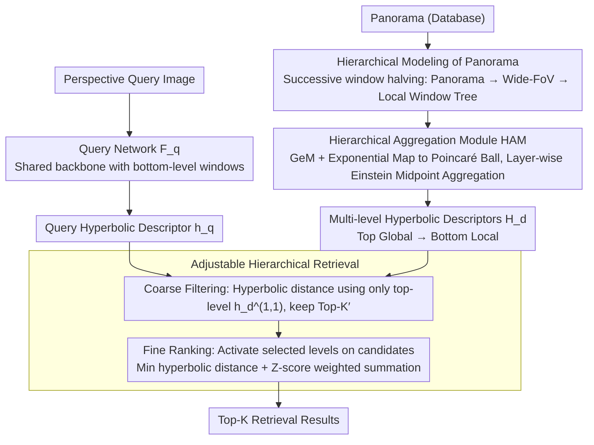

# HypeVPR: Exploring Hyperbolic Space for Perspective to Equirectangular Visual Place Recognition

**Conference**: CVPR 2026  
**arXiv**: [2506.04764](https://arxiv.org/abs/2506.04764)  
**Code**: [https://suhan-woo.github.io/HypeVPR/](https://suhan-woo.github.io/HypeVPR/) (Project Page)  
**Area**: Others  
**Keywords**: Visual Place Recognition, Hyperbolic Space, Panoramic Images, Hierarchical Embedding, Perspective-to-Equirectangular Matching

## TL;DR
This paper proposes HypeVPR, a visual place recognition framework based on hierarchical embeddings in hyperbolic space. It specifically addresses the cross-field-of-view matching problem between perspective images (queries) and equirectangular images (database). By constructing multi-level descriptors from local to global in the Poincaré ball, it achieves a flexible balance between accuracy, efficiency, and storage, with retrieval speeds significantly faster than sliding window baselines while maintaining comparable accuracy.

## Background & Motivation
Visual Place Recognition (VPR) locates a position by retrieving the most similar images from a database relative to a query image, serving as a core capability for autonomous navigation and mobile robotics. Traditional P2P (perspective-to-perspective) methods require storing images from multiple directions for each location to cover all possible query viewpoints, leading to enormous storage and retrieval overhead.

The **Perspective-to-Equirectangular (P2E) framework** offers a more practical solution: the database uses panoramas to represent each location (one image covers all directions), while queries remain standard perspective images. However, P2E faces a **Key Challenge**: panoramas contain 360° information whereas queries cover a limited field of view (FoV). How can a descriptor be extracted from a single panorama that both encodes global context and precisely matches local perspectives?

Existing methods (PanoVPR, Orhan et al.) either perform sliding window cropping on panoramas for one-by-one comparison ($O(n)$ comparisons, extremely slow) or fail to capture the internal structured relationships of the panorama.

**Key Insight**: Visual scenes naturally possess a **hierarchical structure**—a panorama contains multiple wide-FoV sub-views, and each sub-view contains narrower local perspectives. **Hyperbolic space** is naturally suited for modeling hierarchical relationships (where exponential distance growth allows embedding tree structures with low distortion), making it more appropriate than Euclidean space for organizing multi-level descriptors of panoramas.

## Method

### Overall Architecture
HypeVPR addresses the asymmetry in P2E retrieval: the query is a narrow-FoV perspective image, while each database location is a 360° panorama. Both must be mapped to the same metric space for distance calculation. The framework consists of two network branches. The query network $\mathcal{F}_q$ compresses the perspective image into a single hyperbolic descriptor $\mathbf{h}_q$. The database network $\mathcal{F}_d$ decomposes each panorama into a hierarchical tree of "panorama → wide-FoV sub-views → local windows" and uses a Hierarchical Aggregation Module (HAM) to encode this tree into a set of multi-level hyperbolic descriptors $\mathbf{H}_d$ ranging from global to local. Instead of matching the panorama directly to the query, retrieval first uses top-level global descriptors for fast coarse filtering, followed by fine-ranking using lower-level fine-grained descriptors—preserving global context while accurately aligning with the area actually seen by the query.

### Key Designs

**1. Hierarchical Modeling of Panorama: Decomposing a panorama into a coarse-to-fine window tree**

In a panorama, only a small ribbon-like region truly matches the query; the remaining 300+ degrees are redundant. Hard-encoding the entire image into a single descriptor dilutes the matching signal. HypeVPR cuts windows by successively halving the horizontal FoV: the top level $\ell=1$ is the full panorama, and each subsequent level halves the horizontal width, $I_d^{(\ell)} \in \mathbb{R}^{H \times \frac{W'}{2^{\ell-1}} \times C}$. At the bottom level, the window FoV and resolution align with the perspective query image, allowing the bottom windows to share the same backbone as the query network. This tree enables "coarse-to-fine" retrieval—identifying the general orientation in the top level and locking onto the precise local perspective in the bottom level.

**2. Hierarchical Aggregation Module (HAM): Aggregating descriptors in hyperbolic space with geometric respect for hierarchy**

Simple averaging in Euclidean space would blur "global abstraction" and "local details." HAM first performs GeM pooling + Linear layers to obtain Euclidean descriptors $\mathbf{d}_d^{(\ell,j)}$, then projects them onto the Poincaré ball via the exponential map: $\mathbf{h}_d^{(\ell,j)} = \exp_0^c(\mathbf{d}_d^{(\ell,j)})$. A key property of hyperbolic space is that points closer to the origin represent abstract global semantics, while points further away represent fine-grained local concepts, perfectly corresponding to the levels of the window tree. Aggregation of adjacent windows uses the **Einstein midpoint** instead of the arithmetic mean:

$$\mathcal{A}_{hyp}(h_1,\dots,h_n) = \frac{\sum_j \gamma_j h_j}{\sum_j \gamma_j}, \qquad \gamma_j = \frac{1}{\sqrt{1-c\|h_j\|^2}}$$

Where $\gamma_j$ is the Lorentz factor, giving higher weight to descriptors near the boundary (fine-grained). This norm-aware weighting ensures aggregation follows the hyperbolic distance structure, avoiding the geometric distortion of Euclidean averaging that flattens different levels of information.

**3. Adjustable Hierarchical Retrieval: Inference-time level selection for accuracy-efficiency trade-off without retraining**

Different deployment scenarios require different speeds and accuracies, but traditional methods fix this ratio after training. HypeVPR utilizes the hierarchical structure for cascade retrieval: it first performs coarse retrieval using only the top-level descriptor $\mathbf{h}_d^{(1,1)}$ for each location to get Top-$K'$ candidates. Then, it rescores these candidates using sub-descriptors from a user-selected set of levels $\mathbb{L}$. The score for each level is the minimum hyperbolic distance between the query and all sub-windows in that level: $d_\ell = \min_k d_c(\mathbf{h}_q, \mathbf{h}_d^{(\ell,k)})$. Level scores are normalized via Z-score and weighted into a final score: $s = \sum_{\ell \in \{1\} \cup \mathbb{L}} w_\ell \hat{s}_\ell$. Since the candidate set shrinks significantly after coarse filtering, expensive fine-grained comparisons only happen on a few candidates. Activating specific levels is a simple inference-time switch—fewer levels for speed, more for accuracy—without requiring any retraining.

### Mechanism

Tracing a perspective query through the retrieval process clarifies how the "tree" and "cascade" work. In experiments, database panoramas are cut at $W'=224\times 8$, corresponding to $L=4$ levels with $2^{L-1}=8$ windows at the bottom, each 224 wide to align with the $224\times224$ query. Each database location is encoded by HAM into a pyramid of descriptors: 1 panorama-level at level 1, 2 at level 2, 4 at level 3, and 8 at level 4.

**Coarse Filtering**: The query descriptor $\mathbf{h}_q$ is compared only against the top-level $\mathbf{h}_d^{(1,1)}$ of each database location. Top-$K'$ locations are kept. This is fast even for large databases because only one comparison per location is needed, aiming to pick candidates with the correct general vicinity.

**Fine Ranking**: Lower levels are activated only for these $K'$ candidates. If level 4 is activated, $\mathbf{h}_q$ is compared against the 8 local window descriptors of a candidate to find $d_4 = \min_k d_c(\mathbf{h}_q, \mathbf{h}_d^{(4,k)})$. This step automatically selects the window that actually overlaps with the query's FoV (e.g., the 5th window at 45° behind) and naturally ignores the other 7 windows. Scores from activated levels are Z-score normalized across the $K'$ candidates and weighted to produce the final score $s$, outputting the Top-$K$ results.

This process contracts the search from the "entire database" to $K'$ and finally to specific windows, mimicking a mental process of "is it on this street?" followed by "is it this orientation?"

### Loss & Training
The framework is optimized end-to-end using a triplet structure, centered on a **Hierarchical Triplet Loss** $\mathcal{L}_{hier}$: descriptors with overlapping FoVs in adjacent levels are treated as positive pairs, while non-overlapping ones in the same level are negative pairs. All distances are measured in hyperbolic space, explicitly embedding the "parent includes child" hierarchical relationship into the hyperbolic space. Standard triplet loss for query-database matching is added to ensure perspective queries align with corresponding panorama windows.

## Key Experimental Results

### Main Results

| Method | Backbone | Pitts250K R@1 | Pitts250K R@5 | YQ360 R@1 | YQ360 R@5 | Time per query (ms) |
|------|----------|------|------|------|------|------|
| PanoVPR×16 (ConvNeXt-S) | ConvNeXt-S | 40.3 | 63.0 | 46.0 | 83.2 | 48.6 |
| HypeVPR-L (ConvNeXt-S) | ConvNeXt-S | **43.4** | **64.3** | **52.4** | **85.2** | **14.0** |
| Orhan et al.* | ResNet-101 | 47.0 | 66.4 | 47.6 | 79.2 | 1555.2 |
| HypeVPR-O* | ResNet-50 | **66.5** | **82.1** | **53.6** | **81.2** | **4.0** |

### Ablation Study

| Configuration | Key Metrics | Description |
|------|---------|------|
| HypeVPR-B vs PanoVPR×8 (Swin-T) | R@1: 29.4 vs 22.0 (Pitts) | Single descriptor outperforms 8-window sliding window |
| HypeVPR-L vs PanoVPR×16 (Swin-T) | R@1: 32.5 vs 33.6 (Pitts) | Comparable accuracy but 3.5x faster |
| HypeVPR-B speed vs PanoVPR×8 | 3.6ms vs 17.0ms | 4.7x speedup |
| HypeVPR-L speed vs PanoVPR×16 | 14.0ms vs 48.6ms | 3.5x speedup |
| HypeVPR-O* vs Orhan et al.* | Time: 4.0ms vs 1555.2ms | 388x speedup, R@1 Gain: 19.5 |

### Key Findings
- Under conditions using additional large-scale data (HypeVPR-O*), Pitts250K R@1 reaches 66.5%, far exceeding Orhan's 47.0% with a 388x speedup.
- Hierarchical retrieval allows HypeVPR to outperform sliding-window PanoVPR even when using fewer sub-descriptors (-B mode).
- Hyperbolic space embeddings preserve the local-to-global hierarchy of panoramas better than Euclidean space.
- The speed-accuracy trade-off can be flexibly controlled at inference by selecting active levels without retraining.

## Highlights & Insights
- Introducing hyperbolic space to VPR is a natural and compelling innovation: the nested relationship of Panorama → Sub-view → Local area is inherently a tree.
- Einstein midpoint aggregation ensures hierarchical aggregation respects hyperbolic geometry, avoiding geometric distortion from simple averaging.
- Adjustable hierarchical retrieval is a practical feature: it allows sacrificing a small amount of accuracy for significant speedups when deployed on edge devices.

## Limitations & Future Work
- The number of bottom-level windows grows exponentially with levels ($2^{L-1}$), leading to high memory and compute overhead when $L$ is large.
- Experiments were conducted only on two datasets (Pitts250K-P2E and YQ360); more extensive validation for generalization is needed.
- The selection of weights $w_\ell$ in hierarchical retrieval appears manual and could be learned or adaptive.
- Using a shared backbone for both perspective queries and panorama windows might not be globally optimal.

## Related Work & Insights
- The core difference from PanoVPR is that while PanoVPR uses brute-force P2P sliding window search, HypeVPR reduces matching complexity from $O(n)$ to $O(\log n)$ via hierarchical embeddings.
- While hyperbolic embeddings have been applied in NLP (Poincaré embeddings) and image retrieval, this is the first application to P2E VPR.
- The design of hierarchical triplet loss could be extended to other visual matching problems with natural hierarchies.

## Rating
- Novelty: ⭐⭐⭐⭐⭐ The combination of hyperbolic space, hierarchical panorama modeling, and adjustable retrieval is highly novel and logical.
- Experimental Thoroughness: ⭐⭐⭐⭐ Comparisons with other frameworks are sufficient, though the number of datasets is limited.
- Writing Quality: ⭐⭐⭐⭐ Strong theoretical foundation, clear diagrams, and a convincing motivation.
- Value: ⭐⭐⭐⭐ A practical solution for P2E VPR, with significant value for real-world deployment due to its speed advantage.

<!-- RELATED:START -->

## Related Papers

- [\[ICCV 2025\] Learning Visual Hierarchies in Hyperbolic Space for Image Retrieval](../../ICCV2025/others/learning_visual_hierarchies_in_hyperbolic_space_for_image_retrieval.md)
- [\[ICCV 2025\] A Hyperdimensional One Place Signature to Represent Them All: Stackable Descriptors For Visual Place Recognition](../../ICCV2025/others/a_hyperdimensional_one_place_signature_to_represent_them_all_stackable_descripto.md)
- [\[CVPR 2026\] Hyperbolic Defect Feature Synthesis for Few-Shot Defect Classification](hyperbolic_defect_feature_synthesis_for_few-shot_defect_classification.md)
- [\[CVPR 2026\] Modeling the Visual Ambiguity of Human Sketches](modeling_the_visual_ambiguity_of_human_sketches.md)
- [\[ICLR 2026\] Exploring State-Space Models for Data-Specific Neural Representations](../../ICLR2026/others/exploring_state-space_models_for_data-specific_neural_representations.md)

<!-- RELATED:END -->
