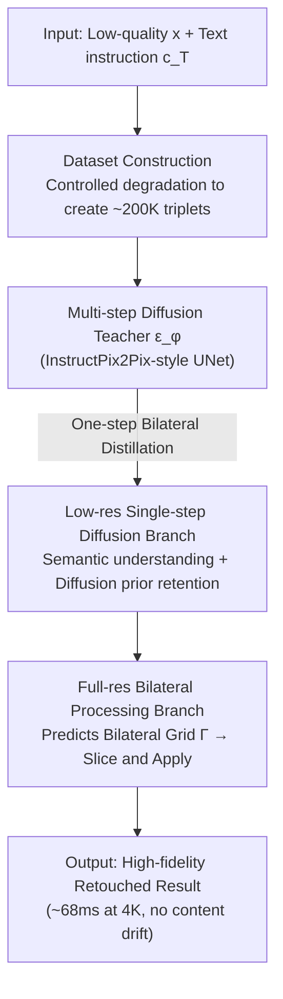

# InstantRetouch: Efficient and High-Fidelity Instruction-Guided Image Retouching with Bilateral Space

**Conference**: CVPR 2026  
**Paper**: [CVF Open Access](https://openaccess.thecvf.com/content/CVPR2026/html/Wu_InstantRetouch_Efficient_and_High-Fidelity_Instruction-Guided_Image_Retouching_with_Bilateral_Space_CVPR_2026_paper.html)  
**Code**: https://openimaginglab.github.io/InstantRetouch/ (Project Page)  
**Area**: Image Restoration and Enhancement / Instruction-Guided Retouching / Diffusion Distillation / Bilateral Grid  
**Keywords**: Language-guided retouching, Bilateral grid, One-step distillation, Variational Score Distillation, Content fidelity

## TL;DR
InstantRetouch shifts language-guided photo retouching from "direct pixel/latent editing" to "predicting a single set of affine transformation grids in a compact, content-disentangled bilateral space." By distilling a multi-step diffusion teacher into a single-step generator using Variational Score Distillation (VSD), it achieves 68ms inference at 4K resolution—70–900 times faster than diffusion baselines—while maintaining near-perfect content fidelity (zero content drift).

## Background & Motivation
**Background**: Language-guided retouching (adjusting tones and styles via natural language) offers finer and more expressive control compared to traditional enhancement algorithms. Recently, large diffusion-based editing models like Step1X-Edit, FLUX.1-Kontext, Qwen-Image, and Gemini-2.5-Flash have shown stunning performance in general editing (adding/removing objects).

**Limitations of Prior Work**: Applying these general editing models to **retouching** faces two major issues. ① **Fidelity**: Retouching should only involve photometric adjustments (brightness, color, tone) without altering geometry or texture; however, generative models fail to decouple these edits, often causing "content drift"—altering content, textures, or even human faces. ② **Efficiency**: Iterative diffusion processes are computationally expensive and slow. High-resolution retouching is particularly demanding, with many models natively unable to handle resolutions above 1K.

**Key Challenge**: The root cause is that generative editing **directly modifies the variational latent** of the input image, which encodes both "actual content" and "photometric information." Retouching only requires the latter, making the former redundant (lowering speed) and dangerous (risking unintended content changes). Retouching should ideally operate on a **smaller representation that concerns only visual appearance without content information**.

**Goal**: To identify a compact and content-disentangled representation for retouching that still leverages the strong semantic priors of diffusion models to "understand instructions and produce aesthetic results," while compressing multi-step diffusion into single-step inference.

**Key Insight**: Utilize **bilateral space**—a low-resolution 3D bilateral grid to store local affine transformations, applied to the full-resolution input via a learned guidance map slicing. This representation is extremely efficient even at 4K and is **faithful by design** (modifying only affine color transformations without touching content). Since bilateral space cannot "understand instructions" on its own, diffusion priors must be distilled into it.

**Core Idea**: Combine a "bilateral grid representation + dual-branch single-step generator + one-step bilateral distillation (VSD + prompt alignment loss + progressive two-stage training)" to compress a multi-step diffusion teacher into a single-step student that directly predicts bilateral grids.

## Method

### Overall Architecture
The method distills a multi-step diffusion teacher into a fast, single-step generator $G_\theta$ that directly predicts bilateral grids. The pipeline consists of two main stages: first, constructing a large-scale, high-quality retouching dataset of approximately 200,000 triplets $(x, x^\star, c_T)$ (input image, retouched target, text instruction) to fine-tune a multi-step diffusion teacher $\epsilon_\phi$; second, distilling the teacher's knowledge into the single-step bilateral grid generator. The generator $G_\theta$ comprises two synergistic branches: a **low-resolution single-step diffusion branch** for semantic understanding and retaining diffusion priors, and a **full-resolution bilateral processing branch** using a lightweight bilateral adapter to predict the grid, which is then "sliced and applied" to the high-resolution original image. Training follows a progressive strategy: first training the low-res branch (VSD + data loss + prompt alignment loss), then jointly training both branches with bilateral loss.

### Key Designs

**1. Bilateral Space Representation: Compressing retouching into a low-res affine grid for intrinsic fidelity and efficiency**

Rather than editing pixels or latents, the model predicts a low-resolution 3D bilateral grid $\Gamma \in \mathbb{R}^{H_g \times W_g \times D \times 12}$, where each cell stores local affine transformation parameters. At application, a fully differentiable "slice-and-apply" operator is used: for each full-resolution pixel $(x', y')$ and color $(r,g,b)$, a learned lookup table computes a grayscale guidance value $z=g(r,g,b)$. Trilinear interpolation of the grid based on spatial coordinates and the guidance value yields the affine matrix $A=\Gamma(x'W_g/W,\, y'H_g/H,\, z/d)$, resulting in the output color $O = A\cdot(r,g,b,1)^T$. Since this only performs affine color adjustments, geometry and texture are naturally preserved. Because the heavy computation stays on the low-res grid, the latency is virtually independent of resolution (68ms at 4K).

**2. Dual-Branch Single-Step Generator: Semantics via diffusion, fidelity via bilateral grid**

To ensure the model follows instructions, $G_\theta$ uses two branches. The low-resolution branch includes a frozen VAE encoder $E_\theta$ and a single-step U-Net denoiser $\epsilon_\theta$. It performs single-step denoising on white noise $z_{t_{max}}\sim\mathcal N(0,I)$ conditioned on the input latent $c_I=E_\theta(x)$ and instruction $c_T$, yielding $\hat z_0 = (z_{t_{max}} - \beta_t\epsilon_\theta)/\alpha_t$. During training, a VAE decoder produces a low-res image $\hat x$ for stable distillation; it is discarded during inference. The full-resolution branch is a lightweight bilateral adapter that outputs the grid $\Gamma$ in a single forward pass. This hybrid approach combines diffusion's semantic strength with bilateral space's structural fidelity.

**3. One-Step Bilateral Distillation: VSD + Prompt Alignment Loss with progressive training**

To handle the structural difference between student and teacher, the paper proposes **Latent Variational Score Distillation (VSD)**. A trainable regularizer $\epsilon_{\phi'}$ is introduced to model the student's distribution. The VSD gradient $\mathbb{E}\big[\omega(t)\,(\epsilon_\phi(\hat z_t)-\epsilon_{\phi'}(\hat z_t))\,\partial\hat z_0/\partial\theta\big]$ pushes the student toward the teacher. To prevent the loss of instruction coupling in single-step models, a **Prompt Alignment Loss** $\mathcal L_{align}$ is added. Instructions are decomposed into atomic attributes (e.g., `brightness:up`, `style:vintage`), and CLIP-based InfoNCE $\ell_{nce}(a)=-\log\frac{\exp(s^+_a/\tau)}{\exp(s^+_a/\tau)+\exp(s^-_a/\tau)}$ provides directional supervision. Training is split into **Stage 1** (low-res branch only) and **Stage 2** (end-to-end joint training with bilateral loss $\mathcal L_{bila}$).

**4. Dataset Construction via Controlled Degradation: 200,000 triplets from "good-to-bad" synthesis**

Lacking high-fidelity retouching instruction data, the authors reverse-engineered approximately 200,000 triplets. They filtered high-quality target images $x^\star$ from public datasets using aesthetic scores (MUSIQ/LAION). Each target underwent random photometric degradations (exposure, white balance, contrast, etc.) to synthesize input $x$. Grounding-SAM was used to apply localized degradations within region masks. Finally, Qwen2.5-VL-72B generated diverse retouching instructions $c_T$ based on the $(x, x^\star)$ pairs. This "good-to-bad" pipeline ensures that the transformation only involves photometric changes.

### Loss & Training
The total objective follows the two-stage strategy: Stage 1 utilizes $\mathcal L_{stage1}=\mathcal L_{data}+\lambda_{VSD}\mathcal L_{VSD}+\lambda_{align}\mathcal L_{align}$, and Stage 2 adds $\mathcal L_{bila}$. Training is performed at 512px using AdamW with EMA and mixed precision. Inference involves a single forward pass, applying the grid directly to the native resolution.

## Key Experimental Results

**Metrics**:
- **Content Fidelity**: SSIM, CW-SSIM, GMSD, DISTS (evaluated on grayscale/histogram-matched versions to isolate structural changes from intentional color shifts).
- **Editing Quality**: SC (Instruction-Image Alignment), PQ (Perceptual Quality), Overall Score $O=\sqrt{SC\times PQ}$ (all rated by GPT-4o).
- **Efficiency**: End-to-end latency for 720p to 4K resolutions.

### Main Results
Comparison on the iRetouch benchmark (excerpt from Table 1):

| Method | 720p Latency (s)↓ | 4K Latency (s)↓ | SSIM↑ | DISTS↓ | O↑ |
| :--- | :---: | :---: | :---: | :---: | :---: |
| 3DLUT | 0.066 | 0.201 | 0.982 | 0.024 | — |
| Qwen-Image | 7.720 | — | 0.689 | 0.147 | 8.39 |
| FLUX.1-Kontext-Pro | 10.235 | — | 0.802 | 0.132 | 8.12 |
| Gemini-2.5-Flash | 14.440 | — | 0.676 | 0.115 | **8.74** |
| **Ours** | **0.065** | **0.068** | **0.989** | **0.022** | 8.54 |

**Summary**: Ours maintains a near-constant latency of ~0.068s from 720p to 4K, outperforming generative baselines by 70–900x. Content fidelity (SSIM 0.989) is the highest among all instruction-driven methods, while editing quality (O 8.54) closely trails the top-tier closed-source Gemini-2.5-Flash.

### Ablation Study
Framework Ablation (Table 2):

| Configuration | Latency (s)↓ | SSIM↑ | O↑ | Notes |
| :--- | :---: | :---: | :---: | :--- |
| Bilateral Grid Prediction | 0.001 | **0.996** | 6.09 | Perfect fidelity but no instruction following |
| Student (Diffusion only) | 0.319 | 0.788 | 8.64 | Best instruction following but worst fidelity |
| **Ours (Dual-branch)** | 0.065 | **0.989** | 8.54 | Balanced high fidelity and quality |

### Key Findings
- **Dual-branch breaks the fidelity-quality trade-off**: While pure bilateral grids provide 0.996 SSIM, they fail to follow instructions (O 6.09). Diffusion models follow instructions well but ruin fidelity (SSIM < 0.84). The dual-branch architecture achieves both high SSIM (0.989) and high quality (O 8.54).
- **Prompt Alignment is crucial**: Adding $\mathcal L_{align}$ improved the semantic score (SC) from 7.257 to 8.140, specifically aiding weak/stylized instructions.
- **Constant Latency**: Unlike diffusion models that scale poorly with resolution, bilateral representations keep heavy computation at low resolution, enabling 4K processing in constant time.

## Highlights & Insights
- **Representation-level preservation**: By using bilateral affine grids instead of latent/pixel editing, content fidelity is "guaranteed by design" rather than just constrained by losses.
- **Cross-structure Distillation**: Successfully transferring knowledge from a multi-step diffusion teacher to a single-step bilateral grid generator via VSD provides a template for distilling diffusion priors into any efficient representation.
- **Decomposed Prompt Alignment**: Breaking down complex instructions into atomic attributes and supervising them via CLIP InfoNCE fixes the "forgetting" issue common in single-step distillation.
- **Good-to-bad synthesis**: Reversing the data flow ensures that the training set perfectly aligns with the non-destructive nature of retouching.

## Limitations & Future Work
- **Domain limitation**: Only supports photometric/tonal edits. It cannot handle structural changes or re-drawing tasks (e.g., "add a hat").
- **Reliability on external LLMs**: Heavy reliance on LLMs for data generation and evaluation creates potential biases.
- **Single-step gap**: There remains a minor quality gap (O 8.54 vs 8.74) compared to the multi-step teacher for extremely complex semantic edits.

## Related Work & Insights
- **vs. Large Diffusion Models**: While models like FLUX excel at general editing, they suffer from content drift and latency; Ours uses bilateral space to ensure 4K efficiency and tonal-only editing.
- **vs. 3DLUT/HDRNet**: Traditional methods are fast but lack instruction-following capabilities. Ours bridges this gap by making the bilateral grid "instruction-aware" via diffusion distillation.

## Rating
- **Novelty**: ⭐⭐⭐⭐⭐ Clever combination of bilateral space and diffusion distillation to solve retouching's efficiency/fidelity bottleneck.
- **Experimental Thoroughness**: ⭐⭐⭐⭐⭐ Wide range of metrics including fidelity consistency and identity preservation on PPR10K.
- **Writing Quality**: ⭐⭐⭐⭐ Clear motivation and mechanism, though the multi-stage loss configuration requires careful reading.
- **Value**: ⭐⭐⭐⭐⭐ Constant-time 4K retouching with zero drift has high practical value for product deployment.

<!-- RELATED:START -->

## Related Papers

- [\[CVPR 2026\] Differentiable Stroke Planning with Dual Parameterization for Efficient and High-Fidelity Painting Creation](differentiable_stroke_planning_with_dual_parameterization_for_efficient_and_high.md)
- [\[AAAI 2026\] Learning Compact Latent Space for Representing Neural Signed Distance Functions with High-fidelity Geometry Details](../../AAAI2026/others/learning_compact_latent_space_for_representing_neural_signed_distance_functions_.md)
- [\[CVPR 2026\] VideoMaMa: Mask-Guided Video Matting via Generative Prior](videomama_mask-guided_video_matting_via_generative_prior.md)
- [\[CVPR 2026\] HypeVPR: Exploring Hyperbolic Space for Perspective to Equirectangular Visual Place Recognition](hypevpr_exploring_hyperbolic_space_for_perspective_to_equirectangular_visual_pla.md)
- [\[CVPR 2026\] Consensus vs. Controversy: Mapping the Decision Space Where Architectures Diverge](consensus_vs_controversy_mapping_the_decision_space_where_architectures_diverge.md)

<!-- RELATED:END -->
