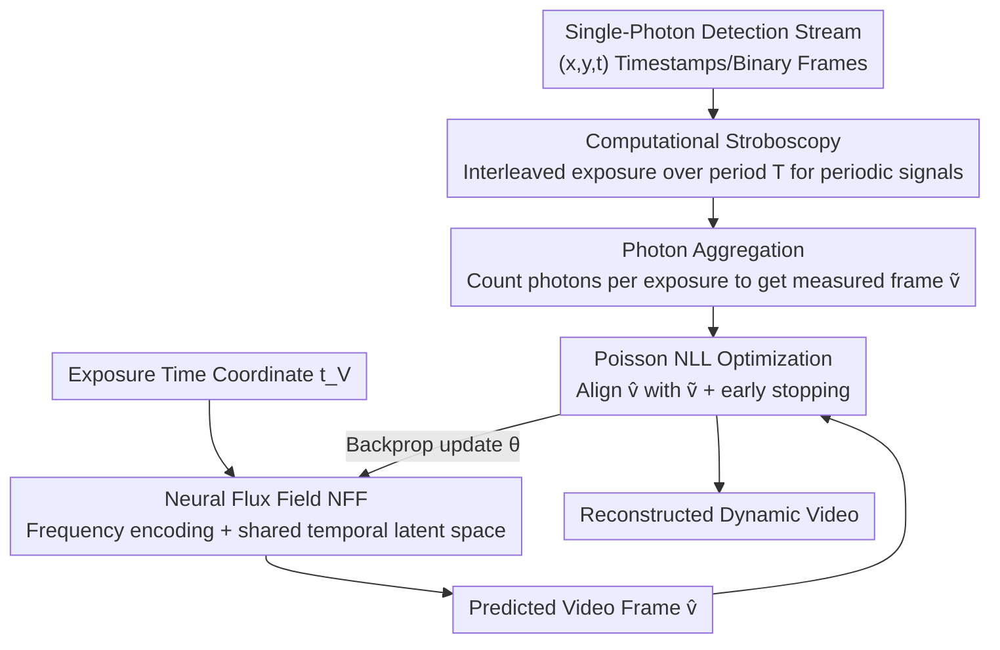

# Inter-Photon-Limited Videography

**Conference**: CVPR 2026  
**Paper**: [CVF Open Access](https://openaccess.thecvf.com/content/CVPR2026/html/Xie_Inter-Photon-Limited_Videography_CVPR_2026_paper.html)  
**Code**: [Project Page](https://www.dgp.toronto.edu/inter-photon) (Code repository not explicitly open-sourced)  
**Area**: Computational Photography / Single-Photon Imaging / Video Reconstruction  
**Keywords**: Single-photon cameras, photon-limited imaging, Neural Flux Fields, Poisson likelihood, computational stroboscopy

## TL;DR
This paper introduces "inter-photon-limited" videography, a neglected physical limit of imaging speed where pixels become "blind" when scene changes occur faster than photon arrivals. It characterizes this difficulty using a unified framework that reparameterizes time into "cycles per photon $f_p$". Utilizing an training-free **Neural Flux Field (NFF)** combined with Poisson statistics and spatio-temporal priors, it reconstructs previously unattainable dynamic videos from extremely sparse single-photon detections.

## Background & Motivation
**Background**: All video capture—whether high-light high-speed or low-light single-photon—implicitly assumes that "the amount of light is sufficient to support the designated frame rate and duration." From capturing bullets at a million frames per second and watching light propagation at a billion frames per second, to imaging in the dark using Single-Photon Avalanche Diode (SPAD) cameras, this assumption holds across various illumination and speed regimes.

**Limitations of Prior Work**: When light is too weak or the scene changes too fast, such that a pixel cannot receive a second photon between two adjacent photon arrivals, the pixel becomes **completely blind** to the "appearance changes occurring within the inter-photon time window"—regardless of how fast the camera itself is. Existing research widely conflates "photon-limited imaging" (low absolute light level, where photons are counted individually) with "inter-photon-limited imaging" (light levels too low relative to the scene change speed). The latter is significantly more challenging, causing existing reconstruction methods to fail completely under general scenarios.

**Key Challenge**: The only existing class of methods capable of breaking the inter-photon limit is strictly restricted to **periodic signals** (cross-period photon accumulation to infer structure), remaining powerless for arbitrary aperiodic scenes. Although self-supervised image/video reconstruction methods possess strong priors, they are designed for dense pixel arrays and cannot directly process the millions of **asynchronous photon events** collected across long time windows. Burst-style methods require flux changes to be much slower than photon arrival rates, while CNN/diffusion-based approaches can only take a limited number of photons in a single forward pass, failing to exploit long-range spatio-temporal dependencies.

**Goal**: (1) Provide a parameterization that enables unified comparison of imaging difficulty across varying illuminations and time scales; (2) Design a method that robustly reconstructs arbitrary (both periodic and aperiodic) dynamic scenes even in the inter-photon-limited regime.

**Key Insight**: The authors' key observation is that the natural variable for describing "reconstruction uncertainty" is not absolute time, but **frequency relative to the photon arrival rate**. A "bright and fast" and a "dim and slow" sinusoidal flux, as long as they receive the same average number of photons per cycle, share identical photon timestamp distributions and are "equally uncertain" to the camera.

**Core Idea**: Reparameterize time using the "average number of detected photons per pixel" ($p = t/\tau(x)$, where each pixel operates on its own "photon clock") to obtain a time-scale-invariant **inter-photon frequency $f_p$ (cycles per photon)**. Then, use an training-free Neural Flux Field (NFF) to fit a flux function that is consistent with the arrival timestamps of single photons.

## Method

### Overall Architecture
The method operates on two levels. The **analytical level** provides the inter-photon reparameterization: rewriting the instantaneous flux $\phi(x,t)$ into the "photon clock" domain $\psi(x,p)$, which defines the inter-photon frequency $f_p = f\,\tau(x)$ (unit: cycles per photon). Here, $f_p = 1$ acts as a soft physical speed barrier—beyond which a pixel cannot collect even one full photon within a single cycle. The **reconstruction level** is the Neural Flux Field (NFF): associating each frame exposure $\mathcal{V}_k$ with a time coordinate $t_{\mathcal{V}_k}$, feeding it into the network to predict the frame's integrated flux $\hat v$, and then aligning the predicted frame with the "measured frame obtained by counting photons over the exposure" $\tilde v$ via a Poisson negative log-likelihood (NLL) loss. The network parameters are optimized end-to-end (single-scene self-supervised, without large-scale pre-training). For periodic signals, **computational stroboscopy** is additionally used to design exposure intervals interleaved by the period $T$, which is equivalent to "filling light" to reduce $f_p$.

### Key Designs

**1. Inter-Photon Reparameterization: Making imaging difficulty a time-scale-invariant unified metric using "cycles per photon $f_p$"**

The limitation is that describing flux using absolute time, frequency, frame rate, and power ties the problem to specific hardware setups, obscuring the primary relationship between the "available photon quantity" and the "achievable speed". Instead, the authors use a relative unit—re-timing using the average number of detected photons $p = t/\tau(x)$, where $\tau(x)=\big(\frac{1}{T}\int_0^{T}\phi(x,t)\,dt\big)^{-1}$ is the average inter-photon interval for that pixel. Under this "photon clock", the flux is written as $\psi(x,p)=\phi(x,p\,\tau(x))\,\tau(x)$, and the corresponding inter-photon frequency is:

$$f_p = f\,\tau(x).$$

Its elegance lies in the fact that $f_p$ directly couples "how fast photons arrive" and "how fast the scene changes" into a single frequency—the larger $f_p$ is, the more photon-starved the system is. Based on this, the authors compare 14 video datasets spanning nearly 14 orders of magnitude (ranging from high-light high-speed cameras to quanta video and transient imaging) on a single plot. They discover that almost all systems (even single-photon designs) operate in the comfort zone of "thousands of photons per cycle," and very few methods execute in the $f_p\!>\!1$ regime, where prior methods collapse. This parameterization also reveals the fundamental differences between capture strategies: **reducing illumination** increases both the inter-photon interval and $f_p$, whereas **shortening exposure** does not; **stroboscopic synchronization** to the modulation frequency $f_{\text{sync}}$ is equivalent to folding time at the period boundaries, reducing the overall frequency by $f_{\text{sync}}$ times, which is equivalent to "filling light into the scene".

**2. Neural Flux Field (NFF): Enabling "bright pixels" to guide "dim pixels" using a pixel-independent shared temporal latent space**

The core challenge in inter-photon-limited reconstruction is the extreme sparsity of single-pixel signals. NFF designs the network $\Phi_\theta$ as a mapping from "time coordinates to integrated flux of the entire frame", $\hat v = \Phi_\theta(t_{\mathcal V})$, which consists of three stages: first, applying **temporal frequency encoding** to the normalized time coordinate in $[-1,1]$:

$$\gamma(t_{\mathcal V}) = \big[\,t_{\mathcal V},\ \sin(\boldsymbol\omega t_{\mathcal V}),\ \cos(\boldsymbol\omega t_{\mathcal V})\,\big]^{T},\quad \boldsymbol\omega=[2,2^2,\dots,2^{L}]^{T},\ L=16,$$

to enhance the representation of high-frequency variations. This encoding is fed into a **pixel-independent** four-layer MLP to output a high-dimensional latent vector, which is then reshaped into a $16\times16\times256$ spatial tensor. It then passes through a convolutional network with four residual blocks + $2\times$ bilinear upsampling (adapted from implicit video representation), and finally a softplus layer to yield the predicted frame. Crucially, forcing the initial layers to be "pixel-independent" compels the network to learn a **temporal latent space shared across all pixels**. Since the same temporal frequency $f$ corresponds to wildly different $f_p$ under varying $\tau(x)$, this sharing allows the changes revealed by "bright" pixels (with low $f_p$) to help infer the dynamics of "dim" pixels (with much higher $f_p$ but the same $f$)—which acts as the core prior designed to extract dynamics from sparse photons.

**3. Poisson Negative Log-Likelihood Self-Supervised Optimization: Treating consistency with photon arrival timestamps as the sole supervision**

Lacking ground-truth videos, the authors model photon detection as an inhomogeneous Poisson process with rate $\hat v(x)$. The supervision signal is the measured frame $\tilde v(x)=\lvert\{(x_i,y_i,t_i)\mid (x_i,y_i)=\mathbf x,\ t_i\in\mathcal V\}\rvert$, constructed by counting photons falling within each frame's exposure interval $\mathcal V$. The optimization objective is the Poisson NLL across all exposures:

$$\mathcal L(\theta)=\sum_{k=1}^{N}\sum_{\mathbf x}\big[\hat v_k(\mathbf x)-\tilde v_k(\mathbf x)\log \hat v_k(\mathbf x)\big].$$

This is a deep-image-prior-like approach—the network architecture itself serves as a spatio-temporal regularizer. It optimizes from scratch for each scene without requiring external training data. Consequently, **early stopping** (fixed at 30 epochs) is mandatory to prevent the network from memorizing random photon noise.

**4. Computational Stroboscopy: Interleaved exposure across periods for periodic signals to equivalently reduce $f_p$**

For fluxes with periodic components (e.g., flickering lights, stroboscopic lamps, projectors, ToF, pulsed lasers), the authors locate strong peaks in the Fourier spectrum of raw photon data via harmonic probing, iteratively refining the fundamental frequency $f$ (period $T=1/f$). They then design the frame exposures as **discontinuous** multi-segment intervals, with each segment spaced by the period $T$:

$$\mathcal V_k=\bigcup_{m=1}^{M}\big[t_{\mathcal V_k}+mT,\ t_{\mathcal V_k}+mT+\Delta t\big],$$

with $N=\lfloor T/\Delta t\rfloor$ exposures covering the full period. This allows each frame to accumulate photons across multiple repetition periods while preserving the intra-period temporal structure, significantly lowering the effective inter-photon frequency and enabling reconstruction even for transient-level scenes where $f_p>10^6$.

### Loss & Training
PyTorch implementation using Adam (learning rate $10^{-3}$) and a batch size of 128 temporal coordinates. A typical dataset contains 100k–130k frames. Training is fixed at 30 epochs with early stopping, converging in approximately 3.5 hours for a single scene on an NVIDIA RTX A6000 Ada GPU.

## Key Experimental Results

### Main Results
Evaluated on both captured and synthetic datasets, covering $f_p$ from $<1$ to $>10^6$. Photon data forms include quanta image sequences and picosecond-level timestamp streams.

| Scene / Competing Method | $f_p$ (with thinning) | Phenomenon / Conclusion |
|----------------|---------------------|-------------|
| Person jumping into elevator + strobe light (SPAD512, 100 kfps) | 2.37 → 5284 | Even when thinned by 3 orders of magnitude, NFF still reconstructs dynamic appearances. |
| Foam bullet + hand (aperiodic, extremely sparse) | 0.447 → 309 | When the bullet is thinned to invisibility, the slower and larger hand is still accurately reconstructed (validating the $f_p$ theory). |
| Milk splashing on cereal (high-speed video simulating photon stream) | 5 orders of magnitude higher than high-speed camera | Achieves comparable quality at points far beyond regular high-speed cameras ($f_p=10^{-6}\!\sim\!10^{-4}$). |
| 54 Hz rotating fan (40 photons/pixel/second) vs UWB [45] | 44.7 → 5188 | UWB harmonics fall to the noise floor leading to blurry results; NFF reconstructs clearly and holds up even after thinning. |
| Fan timestamps (free-running SPAD, computational stroboscopy) | $>10^6$ | Recovers slow-motion and transient videos superior to UWB using computational stroboscopy. |

### Ablation Study

| Configuration | Phenomenon | Explanation |
|------|------|------|
| NFF (Full) | Robust across all $f_p$ | Shared temporal latent space + Poisson NLL + Computational stroboscopy (for periodic signals) |
| NFF w/o computational stroboscopy vs UWB (Fan) | NFF is clear, UWB is blurry | Single-pixel methods ignore spatial correlation; harmonics are buried in noise |
| QBP [24] (Guitar, thinned to $f_p$=4.21 / 21.07) | QBP collapses to binary patterns, NFF recovers fine string movement | Insufficient photons for temporal accumulation |
| bit2bit [22] (Drill, $f_p$=2.82 → 1995 → 32359) | Original sequence is OK, aggressive thinning leads to motion blur | Temporal context window is too small; long-range correlations vanish |

### Key Findings
- **$f_p$ is a unified benchmark for predicting reconstruction difficulty**: In the same scene, slow and large objects (e.g., a hand) naturally generate more photons and are easier to recover, while fast and small objects (e.g., a bullet) are much harder—consistent with predictions from the $f_p$ parameterization.
- **Spatial correlation is the key breakthrough**: Single-pixel periodic methods like UWB fail at extreme $f_p$ because they neglect spatial structure, whereas NFF’s pixel-independent latent space succeeds by leveraging cross-pixel information.
- **Prior methods' failure modes are diverse but share a common origin**: Burst/QBP lack enough photons for accumulation, while CNN/bit2bit have too short of a temporal window. All essentially fail to exploit long-range spatio-temporal dependencies at the scale of inter-photon intervals.

## Highlights & Insights
- **Redefining "difficulty" as $f_p$**: Expressing difficulty as "cycles per photon", a time-scale-invariant quantity, places active and passive imaging systems spanning 14 orders of magnitude onto a single comparable map. It clearly distinguishes "photon-limited" from "inter-photon-limited" imaging—two concepts long conflated—making a profound conceptual contribution.
- **Training-Free Neural Flux Field**: Running single-scene self-supervision using the network architecture as a prior coupled with a Poisson NLL bypasses the engineering barrier of "millions of asynchronous photon events being incompatible with dense reconstruction networks."
- **Portable Design**: The pixel-independent shared temporal latent space design can be transferred to any inverse problem where signal sparsity varies drastically across locations, allowing dense areas to guide sparse ones (e.g., low-dose CT, sparse light fields).
- **Computational Stroboscopy**: Shifting physical stroboscopic sync to the reconstruction side (folding time in software) offers noise reduction and speedup potential for any weak signal containing known periodic components.

## Limitations & Future Work
- The authors acknowledge that, similar to other deep-image-prior-based methods, early stopping is required to prevent overfitting. Training NFF on short-integration frames incurs high overhead when repeatedly querying long exposures. Reconstruction quality degrades during **interpolation** between trained temporal indices.
- Whether the inter-photon reparameterization should be integrated directly into the reconstruction process (rather than serving only as an analytical tool) remains an open question.
- **Ours**: Optimization takes 3.5 hours per scene and lacks cross-scene generalization, meaning it is still far from real-time or online execution. Evaluation heavily relies on artificial thinning of original sequences to fabricate high $f_p$ regimes, offering limited coverage of true extreme low-light captures.
- Future Work: Integrating strong statistical priors of natural videos learned from generative models, along with the interaction between illumination and scenes in active lighting / computational stroboscopy, to push the boundaries of reconstructible $f_p$ even further.

## Related Work & Insights
- **vs UWB (Passive Ultra-Wideband) [45]**: Relying on strong periodic priors and single-pixel processing, UWB can access the inter-photon-limited regime but ignores spatial correlations and only works for periodic signals. NFF handles both periodic and aperiodic signals. By using cross-pixel shared latent spaces, it avoids blurring at extreme $f_p$ (e.g., the rotating fan).
- **vs Quanta Burst Photography [24]**: QBP aligns and merges photons to improve SNR but requires flux changes to be much slower than photon arrival, making accumulation impossible and causing results to collapse into binary patterns once thinned into the inter-photon-limited regime.
- **vs bit2bit [22]**: bit2bit employs a CNN to directly recover flux from photon timestamps, but has a limited temporal context window. Once $f_p$ increases, long-range correlations vanish, causing motion blur. In contrast, NFF's neural fields differentiably represent long-range dependencies over arbitrary integration domains.
- **vs prior periodic-only methods [28,45]**: While they infer structure solely by repeating multiple periods, this work extends capability to arbitrary aperiodic scenes.

## Rating
- Novelty: ⭐⭐⭐⭐⭐ Proposes and formalizes "inter-photon-limited" imaging, an overlooked speed limit of imaging, and introduces a time-scale-invariant unified framework $f_p$. Outstanding innovation at both conceptual and methodological levels.
- Experimental Thoroughness: ⭐⭐⭐⭐ Covers real and synthetic datasets with $f_p$ spanning 6 orders of magnitude, comparing against multiple baselines like UWB, QBP, and bit2bit. However, it relies heavily on artificial thinning to construct extreme scenarios and lacks a quantitative PSNR main table (relying mostly on visualization).
- Writing Quality: ⭐⭐⭐⭐⭐ Clear progression of concepts. The $f_p$ parameterization and analytical plots explain the motivation exceptionally well.
- Value: ⭐⭐⭐⭐⭐ Provides a universal difficulty metric for photon-starved imaging and a practical, training-free reconstruction paradigm, carrying foundational significance for the single-photon/transient imaging community.

<!-- RELATED:START -->

## Related Papers

- [\[CVPR 2026\] Dual-Band Thermal Videography: Separating Time-Varying Reflection and Emission Near Ambient Conditions](dual_band_thermal_videography_separating_time-varying_reflection_and_emission_ne.md)
- [\[CVPR 2025\] Image Reconstruction from Readout-Multiplexed Single-Photon Detector Arrays](../../CVPR2025/others/image_reconstruction_from_readout-multiplexed_single-photon_detector_arrays.md)
- [\[ICLR 2026\] A Scalable Inter-edge Correlation Modeling in CopulaGNN for Link Sign Prediction](../../ICLR2026/others/a_scalable_inter-edge_correlation_modeling_in_copulagnn_for_link_sign_prediction.md)
- [\[ICML 2026\] Spatial Priors via Space Filling Curves for Small and Limited Data Vision Transformers](../../ICML2026/others/spatial_priors_via_space_filling_curves_for_small_and_limited_data_vision_transf.md)
- [\[ACL 2025\] Inter-Passage Verification for Multi-evidence Multi-answer QA](../../ACL2025/others/inter-passage_verification_for_multi-evidence_multi-answer_qa.md)

<!-- RELATED:END -->
