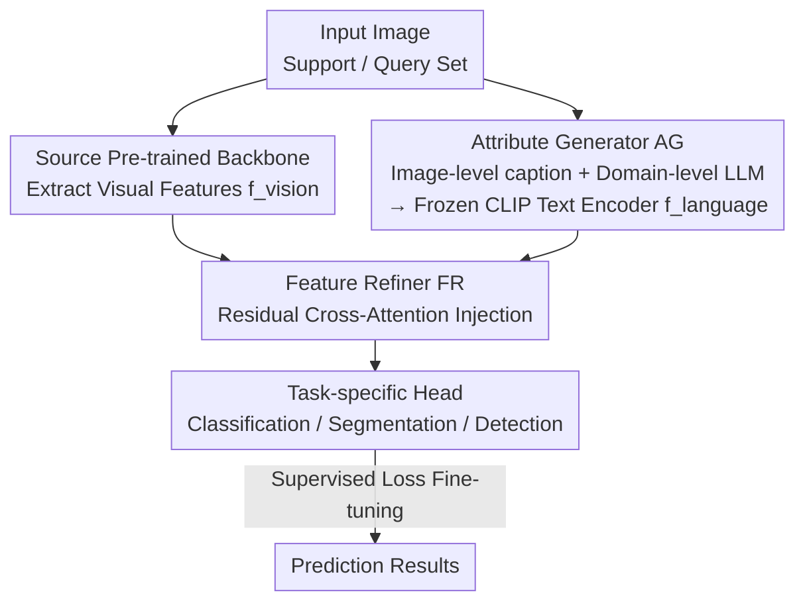

# Language Does Matter for Cross-Domain Few-Shot Visual Feature Enhancement

**Conference**: CVPR 2026  
**Paper**: [CVF Open Access](https://openaccess.thecvf.com/content/CVPR2026/html/Zhou_Language_Does_Matter_for_Cross-Domain_Few-Shot_Visual_Feature_Enhancement_CVPR_2026_paper.html)  
**Code**: https://github.com/SivanXT/LDM-CDFSL  
**Area**: Cross-Domain Few-Shot / Vision-Language  
**Keywords**: Cross-Domain Few-Shot, Language Attributes, Residual Cross-Attention, CLIP, Feature Enhancement

## TL;DR
To address the issue that "pure visual features easily learn non-transferable shortcut patterns" in cross-domain few-shot tasks, this paper uses image captioning models and Large Language Models (LLMs) to generate "image-level + domain-level" language attributes for each image. A lightweight residual cross-attention mechanism then embeds language semantics into visual features. This plug-and-play module can be integrated into classification, segmentation, and detection baselines, yielding consistent performance gains across multiple CD-FSL benchmarks.

## Background & Motivation
**Background**: The mainstream approach for Cross-Domain Few-Shot Image Interpretation (CD-FSII) is to fine-tune a visual model, pre-trained on large-scale source domain data, using a minimal number of labeled samples from the target domain. This enables migration to new domains with significant distribution shifts, covering tasks such as classification, semantic segmentation, and object detection.

**Limitations of Prior Work**: Significant differences exist between source and target domains across levels ranging from low-level (color, texture, resolution) to high-level (object composition, visual style, background context). Simultaneously, large variations in object appearance and extremely scarce labels in the target domain cause models fine-tuned solely on visual features to easily capture **shortcut patterns**. These patterns may be coincidentally relevant in the support set but fail in the query set, as they are fragile, context-dependent, and lack transferable high-level semantics.

**Key Challenge**: Drastic variations in object appearance require rich semantic guidance for alignment. However, the supervision signals available in few-shot scenarios are severely insufficient, forcing models to rely on shallow visual correlations and trapping them in a rigid, non-transferable feature space.

**Goal**: To supplement visual features with "high-level, cross-domain transferable semantics" without disrupting the existing fine-tuned pipelines, and to ensure this enhancement serves classification, segmentation, and detection tasks simultaneously.

**Key Insight**: The authors observe that the visual modality itself struggles to explicitly express high-level semantics such as "style, background, and object attributes," while language is naturally adept at such descriptions. Thus, the language modality is introduced—not by treating category labels as text to construct class prototypes, but by describing the **attributes of each individual image** and the **attributes of the entire domain**.

**Core Idea**: "Train" pre-trained visual features using language attribute descriptions. An image captioning model characterizes image-level attributes for individual images, while an LLM summarizes domain-level attributes for the entire domain. These language semantics are injected into visual features via residual cross-attention to pull the model away from shortcut patterns.

## Method

### Overall Architecture
The framework (termed the Cross-modal Visual Feature Enhancement framework, open-sourced as LDM-CDFSL) inserts two new modules into standard few-shot fine-tuning pipelines: the **Attribute Generator (AG)** and the **Feature Refiner (FR)**. For a target domain image, the source-domain pre-trained backbone $F_\theta$ first extracts visual features $f_{vision}\in\mathbb{R}^{h\times w\times d_v}$. Simultaneously, the AG generates a language representation $f_{language}$. The FR then uses residual cross-attention to inject language into the visual features, resulting in refined features $f_{refined}$, which are fed into task-specific heads (classifier/segmenter/detector) for loss calculation and fine-tuning. During inference, query images follow the same process: they generate language attributes, refine visual features, and then feed into task heads for prediction—adhering strictly to the **inductive inference** protocol of CD-FSL (each query utilizes only its own attributes without looking at the entire query set).

### Key Designs

**1. Attribute Generator (AG): Translating "Single-Image Attributes" and "Domain-Level Attributes" into Language**

To address the failure of pure visual features to capture high-level semantics, the AG constructs linguistic knowledge at two complementary levels. **Image-level attributes** use a pre-trained image-to-caption model to generate fine-grained content descriptions for each image, emphasizing task-related visual cues and weakening spurious correlations. **Domain-level attributes** involve feeding structured descriptions of the target domain into ChatGPT, which generates high-level semantic characterizations (e.g., domain-wide style/background) based on pre-defined templates. After merging the two levels, a **frozen CLIP text encoder** encodes them into a language representation $f_{language}\in\mathbb{R}^{1\times d_p}$. This coarse-to-fine design aligns with ablation findings: domain-level attributes provide global priors and high-level semantics, while image-level attributes provide instance-level details.

**2. Feature Refiner (FR): Lightweight Residual Cross-Attention to "Weld" Language into Visual Features**

A language representation alone is insufficient; it must be embedded losslessly into visual features. The FR uses visual features as the query ($Q$) and language representations as the key/value ($K/V$) for cross-attention: $Q=f_{vision}W_q,\ K=f_{language}W_k,\ V=f_{language}W_v$. The attention score $A=\frac{QK^\top}{\sqrt{d_k}}$ and weights $\alpha=\mathrm{Softmax}(A)$ are computed. Crucially, a **residual connection** is added to preserve the original visual information:

$$f_{refined}=\alpha V + f_{vision}W_r$$

This injects the transferable high-level semantics provided by language without losing original visual cues. The authors specifically set vision as the query; ablations show that "swapping Q/K/V roles" leads to performance drops, suggesting that "using vision to retrieve language semantics" is the correct direction. The entire module introduces only four fully connected layers, adding minimal parameter and training overhead.

**3. Plug-and-Play Universality from an Information Bottleneck Perspective**

This design explains the effectiveness and supports universality. From the Information Bottleneck (IB) perspective, the refined feature $f_{refined}$ acts as an intermediate representation $Z$. The goal is $L_{IB}=I(X;Z)-\beta I(Z;Y)$. By injecting language, the model reduces dependence on shortcut visual cues, lowering $I(X;Z)$ (which decreases $H(Z)$, simplifies the hypothesis space, and tightens generalization bounds), while simultaneously increasing $I(Z;Y)$ using domain-related semantics. Since neither AG nor FR depends on specific task heads, the framework is **task-agnostic and plug-and-play**, allowing it to be integrated into existing baselines such as StyleAdv, PMF, CD-CLS, IFA, GPRN, and CD-ViTO across classification, segmentation, and detection.

### Loss & Training
During the fine-tuning phase on the support set $T_S$, for each support image, image-level and domain-level language representations are derived via the AG, and refined features are obtained via the FR. These are sent to the task head $G_\phi$ for prediction. All learnable parameters are optimized using the task-specific loss (e.g., Cross-Entropy or MSE): $L=\sum_{\{X_S,Y_S\}\in T_S}\mathrm{Loss}(G_\phi(f_{refined}),Y_S)$. All hyperparameters, such as optimizers and learning rates, are kept consistent with the original baselines for fair comparison.

## Key Experimental Results

### Main Results
Evaluation covers Cross-Domain Few-Shot Classification (CD-FSC: mini-ImageNet $\to$ EuroSAT/ISIC/ChestX/CropDisease), Segmentation (CD-FSS: PASCAL VOC $\to$ ISIC/Chest X-Ray/FSS-1000/DeepGlobe), and Detection (CD-FSOD: COCO $\to$ 6 domains including ArTaxOr). The framework consistently improves performance across multiple baselines (values represent relative average gains across domains for each task):

| Task | Baseline | 1-shot Gain | 5-shot Gain | Remarks |
|------|----------|-------------|-------------|---------|
| CD-FSC | StyleAdv | +2.5% | +1.9% | Avg. 4 domains |
| CD-FSC | PMF | +4.83% | +3.33% | Avg. 4 domains |
| CD-FSC | CD-CLS | +3.36% | +2.34% | Avg. 4 domains |
| CD-FSS | IFA | +4.1% | ≈ Similar | Avg. 4 domains |
| CD-FSS | GPRN | +2.9% | ≈ Similar | Avg. 4 domains |
| CD-FSOD | CD-ViTO | +4.4% | +5.4% | 10-shot +7.3% |

It is observed that the more "difficult" the task and the "scarcer" the labels (e.g., detection, or higher-shot budgets), the more significant the relative gains from language enhancement. ⚠️ Note: For CD-FSS 5-shot, the original text mentions "similar improvements" without providing exact numerical values.

### Ablation Study
Using CD-FSS with the IFA baseline on ISIC and Chest X-Ray to decouple the contributions of the two attribute levels (absolute increase over baseline, %):

| Configuration | ISIC 1-shot | ISIC 5-shot | Chest 1-shot | Chest 5-shot |
|---------------|-------------|-------------|--------------|--------------|
| Image-level only | +4.3 | +2.0 | +5.9 | +6.0 |
| Domain-level only | +3.8 | +1.9 | +5.6 | +5.6 |
| Two-level (Full) | Further Improvement | Further Improvement | Further Improvement | Further Improvement |

Additional variant comparisons (Table 5) show: ① Even when the baseline is supplemented with the same number of MLPs ("Baseline w/ same MLP"), the proposed method is still significantly better, proving that gains are not merely due to increased parameter count; ② Removing residual connections, replacing cross-attention with element-wise addition/multiplication, or swapping Q/K/V roles all result in performance drops.

### Key Findings
- **Two-level attributes are complementary and indispensable**: Image-level attributes provide instance details whereas domain-level attributes provide global priors. Together, they form a "coarse-to-fine" semantic spectrum; neither is as effective alone.
- **Direction of cross-attention is crucial**: Using vision as the query to "ask" language is superior to the reverse or element-wise fusion—indicating that visual features should actively retrieve linguistic semantics rather than simply being overlaid.
- **Gains amplify with task difficulty**: The largest gains are seen in detection (CD-FSOD) and higher-shot budgets, with 10-shot detection showing an average gain of +7.3%.

## Highlights & Insights
- **The concept of "describing attributes" rather than "category labels" is clever**: Most prior cross-modal CD-FSII methods use class names as text to construct prototypes. This paper shifts to describing attributes of individual images and the entire domain, directly addressing the root cause of "pure visual shortcuts."
- **Extremely lightweight residual cross-attention**: By adding only four FC layers and using vision as the query with language as key/value, plus a residual connection to safeguard original visual information, the method adds almost no training cost while remaining a plug-and-play module for any task head.
- **IB explanation provides a solid theoretical foundation**: Using language to lower $I(X;Z)$ (removing shortcuts) and raise $I(Z;Y)$ (complementing semantics) provides a clear theoretical basis for why language enhancement improves cross-domain generalization, moving beyond purely empirical results.

## Limitations & Future Work
- **Strong dependency on external model quality**: Image-level attributes depend on captioning models and domain-level attributes on ChatGPT. If descriptions are inaccurate or contain hallucinations, the injected semantics will be noisy. The paper does not deeply analyze sensitivity to description quality.
- **Domain-level attributes require manual "structured domain descriptions"**: A template for the target domain must be provided to the LLM. This may become a bottleneck for entirely unfamiliar domains that are hard to summarize in words. ⚠️ The degree of automation for these templates is not explicitly clarified.
- **Language representation is compressed into a single vector**: Compressing a whole attribute description into $f_{language}\in\mathbb{R}^{1\times d_p}$ (one token-level representation) might lose fine-grained spatial semantics. Future work could explore multi-token injection aligned with visual spatial positions.

## Related Work & Insights
- **vs. Class Prototype Text Fusion (Han et al. / Shangguan et al.)**: These works treat labels as text and use CLIP to encode them into class-level prototypes for fusion. This work instead embeds "image + domain attribute descriptions" into the visual features themselves, aiming for transferable high-level semantics rather than discriminative prototypes.
- **vs. Prompt Tuning (Zhuo et al. / Wu et al.)**: These works learn visual prompts or feed support set information into learnable prompts to modulate features. This paper uses explicit natural language attribute descriptions and cross-attention injection, providing more explicit semantic sources in a task-agnostic manner.
- **vs. Pure Visual CD-FSL Fine-tuning (StyleAdv/PMF/CD-CLS, etc.)**: These methods rely on normalization, adversarial training, or linear transformations within the visual modality to alleviate overfitting. This work sits on top of them, complementing the high-level semantics they lack via the language modality.

## Rating
- Novelty: ⭐⭐⭐⭐ The use of "describing attributes rather than class names" + residual cross-attention injection is clear, though individual components are relatively standard.
- Experimental Thoroughness: ⭐⭐⭐⭐⭐ Covers three tasks (classification/segmentation/detection), multiple baselines, and target domains, with detailed ablations on attribute levels and attention direction.
- Writing Quality: ⭐⭐⭐⭐ Complete logical chain from motivation and method to IB analysis; note that some formulas may require reference to the original text due to potential OCR artifacts.
- Value: ⭐⭐⭐⭐ Plug-and-play, low overhead, and cross-task gains make this highly practical for the cross-domain few-shot community.

<!-- RELATED:START -->

## Related Papers

- [\[CVPR 2026\] Hyperbolic Defect Feature Synthesis for Few-Shot Defect Classification](hyperbolic_defect_feature_synthesis_for_few-shot_defect_classification.md)
- [\[CVPR 2026\] Data-Centric Meta-Learning for Robust Few-Shot Generalization](data-centric_meta-learning_for_robust_few-shot_generalization.md)
- [\[CVPR 2026\] NAF: Zero-Shot Feature Upsampling via Neighborhood Attention Filtering](naf_zero-shot_feature_upsampling_via_neighborhood_attention_filtering.md)
- [\[CVPR 2026\] DDSF: Robust Few-Shot Learning via Disentangled Subspaces with Determinantal Point Process](ddsf_robust_few-shot_learning_via_disentangled_subspaces_with_determinantal_poin.md)
- [\[ACL 2025\] ALGEN: Few-Shot Inversion Attacks on Textual Embeddings via Cross-Model Alignment](../../ACL2025/others/algen_few-shot_inversion_attacks_on_textual_embeddings_via_cross-model_alignment.md)

<!-- RELATED:END -->
