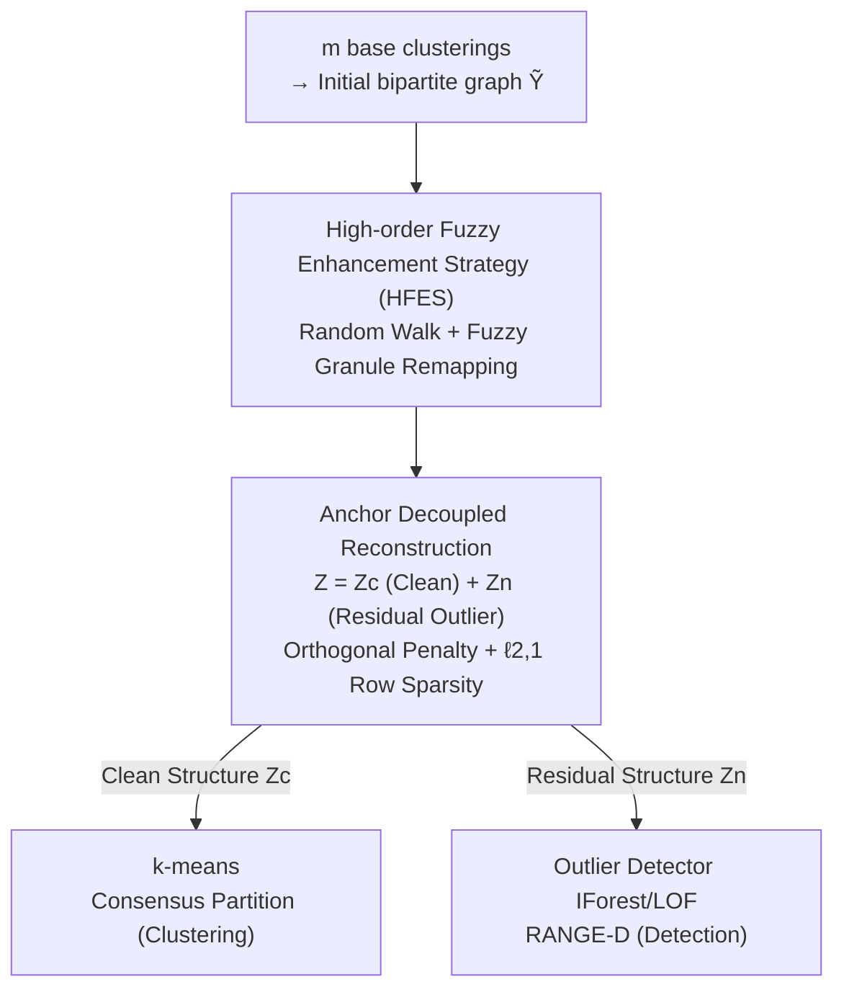

# Large-scale Robust Enhanced Ensemble Clustering via Outlier Decoupling

**Conference**: CVPR 2026  
**Paper**: [CVF Open Access](https://openaccess.thecvf.com/content/CVPR2026/html/Xu_Large-scale_Robust_Enhanced_Ensemble_Clustering_via_Outlier_Decoupling_CVPR_2026_paper.html)  
**Code**: https://github.com/middle258/RANGE  
**Area**: Ensemble Clustering / Unsupervised Learning  
**Keywords**: Ensemble clustering, Anchors, Outlier decoupling, Bipartite graph enhancement, Outlier detection

## TL;DR
Addressing the issue where anchor-based ensemble clustering produces biased anchors due to "reconstructing contaminated base clusterings," this paper proposes RANGE. It first utilizes a high-order fuzzy enhancement strategy to improve bipartite graph reliability. It then explicitly decomposes the similarity matrix into "clean structure + residual outlier structure" in the anchor space, using orthogonal penalties and $\ell_{2,1}$-norm constraints to isolate pollution into a few anchor directions. This residual structure also enables outlier detection, forming a cross-task framework with linear complexity scalable to millions of samples.

## Background & Motivation
**Background**: Ensemble clustering refines a consensus partition from multiple base clustering results using only decision-level information. Most methods convert base clusterings into an $n\times n$ co-association (CA) matrix to characterize sample similarity. However, processing the CA matrix requires at least $O(n^2)$ complexity, making it difficult to scale to large-scale data.

**Limitations of Prior Work**: To break the computational bottleneck, anchor-based methods introduce representative "anchors" to replace sample-sample similarity with anchor-sample similarity via a three-step process (anchor selection, similarity matrix construction, and clustering). The quality of the similarity matrix determines clustering accuracy. However, existing methods (fixed anchors via k-means or dynamic updates via reconstruction) ignore a key problem: **base clustering results are inherently unreliable**—especially when data is contaminated by outliers, distorting base clusterings. Reconstructing these distorted results to minimize error produces **biased anchors** and contaminated similarity matrices.

**Key Challenge**: The reconstruction goal attempts to faithfully approximate base clustering results that contain outlier pollution. Faithful reconstruction means learning pollution into the anchors. The entanglement of clean structures and outlier pollution in the same set of anchor directions is the root cause of performance degradation.

**Goal**: The authors decompose this into three challenges: (C1) How to enhance the reliability of base clustering results; (C2) How to generate unbiased anchors by avoiding the influence of distorted base clusterings during reconstruction; (C3) How to explicitly characterize and utilize the outlier structure for outlier detection.

**Key Insight**: Instead of passively tolerating pollution after reconstruction, it is better to **explicitly decompose the similarity matrix** into a clean component and a residual outlier component in the anchor space, forcing them to decouple—clean for clustering and residual for outlier detection.

**Core Idea**: Enhanced Bipartite Graph (HFES) + "Clean/Residual" decoupled reconstruction in anchor space (orthogonal penalty + row-sparse $\ell_{2,1}$). This simultaneously yields unbiased anchors for clustering and residual structures for detection with $O(n)$ complexity.

## Method

### Overall Architecture
RANGE (large-scale **R**obust enh**A**nced e**N**semble clusterin**G** via outlier d**E**coupling) takes $m$ base clustering results as input and outputs a consensus partition (optionally outputting outlier scores). The workflow is: convert base clusterings into an initial bipartite graph $\tilde Y$ → refine the unstable graph into an enhanced bipartite graph $Y$ using the **High-order Fuzzy Enhancement Strategy (HFES)** → perform anchor reconstruction on $Y$ while explicitly splitting the anchor similarity matrix $Z$ into a clean component $Z_c$ and a residual outlier component $Z_n$ via **decoupling constraints** → perform k-means on $Z_c$ for the consensus partition. Simultaneously, $Z_n$ is fed into outlier detectors (IForest/LOF) for the RANGE-D variant. The optimization uses the Augmented Lagrangian Method (ALM) with linear time complexity.

### Key Designs

**1. High-order Fuzzy Enhancement Strategy (HFES): Refining unreliable bipartite graphs before reconstruction**

Directly reconstructing from $\tilde Y$ inherits the unreliability of base clusterings (C1). HFES enhances it in three steps: First, quantify similarity between clusters using Jaccard similarity $S_{ij}=J(\pi_p,\pi_q)=\frac{|\tilde Y_{p:}\cap\tilde Y_{q:}|}{|\tilde Y_{p:}\cup\tilde Y_{q:}|}$. Normalized into a transition matrix $S_p=D_S^{-1}S$, a random walk is performed to capture **high-order** cluster similarity:

$$S_h=S_p^{(1)\top}S_p+S_p^{(2)\top}S_p+\cdots+S_p^{(d)\top}S_p$$

Instead of hard-merging clusters which loses diversity, authors use **soft merging**: filter $S_h$ by threshold $\tau$, use connected components to divide $s$ clusters into $h$ "cluster granules," and construct a fuzzy membership matrix $G$. Fuzzy sample-cluster memberships $\tilde Y_s$ are calculated via two hops (sample→granule→cluster), then fused: $Y=\alpha\tilde Y+(1-\alpha)\tilde Y_s^\top$. This injects high-order fuzzy information to improve stability while preserving diversity.

**2. Outlier Decoupling Reconstruction in Anchor Space: "Stripping" pollution from anchors**

This addresses C2/C3. Traditional reconstruction is $\min_{A,Z}\|Y-AZ\|_F^2$ (subject to $A^\top A=I_k, Z^\top 1_k=1_n, Z\ge0$). A mapping matrix $P$ is introduced to reparameterize as $\|P^\top Y-AZ\|_F^2$ for efficiency. The key step is decomposing $Z=Z_c+Z_n$, where $Z_c$ is clean similarity and $Z_n$ is the residual outlier structure. To prevent reuse of the same anchor directions, two constraints are added: ① **Global cross-correlation penalty** $\|Z_c^\top Z_n\|_F^2$ to force clean and residual coefficient subspaces toward orthogonality; ② **Row-sparse $\ell_{2,1}$-norm** on $Z_n$ ($\|Z_n\|_{2,1}=\sum_{i=1}^k\|Z_n(i,:)\|_2$) to activate minimal residual rows, confining pollution to a few "noise anchor directions." The full objective:

$$\min_{P,A,Z_c,Z_n}\|P^\top Y-A(Z_c+Z_n)\|_F^2+\lambda\|Z_n\|_{2,1}+\|Z_c^\top Z_n\|_F^2$$

Non-negative constraints help separation, and $Z_c^\top 1_k=1_n$ ensures probate soft assignment. Final k-means runs on the clean $Z_c$, while outliers are isolated in $Z_n$, rendering the anchors "unbiased."

**3. Linear Complexity Alternating Optimization + Residual-driven Outlier Detection**

The variables $P, A, Z_c, Z_n$ are updated via alternating optimization with closed/semi-closed solutions. Subproblems for $P$ and $A$ involve $\max \mathrm{tr}(\cdot)$ with orthogonal constraints solved by SVD ($P^*=U_HV_H^\top$). $Z_c$ is solved using ALM with non-negative truncation. $Z_n$ uses a diagonal reweighting matrix $D$ to handle the $\ell_{2,1}$-norm. Since $n\gg s,k,s'$, the complexity is linear $O(n)$ in time and $O(ns)$ in space, scalable to millions of samples. By applying IForest/LOF to $Z_n$, **RANGE-D** is formed, utilizing the residual structure to represent abnormal behavior at the decision level.

### Loss & Training
Optimization is orchestrated by Algorithm 2: Initialize $P, A, Z_c, Z_n, J$, set $\rho=1.3, \mu=0.5$. Construct $\tilde Y$ → HFES yields $Y$ → Iteratively update $P\to A\to Z_c\to Z_n\to$ Lagrange multiplier ($J=J+\mu(Z_c^\top 1_k-1_n), \mu=\min(\rho\mu, \mu_{max})$) until convergence → Final k-means on $Z_c$. Key hyperparameters: max random walk order $d=20$, $\lambda=0.5$, fusion weight $\alpha=0.8$, anchor count $k=k'+c$ ($k'\in\{-1,0,1,2,3\}$, $c$ is clusters), threshold $\tau\in\{0.9:0.01:1\}$.

## Key Experimental Results

### Main Results
Evaluated on 1 synthetic (SF-2M, 2 million samples) + 9 real-world datasets. Base clusterings generated by 100 random k-means runs, ensemble size $m=20$, repeating 10 times. Compared against 19 methods on ACC and ARI. Selected ACC (%) results from strong baselines:

| Dataset | YACHT (IJCAI25) | CEHM (AAAI25) | FSEC (Inf.Fusion25) | RANGE (Ours) |
|--------|------|------|------|------|
| COIL20 (D2) | 68.6 | 68.2 | 70.7 | **74.1** |
| ISOLET (D3) | 58.5 | 54.9 | 57.8 | **59.7** |
| COIL100 (D4) | 53.8 | 45.7 | 51.2 | **54.8** |
| ALOI100 (D5) | 71.9 | 68.0 | 70.8 | **73.2** |
| FashionMNIST (D6) | 55.1 | 49.7 | 50.9 | **58.5** |
| EMNIST (D9, 280k) | 55.8 | 54.8 | 55.3 | **57.6** |
| MNIST8M-1M (D10, 1M) | 48.7 | 49.1 | 48.5 | **50.8** |

RANGE leads across the board. On SF-2M (2M samples), it achieved 74.6 ACC / 52.9 ARI, outperforming all competitors.

### Ablation Study
Tested components on 10 datasets (ACC, %):

| Configuration | COIL20 (D2) | FashionMNIST (D6) | MNIST (D7) | Description |
|------|------|------|------|------|
| w/o $\|Z_n\|_{2,1}$ | 73.0 | 53.5 | 56.7 | Remove row-sparsity |
| w/o $\|Z_c^\top Z_n\|_F^2$ | 73.8 | 54.5 | 55.8 | Remove decoupling penalty |
| w/o HFES | 72.8 | 54.2 | 54.8 | Remove graph enhancement |
| RANGE (Full) | **74.1** | **58.5** | **58.0** | All components present |

### Key Findings
- **Component Contributions**: Removing HFES, the decoupling term, or $\ell_{2,1}$ results in performance drops; the impact is more pronounced on larger/complex datasets like FashionMNIST.
- **Hyperparameter Stability**: RANGE is robust across different local combinations of $k'$ and $\tau$.
- **Scalability**: While CA-based SOTA methods fail on large data due to time/memory, RANGE remains effective at the million-scale. It is faster than CEHM/YACHT with higher accuracy.

### Outlier Detection (RANGE-D)
Applying IForest/LOF to $Z_n$ on 14 ADBench datasets (Average AUC, %):

| Method | Mean AUC |
|------|---------|
| IForest | 66.67 |
| LOF | 60.40 |
| COR (Decision-level baseline) | 62.19 |
| RANGE-D (LOF) | 69.70 |
| RANGE-D (IF) | **74.91** |

RANGE-D improves detector performance significantly, proving the residual structure captures meaningful decision-level anomaly information.

## Highlights & Insights
- **Effective Decoupling**: Adapting low-rank/sparse decomposition (from Robust PCA) to the anchor space via "orthogonal penalty + row sparsity" is a precise way to isolate pollution.
- **Dual-purpose Residuals**: Reusing the $Z_n$ "garbage" as a signal for outlier detection is an elegant cross-task design.
- **Diversity via Soft Merging**: HFES uses thresholding and fuzzy membership to balance high-order stability with the diversity required for ensemble success.
- **Million-scale Linear Complexity**: Closed-form updates and ALM enable execution on 2 million samples with true $O(n)$ scaling.

## Limitations & Future Work
- **Boundary Outliers**: Effectiveness of RANGE-D/COR degrades when outliers lie near cluster boundaries, as their decision-level patterns are less distinct.
- **Base Clustering Dependence**: Results rely on $m=20$ k-means partitions; if the entire ensemble lacks diversity or is heavily biased, the enhancement ceiling is limited.
- **Sensitivity of $\tau$**: The number of granules $h$ depends on connected components derived from $\tau$; while generally stable, extreme values may cause structural shifts.

## Related Work & Insights
- **vs CA Matrix Methods**: Methods like ECCMS/CEAM use $O(n^2)$ matrices and cannot scale; RANGE uses anchors to maintain $O(n)$.
- **vs Fixed/Dynamic Anchors**: Unlike FSEC/YACHT, RANGE explicitly decouples outliers, leading to higher accuracy with fewer anchors.
- **vs Robust Multi-view Clustering**: Multi-view methods like RCAGL work in feature space; ensemble methods like RANGE are specifically tailored for decision-level inputs and outperform them in this scenario.

## Rating
- Novelty: ⭐⭐⭐⭐
- Experimental Thoroughness: ⭐⭐⭐⭐⭐
- Writing Quality: ⭐⭐⭐⭐
- Value: ⭐⭐⭐⭐

<!-- RELATED:START -->

## Related Papers

- [\[CVPR 2026\] MSPT: Efficient Large-Scale Physical Modeling via Parallelized Multi-Scale Attention](mspt_efficient_large-scale_physical_modeling_via_parallelized_multi-scale_attent.md)
- [\[CVPR 2026\] Efficient Unrolled Networks for Large-Scale 3D Inverse Problems](efficient_unrolled_networks_for_large-scale_3d_inverse_problems.md)
- [\[CVPR 2026\] Life-IQA: Boosting Blind Image Quality Assessment through GCN-enhanced Layer Interaction and MoE-based Feature Decoupling](life-iqa_boosting_blind_image_quality_assessment_through_gcn-enhanced_layer_inte.md)
- [\[ICML 2026\] Torus Graphs for Large-Scale Neural Phase Analysis](../../ICML2026/others/torus_graphs_for_large_scale_neural_phase_analysis.md)
- [\[ACL 2025\] Code-Switching and Syntax: A Large-Scale Experiment](../../ACL2025/others/code-switching_and_syntax_a_large-scale_experiment.md)

<!-- RELATED:END -->
