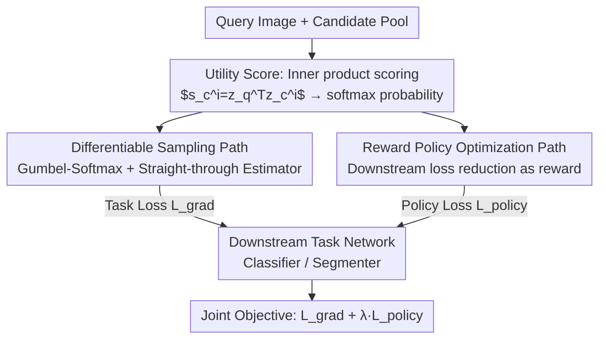

# Learning What Helps: Task-Aligned Context Selection for Vision Tasks

**Conference**: CVPR 2026  
**Paper**: [CVF Open Access](https://openaccess.thecvf.com/content/CVPR2026/html/Guo_Learning_What_Helps_Task-Aligned_Context_Selection_for_Vision_Tasks_CVPR_2026_paper.html)  
**Code**: TBD  
**Area**: Retrieval Augmentation / Discriminative Vision / Context Selection  
**Keywords**: Task-Aligned Retrieval, Context Selection, ViT, Gumbel-Softmax, Policy Gradient

## TL;DR
TACS enables discriminative vision models (ViT) to learn to select paired samples from a candidate pool that "truly improve task performance," rather than "visually most similar" neighbors. By jointly training a selector through a differentiable sampling path and a reward-driven policy optimization path, retrieval is transformed from a static preprocessing step into a learnable component back-propagated by downstream task loss. It consistently outperforms similarity-based retrieval across 18 datasets.

## Background & Motivation

**Background**: Large Language Models (LLMs) have long adopted "retrieval augmentation"—incorporating relevant information from external corpora (RAG/RAL) when facing uncertainty. However, discriminative vision models (such as ViTs for classification and segmentation) lack mechanisms to integrate retrieval into decision-making, with few multi-view/multi-instance methods relying on pre-defined or manually paired data.

**Limitations of Prior Work**: In existing vision systems, retrieval is a **static preprocessing step** using frozen embeddings like CLIP or DINO to calculate perceptual similarity and selecting nearest neighbors as auxiliary inputs. This implicitly assumes that "visual similarity = task utility." However, this assumption is often invalid: visual similarity does not guarantee that an image helps the ViT make better judgments. In fine-grained recognition, similarity retrieval often picks near-duplicate samples (birds in the same pose, scenes under the same lighting), merely reinforcing redundancy.

**Key Challenge**: Retrieval is essentially a **discrete selection** (choosing one from $N_c$ candidates). Discrete operations are non-differentiable and cannot directly receive gradient feedback from downstream task losses. Consequently, researchers settle for "similarity," a task-agnostic static proxy, resulting in selected samples that may not be useful for the task.

**Goal**: To let a specialized vision model **learn for itself** which context samples best improve its own performance. The objective is to transform the "selection of context" from a fixed heuristic into a learnable, task-aligned policy.

**Key Insight**: When human experts (e.g., radiologists) judge benignity vs. malignancy, they refer not only to similar past cases but also to **different** cases to clarify diagnostic boundaries. This suggests that a **complementary** sample (exposing discriminative contrasts, such as different poses/lighting) might be more useful than the nearest neighbor.

**Core Idea**: Train a Selector using "how much the downstream loss decreases after adding this candidate" as a signal to define "utility." Use a hybrid optimization of **differentiable relaxation + policy gradient** to align the selector directly with downstream task rewards.

## Method

### Overall Architecture
TACS consists of two **jointly trained** modules: a **Selector** that picks the most informative samples from a candidate pool, and a **Downstream Task Network** (classifier or segmenter) that performs the main task using the "query image + selected sample" input pair. Crucially, gradients from the downstream network are back-propagated to the selector, making retrieval part of the learning objective.

Given a query image $x_q$ and $N_c$ candidates $\{x_c^i\}$, the selector backbone encodes them into $z_q, z_c^i$. The utility score for each candidate is the inner product of query and candidate features $s_c^i = z_q^{\mathsf T} z_c^i$, which is then softmax-normalized into selection probabilities. During inference, the image $x_{\text{sel}}$ is selected via $\arg\max$ and fed to the downstream network to produce prediction $\hat y = f_d(x_q, x_{\text{sel}})$.

Since the discrete $\arg\max$ is non-differentiable during training, the selector follows two complementary optimization paths: the **differentiable sampling path** provides a stable gradient flow and characterizes smooth utility relationships between candidates; the **policy optimization path** uses reward feedback from the downstream task to reinforce discrete choices that "truly improve performance." Both paths share selector parameters.

### Key Designs

**1. Utility Score: Redefining "Similarity" as "Utility"**

The pain point of similarity retrieval is the use of task-agnostic frozen embeddings. TACS no longer uses pre-calculated CLIP/DINO similarity but allows the selector backbone to **learn a set of embeddings end-to-end**, such that the inner product $s_c^i = z_q^{\mathsf T} z_c^i$ directly reflects "task utility" rather than "visual similarity." This score is converted to selection probability $p(x_c^i|x_q)=\frac{\exp(s_c^i)}{\sum_j \exp(s_c^j)}$ via softmax. Because these embeddings are shaped by downstream task loss back-propagation, "high score" gradually becomes equivalent to "good task performance when paired," rather than "looking similar." This is the foundation for transforming retrieval into a learnable component.

**2. Differentiable Sampling Path: Enabling Gradients for Discrete Selection**

The $\arg\max$ selection is discrete and blocks gradients. This work uses the straight-through Gumbel-Softmax estimator for a differentiable approximation of categorical sampling: Gumbel noise $g_i = -\log(-\log u_i),\ u_i\sim\mathcal U(0,1)$ is added to the logits, and a temperature $\tau$-controlled softmax $p=\frac{\exp((s_c^i+g_i)/\tau)}{\sum_j \exp((s_c^j+g_j)/\tau)}$ yields soft samples. The forward pass uses a straight-through estimator to output a one-hot hard selection, while the backward pass retains gradients. The corresponding objective is the standard cross-entropy task loss $\mathcal L_{\text{grad}}=\mathcal L_{ce}(f_d(x_q,x_{\text{sel}}),y)$. This path provides smooth and stable supervision in early training.

**3. Reward Policy Optimization Path: Directly Rewarding Choices that Reduce Loss**

Differentiable sampling alone is insufficient—it does not explicitly judge whether adding the retrieved image actually improved the prediction. An ideal selection should satisfy $\mathcal L_{ce}(f_d(x_q,x_c),y) < \mathcal L_{ce}(f_d(x_q,\emptyset),y)$, meaning the loss with context is lower than using the query image alone. Thus, the selector is treated as a policy agent: observation $o=\{z_q, z_c^1,\dots\}$, action $a\in\{1,\dots,N_c\}$, policy $\pi(a|o)=\text{softmax}(s(o))$. The reward is defined as the relative improvement in downstream performance $r(o,a)=\mathcal L_{ce}(f_d(x_q,\emptyset),y) - \mathcal L_{ce}(f_d(x_q,x_c^a),y)$, where a positive reward indicates the retrieved image indeed improved accuracy. Gradients are detached from the task model so that policy updates rely solely on reward signals. The policy objective is $\mathcal L_{\text{policy}} = -\mathbb E_{a\sim\pi}[\log\pi(a|o)\,A(o,a)]$, where advantage $A(o,a)$ is the standardized reward within a batch to reduce variance.

**4. Joint Objective: Convergence of Smooth Supervision and Decisive Rewards**

The two paths share selector parameters and are trained jointly, allowing gradients and rewards to act on the same concept of "task utility." The total loss is $\mathcal L_{\text{TACS}} = \mathcal L_{\text{grad}} + \lambda\,\mathcal L_{\text{policy}}$, where $\lambda$ balances differentiable supervision and reward-driven learning (default $\lambda=1.0, \tau=0.1$). Intuitively, the differentiable path handles smooth shaping in the early stages, while the policy path handles decisive sharpening in the later stages.

### Loss & Training
The selector shares a ViT-S/16 backbone with the downstream network, initialized with DINOv3 weights and fine-tuned using AdamW for 100 epochs with cosine annealing. For classification, the full model is fine-tuned after concatenating patch embeddings of the query and paired images. For segmentation, the backbone is frozen, and gated cross-attention is inserted after each transformer block to enhance query features, followed by a lightweight DPT head. A fixed candidate pool is formed by sampling 20% of the training images for each dataset, with relational images (e.g., same patient) excluded to prevent data leakage.

## Key Experimental Results

### Main Results
Evaluated across 18 datasets (11 fine-grained classification + 4 medical classification + 3 medical segmentation), consistently using ViT-S/16 + DINOv3 initialization.

| Dataset Group | Metric | TACS | Frozen DINO Similarity Retrieval | No-Context | Notes |
|----------|------|------|----------------------|-----------|------|
| Fine-grained Classification Avg. (11) | mAcc/Acc ↑ | 88.3 | 86.6 | 86.3 | Avg +1.7% vs Frozen Retrieval |
| CUB-200 | Acc ↑ | 85.2 | 81.4 | 82.1 | Max gain of +3.8% |
| SUN397 | Acc ↑ | 71.8 | 69.2 | 68.0 | +2.6% |
| Medical Classification Avg. (4) | — ↑ | 92.9 | 92.0 | 91.0 | Avg +0.9% vs Frozen Retrieval |
| DDSM | AUC ↑ | 97.4 | 96.1 | 96.1 | +1.3% AUC |
| Kvasir-SEG (Segmentation) | IoU ↑ | 81.1 | 80.0 | 77.0 | Up to +1.1 IoU |

Note: Metric specifics—Fine-grained classification reports top-1 accuracy or mean per-class accuracy (mAcc); medical classification metrics vary (APTOS uses quadratic weighted Cohen's Kappa, Colorectal uses Acc, DDSM uses ROC-AUC, ISIC2019 uses Recall); segmentation reports Dice and IoU. "Avg." denotes the group average.

### Ablation Study

**Ablation of Context Pairing (Tab. 4)**: Replacing "learned retrieval" with various fixed pairings to verify that gains come from "choosing right" rather than "extra tokens/model capacity."

| Configuration | Key Metric | Description |
|------|---------|------|
| TACS (Learned Retrieval) | Best | Full model |
| No context image | ↓ ~2% | No context provided |
| Blank image | ≈ No-Context | Equivalent to no context |
| Duplicate query | ≈ No-Context | No gain from duplicating query |
| Noisy query | Unstable | Noisy version of query image |
| Frozen DINO Similarity Retrieval | Slight rise | Static similarity is better than nothing but inferior to TACS |

**Ablation of Optimization Components (Tab. 5)**: Separating differentiable and policy paths.

| Configuration | Relative Performance | Description |
|------|---------|------|
| Frozen Retrieval (Fixed Emb) | Baseline | No learning |
| Differentiable (soft) selection only | Better than fixed | Early smooth supervision |
| Policy (hard) selection only | Better than fixed | Discrete reward refinement |
| Dual-path Full Model | Most stable & highest | Paths are complementary |

### Key Findings
- **Gains scale with context informativeness**: Providing a blank image or duplicating the query is equivalent to "no context" (dropping ~2%), proving the improvement stems from "useful selection" rather than more tokens or capacity.
- **Complementarity of optimization paths**: Either path alone outperforms static retrieval, but the combination is most stable—the differentiable path manages smooth early supervision, while the policy path manages reward refinement for discrete decisions.
- **Learned strategies favor "complementarity" over "redundancy"**: Compared to similarity retrieval's preference for near-duplicates, TACS increases cross-class selection rates by 40–70% and selects samples with higher perceptual diversity (LPIPS distance). For instance, in APTOS, it often pairs mild and severe diabetic retinopathy cases to contrast lesion severity; in SUN397, it retrieves contrasting scenes to clarify fine-grained boundaries.
- **Largest gains in challenging/data-limited scenarios**: Improvements are most significant in fine-grained (CUB/SUN397) and few-shot medical tasks, where similarity retrieval is most prone to redundancy.

## Highlights & Insights
- **Operationalizing "Utility" as an Optimizable Reward**: Using the "downstream loss reduction" $\mathcal L_{ce}(\cdot,\emptyset)-\mathcal L_{ce}(\cdot,x_c)$ to directly quantify the value of a retrieved image avoids the unreliable assumption that "similarity ≈ utility." This reward definition is transferable to any discriminative task involving auxiliary sample selection.
- **Engineering Ingenuity of the Dual-Path Approach**: Gumbel-Softmax provides stable gradients early on, while policy gradients provide decisive sharpening later. Detaching gradients for the policy path ensures a clean reward signal, solving the long-standing problem of end-to-end training for discrete retrieval.
- **Filling the Retrieval Gap in Discriminative Vision**: RAG/RAL previously served generative/multimodal models almost exclusively. This work introduces task-aligned learnable retrieval to pure vision ViTs, which is particularly valuable for fields like medical imaging where paired data is scarce.

## Limitations & Future Work
- **Fixed Candidate Pool**: Each dataset uses a fixed 20% training subset; samples outside the pool cannot be selected. The coverage and construction of the pool may affect the upper bound, which the authors did not explore in depth regarding dynamic/full-pool costs.
- **Single Paired Image Selection**: The current framework pairs a query with a single $x_{\text{sel}}$. It does not discuss whether multi-sample combinatorial retrieval (top-k) is superior or how to avoid combinatorial explosion.
- **Dependency on Strong Pre-trained Backbones**: Initializing with DINOv3 suggests that the learnability of utility embeddings may partly benefit from a good starting point; effectiveness with weak backbones or training from scratch is unknown.
- ⚠️ Some ablation tables (Tab. 4/5) in the cache have incomplete values or potential OCR noise; refer to the original paper for exact figures.

## Related Work & Insights
- **vs Frozen DINO Similarity Retrieval**: They use frozen embeddings for static nearest neighbors; TACS back-propagates task loss to learn utility embeddings for "useful" samples. The retrieval objective shifts from "perceptual similarity" to "downstream reward," selecting complementary rather than redundant contexts.
- **vs REACT / SWAT (Vision Retrieval Augmentation)**: These use retrieved images as extra training data while retrieval remains static similarity-driven; TACS integrates retrieval into the inference process itself, learning selection policies per instance and task-aligned.
- **vs SmartRAG / RAG-DDR / DRO (Generative Differentiable/Reinforcement Retrieval)**: These methods use differentiable data rewards or policy gradients to jointly train retrieval and generation, but only for generative/multimodal tasks where rewards are based on text fluency. TACS migrates this to discriminative vision, where the reward is directly the improvement in prediction accuracy.

## Rating
- Novelty: ⭐⭐⭐⭐⭐ First to introduce task-aligned learnable retrieval to pure vision discriminative models; the "loss reduction as reward" definition is clean and potent.
- Experimental Thoroughness: ⭐⭐⭐⭐ 18 datasets across natural/medical, classification/segmentation, with solid ablations; however, deeper exploration into multi-sample combinations or dynamic pools is lacking.
- Writing Quality: ⭐⭐⭐⭐ Motivation-Method-Experiment logic is smooth; dual-path design is clearly explained.
- Value: ⭐⭐⭐⭐ Practical value for domains with scarce paired data like medical imaging; the reward design is transferable.

<!-- RELATED:START -->

## Related Papers

- [\[CVPR 2026\] Debiased Sample Selection for Learning with Noisy Labels](debiased_sample_selection_for_learning_with_noisy_labels.md)
- [\[CVPR 2026\] Towards Knowledge-augmented Bayesian Deep Learning For Computer Vision](towards_knowledge-augmented_bayesian_deep_learning_for_computer_vision.md)
- [\[CVPR 2026\] Computer Vision with a Superpixelation Camera](computer_vision_with_a_superpixelation_camera.md)
- [\[CVPR 2026\] Adapting In-context Generation for Enhanced Composed Image Retrieval](adapting_in-context_generation_for_enhanced_composed_image_retrieval.md)
- [\[CVPR 2026\] ALLNet: Multi-task Dense Prediction for Degraded Images](allnet_multi-task_dense_prediction_for_degraded_images.md)

<!-- RELATED:END -->
