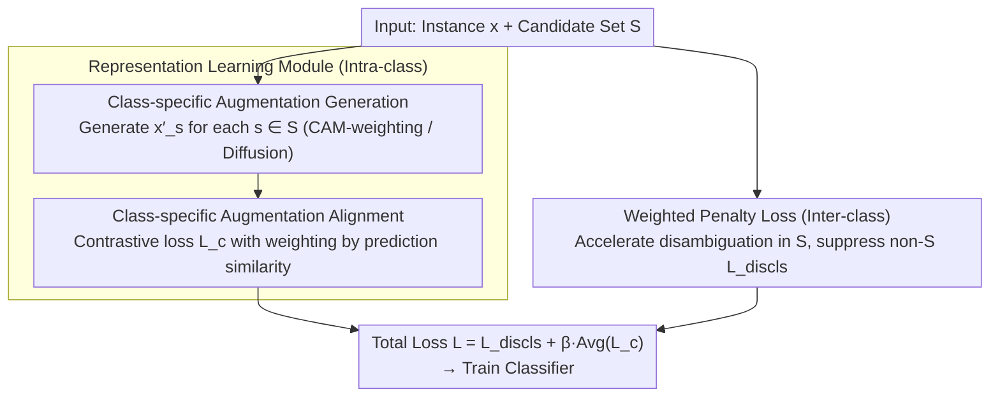

# Mitigating Instance Entanglement in Instance-Dependent Partial Label Learning

**Conference**: CVPR2026  
**arXiv**: [2603.04825](https://arxiv.org/abs/2603.04825)  
**Code**: [RyanZhaoIc/CAD](https://github.com/RyanZhaoIc/CAD)  
**Area**: others (Weakly Supervised Learning / Partial Label Learning)  
**Keywords**: Partial Label Learning, Instance Entanglement, Class-specific Augmentation, Contrastive Learning, Weakly Supervised Classification

## TL;DR
To address the "instance entanglement" problem in Instance-Dependent Partial Label Learning (ID-PLL), where instances from similar classes share overlapping features and candidate labels, this paper proposes the CAD framework. CAD mitigates class confusion through a two-pronged approach: intra-class alignment via class-specific augmentation and inter-class separation via weighted penalty loss.

## Background & Motivation

**Practical Demand for PLL**: Obtaining precise labels is expensive in real-world scenarios. Partial Label Learning (PLL) allows each instance to be associated with a set of candidate labels (containing the ground truth), which can be obtained at low cost through crowdsourcing or web mining.

**Realism of Instance-Dependent Assumption**: Traditional PLL assumes candidate labels are independent of instance features (random or category-related noise). However, real-world label ambiguity often depends on instance features—for example, a Japanese Spitz is more likely to be labeled as a "fox," whereas a Corgi is not.

**Neglected Instance Entanglement**: In ID-PLL, instances from similar categories share overlapping features and candidate labels (e.g., Japanese Spitz and Arctic Fox), leading to severe class confusion. Statistics show that on CIFAR-10, 96.62% of instances in the most confused class pairs share candidate labels.

**Limitations of Contrastive Learning**: Existing SOTA methods (e.g., ABLE, DIRK) rely on contrastive learning to pull representations of the same class closer. However, for entangled instances, these methods tend to incorrectly align samples from different categories, exacerbating decision boundary blurring.

**Insufficient Inter-class Distance**: Optimizing only intra-class alignment without explicitly increasing inter-class distance causes entangled instances to continuously provide incorrect disambiguation signals during iterative training, ultimately degrading classification performance.

**Prevalence and Impact of Entangled Instances**: Experiments demonstrate that even with a cosine similarity threshold $>0.90$, Fashion-MNIST contains 529,000 pairs of entangled instances. Performance of existing methods drops sharply as similarity increases.

## Method

### Overall Architecture

The core obstacle in ID-PLL is "instance entanglement": samples from similar categories (e.g., Japanese Spitz and Arctic Fox) share both overlapping features and candidate labels. Methods relying on contrastive learning to pull representations of the same category together may inadvertently align them incorrectly. The CAD (Class-specific Augmentation based Disentanglement) framework adopts a two-pronged strategy: tightening intra-class features while explicitly pushing apart confusable classes inter-class. The model consists of a **Representation Learning Module** (intra-class regulation, including "Class-specific Augmentation Generation" and "Class-specific Augmentation Alignment") and a **Confidence Adjustment Module** (inter-class regulation, via "Weighted Penalty Loss"). The total loss is a weighted sum: $\mathcal{L}(\boldsymbol{x}, \mathcal{S}) = \mathcal{L}_{discls}(\boldsymbol{x}) + \frac{\beta}{|\mathcal{S}|}\sum_{s \in \mathcal{S}}\mathcal{L}_c(\boldsymbol{x}'_s)$, where $\beta$ controls the weight of the modules. The overall data flow is shown below:

### Key Designs

**1. Class-specific Augmentation Generation: Explicitly Visualizing "Which Class an Instance Belongs To"**

To address the issue where features of entangled instances are mixed and indistinguishable, CAD generates an augmented image $\boldsymbol{x}'_s$ for each instance $\boldsymbol{x}$ and each label $s$ in the candidate set $\mathcal{S}$, specifically strengthening the features of that class. Two paths are proposed: CAD-CAM (Lightweight), which uses Class Activation Mapping to locate class-related regions and amplifies them via $\boldsymbol{x}'_s = \boldsymbol{a}_s \odot \boldsymbol{x} + \epsilon \cdot (\boldsymbol{1} - \boldsymbol{a}_s) \odot \boldsymbol{x}$ without external models; and CAD-Diffusion (Heavyweight), which uses InstructPix2Pix to edit images based on class names. This creates semantically distinct and separable versions of the same image for different candidate labels.

**2. Class-specific Augmentation Alignment: Using Same-label Augmentations as Positive Pairs**

The most difficult task in weakly supervised learning is identifying positive pairs, especially since candidate labels in PLL are ambiguous. CAD treats augmentations generated under the same candidate label as positive pairs for contrastive learning: $\mathcal{L}_c(\boldsymbol{x}') = -\sum_{\boldsymbol{x}^+ \in \mathcal{A}_{y'}} w(\boldsymbol{x}', \boldsymbol{x}^+) \log s_\tau(\boldsymbol{q}_{\boldsymbol{x}'}, \boldsymbol{k}_{\boldsymbol{x}^+}, \mathcal{K})$. This approach is effective because: positive pairs are naturally defined by the "same label," bypassing identification difficulties; different class augmentations of the same instance serve as hard semantic negatives; and a weight $w(\boldsymbol{x}', \boldsymbol{x}^+)$ based on predicted logit similarity reduces the impact of noisy augmentations.

**3. Weighted Penalty Loss: Accelerated Disambiguation and Inter-class Suppression**

Intra-class alignment alone is insufficient as entangled instances continue to provide false signals. Weighted penalty loss applies higher positive weights to high-confidence labels within the candidate set (accelerating disambiguation) and stronger penalties to high-confidence labels outside the candidate set (suppressing confusion): $\mathcal{L}_{discls}(\boldsymbol{x}) = \sum_{j \in \mathcal{Y}} \omega_j \ell(\boldsymbol{s}_j, \boldsymbol{x})$. Weights $\omega_j$ are normalized within and outside the candidate set ($\sum_{j \in \mathcal{S}} \omega_j = 1$, $\sum_{j \in \bar{\mathcal{S}}} \omega_j = 1$), ensuring independence from candidate set size. This loss belongs to the Leveraged Weighted Loss family and provides Bayes consistency guarantees.

## Key Experimental Results

### Main Results: Classification Accuracy

| Method | Fashion-MNIST | CIFAR-10 | CIFAR-100 | Flower | Oxford-IIIT Pet |
|------|:---:|:---:|:---:|:---:|:---:|
| DIRK | 91.48 | 90.87 | 68.77 | 44.03 | 64.95 |
| ABLE | 89.81 | 83.92 | 63.92 | 43.51 | 54.19 |
| CEL | 87.78 | 89.18 | 68.73 | 38.51 | 68.19 |
| **CAD-CAM** | 91.64 | 92.69 | 69.08 | **49.67** | **74.56** |
| **CAD** | **92.14** | **93.57** | **72.03** | 47.88 | 69.46 |

CAD achieves optimality across all 5 benchmarks, outperforming DIRK by 2.70% on CIFAR-10 and 3.26% on CIFAR-100. CAD-CAM performs better on fine-grained datasets.

### Accuracy on Entangled Instances

| Dataset | Top 0.1% | Top 0.01% | Top 0.001% |
|--------|:---:|:---:|:---:|
| CIFAR-10 DIRK | 91.78 | 85.88 | 74.09 |
| CIFAR-10 CAD | **94.51** | **90.90** | **83.37** |
| CIFAR-100 DIRK | 70.42 | 66.61 | 62.59 |
| CIFAR-100 CAD | **72.43** | **68.80** | **67.78** |

On the most challenging top 0.001% entangled pairs, CAD outperforms DIRK by 9.28% on CIFAR-10.

### Ablation Study

| Variant | Fashion-MNIST | CIFAR-10 |
|------|:---:|:---:|
| CAD (Full) | 92.14 | 93.57 |
| w/o CA (Confidence Adj.) | 91.19 | 93.32 |
| w/o RL (Rep. Learning) | 91.48 | 91.21 |
| w/o Both | 85.30 | 87.81 |

Both modules contribute positively, with the representation learning module providing more significant gains (+2.36% on CIFAR-10).

### Key Findings

- **Gains not solely from external models**: CAD-CAM outperforms all baselines without external generative models, proving the structural effectiveness. Adding diffusion samples directly to DIRK/ABLE decreases performance.
- **Significant increase in inter-class distance**: t-SNE visualization and quantitative metrics show CAD achieves the largest inter-class distance (class center distance 1.103 vs. DIRK 0.936).
- **Confusion matrix improvement**: Error rates for highly confused pairs (e.g., cat-dog, truck-automobile) are significantly reduced.
- **Fine-grained prompts are effective**: Using detailed class descriptions on Oxford-IIIT Pet improves CAD accuracy from 69.46% to 76.23%, surpassing CAD-CAM.

## Highlights & Insights

- **Clear Problem Definition**: Systematically defines and analyzes the "instance entanglement" phenomenon in ID-PLL with quantitative evidence.
- **Elegant Design**: The dual-regulation framework (intra-class + inter-class) is simple yet effective. The two augmentation methods (CAM/Diffusion) demonstrate framework versatility.
- **Clever Positive Pairs**: Naturally solves the core challenge of positive pair identification in weakly supervised contrastive learning via class-specific augmentation.
- **Thorough Evaluation**: Validated against 14 baselines on 5 datasets with specific analysis on entangled instances and multi-dimensional evaluations.

## Limitations & Future Work

- **Prompt Quality Sensitivity**: Diffusion-based editing on fine-grained datasets requires manual detailed descriptions, limiting automation.
- **Domain Applicability**: Visual semantics in medical or industrial images are hard to describe textually; generic diffusion priors may be insufficient.
- **Offline Augmentation Costs**: Diffusion models require offline generation and storage, increasing preprocessing time and storage demands for large datasets.
- **Entanglement Definition**: The identification of entangled pairs depends on pre-trained ResNet feature similarity, making the definition sensitive to the feature extractor.

## Related Work & Insights

- **ID-PLL Methods**: VALEN (Dirichlet inference), ABLE (ambiguity-guided contrast), and DIRK (negative label confidence), none of which explicitly handle instance entanglement.
- **Contrastive Learning in PLL**: Methods like PiCO use prototype contrastive learning for disambiguation but may incorrectly align entangled instances sharing candidate labels.
- **Maximum Margin Methods**: Early SVM-like methods implicitly increased inter-class distance but struggled to scale to high-dimensional data.
- **Diffusion Image Editing**: InstructPix2Pix is innovatively used for class-specific augmentation generation rather than traditional editing tasks.

## Rating
- Novelty: ⭐⭐⭐⭐ — Systematic definition of instance entanglement provides a new perspective for ID-PLL.
- Experimental Thoroughness: ⭐⭐⭐⭐⭐ — Extensive baselines and specialized analyses across multiple datasets.
- Writing Quality: ⭐⭐⭐⭐ — Clear problem articulation and rich visualizations.
- Value: ⭐⭐⭐⭐ — Provides effective solutions for class confusion in weakly supervised learning; CAD-CAM is highly practical.

<!-- RELATED:START -->

## Related Papers

- [\[CVPR 2026\] Evidential Deep Partial Label Learning to Quantify Disambiguation Uncertainty](evidential_deep_partial_label_learning_to_quantify_disambiguation_uncertainty.md)
- [\[CVPR 2025\] Instance-wise Supervision-level Optimization in Active Learning](../../CVPR2025/others/instance-wise_supervision-level_optimization_in_active_learning.md)
- [\[CVPR 2026\] Revisiting Sparsity Constraint Under High-Rank Property in Partial Multi-Label Learning](revisiting_sparsity_constraint_under_high-rank_property_in_partial_multi-label_l.md)
- [\[ICML 2025\] Revisiting Instance-Optimal Cluster Recovery in the Labeled Stochastic Block Model](../../ICML2025/others/revisiting_instance-optimal_cluster_recovery_in_the_labeled_stochastic_block_mod.md)
- [\[ACL 2025\] Mitigating Shortcut Learning with InterpoLated Learning](../../ACL2025/others/mitigating_shortcut_learning_with_interpolated_learning.md)

<!-- RELATED:END -->
