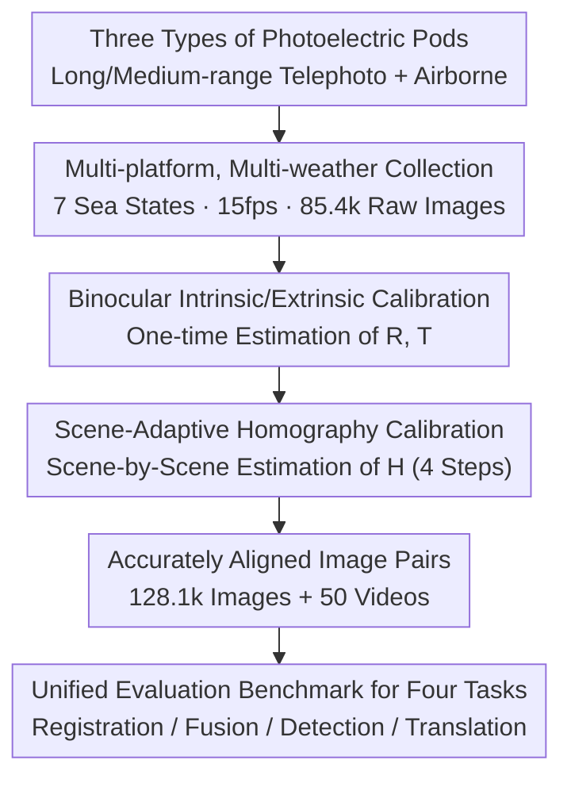

# MMVIP: A Visible-infrared Paired Dataset for Multi-weather Marine Vision

**Conference**: CVPR 2026  
**Paper**: [CVF Open Access](https://openaccess.thecvf.com/content/CVPR2026/html/Yin_MMVIP_A_Visible-infrared_Paired_Dataset_for_Multi-weather_Marine_Vision_CVPR_2026_paper.html)  
**Code**: https://github.com/yyppptjr/MMVIP  
**Area**: Multimodal Dataset / Visible-Infrared Registration and Fusion / Marine Visual Perception  
**Keywords**: Visible-infrared pairing, marine vision, multi-weather, image registration, cross-modal fusion

## TL;DR
MMVIP is the first large-scale, realistically collected visible-infrared paired dataset for marine vision. Utilizing multi-platform photoelectric pods, it captures 128k strictly spatially-temporally aligned image pairs and 50 videos across 7 harsh sea conditions. It is accompanied by an alignment pipeline featuring "intrinsic/extrinsic calibration + multi-scene adaptive homography calibration." SOTA methods are systematically evaluated across four tasks: registration, fusion, detection, and cross-modal translation, revealing that existing algorithms generally suffer performance degradation under marine conditions such as low texture, strong reflection, and low illumination.

## Background & Motivation
**Background**: Modern vessels are commonly equipped with both visible and infrared cameras. Visible-light images offer rich texture and structural details but degrade severely under low-light/adverse weather, whereas infrared images highlight ship targets through thermal radiation in low-light/occluded scenes but lack fine textures. They are naturally complementary, but this complementarity hinges on **accurate cross-modal registration**. Only with joint registration and fusion can they provide a consistent spatial reference for downstream detection and tracking.

**Limitations of Prior Work**: Cross-modal paired data represents the bottleneck of this field. Existing visible-infrared aligned datasets (e.g., TNO, RoadScene, MSRS, LLVIP) are almost exclusively focused on urban road scenes. A few marine datasets (e.g., Tri-band, RGBT-Tiny, SMD, VAIS) either **lack precise alignment** (making fusion research impossible) or **lack real adverse weather conditions**, and their scales are too small to support multimodal perception research in real marine environments.

**Key Challenge**: The sea surface is an exceptionally challenging environment for registration. Vast sea areas are characterized by low texture, low contrast, and sparse feature points, causing homography estimation to fail easily. Moreover, sea states and weather (sunny, cloudy, night, rain, fog, low light, typhoon) significantly alter background depth and illumination, leading to geometric relationship drift. Without a dataset that is both accurately aligned and covers multi-weather marine conditions, algorithms can neither be trained nor fairly evaluated.

**Goal**: (1) Construct the first large-scale visible-infrared paired dataset covering multi-weather and multi-sea states for marine vision; (2) Provide a calibration pipeline robust to sparse features across various hardware platforms; (3) Establish a reproducible benchmark across four core visual tasks.

**Core Idea**: Collect real multi-weather sea state paired data using multi-platform photoelectric pods, and address the alignment difficulty caused by sparse marine features through "scene-by-scene adaptive" homography calibration, transforming the dataset into a unified cross-modal marine evaluation platform.

## Method

### Overall Architecture
MMVIP essentially consists of "a data collection and alignment pipeline + a four-task evaluation platform." The workflow is as follows: visible and infrared videos are synchronously captured under 7 representative sea states using three types of photoelectric pods (self-developed long-range/medium-range telephoto pods + DJI Matrice 4 airborne pod); for each pod, a one-time binocular intrinsic and extrinsic calibration is performed to obtain rotation $R$ and translation $T$; then, scene-by-scene adaptive homography calibration is applied to estimate the pixel-level aligned homography matrix $H$; finally, the aligned image pairs are organized into a unified benchmark for four tasks: image registration, image fusion, object detection, and visible-to-infrared translation. The process yields a total of 128,100 accurately aligned images, 50 annotated videos, and additional unaligned raw data to support the evaluation of registration algorithms.

### Key Designs

**1. Multi-platform, multi-weather real paired collection: Covering harsh sea states missing in existing marine datasets**

Addressing the pain point that existing marine datasets "either lack weather variety, lack alignment, or are small in scale," the authors captured data across multiple sea areas using three types of photoelectric pods (spherical pod, UAV airborne pod, and long-range pod). The infrared thermal imagers and visible cameras of all devices are **rigidly fixed** to minimize data discrepancies between platforms. The infrared imager operates at wavelengths of 8–14 µm (resolutions of 1280×1024 and 640×512), the visible camera at 1920×1080, and the video frame rate is 15 fps. Ultimately, 85,400 raw images (unified to 960×770 or 640×512) were captured under 7 weather conditions (sunny, cloudy, night, rain, fog, low light, typhoon), yielding a total of 128,100 accurately aligned images after registration, along with 50 annotated videos for continuous temporal analysis. Compared with similar datasets in Tab. 1, MMVIP is the only one that simultaneously meets the requirements of "covering all 7 weather types A–G + multiple scenes (port/coast/offshore) + multiple views (UAV/coast-fixed/vessel-mounted) + precise alignment." In terms of scale, its 50 sequences, 128k frames, and 50k annotated images also significantly outperform marine counterparts.

**2. Binocular intrinsic and extrinsic calibration: Establishing a one-time geometric reference under fixed optical paths**

Since the optical paths and mounting positions of the visible and infrared cameras of each pod are fixed, the authors first perform monocular intrinsic calibration for each camera (focal length, principal point, distortion coefficients), followed by binocular extrinsic calibration to estimate the rotation matrix $R$ and translation vector $T$ between them. This establishes the geometric correspondence between the infrared and visible cameras. Because the optical parameters and mounting positions are fixed, this step generally requires only a one-time static calibration, providing a stable physical and geometric prior for subsequent scene-by-scene homography estimation.

**3. Scene-adaptive homography calibration: Solving scene-by-scene alignment under low-texture and sparse feature marine conditions**

This is the core innovation of the pipeline. Since vast sea areas suffer from low texture and low contrast, and differences in background depth and illumination across sea states cause geometric drift, a single fixed homography matrix cannot achieve alignment. The authors designed a "scene-by-scene estimation + verification" adaptive homography calibration, containing four steps: ① **Multi-scene data collection**—capturing synchronous images under 7 sea states to ensure the calibration set covers diverse conditions, improving the robustness and generalization of the estimated matrices; ② **Cross-modal feature matching**—extracting corresponding feature points between the two modalities using the MINIMA algorithm, augmented with manual refinement in low-texture/low-contrast areas, and ensuring that the selected points are uniformly distributed across the field of view to eliminate mismatches and guarantee geometric consistency; ③ **Homography estimation**—utilizing RANSAC to remove outliers from the matched point pairs and applying least-squares fitting to minimize the re-projection error of $H$ on valid matches; ④ **Verification and scene mapping**—repeatedly estimating $H$ for each representative scene using multiple pairs of synchronous images, selecting the one with the smallest average re-projection error, and performing manual visual consistency checks (focusing on key areas like the sea horizon and vessel contours). The homography can be expressed as:

$$\boldsymbol{x}' = H\boldsymbol{x}, \qquad H = K_2\left(R - \frac{T\boldsymbol{n}^\top}{d}\right)K_1^{-1}$$

where $\boldsymbol{x},\boldsymbol{x}'$ represent the homogeneous pixel coordinates of the visible and infrared images, $K_1,K_2$ are the intrinsic matrices of the two cameras, $R,T$ are the extrinsic parameters, and $\boldsymbol{n},d$ denote the unit normal vector and the distance to the principal plane. Since the sea surface is dynamic and viewpoints shift, $\boldsymbol{n},d$ are difficult to compute accurately. Therefore, the authors employ a data-driven feature point fitting scheme, using the average re-projection error as the accuracy metric and incorporating extrinsic constraints to ensure geometric consistency and physical plausibility. This "scene-adaptive" approach, replacing a fixed homography, is key to robust alignment under multi-platform and sparse-feature marine conditions.

**4. Unified evaluation benchmark for four tasks: Transforming the dataset into a evaluation platform for cross-modal marine perception**

The aligned data is organized into a a unified evaluation pipeline for four core tasks: image registration (evaluating registration robustness by classifying methods into sparse, semi-dense, and dense categories), image fusion (evaluating cross-modal information integration and detail preservation), object detection (detecting small targets in two categories: Ship and Buoy), and visible-to-infrared translation (evaluating the generalization of cross-modal generation under challenging marine conditions). This ensures that MMVIP is not just a collection of images, but a benchmark capable of making horizontal comparisons of SOTA methods and exposing their limitations in real maritime conditions.

### Loss & Training
This paper is a dataset paper and does not propose a new model; thus, it has no proprietary training objectives. For the detection task, a pre-trained YOLO11 is used as a baseline and fine-tuned on MMVIP (using 90% training / 10% testing split, 100 epochs, and a batch size of 16). For the registration, fusion, and translation tasks, SOTA methods are directly evaluated using their official pre-trained models and default parameters. All experiments were conducted on a single NVIDIA RTX 4090 GPU.

## Key Experimental Results

### Image Registration (Main Results)
Evaluations were performed on 9 cross-modal matching algorithms using 8 metrics: Failure rate (Failed), Inaccuracy rate (Inaccurate), MSE/RMSE (pixel-level geometric error, lower is better), SSIM/NCC/MI (global consistency and information preservation, higher is better), and registration time per 960×770 image pair. Failure definitions follow GLAMpoints (insufficient keypoints/correspondences, mirror flips, out-of-bounds scale factors). An alignment with MSE > 0.01 or SSIM < 0.9 is classified as "Inaccurate" (thresholds determined by empirical calibration).

| Category | Method | Failed↓ | Inaccurate↓ | MSE↓ | RMSE↓ | SSIM↑ | NCC↑ | MI↑ | Time(ms) |
|------|------|---------|-------------|------|-------|-------|------|-----|----------|
| Dense | **MINIMA-RoMa** | **0%** | **49.64%** | **0.0039** | **0.0464** | **0.8822** | **0.8537** | **1.6406** | 2078.8 |
| Dense | RoMa | 0% | 62.86% | 0.0191 | 0.0917 | 0.8244 | 0.6940 | 1.4684 | 5042.6 |
| Sparse | MINIMA-LG | 5.14% | 58.14% | 0.0198 | 0.0921 | 0.8297 | 0.6860 | 1.4733 | **480.8** |
| Semi-dense | XoFTR | 1.29% | 71.57% | 0.0357 | 0.1359 | 0.7558 | 0.5804 | 1.2945 | 1035.7 |
| Semi-dense | ELoFTR | 14.86% | 66.07% | 0.0535 | 0.1799 | 0.6908 | 0.4123 | 1.0172 | 763.9 |
| Semi-dense | JamMa | 0.29% | 95.93% | 0.0888 | 0.2414 | 0.5555 | 0.2738 | 0.6713 | 630.5 |

Conclusion: Dense matching methods (RoMa/MINIMA-RoMa) are significantly superior to semi-dense and sparse ones but suffer from high computational overhead. Fine-tuned MINIMA-RoMa achieves the best performance across six metrics (with MSE of only 0.0039 and SSIM of 0.8822), demonstrating the highest geometric consistency and producing registration results closest to the ground truth. The sparse method MINIMA-LG balances performance and speed, achieving the fastest runtime of 480.8 ms. Almost all algorithms degrade significantly in low-light and low-texture scenarios (such as night and fog), indicating that "fast and accurate infrared-visible registration" remains an open challenge.

### Object Detection (Ablation/Analysis)
YOLO11 was fine-tuned separately on visible vs. infrared modalities to detect ships (Ship) and buoys (Buoy):

| Target | Modality | Precision | Recall | mAP@0.5 | mAP@0.5:0.95 |
|------|------|-----------|--------|---------|---------------|
| Ship | Visible | **0.925** | **0.871** | **0.907** | **0.754** |
| Ship | Infrared | 0.901 | 0.813 | 0.854 | 0.590 |
| Buoy | Visible | 0.874 | 0.667 | **0.795** | **0.527** |
| Buoy | Infrared | **0.889** | 0.511 | 0.599 | 0.345 |

### Key Findings
- **Visible light generally outperforms infrared**: The visible-light modality achieves higher precision and mAP for ship detection, indicating that richer boundaries and texture benefit target localization. Although infrared yields slightly higher precision for buoy detection, its mAP is significantly lower, exposing its limitations with small targets under high IoU requirements.
- **Modalities have complementary strengths that flip with weather**: Qualitative results (Fig. 6) show that the visible modality suffers from more missed detections and false alarms under low visibility, while the infrared modality more robustly highlights ships and buoys. However, in rainy weather, the thermal contrast of infrared reduces, leading to a marked decrease in detection performance. No single modality dominates in all marine conditions, underlining the necessity of a paired multimodal dataset.
- **Fusion algorithms favor different modalities**: Methods like DCEvo, LUT-Fuse, and TDFusion favor the infrared modality, highlighting targets but losing hull textures. Conversely, RFfusion, TG-ECNet, and GIFNet favor the visible modality, preserving rich background details but failing to highlight distant targets in low-light environments. Existing fusion techniques still show clear limitations in balancing cross-modal information and preserving structures.
- **Cross-modal translation shows poor generalization**: In visible-to-infrared translation, MINIMA tends to generate non-existent "phantom" structures under low visibility, sRGB-TIR often misclassifies high-temperature sources as low-intensity regions, and ThermalGen outputs lack thermal gradients and are blurred. DR-AVIT exhibits relatively stable results. Overall, current translation models generalize poorly to marine challenges such as reflection, salt spray, and high dynamic range.

## Highlights & Insights
- **Treating "alignment difficulty" as a first-class citizen**: Recognizing that low textures on the sea surface lead to sparse features and cause homography to fail, the authors did not settle for a global fixed homography. Instead, they designed a scene-adaptive calibration with manual refinement for key areas. This forms the foundation of their "precise alignment" claim and marks the essential difference between marine cross-modal datasets and urban road ones.
- **Simultaneous provision of aligned and raw unaligned data**: The unaligned raw data allows researchers to evaluate registration algorithms themselves rather than forcing them to accept the authors' pre-aligned results—a user-friendly, important, but often overlooked design.
- **One dataset supporting four tasks**: Sharing the same, accurately aligned pairs across registration, fusion, detection, and translation ensures that cross-task and cross-modal conclusions (e.g., "infrared benefits low-light detection but fails in rain") hold on a consistent data baseline. These insights can transfer to other multi-weather multimodal perception scenarios, such as UAV inspection and night surveillance.

## Limitations & Future Work
- **No new method proposed**: The contribution is heavily focused on the dataset and benchmark. All tasks are evaluated using existing SOTAs without introducing a new model or alignment network tailored for marine challenges.
- **Relatively simple detection evaluation**: The evaluation only utilizes a single YOLO11 detector for two categories (ship and buoy), and the authors state that the overall detection performance is "average." The fusion and translation tasks rely mostly on qualitative comparisons, lacking a comprehensive quantitative metric table (⚠️ subject to the original text).
- **Manual steps in the alignment pipeline**: The cross-modal feature matching and verification steps still depend on manual refinement, posing challenges for scale expansion and full automation.
- **Future directions**: Future iterations will expand to include more challenging conditions (e.g., intense platform motion blur and minute targets). Future visible-to-infrared generation research should focus on suppressing sea clutter and enhancing weak temperature contrasts.

## Related Work & Insights
- **vs. Urban Road VI Datasets (LLVIP / RoadScene / FMB / KAIST)**: These feature precise alignment but are confined to street/pedestrian scenes with limited weather types (FMB has the most with scenarios A-E). They cannot capture marine degradation elements like reflections, salt spray, and typhoons. MMVIP shifts the scene to ports, coasts, and open seas and covers all 7 weather conditions (A–G).
- **vs. Marine VI Datasets (Tri-band / RGBT-Tiny / SMD / VAIS)**: The marine subsets of Tri-band, SMD, and VAIS lack precise spatial alignment (rendering them unsuitable for fusion research), whereas RGBT-Tiny is large but lacks sufficient marine samples and complex sea weather. MMVIP fills these gaps by simultaneously providing "precise alignment + multi-weather + multi-platform views," establishing the first true paired dataset for multi-weather marine fusion.

## Rating
- Novelty: ⭐⭐⭐⭐ First large-scale multi-weather visible-infrared precisely aligned dataset for marine vision, with a highly targeted adaptive homography calibration pipeline.
- Experimental Thoroughness: ⭐⭐⭐⭐ Benchmarked 20+ SOTA methods across four tasks, though fusion/translation evaluations are mostly qualitative and the detection network is singular.
- Writing Quality: ⭐⭐⭐⭐ Clear motivation, and the dataset comparison tables and calibration processes are well-explained.
- Value: ⭐⭐⭐⭐ Fills a crucial gap in cross-modal paired marine data, offering reproducible benchmarks and open data with high downstream value.

<!-- RELATED:START -->

## Related Papers

- [\[CVPR 2026\] Customized Fusion: A Closed-Loop Dynamic Network for Adaptive Multi-Task-Aware Infrared-Visible Image Fusion](customized_fusion_a_closed-loop_dynamic_network_for_adaptive_multi-task-aware_in.md)
- [\[CVPR 2026\] EXOTIC: External Vision-driven Incomplete Multi-view Classification](exotic_external_vision-driven_incomplete_multi-view_classification.md)
- [\[CVPR 2026\] Computer Vision with a Superpixelation Camera](computer_vision_with_a_superpixelation_camera.md)
- [\[CVPR 2026\] NeuroRule: Bridging Vision and Logic with Differentiable Rule Induction](neurorule_bridging_vision_and_logic_with_differentiable_rule_induction.md)
- [\[CVPR 2026\] Towards Knowledge-augmented Bayesian Deep Learning For Computer Vision](towards_knowledge-augmented_bayesian_deep_learning_for_computer_vision.md)

<!-- RELATED:END -->
