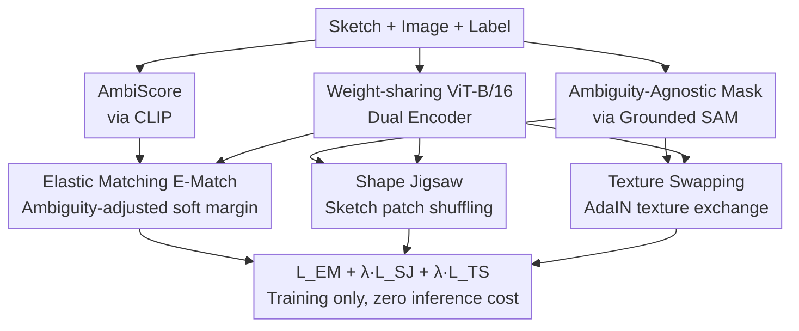

# Modeling the Visual Ambiguity of Human Sketches

**Conference**: CVPR 2026  
**Paper**: [CVF Open Access](https://openaccess.thecvf.com/content/CVPR2026/html/Zhou_Modeling_the_Visual_Ambiguity_of_Human_Sketches_CVPR_2026_paper.html)  
**Code**: TBD  
**Area**: Sketch Understanding / Cross-modal Retrieval  
**Keywords**: Sketch Visual Ambiguity, Zero-shot Sketch-based Image Retrieval (ZS-SBIR), Noisy Supervision, Elastic Matching, Shape-Texture Decoupling

## TL;DR
This paper points out that **visual ambiguity**, where "one sketch corresponds to multiple plausible images," can degrade sketch-image matching training. It proposes **AmbiScore**, calculated using CLIP, to quantify the ambiguity of each sketch-image pair. The **DisAmb** framework is introduced to explicitly model and eliminate ambiguity through Elastic Matching (dynamically adjusting supervision strength based on ambiguity) and Purified Matching (using Grounded SAM masks for shape jigsaw and texture swapping). The method significantly advances SOTA on ZS-SBIR / FG-ZS-SBIR without increasing inference overhead.

## Background & Motivation

**Background**: Learning visual representations from hand-drawn sketches is a core direction in computer vision. As a direct, controllable, and expressive interaction interface, sketches are widely used in tasks such as sketch-based image retrieval (SBIR), segmentation, and generation. **Zero-shot sketch-based image retrieval (ZS-SBIR)**, where a sketch is used to retrieve natural images from unseen categories, is a representative benchmark. Mainstream methods use metric learning to align sketches and images into a shared latent space, pulling same-class pairs together and pushing different-class pairs apart using triplet losses.

**Limitations of Prior Work**: Fundamental differences exist between sketches and images in visual structure: sketches consist of sparse outlines, while natural images are filled with dense textures, colors, and backgrounds. This results in significant portions of images (backgrounds, co-occurring objects) having **no correspondence** in the sketch. This mismatch is defined as **visual ambiguity**: a sketch of a "bird" could correspond to a single flying bird, a flock of birds, or a complex scene with a bird, branches, and the sky. Existing ZS-SBIR methods (SAKE, Sketch3T, ZSE-SBIR, etc.) treat all training pairs **equally**, assuming every pair is equally reliable.

**Key Challenge**: Ambiguity is essentially a form of **noisy supervision**. Observations of ViT `[RET]` token attention maps reveal a "model distraction" phenomenon in high-ambiguity samples, where attention is drawn to backgrounds or co-occurring objects rather than sketch-relevant regions. Statistical analysis of the Sketchy dataset across five ambiguity intervals shows that **only about 40% of the data falls into the low-ambiguity range**. Training on high-ambiguity subsets leads to a sharp performance collapse in ZS-SBIR and especially fine-grained FG-ZS-SBIR, meaning over half of the training data may be negatively impacting the model.

**Goal**: (1) How to **quantify** the ambiguity of a sketch-image pair? (2) How to **explicitly eliminate** ambiguity during training to purify the supervision signal?

**Key Insight**: While ambiguity is subjective and hard to annotate, sketches and images usually **share semantic labels**. Pre-trained Vision-Language Models (CLIP) can measure the semantic relevance between image content and category labels as a proxy for how well image content matches the sketch's intent.

**Core Idea**: First, use CLIP to generate a continuous **AmbiScore**. Then, adjust supervision signals accordingly: down-weighting high-ambiguity pairs and strengthening low-ambiguity ones (Elastic Matching). Simultaneously, use foundation model masks to remove sketch-irrelevant pixels, forcing the model to learn shape and semantics rather than texture shortcuts (Purified Matching).

## Method

### Overall Architecture

DisAmb is built on a standard SBIR dual-encoder: given a pair of sketch $x_s$, image $x_i$, and shared semantic label $T$, two **weight-sharing 12-layer ViT-B/16** (sketch encoder $V_s$, image encoder $V_i$) extract cross-domain embeddings. A critical setting is that **all ambiguity modeling components are only activated during training, while the model degrades to a clean dual-encoder during inference**, resulting in zero additional inference cost.

During training, AmbiScore and an "ambiguity-agnostic mask" (keeping only sketch-relevant regions) are pre-calculated offline. Two branches then work in parallel: **E-Match (Elastic Matching)** uses AmbiScore to dynamically adjust the triplet loss margin, softening supervision for ambiguous pairs; **P-Match (Purified Matching)** aggressively filters out irrelevant pixels via masks and performs auxiliary tasks like shape jigsaw and texture swapping on purified features. These branches complement each other: E-Match might "become lazy" on high-ambiguity data, which P-Match corrects using mask-based hard triplet losses.

### Key Designs

**1. AmbiScore: Quantifying Sketch-Image Ambiguity via CLIP**

Since ambiguity cannot be manually labeled, CLIP-based image-text relevance is used as a proxy. For a dataset with $N$ categories, a prompt `"a photo of [category]"` is created for each class. Text features $\{t_1,\dots,t_N\}$ are extracted via the CLIP text encoder $\mathcal{T}(\cdot)$, and visual features $v_c$ via the image encoder. Similarities are computed as $p_i = v_c^\top t_i$ and normalized via softmax:

$$p_i = \frac{\exp(p_i/\tau)}{\sum_{j=1}^N \exp(p_j/\tau)}, \quad \tau = 1.5$$

If $y$ is the ground-truth class index, **AmbiScore is defined as $s_t = (1 - p_t)$**. A higher $p_t$ implies the image purely corresponds to the category (clear intent), resulting in a lower $s_t$. Conversely, extraneous content increases $s_t$. This design reflects **relative ambiguity within the dataset** rather than absolute ambiguity, adapting to different scales and distributions. An additional prompt `"a photo of person"` is used to improve cross-dataset generalization.

**2. Elastic Matching (E-Match): Softening Supervision via Ambiguity**

To address the issue of uniform treatment, E-Match replaces fixed margins in triplet loss with **soft margins** that adapt to AmbiScore. The standard form is:

$$\mathcal{L}_{\rm EM} = \max\{d(v_s^{\rm cls}, v_p^{\rm cls}) - d(v_s^{\rm cls}, v_n^{\rm cls}) + \alpha_t,\ 0\}$$

where $d(a,b)=1-\frac{a\cdot b}{\|a\|\|b\|}$ is cosine distance. The soft margin $\alpha_t$ is determined by the normalized ambiguity score $\hat{s_t}$:

$$\alpha_t = \frac{\epsilon^{1-\hat{s_t}}-1}{\epsilon-1}\,\alpha$$

$\hat{s_t}$ is normalized across the gallery to prevent the loss from becoming inactive in high-ambiguity datasets. If $s_t \to 1$ (high ambiguity), $\alpha_t$ is small, reducing the pressure to pull the pair together. If $s_t \to 0$ (clean pair), $\alpha_t$ increases to enforce strict separation.

**3. Purified Matching - Shape Jigsaw: Mastering Shape through Masking**

P-Match leverages Grounded SAM to create an **ambiguity-agnostic mask** $M$, filtering out irrelevant pixels. The mask is downsampled to patch-level binary vectors $m$, identifying sketch-relevant features $v_{\rm mask}=\{v_i\}_{i\in S}$.

In the **Shape Jigsaw** task, sketch features $v_s$ are split into $k$ shuffled patches $v_s^r$. A Transformer decoder $\mathcal{D}_r$ with cross-attention processes $(v_s^r, v_{\rm mask})$ to perform: (1) Binary classification of whether the pair matches ($\mathcal{L}_{\rm pair}$); (2) Prediction of the original spatial order of sketch patches ($\mathcal{L}_{\rm jigsaw}$). This forces the model to learn local shape correspondences.

**4. Texture Swapping: Addressing Shape Bias**

Experiments show that SBIR models often rely purely on shape; matching performance remains nearly unchanged when images are replaced by binary masks. However, texture is critical for semantics (e.g., horse vs. zebra). Texture swapping is used to create **hard negatives with identical shapes but different textures/semantics**. Textures from the Describable Textures dataset are applied to the masked object via AdaIN, forming triplets $(x_s, x_p^\delta, x_n^\delta)$ for a hard-margin triplet loss:

$$\mathcal{L}_{\rm TS} = \max\{d(v_s, v_p^\delta) - d(v_s, v_n^\delta) + \alpha_{ts},\ 0\}$$

This forces the model to prioritize semantic correspondence over simple contour matching and acts as a safety net when E-Match reduces margins on ambiguous samples.

### Loss & Training
Images/sketches are $224\times224$. Margins $\alpha=\alpha_{ts}=1.0$, $\epsilon=10$. ViT-B/16 is initialized with ImageNet, Adam optimizer, learning rate $1e^{-5}$ for 40 epochs. Shape jigsaw uses $k=16$ ($4\times4$). **AmbiScore and masks are pre-calculated offline** for efficiency.

## Key Experimental Results

### Main Results

**Category-level ZS-SBIR (mAP@200 / Prec@200)**: Both B-DisAmb (no foundation model at inference) and C-DisAmb (using CLIP prompt tuning) achieve SOTA.

| Method | Sketchy mAP@200 | Sketchy Prec@200 | TU-Berlin mAP | QuickDraw mAP |
|------|------|------|------|------|
| ZSE-SBIR | 0.525 | 0.624 | 0.542 | 0.145 |
| **B-DisAmb** | **0.682** | **0.648** | **0.592** | **0.170** |
| SketchLVM | 0.723 | 0.725 | 0.651 | 0.202 |
| **C-DisAmb** | **0.812** | **0.789** | **0.707** | **0.245** |

B-DisAmb improves mAP@200 by 10.7% over previous SOTA on Sketchy, indicating significantly better ranking quality.

**Fine-grained FG-ZS-SBIR**:

| Method | acc@1 | acc@5 |
|------|------|------|
| ZSE-SBIR | 23.97 | 49.52 |
| **B-DisAmb** | **28.09** | **58.69** |
| **C-DisAmb** | **33.83** | **69.61** |

B-DisAmb outperforms ZSE-SBIR by 4.32% acc@1, proving that purified supervision effectively addresses model distraction.

### Ablation Study

| Configuration | mAP@200 | acc@1 | Note |
|------|---------|-------|------|
| w/o E-Match (Fixed margin) | 0.514 | 17.24 | Largest drop; noisy supervision poisons space |
| w/o $\mathcal{L}_{\rm TS}$ (Texture Swapping) | 0.635 | 21.28 | Significant drop on Fine-grained |
| **Ours-full** | **0.682** | **28.09** | Full model |

**Shape Bias Validation**: Training only on masks/edges yields mAP@200 of 0.466 vs 0.479 for full images, confirming high shape bias. Texture swapping improves this to 0.537 (+5.8%).

### Key Findings
- **E-Match is the core driver**: Removing it results in an mAP@200 drop of 0.168, proving that explicit ambiguity modeling is essential.
- **E-Match and P-Match are complementary**: DisAmb remains stable in high-ambiguity ranges where other baselines collapse.
- **Robustness to rough sketches**: DisAmb shows significant gains on low-quality sketches in the Sketchy-Q benchmark.

## Highlights & Insights
- **Quantifying Ambiguity**: AmbiScore provides a plug-and-play diagnostic tool to measure inter-modal ambiguity without manual annotation.
- **Soft and Hard Matching**: The dual approach of "avoiding" noise via E-Match and "purifying" it via P-Match is a robust strategy against noisy supervision.
- **Revealing the "Shape Bias"**: Identifying that SBIR models often "cheat" using shapes led to the development of texture swapping, which forces genuine semantic understanding.
- **Zero Inference Overhead**: The design ensures high performance without requiring heavy foundation models at runtime.

## Limitations & Future Work
- AmbiScore relies on hand-crafted CLIP prompts; future work may explore MLLMs for more reliable assessment.
- The method depends on the quality of Grounded SAM; failures in masking result in fallback to the original image.
- "Person" prompt tricks suggest sensitivity to class distribution.

## Related Work & Insights
- **Comparison to ZSE-SBIR**: While both use masks, DisAmb explicitly quantifies ambiguity and uses soft margins, leading to 4.32% higher accuracy.
- **Comparison to foundation model methods (SketchFusion, etc.)**: DisAmb identifies the ambiguity problem itself rather than incidentally mitigating it with text constraints.
- **Insight**: AmbiScore's approach of using pre-trained confidence as a noise proxy can be extended to other cross-modal alignment tasks lacking manual ambiguity labels.

## Rating
- **Novelty**: ⭐⭐⭐⭐⭐ First to quantify and explicitly model visual ambiguity in sketches.
- **Experimental Thoroughness**: ⭐⭐⭐⭐⭐ Validated across multiple benchmarks, downstream tasks, and quality levels.
- **Writing Quality**: ⭐⭐⭐⭐ Strong insights and convincing control experiments.
- **Value**: ⭐⭐⭐⭐⭐ Practical due to zero inference overhead and multi-task utility.

<!-- RELATED:START -->

## Related Papers

- [\[CVPR 2026\] Event-based Visual Deformation Measurement](event-based_visual_deformation_measurement.md)
- [\[AAAI 2026\] TDSNNs: Competitive Topographic Deep Spiking Neural Networks for Visual Cortex Modeling](../../AAAI2026/others/tdsnns_competitive_topographic_deep_spiking_neural_networks_for_visual_cortex_mo.md)
- [\[ACL 2025\] Visual Cues Enhance Predictive Turn-Taking for Two-Party Human Interaction](../../ACL2025/others/visual_cues_enhance_predictive_turn-taking_for_two-party_human_interaction.md)
- [\[CVPR 2026\] Negative Binomial Variational Autoencoders for Overdispersed Latent Modeling](negative_binomial_variational_autoencoders_for_overdispersed_latent_modeling.md)
- [\[CVPR 2026\] Advancing Image Classification with Discrete Diffusion Classification Modeling](advancing_image_classification_with_discrete_diffusion_classification_modeling.md)

<!-- RELATED:END -->
