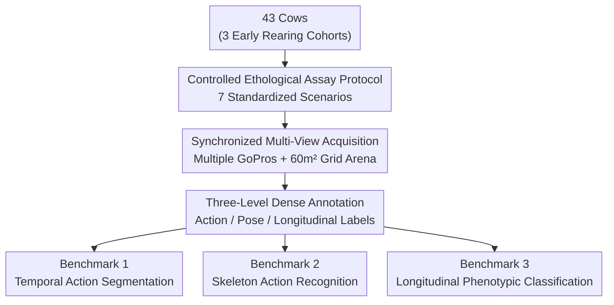

# MooCap: A Multi-View Benchmark for Cow-Object-Human Interaction and Behavior Dynamics

**Conference**: CVPR 2026  
**Paper**: [CVF Open Access](https://openaccess.thecvf.com/content/CVPR2026/html/Noronha_MooCap_A_Multi-View_Benchmark_for_Cow-Object-Human_Interaction_and_Behavior_Dynamics_CVPR_2026_paper.html)  
**Code**: https://github.com/IannoIITR/MooCap (Available)  
**Area**: Animal Behavior Understanding / Multi-View Video Benchmark / Temporal Action Segmentation  
**Keywords**: Animal behavior, Multi-view benchmark, Temporal action segmentation, Skeleton action recognition, Longitudinal phenotypic inference

## TL;DR
MooCap integrates classic ethological "controlled stimulus experiments" into computer vision. Utilizing 43 cows, 7 standardized interaction scenarios, 42 hours of synchronized multi-view video, and dense annotations (23 fine-grained behaviors + 39 keypoints + 4 spatial zones + three longitudinal rearing labels), it establishes three benchmarks: temporal action segmentation, skeleton action recognition, and longitudinal phenotypic classification. SOTA models achieve only $66.4\%$ frame accuracy and $0.39$ mean F1, highlighting the vast potential for research in animal behavior understanding.

## Background & Motivation

**Background**: The trajectory of animal behavior analysis in computer vision largely mirrors Human Action Recognition (HAR)—moving from small-scale controlled datasets like KTH and HMDB51 towards large-scale "in-the-wild" benchmarks like ActivityNet and Kinetics. In the animal domain, datasets have evolved from single-species efforts such as Cattle Visual Behaviours to massive passive collections like Animal Kingdom (850 species) and MammalNet (539 hours, 173 mammal species).

**Limitations of Prior Work**: These large-scale datasets primarily serve **isolated action recognition** or **frame-wise pose estimation**. They typically label "what the animal is doing in this frame" or provide skeleton keypoints, but rarely offer the structured multi-entity interaction annotations (animal-object-human-conspecific) required for studying "behavioral dynamics." Understanding animal behavior fundamentally requires modeling how the body, objects, and other individuals interact over time, rather than detecting isolated actions.

**Key Challenge**: Passive observation faces a fundamental **observation bottleneck**. While wild videos possess ecological validity, they tend to oversample "eye-catching" behaviors (e.g., fighting) while severely undersampling critical welfare indicators (low-frequency, non-dramatic behaviors) and introducing dataset bias. Consequently, the field is split into two extremes: (1) large-scale, passive wild data lacking context and control; and (2) small-scale, hypothesis-driven lab studies using powerful pose-tracking tools that are difficult to scale and limited to a single species. The former answers "what the animal is doing" (descriptive recognition), but cannot answer "how this individual responds to specific stimuli" (behavioral profiling).

**Goal**: To create a dataset that possesses both **controlled experimental protocols** (capable of systematically inducing interpretable behavioral responses) and **video scale with dense multimodal annotations**, bridging these extremes and enabling models to learn "behavioral profiles" rather than just "action labels."

**Key Insight**: Leveraging expertise in agricultural engineering, animal science, and veterinary medicine, the authors embedded classic **ethological assays**—applying a sequence of standardized stimuli to each individual (novel environment, novel object, human approach, unfamiliar conspecific, mother-offspring reunion)—directly into a multi-camera video acquisition framework. These stimuli are ethologically validated to systematically probe dimensions such as exploration motivation, neophobia, social ability, and human-animal relationships, which are rarely visible in unstructured recordings.

**Core Idea**: Replace "passive wild collection" with "standardized controlled stimuli + synchronized multi-view video + three-level dense annotation + longitudinal rearing labels," upgrading animal behavior datasets from simple action recognition benchmarks to behavioral dynamics testbeds capable of **causal/phenotypic inference**.

## Method

MooCap presents a **dataset + three benchmarks**. The pipeline consists of four stages: designing "what to record" using ethological protocols, determining "how to record" via multi-camera arrays, performing three-level dense annotation (actions/poses/longitudinal labels), and evaluating SOTA baselines on three tasks.

### Overall Architecture

The input consists of 7 scenarios experienced by 43 cows in a standardized test pen; the output is a three-level annotated multi-view video benchmark and its associated tasks.

### Key Designs

**1. Controlled Ethological Assay Protocol: Replacing Passive Recording with Standardized "Exams"**
Passive collection makes it impossible to control variables or compare responses across individuals. MooCap draws from classic ethology: each cow undergoes five core scenarios in a **completely identical sequence and duration**: Novel Environment (3 min, exploration/isolation fear), Novel Object (3 min, neophilia vs. neophobia), Human Approach (3 min passive + human-led approach, human-animal relationship), Unfamiliar Conspecific Restricted (5 min, visual contact), and Unfamiliar Conspecific Unrestricted (5 min, physical contact). A subset includes Mother-Offspring Reunion (Restricted/Unrestricted, 5 min each). This protocol isolates signals like dominance, affinity, and recognition.

**2. Synchronized Multi-View Acquisition + Grid Arena: Fixating Occlusions and Spatial Relations**
Non-rigid animal bodies and multi-entity interactions naturally cause significant occlusions. Synchronized GoPros on elevated platforms provide complementary views to resolve occlusions and support robust 3D reconstruction. The $60\text{ m}^2$ arena features a $1\text{ m}$ ground grid and fixed markers (troughs, waterers) to facilitate "spatial occupancy mapping, trajectory tracking, and approach-avoidance metrics" within a ground-truth coordinate system.

**3. Three-Level Dense Annotation: From Recognition to Inference**
The first layer is **frame-wise action labels**: dense annotations synchronized across views covering 23 fine-grained behaviors (Exploratory: sniffing/licking; Attention: alert; Social: affiliative/agonistic). The second layer is **skeleton pose**: manual annotation of ~3000 frames with 39 anatomical keypoints (head orientation, limbs, tail pose, etc.). The third is **longitudinal rearing labels**: 43 cows belong to three cohorts—full-day contact with bio-mother (23h/day), half-day contact (10h/day), or separated at birth. MooCap recordings were collected **9 months after weaning**, turning the dataset into a phenotypic inference testbed.

### Three Benchmark Tasks

- **Benchmark 1 · Temporal Action Segmentation**: Frame-wise action labeling of untrimmed 20–25 minute videos. Challenges include extreme temporal spans, 23 classes with high diversity, and severe class imbalance.
- **Benchmark 2 · Skeleton Action Recognition**: Classifying behaviors based on 39-keypoint trajectories. This task isolates whether kinematics alone are sufficient for behavioral discrimination.
- **Benchmark 3 · Longitudinal Behavioral Classification**: Assigning individuals to their early rearing groups (Full/Half/No mother contact) based on video. Models must extract "distributional signatures" (exploration latency, alert duration, approach distance) to infer a latent cause from observed effects.

## Key Experimental Results

### Benchmark 1: Temporal Action Segmentation

| Model | Type | Acc(MoF) $\uparrow$ | F1@0.10 $\uparrow$ | F1@0.25 $\uparrow$ | F1@0.50 $\uparrow$ |
| :--- | :--- | :--- | :--- | :--- | :--- |
| FACT | Supervised | **66.39** | 40.76 | 36.94 | **30.57** |
| LTContext | Supervised | 48.87 | 34.99 | 26.33 | 17.81 |
| DiffAct | Supervised | 35.65 | 19.83 | 11.57 | 3.31 |
| ASFormer | Supervised | 34.15 | 13.43 | 8.96 | 2.99 |
| MS-TCN++ | Supervised | 29.72 | 15.12 | 6.98 | 4.65 |
| UVAST | Supervised | 25.56 | 5.79 | 3.22 | 1.61 |
| TSA-ActionSeg (FINCH) | Unsupervised | 14.73 | — | — | — |

The strongest model, FACT, achieves only $66.39\%$ frame accuracy and $30.57\%$ F1@0.5, indicating that animal behavior transitions are complex and far from solved.

### Benchmark 2: Skeleton Action Recognition (F1 Scores)

| Behavior | AMGCN | MS-G3D | 2S-AGCN |
| :--- | :--- | :--- | :--- |
| Attentive | 0.39 | 0.02 | **0.62** |
| Threat | **0.50** | 0.16 | 0.14 |
| Close Proximity | 0.09 | **0.50** | 0.13 |
| Grooming | 0.35 | **0.51** | 0.22 |
| Playful | 0.40 | **0.52** | 0.23 |
| Push | 0.45 | **0.53** | 0.24 |
| Sexual | 0.34 | **0.49** | 0.21 |
| **Mean F1** | 0.36 | **0.39** | 0.26 |

MS-G3D leads with $0.39$ mean F1, excelling at "stereotypical repetitive movement signatures" like grooming and play, but struggling with subtle social cues requiring spatial context.

### Benchmark 3: Longitudinal Behavioral Classification (Accuracy %)

| Scenario | TimeSformer | VSwin | ViViT | UniFormer |
| :--- | :--- | :--- | :--- | :--- |
| Novel Environment | 25.18 | 18.00 | 30.00 | **88.10** |
| Novel Object | 32.10 | 14.82 | 23.46 | **88.89** |
| Human Approach | 22.22 | 22.22 | 20.99 | **83.95** |
| Conspecific Restricted | 24.00 | 17.00 | 25.00 | **85.00** |
| Conspecific Unrestricted | 25.00 | 16.00 | 28.39 | **87.00** |
| Reunion Restricted | **96.67** | 63.33 | 66.67 | 86.67 |
| Reunion Unrestricted | **93.33** | 56.67 | 76.67 | 70.00 |
| **Mean** | 45.50 | 29.72 | 38.74 | **84.23** |

### Key Findings
- **UniFormer outperforms other architectures in cross-scenario stability** (mean $84.23\%$), suggesting architecture choice is extremely sensitive for phenotype detection.
- **TimeSformer's unbalanced performance**: It peaks at $96.67\%$ in reunion scenarios but collapses $(22.22\%)$ in human interactions, suggesting it captures scenario-specific patterns rather than generalizable phenotypic features.
- **Complementary Failure Modes**: Segmentation often confuses behaviors when animals are in close proximity. Skeleton-only methods lack scene-level reasoning (inter-individual distance), necessitating hybrid pose + spatial scene graph architectures.

## Highlights & Insights
- **Engineering Ethological Assays into CV**: The use of standardized stimuli makes responses comparable across individuals, moving beyond "identifying what" to "profiling how."
- **Longitudinal Labels as Natural Causal Testbeds**: The 9-month interval between treatment and recording forces models to infer latent causes from behavior, offering significant value to behavioral genomics and welfare diagnostics.
- **Transferable Framework**: The "standardized stimuli $\to$ comparable response" approach is applicable to any video task requiring individual profiling, such as clinical gait analysis or child development assessments.

## Limitations & Future Work
- **Species/Site Limitation**: Limited to Holstein cows in a single facility; generalization to diverse farm environments is unproven.
- **Sample Size**: $N=43$ is typical for longitudinal ethology but limited for some deep learning phenotypic analyses.
- **Future Directions**: Expanding species diversity, including real-world pastured interactions, and scaling using automated tracking.

## Related Work & Insights
- **vs. Animal Kingdom / MammalNet**: While wild datasets offer ecological validity, they lack context/control and suffer from "eye-catching" bias. MooCap prioritize comparability and interpretability.
- **vs. MBE-ARI / ChimpACT**: MooCap provides a more comprehensive suite of dense actions + 39 keypoints + spatial zones + longitudinal labels in a single dataset.
- **vs. Lab Tools (DeepLabCut)**: MooCap embeds controlled protocols into a scalable video framework, balancing control with data volume.

## Rating
- Novelty: ⭐⭐⭐⭐ (Implementation of controlled ethological protocols and longitudinal tasks is a methodological breakthrough).
- Experimental Thoroughness: ⭐⭐⭐⭐ (Extensive evaluation across 13 baselines).
- Writing Quality: ⭐⭐⭐⭐ (Clear motivation and interdisciplinary narrative).
- Value: ⭐⭐⭐⭐ (Public data and evaluation tools fill a critical gap in precisely-monitored animal welfare).

<!-- RELATED:START -->

## Related Papers

- [\[ICCV 2025\] SyncDiff: Synchronized Motion Diffusion for Multi-Body Human-Object Interaction Synthesis](../../ICCV2025/others/syncdiff_synchronized_motion_diffusion_for_multi-body_human-object_interaction_s.md)
- [\[CVPR 2026\] Cross-View Distillation and Adaptive Masking for Incomplete Multi-View Multi-Label Classification](cross-view_distillation_and_adaptive_masking_for_incomplete_multi-view_multi-lab.md)
- [\[CVPR 2026\] Temporal Interaction in Spiking Transformers with Multi-Delay Mixer](temporal_interaction_in_spiking_transformers_with_multi-delay_mixer.md)
- [\[CVPR 2026\] Multi-Hierarchical Contrastive Spectral Fusion for Multi-View Clustering](multi-hierarchical_contrastive_spectral_fusion_for_multi-view_clustering.md)
- [\[CVPR 2026\] DF²-VB: Dual-level Fuzzy Fusion with View-specific Boosting for Multi-view Multi-label Classification](df2-vb_dual-level_fuzzy_fusion_with_view-specific_boosting_for_multi-view_multi-.md)

<!-- RELATED:END -->
