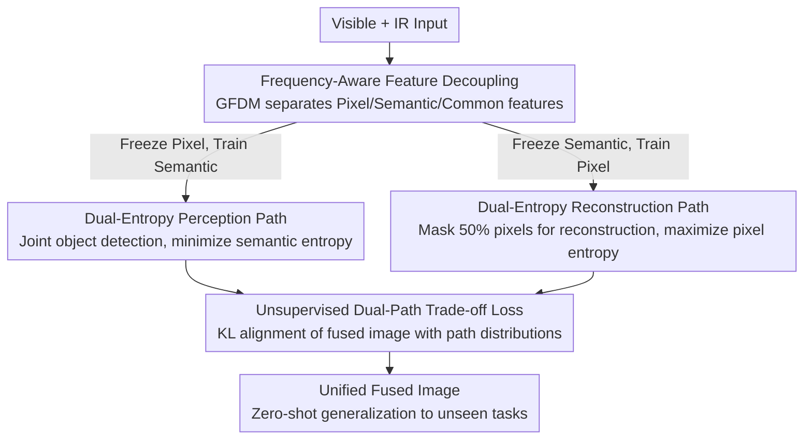

# More Than Meets the Eye: A Unified Image Fusion Framework via Semantic-Pixel Entropy Trade-off for Zero-Shot Generalization

**Conference**: CVPR 2026  
**Paper**: [CVF Open Access](https://openaccess.thecvf.com/content/CVPR2026/html/Liu_More_Than_Meets_the_Eye_A_Unified_Image_Fusion_Framework_CVPR_2026_paper.html)  
**Code**: https://github.com/XiaoW-Liu/DECC  
**Area**: Image Fusion / Image Restoration  
**Keywords**: Image Fusion, Free Energy Principle, Semantic-Pixel Entropy Trade-off, Zero-Shot Generalization, Frequency Domain Feature Decoupling

## TL;DR
Image fusion is reformulated as a free energy minimization problem—where the perception path suppresses "semantic entropy" and the reconstruction path elevates "pixel entropy." By training on only infrared-visible data, the model generalizes zero-shot to unseen fusion tasks such as medical, multi-focus, and multi-exposure imaging, while significantly improving downstream detection/segmentation performance.

## Background & Motivation

**Background**: Multi-source image fusion integrates complementary inputs into a single information-rich image. Traditionally, this relied on task-specific networks (separate models for infrared-visible, medical, etc.). Recently, "general networks" and "unified fusion" methods have emerged to cover multiple tasks with one model, but most still require explicit task labels during inference or pre-exposure to the target tasks during training.

**Limitations of Prior Work**: Existing methods face two bottlenecks. First, **inability to adapt to unseen fusion tasks**—general methods often require task identifiers, and unified methods mostly perform well only on seen tasks. While methods like TC-MoA and GIFNet achieve some generalization via gating mechanisms, they still require task-specific selectors or auxiliary networks during training, leading to high complexity. Second, the **difficulty in balancing semantics and pixels**—methods prioritizing downstream tasks (detection/segmentation) often sacrifice fine-grained pixel details, while purely pixel-driven methods lack high-level perceptual constraints, potentially introducing artifacts and increasing semantic uncertainty.

**Key Challenge**: The authors identify three fundamental challenges: (1) **Lack of a unified, task-agnostic optimization objective**—for zero-shot generalization, the optimization space of the anchor task must naturally align with other fusion tasks, requiring an objective function that captures the "essence" of fusion beyond specific data attributes; (2) **Domain gap between semantic fidelity and pixel richness**—the distributions of high-level semantic features and low-level pixel features differ significantly, making simultaneous optimization difficult; (3) **Over-reliance on supervised learning**—cross-modal fusion lacks "ground truth" fused images, and forced task supervision can hinder the learning of transferable shared representations.

**Key Insight**: Borrowing from the **Free Energy Principle** (Friston) in computational neuroscience, agents minimize prediction error through "perceptual inference" and "active inference." Mapped to fusion, perceptual inference maps pixels to semantic space to reduce uncertainty (**minimizing semantic entropy**), while generative reconstruction derives pixel details from semantics to maximize information (**maximizing pixel entropy**). These two directions are naturally symmetric and mutually constraining.

**Core Idea**: A unified free energy objective—"maximizing pixel entropy while minimizing semantic entropy"—replaces task-specific loss designs. This ensures the objective itself is task-agnostic, granting zero-shot generalization capabilities. This is implemented via a triple-component design: Dual-Entropy Collaborative Constraints (DECC), Grouped Frequency Dynamic Modulation (GFDM), and an unsupervised KL trade-off loss.

## Method

### Overall Architecture

The framework is named **DECC (Dual-Entropy Collaborative Constraints)**. It formulates fusion as free energy minimization:

$$\mu^*,\alpha^* = \arg\min_{\mu,\alpha} F(\tilde{s}(\alpha),\mu)$$

Where $F$ can be decomposed into "prediction error + complexity (prior divergence)": $F = \mathbb{E}_{q(\mu)}[-\log p(\tilde{s}(\alpha)|\mu)] + \mathrm{KL}[q(\mu)\|p(\mu)]$. The authors approximate this as the difference between two entropies based on the connection between prediction error and conditional entropy:

$$F(\tilde{s}(\alpha),\mu) \propto \mathbb{E}[H(I_{sem}|\mu)] - \mathbb{E}[H(I_{pix}|\alpha)] + C$$

Thus, the unified fusion goal becomes a symmetric dual-entropy optimization ($C$ is a constant):

$$\mu^*,\alpha^* = \arg\max_{\mu,\alpha}\ \mathbb{E}[H(I_{pix}|\alpha)] - \mathbb{E}[H(I_{sem}|\mu)]$$

Essentially, "maximize pixel entropy during reconstruction and minimize semantic entropy during perception." This objective is not tied to any specific task's data attributes, making it task-agnostic.

The network consists of a **Shared Frequency Dynamic Encoder**, a **Perception Decoder**, and a **Reconstruction Decoder**, optimized via a **dual-path alternating training** mechanism. Input pairs (e.g., Visible + IR) undergo frequency-aware decoupling via the encoder followed by cross-modal and cross-frequency fusion. The flow then splits into two symmetric paths: the Perception Path (PP), which jointly performs object detection to suppress semantic entropy, and the Reconstruction Path (RP), which reconstructs the input with 50% random pixel masking to elevate pixel entropy. The encoder parameters are shared across both paths, serving as mutual regularizers.

### Key Designs

**1. Dual-Path Symmetric Training (DECC): Separating "Semantic Fidelity" and "Pixel Richness" into Shared-Parameter Paths**

This design directly addresses the "lack of unified objective" challenge. Instead of designing losses for each task, it splits the dual-entropy objective into two symmetric paths optimized simultaneously. The **Perception Path (PP)** learns a "pixel → semantics" mapping by jointly training fusion and object detection to force out semantic structures, thereby minimizing semantic entropy and enhancing representation. Its goal is $\min_{\phi,\theta}\mathbb{E}_{x}[-\sum_y s_\phi(y|x;\theta)\log s_\phi(y|x;\theta)]$ (where $\theta$ is the shared encoder and $\phi$ is the perception head). The **Reconstruction Path (RP)** learns a "semantics → pixel" mapping by masking 50% of the pixels in each input and forcing the model to complete them, encouraging the preservation of visual diversity. Its goal is $\max_{\psi,\theta}\mathbb{E}_{x}[-\sum_f p_\psi(f|x;\theta)\log p_\psi(f|x;\theta)]$.

The shared encoder $\theta$ means constraints from both sides are regularized within the same parameters—an engineering embodiment of "perception-reconstruction symmetry."

**2. Grouped Frequency Dynamic Modulation (GFDM): Frequency-Aware Feature Decoupling**

Targeting the "semantic-pixel domain gap," the encoder utilizes the **GFDM** module. It uses Discrete Fourier Transform (DFT) to process features in the frequency domain, employing Fourier Disjoint Weight, Kernel Spatial Modulation, and Frequency Band Modulation for dynamic tuning before an IDFT returns to the spatial domain. The representations are **decoupled into three groups: pixel-oriented ($K_P$), semantic-oriented ($K_S$), and common ($K_C$)**. During iterative training, groups irrelevant to the current path are **frozen**—e.g., freezing pixel-oriented parameters while training the perception path—to prevent cross-domain contamination.

This is effective because low-level pixel details concentrate in high frequencies, while high-level semantic structures concentrate in low frequencies. Frequency-domain grouping naturally fits the physical differences between semantics and pixels.

**3. Unsupervised Dual-Path KL Trade-off Loss: Aligning Fusion with Shared Feature Distributions**

To address the "lack of ground truth" challenge, the authors use KL divergence for distribution-level constraints. In the perception path, a KL constraint $\mathcal{L}^{PP}_{trade}=\mathcal{L}_{KL}(x_f, \mathrm{Fea}_{PP})$ pulls the fused image $x_f$ toward a "semantically certain" distribution; in the reconstruction path, $\mathcal{L}^{RP}_{trade}=\mathcal{L}_{KL}(x_f, \mathrm{Fea}_{RP})$ pulls it toward a "pixel-rich" high-dimensional distribution. Combined, these achieve a balance between distribution types. Additionally, **EWC (Elastic Weight Consolidation)** is used to protect important parameters during alternating training and alleviate catastrophic forgetting.

### Loss & Training

The total loss for each path is:

$$\mathcal{L}_{path} = \mathcal{L}_{base} + \alpha\,\mathcal{L}^{path}_{info} + \beta\,\mathcal{L}^{path}_{trade} + \mathcal{L}_{ewc},\quad path\in\{PP,RP\}$$

where $\mathcal{L}_{base}=\mathcal{L}_{int}+\gamma\,\mathcal{L}_{grad}$ (intensity and gradient consistency). $\mathcal{L}_{info}$ uses detection labels in PP to suppress semantic entropy and reconstruction accuracy in RP to raise pixel entropy. Training data is strictly **M3FD** (Infrared-Visible).

## Key Experimental Results

Training used only M3FD, while evaluation was conducted on **tasks/datasets unseen during training**: Medical (MIF - Harvard), VIS-NIR (NVIF), Multi-exposure (MEIF - MEFB), Multi-focus (MFIF - MFI-WHU), and downstream detection (YOLOv8/v11 on M3FD) and segmentation (FMB).

### Main Results

Cross-task fusion quality (Table 1, DECC ranks 1st or 2nd in most metrics; EN = Entropy, higher is better for pixel information):

| Task | Metric Group | Ours (DECC) | Representative Rival | Note |
|------|--------------|-------------|----------------------|------|
| MIF Medical | EN/SD/MI/Qabf | 7.10 / **85.52** / 2.74 / **0.66** | EMMA SD 92.57 | Top-tier SD and Qabf |
| NVIF NIR | EN/SD/MI/Qabf | **7.26** / 56.41 / **4.63** / 0.62 | SegMiF EN 7.17 | 1st in EN and MI |
| MFIF Multi-focus | EN/SD/VIFF/SCD | **7.37** / 57.51 / 0.84 / 0.88 | GIF SD 67.33 | 1st in EN (detail preservation) |
| MEIF Multi-exp | EN/SD/VIFF/SCD | 7.20 / 64.26 / 0.78 / **1.25** | GIF SCD 1.23 | 1st in SCD (structural consistency) |

Downstream Task Gains (Detection mAP / Segmentation mIoU):

| Downstream Task | Model | Ours | Runner-up | Gain |
|-----------------|-------|------|-----------|------|
| Det. mAP@[.5:.95] | YOLOv8 | **35.34** | TC-MoA 34.76 | +0.58 |
| Det. mAP@[.5:.95] | YOLOv11 | **36.85** | TC-MoA 36.25 | +0.60 |
| Seg. mIoU | Mask2Former | **55.39** | GIFNet 55.28 | +0.11 |
| Seg. mIoU | DPT | **49.38** | TC-MoA 48.80 | +0.58 |

### Ablation Study

Ablations on M3FD (Table 4; Full model focuses on "balance" rather than single-metric maximum):

| Configuration | MI | Qabf | EN | SD | SF | PSNR | mAPv8 | Note |
|---------------|----|------|----|----|----|------|-------|------|
| only PP | 4.25 | 0.65 | 6.96 | 39.62 | 15.47 | 15.89 | 34.28 | High semantics, low pixel richness |
| only RP | 3.20 | 0.45 | 7.07 | **56.92** | **17.67** | 11.39 | 28.93 | Rich pixels, poor detection/PSNR |
| w/o GFDM | 3.10 | 0.61 | 6.49 | 27.67 | 11.26 | 13.28 | 32.76 | Significant performance drop |
| w/o Ltrade | 4.19 | 0.65 | 7.06 | 40.21 | 15.09 | 16.02 | 34.61 | Degradation in both ends |
| DECC (Full) | 3.89 | **0.67** | 7.01 | 40.97 | 15.94 | **16.48** | **36.34** | Best balance & downstream |

### Key Findings
- **GFDM is the backbone**: Removing it causes SD to drop from 40.97 to 27.67 and SF to nearly halve, proving frequency decoupling is essential.
- **Paths are truly "collaborative"**: Only PP maximizes MI but lacks richness; only RP maximizes SD but collapses detection and PSNR. The full model achieves the highest Qabf and PSNR by finding the optimal trade-off point.
- **Trade-off Perspective**: The full model's MI and EN are not the absolute highest across all variants, reflecting the author's intent to optimize for balanced perceptual quality and downstream utility rather than chasing single no-reference metrics.

## Highlights & Insights
- **"Ontological" redefinition of fusion**: Reformulating fusion via Free Energy into "semantic vs. pixel" entropy optimization allows the objective to decouple from specific tasks—enabling zero-shot generalization through the optimization goal itself rather than data scaling.
- **Frequency grouping + alternating freezing** is a clever decoupling trick. It achieves parameter specialization within a shared backbone without the complexity of multi-branch networks.
- **KL distribution alignment for unsupervised fusion**: By aligning the fused result with path-specific feature distributions, the model bypasses the fundamental difficulty of lacking ground truth while maintaining task-agnosticism.

## Limitations & Future Work
- **Dependency on detection labels**: The perception path relies on specific labels to suppress semantic entropy, meaning the choice of anchor task (M3FD) impacts the generalization boundary.
- **Explainability of frequency groups**: The physical meaning of $K_P/K_S/K_C$ relies more on intuition than quantitative evidence in the main text (details are relegated to the supplement).
- **Entropy approximation**: The approximation of Free Energy as the difference between conditional entropies ($F \approx H_{sem} - H_{pix}$) assumes specific conditions regarding prediction error that require deeper validation.
- **Future Directions**: Exploring purely self-supervised semantic entropy suppression to remove detection label dependency, and extending to more than two paths (e.g., illumination or geometric priors).

## Related Work & Insights
- **vs. U2Fusion (TPAMI 2021)**: U2Fusion uses continual learning, which is data-intensive and prone to bias; DECC aligns task spaces via a unified objective.
- **vs. TC-MoA (CVPR 2024) / GIFNet (CVPR 2025)**: These use gating/selection mechanisms with higher complexity; DECC achieves zero-shot generalization through shared parameters and frequency decoupling without task identifiers.
- **vs. Pixel-driven vs. Semantic-driven methods**: DECC fills the gap by explicitly regularizing both ends, preventing artifacts while maintaining semantic fidelity.

## Rating
- **Novelty**: ⭐⭐⭐⭐⭐ (Unique perspective using Free Energy to unify fusion optimization).
- **Experimental Thoroughness**: ⭐⭐⭐⭐ (Extensive tasks and downstream models; consistent gains across diverse scenarios).
- **Writing Quality**: ⭐⭐⭐⭐ (Clear logic and flow, although some architectural details are in the supplement).
- **Value**: ⭐⭐⭐⭐ (Practical zero-shot capability and lightweight implementation).

<!-- RELATED:START -->

## Related Papers

- [\[CVPR 2026\] Zero-shot Detection of AI-Generated Image via RAW-RGB Alignment](zero-shot_detection_of_ai-generated_image_via_raw-rgb_alignment.md)
- [\[CVPR 2026\] Customized Fusion: A Closed-Loop Dynamic Network for Adaptive Multi-Task-Aware Infrared-Visible Image Fusion](customized_fusion_a_closed-loop_dynamic_network_for_adaptive_multi-task-aware_in.md)
- [\[CVPR 2026\] NAF: Zero-Shot Feature Upsampling via Neighborhood Attention Filtering](naf_zero-shot_feature_upsampling_via_neighborhood_attention_filtering.md)
- [\[CVPR 2026\] Data-Centric Meta-Learning for Robust Few-Shot Generalization](data-centric_meta-learning_for_robust_few-shot_generalization.md)
- [\[AAAI 2026\] Forest vs Tree: The (N, K) Trade-off in Reproducible ML Evaluation](../../AAAI2026/others/forest_vs_tree_the_n_k_trade-off_in_reproducible_ml_evaluation.md)

<!-- RELATED:END -->
