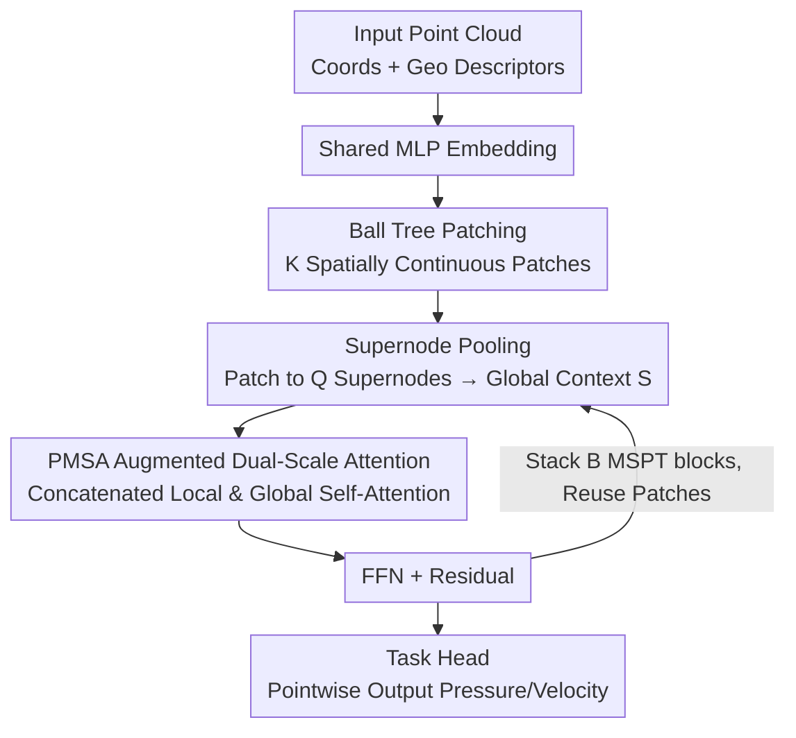

# MSPT: Efficient Large-Scale Physical Modeling via Parallelized Multi-Scale Attention

**Conference**: CVPR 2026  
**Paper**: [CVF Open Access](https://openaccess.thecvf.com/content/CVPR2026/html/Curvo_MSPT_Efficient_Large-Scale_Physical_Modeling_via_Parallelized_Multi-Scale_Attention_CVPR_20_paper.html)  
**Code**: https://github.com/pedrocurvo/mspt (Available)  
**Area**: Large-Scale Physical Modeling / Neural PDE Operators / Efficient Attention  
**Keywords**: Neural Operator, Multi-Scale Attention, Ball Tree Patching, Supernode Pooling, CFD Surrogate Model

## TL;DR
MSPT partitions million-scale point clouds into ball tree patches, performing local self-attention within each patch while pooling each patch into a small number of "supernodes" for cross-patch global communication. Both operations are integrated into the **same** attention operator for parallel computation, enabling solvers for industrial-grade PDE/aerodynamics problems on a single GPU with near-linear complexity, achieving SOTA on multiple benchmarks with significantly lower memory and latency.

## Background & Motivation
**Background**: Using neural networks as surrogate models for physical simulation (PDE solving) has become a prominent direction. Mainstream approaches include: 1) Neural Operators (FNO and its variants), which learn mappings from function space to function space in the Fourier spectral domain to ensure discretization invariance; 2) Transformer-based operators (Transolver, UPT, Erwin, etc.), which adapt attention to unstructured grids/point clouds to capture long-range dependencies.

**Limitations of Prior Work**: When applications like CFD or multi-physics design scale to **million-scale grid points**, the $O(N^2)$ interaction of vanilla attention becomes computationally prohibitive. Existing approximations have critical flaws: spectral methods (FNO family) require regular grids or periodic boundaries and provide poor expressivity for sharp local features; Transolver compresses the entire domain into a fixed number of global slices for hidden space attention, suffering from poor scaling as the slice bottleneck grows and sacrifice of simulation fidelity due to pooling; UPT/AB-UPT utilize centralized latent tokens to summarize the domain, "uniformly" spreading global context across regions, which is unfriendly to local details; Erwin performs strictly local attention within ball tree patches, achieving linear complexity and high local fidelity, but information propagates slowly through many layers, leading to weak long-range dependency capture.

**Key Challenge**: Different physical fields naturally require different spatial dependencies—stress and strain in solid mechanics are highly localized near loads, whereas global pressure coupling occurs in incompressible fluids due to divergence-free constraints, and aerodynamics requires consistency between surface pressure and far-field boundaries. In other words, **fine-grained local interaction, long-range global coupling, and near-linear cost** are difficult to satisfy simultaneously: purely local models (Erwin) lose global context; fixed global bottlenecks (Transolver/UPT) lose local details.

**Goal**: Design an attention mechanism where local interaction and global communication occur simultaneously within a **single, near-linear cost** operation, capable of elastically adapting to irregular geometries and varying resolutions.

**Core Idea**: Partition the point cloud into spatially continuous small patches for local attention to capture fine structures, while pooling each patch into a few "supernodes" acting as coarse-grained representatives for global communication. Local tokens attend to all supernodes to spread global information without incurring quadratic costs—both processes being integrated and computed in **parallel** within an augmented self-attention.

## Method

### Overall Architecture
The input to MSPT (Multi-Scale Patch Transformer) is a point cloud $P=\{p_1,\dots,p_N\}$ and its feature matrix $H\in\mathbb{R}^{N\times F}$, and the output is the target physical field (e.g., pressure, velocity) at each point. The pipeline begins by concatenating point coordinates $x_i$ and geometric descriptors $g_i$ through a shared MLP to obtain hidden features. A balanced ball tree is then constructed on the coordinates, and points are reordered via a depth-first search traversal of the leaves. After reordering, **every $L$ consecutive points** constitute a patch $P_k$, for a total of $K$ patches ($N=KL$, with zero padding if necessary). This partitioning is calculated only once before the first block and reused across all subsequent blocks.

Next, $B$ MSPT blocks are stacked. Each block is a modified pre-norm Transformer block: first, LayerNorm is applied, followed by **Supernode Pooling** for each patch to obtain $Q$ supernodes per patch, which are concatenated to form the global context $S$. Then, **PMSA (Parallelized Multi-Scale Attention)** is executed—within each patch, local tokens and global supernodes are concatenated for a single self-attention operation, followed by a residual connection. Finally, it passes through an FFN (LayerNorm + GELU MLP) with a residual connection. Point features and supernodes are iteratively refined block by block. The final block replaces the FFN with a task head to output the target field for each point.

### Key Designs

**1. Ball Tree Patching: Spatial Continuous "Neighborhood Patches" for Irregular Geometry**

For attention to be local, "locality" must first be defined. However, CFD grids and point clouds are unstructured and geometrically irregular without ready-made partitions. MSPT adopts the ball tree approach from Erwin: a balanced ball tree is constructed on point coordinates, and a depth-first traversal of the leaves yields a **spatially local reordering of points**—points near each other in space are adjacent in the sequence. By slicing the sequence into consecutive blocks of length $L$, $K$ spatially continuous patches $P_k$ are obtained, satisfying $P=\bigcup_{k=1}^K P_k$ and $|P_k|=L$. Crucially, this tree is built **only once before the first block**, and the patches are shared across all subsequent blocks to amortize preprocessing costs.

**2. Supernode Pooling: Compressing Patches for Global Communication**

To enable inter-patch information exchange, MSPT designates a few "representatives" or supernodes for each patch. Within patch $k$, $L$ point tokens are compressed into $Q$ supernodes $S_k\in\mathbb{R}^{Q\times F}$ by dividing the $L$ tokens into $Q$ sub-blocks and aggregating them via mean pooling $S_k^q=\frac{1}{L/Q}\sum_{j=1}^{L/Q}(H_k^q)_j$, max pooling, or a learnable linear projection $S_k=W_{\text{pool}}^\top H_k$. All $K$ sets of supernodes are concatenated to form the global context $S=[S_1;S_2;\cdots;S_K]\in\mathbb{R}^{(KQ)\times F}$. By adjusting $L$ such that $KQ \ll N$ (even $KQ\approx\sqrt N$), the global communication "bandwidth" remains narrow and costs are controlled.

**3. PMSA (Parallelized Multi-Scale Attention): Solving Local and Global in One Pass**

PMSA addresses the conflict between purely local and fixed global bottlenecks by **concatenating local tokens and global supernodes into an augmented sequence within each patch**, allowing interactions across two scales to occur in a single self-attention pass. Specifically, for patch $k$, the sequence $Z_k=\begin{bmatrix}H_k\\ S\end{bmatrix}\in\mathbb{R}^{(L+KQ)\times F}$ is formed. After computing standard QKV and $A_k=\mathrm{softmax}(Q_kK_k^\top/\sqrt F)$, the attention matrix naturally partitions into four components: $A_k^{\text{loc,loc}}$ for intra-patch local attention, and $A_k^{\text{loc,glob}}$ for local tokens attending to all global supernodes. MSPT retains only the updated local tokens:

$$H_k'=A_k^{\text{loc,loc}}V_k^{\text{loc}}+A_k^{\text{loc,glob}}V_k^{\text{glob}}\in\mathbb{R}^{L\times F}$$

The complexity is $O(NL+N^2Q/L)$. Since the quadratic coefficient $Q/L$ is typically very small, the linear term dominates, resulting in near-linear practical complexity.

### Loss & Training
The model is trained following standard protocols for each benchmark, reporting the relative $L_2$ error between predicted fields and ground truth. For CFD tasks (ShapeNet-Car / AhmedML), the validation loss is defined as $L=L_v+0.5\,L_s$ (volume term + 0.5×surface term). The final block's FFN is replaced by a task-specific head for pointwise regression of target fields.

## Key Experimental Results

### Main Results

Standard PDE benchmarks (Relative $L_2$ error, $\times10^{-2}$, lower is better):

| Model | Elasticity | Plasticity | Airfoil | Pipe | Navier-Stokes | Darcy |
|------|-----------|-----------|---------|------|---------------|-------|
| Transolver | 0.64 | 0.12 | 0.53 | 0.33 | 9.00 | **0.57** |
| Erwin | **0.34** | **0.10** | 2.57 | 0.61 | N/A | N/A |
| **Ours (MSPT)** | 0.48 | **0.10** | **0.51** | **0.31** | **6.32** | 0.63 |
| Gain (vs 2nd) | -41% | 17% | 4% | 6% | **30%** | -10% |

MSPT achieves SOTA on 4 out of 6 standard benchmarks, notably in Navier-Stokes (30% reduction vs Transolver) and Plasticity/Airfoil/Pipe.

Industrial 3D Aerodynamics Benchmarks (Relative $L_2$, $\times10^{-2}$):

| Model | ShapeNet-Car Vol↓ | Surf↓ | CD↓ | ρD↑ | AhmedML Vol↓ | Surf↓ |
|------|------|------|------|------|------|------|
| Transolver | 2.07 | 7.45 | 1.03 | 99.35 | 2.05 | 3.45 |
| **Ours (MSPT)** | **1.89** | **7.41** | **0.98** | **99.41** | **2.04** | **3.22** |
| AB-UPT (Original) | 1.16 | 4.81 | N/A | N/A | 1.90 | 3.01 |
| AB-UPT (Reproduced) | 2.51 | 7.67 | 2.20 | 97.48 | 2.39 | 4.33 |

MSPT outperforms all single-branch models. While the original AB-UPT reports lower numbers, MSPT outperforms it in uniform reproduction settings.

### Ablation Study

Impact of patch count $K$ on ShapeNet-Car test loss ($\times10^{-2}$):

| Configuration | Conclusion |
|------|------|
| Patch Count K | **Non-monotonic**: Low $K$ (large patches) provides sufficient local context but limits global communication; as $K$ increases, performance initially drops but improves beyond a threshold (around 512) as supernodes increase. |
| Pooling Method | Mean pooling is most stable; max pooling is worse; learnable linear projection is inconsistently better. |
| Supernode Q | $Q>1$ is generally better for richer representation, but excessive $Q$ consumes the computational savings from pooling. |

### Key Findings
- **The non-monotonic curve of $K$ reveals an essential trade-off**: too few patches oversmooth local details, while too many patches fragment long-range coherence. 
- **Efficiency is a core advantage**: Peak memory scales near-linearly. At 500k points, MSPT consumes 26.0 GB VRAM with 28 ms latency, vs Transolver’s 42.8 GB / 31 ms. At $K=128$, it can process one million points within 50 GB VRAM in 0.084 s on a single card.

## Highlights & Insights
- **Parallelizing Multi-Scale Interaction**: Instead of serial local and global blocks, MSPT integrates supernodes into the local sequence, utilizing the attention matrix structure (loc-loc / loc-glob) for joint normalization in a single softmax. This avoids "dilution" of global information in two-stage serial architectures.
- **Supernodes as Tunable Global Channels**: By setting $L$ such that $KQ\approx\sqrt N$, the global communication cost is suppressed by the small $Q/L$ coefficient. This "representatives for communication" design is transferable to other large-scale point cloud or graph tasks.

## Limitations & Future Work
- **Performance Boundaries**: On purely locally dominant tasks (Elasticity), Erwin remains superior; on Darcy, Transolver is better, suggesting PMSA is not universally optimal for all physical fields.
- **Lossy Bottleneck**: Pooling $L$ points into $Q$ representatives inherently loses information. Improving pooling and patching strategies is a future direction.
- **Reproduction Dependency**: Comparisons against specialized models like AB-UPT rely on internal reproduction, as original training pipelines were not fully open-sourced.

## Related Work & Insights
- **vs Transolver**: MSPT operates on local patches rather than fixed global slices, allowing better scaling and retention of local details to avoid oversmoothing.
- **vs Erwin**: MSPT adds supernodes for immediate global context in every layer, whereas Erwin requires many layers for information to diffuse from strictly local patches.

## Rating
- Novelty: ⭐⭐⭐⭐
- Experimental Thoroughness: ⭐⭐⭐⭐
- Writing Quality: ⭐⭐⭐⭐
- Value: ⭐⭐⭐⭐

<!-- RELATED:START -->

## Related Papers

- [\[CVPR 2026\] Efficient Unrolled Networks for Large-Scale 3D Inverse Problems](efficient_unrolled_networks_for_large-scale_3d_inverse_problems.md)
- [\[CVPR 2026\] Large-scale Robust Enhanced Ensemble Clustering via Outlier Decoupling](large-scale_robust_enhanced_ensemble_clustering_via_outlier_decoupling.md)
- [\[ICML 2026\] AMDP: Asynchronous Multi-Directional Pipeline Parallelism for Large-Scale Models Training](../../ICML2026/others/amdp_asynchronous_multi-directional_pipeline_parallelism_for_large-scale_models_.md)
- [\[ICML 2026\] Torus Graphs for Large-Scale Neural Phase Analysis](../../ICML2026/others/torus_graphs_for_large_scale_neural_phase_analysis.md)
- [\[ACL 2025\] Code-Switching and Syntax: A Large-Scale Experiment](../../ACL2025/others/code-switching_and_syntax_a_large-scale_experiment.md)

<!-- RELATED:END -->
