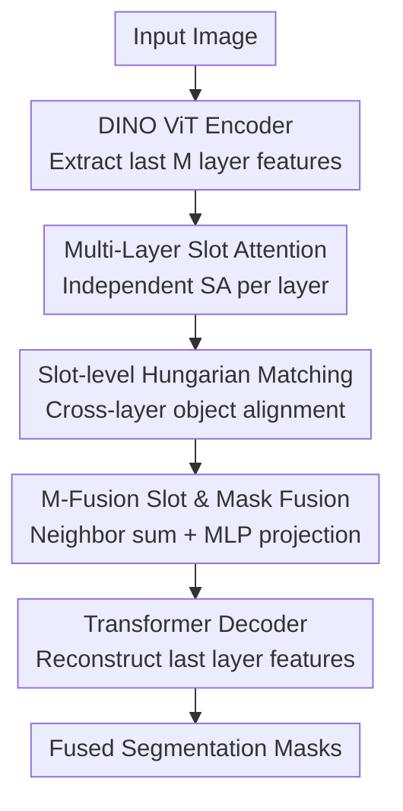

# MUFASA: A Multi-Layer Framework for Slot Attention

**Conference**: CVPR 2026  
**Paper**: [CVF Open Access](https://openaccess.thecvf.com/content/CVPR2026/html/Bock_MUFASA_A_Multi-Layer_Framework_for_Slot_Attention_CVPR_2026_paper.html)  
**Code**: https://visinf.github.io/mufasa/ (Project page available)  
**Area**: Object-Centric Representation / Self-Supervised Representation Learning  
**Keywords**: Slot Attention, Object-Centric Learning, Unsupervised Object Segmentation, Multi-Layer Feature Fusion, DINO

## TL;DR
MUFASA is a plug-and-play multi-layer Slot Attention framework. Instead of performing Slot Attention solely on the features of the last layer of a pre-trained DINO ViT, it simultaneously runs Slot Attention on several final layers. It uses Hungarian matching to align slots across layers and fuses them into a unified set of object-centric representations. This approach pushes methods like DINOSAUR/SPOT to new SOTA performance on VOC/COCO/MOVi-C for unsupervised segmentation, while significantly accelerating training convergence with minimal inference overhead.

## Background & Motivation

**Background**: Unsupervised Object-Centric Learning (OCL) aims to decompose an image into several "object-level" representations without annotations. A popular branch is Slot Attention (SA), which uses an iterative attention mechanism similar to soft k-means to cluster image patch features into $K$ latent vectors—"slots"—each competitively binding to an object. DINOSAUR extended this to real-world scenes by performing reconstruction in the **feature space** of a pre-trained self-supervised encoder (DINO ViT). SPOT further pushed Unsupervised Object Segmentation (UOS) to the then-SOTA using teacher-student self-distillation of attention masks and patch order perturbations.

**Limitations of Prior Work**: Methods like DINOSAUR and SPOT **only use the features from the last layer** of the DINO ViT as input to Slot Attention. However, research indicates that the semantics of DINO ViT are not concentrated solely in the last layer—shallow layers encode positional information, semantics emerge from middle layers and enrich deeper down, and different layers are **semantically complementary** (different layers partition the same scene differently). Relying only on the last layer discards complementary semantic information from intermediate ViT layers that is useful for segmentation.

**Key Challenge**: The "semantic perspective" of a single-layer feature is biased—one layer might merge a person and a dog into one slot, while another might separate them but introduce background noise. No single layer is "entirely correct," but their errors differ, creating natural complementary redundancy that can be exploited.

**Goal**: To allow Slot Attention to ingest multi-layer features simultaneously and **align then fuse** the resulting multi-layer slots into a clean, unified object representation without retraining the encoder or adding new losses; additionally, to design this as a plug-in for existing SA methods.

**Key Insight**: The authors confirmed via PCA visualization and per-layer training experiments (Fig. 2e) that several final deep layers are individually strong yet distinct in segmentation performance. Fusing slots from these layers can surpass any single layer. Thus, the problem shifts from "picking the best layer" to "how to merge the good layers."

**Core Idea**: Run independent Slot Attention on $M$ consecutive layers at the end of the ViT. Use Hungarian matching based on mask IoU to align slots representing the same object across layers, then fuse them into a single set of slots using an MLP (M-Fusion) with a "neighboring layer summation" inductive bias, which is then fed into the original decoder.

## Method

### Overall Architecture
MUFASA addresses the waste of intermediate DINO layer semantics by moving beyond single-layer usage. The pipeline is as follows: given an image, the DINO encoder extracts patch features from the final $M$ layers (default 4). Each layer is assigned an **independently parameterized** Slot Attention module, producing $K$ slots and corresponding attention masks per layer. **Slot-level Hungarian matching** is then performed to align slots across adjacent layers that bind to the same object. After alignment, the **M-Fusion module** fuses the multi-layer slots and masks into a unified set of representations. Finally, these fused slots are fed into an autoregressive Transformer decoder to reconstruct the **last layer** features. Training utilizes only the original reconstruction/distillation signals without additional losses. This module replaces the "single-layer SA bottleneck" in existing methods, resulting in DINOSAUR-M and SPOT-M.

### Key Designs

**1. Multi-Layer Slot Attention: Independent Slots for Each Deep Layer**

To address the loss of intermediate semantics, MUFASA selects an index set $\mathcal{I}\subseteq\{1,\dots,12\}$ ($|\mathcal{I}|=M$) from the 12 DINO layers $\mathcal{H}=\{h_1,\dots,h_{12}\}$. Patch features $\hat{\mathcal{H}}=\{h_i\in\mathbb{R}^{N\times d_\mathrm{emb}}\mid i\in\mathcal{I}\}$ are extracted, and Slot Attention is run **individually** for each $h_i$, yielding $M$ sets of slots $\mathcal{U}=\{S_1,\dots,S_M\}$. A key aspect is that each $\mathrm{SA}_m$ module has its own **trainable parameters** rather than sharing weights, as different layers have distinct statistics and semantics. Standard SA is used: mapping features to keys and the previous iteration's slots to queries to compute the assignment matrix:

$$\mathcal{A}^{\mathrm{Slot}}=\underset{K}{\mathrm{softmax}}\!\left(\frac{f_{\mathrm{Key}}(h)\cdot f_{\mathrm{Query}}(\mathcal{S})^T}{\sqrt{d}}\right),$$

where the softmax is normalized along the slot dimension to force competition, followed by iterative updates via a GRU-like function. This results in masks $\mathcal{A}^{\mathrm{Slot}}_m$ representing which patches belong to which slot from that layer's perspective.

**2. Slot-level Hungarian Matching: Aligning Before Fusing**

Since Slot Attention modules for different layers are initialized and trained independently, **slot indices do not correspond across layers**—slot 3 in layer 1 might be a dog, while slot 3 in layer 2 might be a person. Direct summation or concatenation would mix different objects, causing fusion to fail. MUFASA performs Hungarian matching between adjacent layers $S_m$ and $S_{m+1}$ based on the mIoU of binarized attention masks to find a permutation $\Pi_{m+1}$ that maximizes mean IoU. $S_{m+1}$ and its masks are then reordered so that the same object occupies the same index across all layers. This step is a prerequisite for fusion, ensuring that "incarnations" of the same object in different layers are aligned.

**3. M-Fusion: Fusing Multi-Layer Slots with "Neighbor Summation" Bias**

After alignment, the $M$ sets of slots must be fused into a single set $\mathcal{S}_\mathrm{fused}\in\mathbb{R}^{K\times d_\mathrm{slot}}$ for the decoder. While simple averaging (Avg-Fusion) performs similarly to the baseline and pure concatenation (Concat-Fusion) discards inter-layer structure, M-Fusion performs **sliding window element-wise summation between adjacent layers**. Each pair of adjacent slot sets $(\hat{S}_m, \hat{S}_{m+1})$ is summed to produce $M-1$ elements $\mathcal{Z}=\{(\hat{S}_1+\hat{S}_2),\dots,(\hat{S}_{M-1}+\hat{S}_M)\}$. This summation encodes an inductive bias of local interaction between adjacent layers. These are concatenated along the feature dimension and projected by a single hidden-layer MLP:

$$\mathcal{S}_\mathrm{fused}=\mathrm{MLP}\big(\mathrm{Concat}(\mathcal{Z},\,\text{axis=features})\big).$$

Attention masks are handled similarly: adjacent masks are summed to get $\mathcal{Z}^\mathrm{att}$, then combined via a weighted linear combination $\mathcal{A}^{\mathrm{Slot}}_\mathrm{fused}=\sum_{m=1}^{M-1}w_m\mathcal{Z}^\mathrm{att}_m$. In DINOSAUR-M (no teacher-student learning), weights $w$ are uniform constants $\frac{1}{M-1}$. In SPOT-M, weights are learnable parameters guided by mask distillation from the teacher, normalized via softmax over the layer dimension.

### Loss & Training
MUFASA **introduces no new losses** and reuses baseline training signals. The core target is a standard reconstruction objective in feature space where the decoder reconstructs the last DINO layer feature $h$:

$$\mathcal{L}_\mathrm{Rec}=\frac{1}{N\cdot d_\mathrm{emb}}\big\lVert h-\mathrm{Decoder}(\mathcal{S})\big\rVert_2^2.$$

DINOSAUR-M uses only this loss; SPOT-M adds teacher-student self-training. Implementation details: $M=4$ consecutive final layers are used; M-Fusion MLP has a hidden width of 768 with GELU; $K$ varies by dataset (VOC $K=6$, COCO $K=7$, MOVi-C $K=11$); encoder is ViT-B/16 with pre-trained DINO weights.

## Key Experimental Results

### Main Results
On PASCAL VOC, COCO, and MOVi-C, MUFASA improves upon DINOSAUR and SPOT in nearly all settings, setting a new SOTA for UOS. Improvements are most significant in category-level mBO (mBOc). The table below shows a comparison on VOC (%):

| Model | mBOc | mBOi | mIoU | FG-ARI |
|------|------|------|------|--------|
| DINOSAUR | 51.2 | 44.0 | – | 24.8 |
| DINOSAUR-M (Ours) | 57.6 | 49.2 | 47.2 | 25.2 |
| SPOT | 55.3 | 48.1 | 46.5 | 19.7 |
| SPOT-M (Ours) | **59.8** | **51.3** | **49.4** | 20.6 |

Notably, DINOSAUR-M (57.6 mBOc) outperforms the more complex SPOT (55.3), indicating that MUFASA's gains do not rely solely on the teacher-student strategy. On synthetic MOVi-C, DINOSAUR-M raises mBOi from 42.4 to 49.2 and FG-ARI from 55.7 to 66.4.

### Ablation Study
Fusion strategy ablation (SPOT-M on VOC, %):

| Fusion Strategy | mBOc | mBOi | mIoU | FG-ARI |
|----------|------|------|------|--------|
| SPOT (Single-layer baseline) | 55.3 | 48.1 | 46.5 | 19.7 |
| Avg-Fusion (Non-learned avg) | 55.6 | 48.1 | 46.5 | 19.4 |
| Concat-Fusion (No neighbor sum) | 59.0 | 50.9 | 48.9 | 20.0 |
| T-Fusion (MLP → Transformer) | 59.0 | 50.7 | 48.9 | 19.7 |
| **M-Fusion (Ours)** | **59.8** | **51.3** | **49.4** | **20.6** |

Regarding training efficiency, MUFASA converges rapidly: SPOT-M reaches baseline performance on VOC in 51 epochs (vs. 944 for SPOT), overall reducing VOC training time by 94.4% and DINOSAUR-M by 90.2%.

### Key Findings
- **Neighboring summation bias is critical**: Excluding it (Concat-Fusion) drops mBOc from 59.8 to 59.0. Pure averaging offers almost no gain over the baseline.
- **More layers are not always better**: Performance peaks at 4 consecutive layers; additional layers slightly degrade results, making 4 layers the sweet spot for accuracy and efficiency.
- **Consecutive deep layers > Scattered layers**: Mixing early and late layers outperforms the baseline but lags behind using consecutive final layers.
- **Robustness to components**: MUFASA consistently outperforms baselines when replacing the encoder (MAE, DINOv2, ViT-S/8) or using a weaker MLP decoder, suggesting improvements stem from the Slot Attention mechanism itself.
- **Low overhead**: DINOSAUR-M has 20.7% more parameters than DINOSAUR; SPOT-M throughput remains nearly constant (86.1 $\rightarrow$ 84.7 img/s).

## Highlights & Insights
- **From "layer selection" to "complementary fusion"**: Instead of debating which DINO layer is best, the authors acknowledge that every layer has unique errors and use fusion to cancel out noise. This perspective is valuable for any task using pre-trained ViT intermediate features.
- **Hungarian matching solves multi-branch fusion**: Latent vectors from independent branches naturally lack correspondence. Using mask IoU for one-to-one alignment before fusion is a clean, reusable strategy for any scenario merging multi-view/multi-branch slots.
- **Neighboring summation = Cheap inductive bias**: Sliding window summation outperforms both simple concatenation and complex Transformers, showing that structural priors for layer interaction can be more effective than adding parameters.
- **Plug-and-play with zero extra loss**: MUFASA replaces the SA bottleneck while reusing baseline signals, allowing the lighter DINOSAUR-M to beat the heavier SPOT.

## Limitations & Future Work
- **Instance merging**: Similar to other SA models, MUFASA tends to merge multiple instances of the same class (e.g., several people) into a single slot.
- **Rigid matching**: Hungarian matching enforces a strict one-to-one correspondence between layers. Exploring more flexible soft matching could be beneficial.
- **Manual hyperparameter selection**: The selection of the final 4 layers was tuned on VOC; whether this is optimal across all datasets/encoders remains to be validated.
- **Inconsistent memory impact**: While parameter counts increase, memory overhead varies by base model (8.1% for DINOSAUR-M vs. 0.4% for SPOT-M), requiring careful assessment for large-scale training.

## Related Work & Insights
- **vs. DINOSAUR**: DINOSAUR moved SA to the DINO feature space. MUFASA builds on this with multi-layer SA and M-Fusion, improving VOC mBOc from 51.2 to 57.6 without changing the training pipeline.
- **vs. SPOT**: SPOT relies heavily on the decoder and self-training. MUFASA’s gains are at the SA bottleneck, making it less decoder-sensitive.
- **vs. Multi-query SA**: While some methods use multiple SA modules on the **same layer**, MUFASA differentiates itself by exploiting complementarity **across different layers** with explicit alignment.
- **vs. Other multi-layer ViT uses**: While others use multi-layer ViT for multimodal or correspondence tasks, MUFASA is the first to systematically introduce multi-layer ViT representations to the OCL/Slot Attention domain.

## Rating
- Novelty: ⭐⭐⭐⭐ Systematic introduction of multi-layer features to SA; the combination of Hungarian alignment and neighbor sum fusion is effective, though components are combined from existing ideas.
- Experimental Thoroughness: ⭐⭐⭐⭐⭐ Extensive tests across datasets, baselines, and encoders; includes comprehensive ablations on fusion, layer count, and training efficiency.
- Writing Quality: ⭐⭐⭐⭐ Clear logical flow from motivation to observation to method; Fig 2. visualization is persuasive.
- Value: ⭐⭐⭐⭐ Plug-and-play, no additional losses, and provides significant training acceleration; directly useful for UOS and related DINO-based tasks.

<!-- RELATED:START -->

## Related Papers

- [\[CVPR 2026\] MSPT: Efficient Large-Scale Physical Modeling via Parallelized Multi-Scale Attention](mspt_efficient_large-scale_physical_modeling_via_parallelized_multi-scale_attent.md)
- [\[CVPR 2026\] AVGGT: Rethinking Global Attention for Accelerating VGGT](avggt_rethinking_global_attention_for_accelerating_vggt.md)
- [\[ACL 2025\] A Multi-Persona Framework for Argument Quality Assessment](../../ACL2025/others/a_multi-persona_framework_for_argument_quality_assessment.md)
- [\[CVPR 2026\] Drainage: A Unifying Framework for Addressing Class Uncertainty](drainage_a_unifying_framework_for_addressing_class_uncertainty.md)
- [\[CVPR 2026\] Multi-Hierarchical Contrastive Spectral Fusion for Multi-View Clustering](multi-hierarchical_contrastive_spectral_fusion_for_multi-view_clustering.md)

<!-- RELATED:END -->
