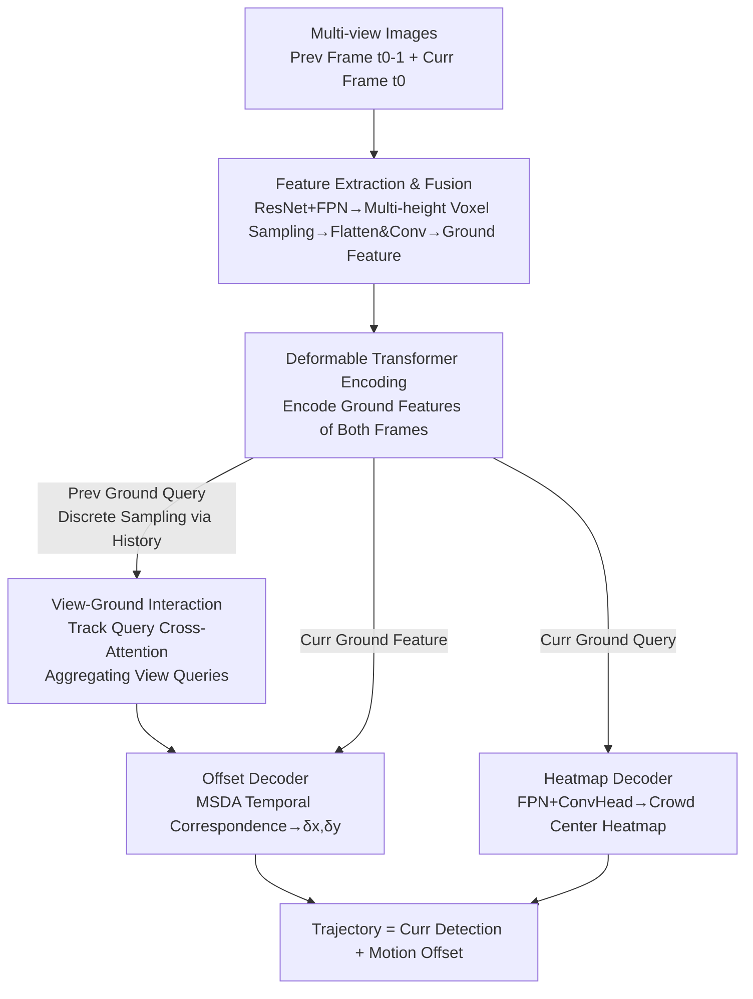

# Multi-view Crowd Tracking Transformer with View-Ground Interactions Under Large Real-World Scenes

**Conference**: CVPR 2026  
**arXiv**: [2604.19318](https://arxiv.org/abs/2604.19318)  
**Code**: https://github.com/zqyq/MVTrackTrans  
**Area**: Multi-view Tracking / Object Detection  
**Keywords**: Multi-view Crowd Tracking, Transformer, View-Ground Interaction, BEV, Large-scale Scene Dataset

## TL;DR
This work is the first to push multi-view crowd tracking from small scenes with dozens of frames (e.g., Wildtrack/MultiviewX) to large-scale real-world scenes spanning hundreds of meters. It proposes a fully Transformer-based model, MVTrackTrans (tracking in ground BEV space + view-ground cross-attention to complement appearance information), and releases two large-scale long-sequence datasets, MVCrowdTrack and CityTrack. The model leads CNN-based methods in MOTA/IDF1 on large datasets.

## Background & Motivation
**Background**: The goal of multi-view crowd tracking is to fuse information from multiple synchronized and calibrated cameras to estimate the trajectories of individuals on the ground plane. It is applied in crowd management, public transportation, and autonomous driving. Current mainstream methods (EarlyBird, TrackTacular, MVFlow, etc.) primarily utilize CNN architectures: projecting features from various views onto a BEV/ground plane for detection, then stacking world representations of adjacent frames to regress motion offsets, followed by ReID and Kalman filtering for temporal association.

**Limitations of Prior Work**: These methods are mostly evaluated on Wildtrack and MultiviewX. These datasets feature small scenes ($36 \times 12$ m, $25 \times 16$ m), sequences of only a few hundred frames, around 300 individuals, and average trajectory lengths of only 30-44 frames. Methods optimized for these "mini" benchmarks struggle in large real-world scenes characterized by wider coverage, dense crowds, severe occlusion, and longer time spans. There is a lack of suitable datasets to expose these issues, and current model capacities are insufficient.

**Key Challenge**: Evaluation-wise, small datasets do not reflect the complexity of real applications. Model-wise, CNN architectures lack the receptive field and spatial-temporal modeling capability to support stable long-term tracking in dense, large-scale scenes. While Transformers have proven effective for global spatial-temporal association in single-view MOT, they remain largely unexplored in multi-view crowd tracking.

**Goal**: (1) Provide large-scale, long-sequence benchmarks reflecting real-world complexity; (2) Design a Transformer-based multi-view tracking model that effectively fuses "view features" and "ground features."

**Key Insight**: Ours observes that track queries obtained by discrete sampling solely on the BEV ground plane lose appearance details (features become stretched or blurred after projection). Conversely, individual camera views lack consistent cross-view ground positioning. Since they are complementary, cross-attention is used to explicitly interact "ground-side track queries" with "multi-camera view queries."

**Core Idea**: Perform tracking on the BEV ground plane using a Transformer and implement a **View-Ground Interaction** module. This allows ground track queries to aggregate appearance features from all camera view queries through cross-attention, recovering visual information lost during discrete sampling.

## Method

### Overall Architecture
MVTrackTrans receives multi-view images from two consecutive frames (previous frame $t_0-1$ and current frame $t_0$) and outputs the positions (heatmap) and motion offsets relative to the previous frame to generate trajectories. The process consists of three stages: **Feature Extraction and Multi-view Fusion** $\rightarrow$ **Multi-view Tracking Encoding (with View-Ground Interaction)** $\rightarrow$ **Multi-view Tracking Decoding (Dual-branch)**.

Intuitively: A shared ResNet extracts features, which are fused into ground features via multi-height voxel sampling and convolution. A deformable Transformer encoder then processes ground features for both frames. Track queries are sampled from the previous ground queries based on historical positions and interact with multi-camera view queries via cross-attention. Finally, an offset decoder regresses $[\delta x, \delta y]$ using temporal correspondence, while a heatmap decoder regresses the crowd center heatmap from the current ground features.

### Key Designs

**1. Multi-view Ground Fusion via Multi-height Voxel Sampling: Retaining Height Info during Projection**

Traditional multi-view fusion projects image features to a single ground plane, causing misalignment of features at different heights (feet, torso, head). Ours employs multi-height bilinear voxel sampling: for a voxel $(x_n, y_n, z_n)$ above the ground, the camera projection matrix $K[R|T]$ projects its eight vertices onto image planes $(u_n, v_n, 1)^T = K[R|T](x_n, y_n, z_n, 1)^T$ to sample and aggregate features. These are collapsed along the height axis and fused via convolution to produce multi-scale ground features $\{F_l^{t_0}\}_{l=1}^L$. This geometric foundation is more robust for large-scale, occluded scenes.

**2. Deformable Encoding + Ground Discrete Sampling for Track Queries: Explicit Representation in Ground Space**

Ground features are fed into a multi-scale deformable attention Transformer encoder to obtain $\hat{Q}^{t_0-1}$ and $\hat{Q}^{t_0}$. A crucial step is **discrete sampling** from the previous frame's encoded ground queries at historical detection positions $(x, y)$ to construct track queries: $Q_{\mathrm{track}}^{t_0-1} = \mathrm{SampleQueries}(\hat{Q}^{t_0-1}, (x, y))$. This represents each previously tracked entity as an explicit query addressable in ground space for temporal propagation.

**3. View-Ground Interaction: Recovering Visual Appearance via Cross-Attention**

This is the core performance contributor. While discrete sampling provides accurate positioning, ground features are often stretched, leading to insufficient appearance representation. Ours samples view queries from each camera's detection features and concatenates them: $Q_{\mathrm{view}}^{t_0-1} = \mathrm{Concat}(Q_{\mathrm{view}, 0}^{t_0-1}, \dots, Q_{\mathrm{view}, n-1}^{t_0-1})$. Then, track queries interact with view queries via cross-attention, where **track queries act as Q and view queries act as K/V**: $Q_{\mathrm{track}}^{t_0-1} = \mathrm{CrossAttn}(\mathrm{FFN}(Q_{\mathrm{track}}^{t_0-1}), \mathrm{FFN}(Q_{\mathrm{view}}^{t_0-1}))$. This aggregates visual features corresponding to the same person across all views.

**4. Dual-branch Decoding: Separate Branches for Timing and Detection**

The offset decoder uses Multi-Scale Deformable Attention (MSDA) to model temporal correspondence between ground features of adjacent frames. Using $Q_{\mathrm{track}}^{t_0-1}$ as the query and $\hat{Q}^{t_0}$ as the reference, it regresses the motion offset $O^{t_0} = [\delta x, \delta y]^T$. Simultaneously, the heatmap decoder uses FPN to fuse current multi-scale ground features and a convolution head to output the center heatmap $H^{t_0} = \mathrm{ConvHead}(\mathrm{FPN}(\hat{Q}^{t_0}))$.

### Loss & Training
Joint optimization of heatmap classification (ground and image domains) and motion offset regression is performed using uncertainty weighting for balancing.
- **Heatmap Loss**: Focal loss $\mathcal{L}_{\mathrm{ground}} = \mathrm{FocalLoss}(H, H^*)$ is used for predicted ground heatmaps. An image-level term $\mathcal{L}_{\mathrm{img}}$ supervises center detection in each view.
- **Offset Regression Loss**: $\ell_1$ loss $\mathcal{L}_{\mathrm{track}} = \frac{1}{K}\sum_{x,y}\|O_{xy}-O^*_{xy}\|_1$ is applied only at valid center positions ($C^*_{xy}=1$).
- **Total Loss**: $\mathcal{L}_{\mathrm{all}} = 10e^{-\sigma_c}\mathcal{L}_{\mathrm{ground}} + e^{-\sigma_t}\mathcal{L}_{\mathrm{track}} + \mathcal{L}_{\mathrm{img}} + \sigma_c + \sigma_t$, where $\sigma_c, \sigma_t$ are learnable uncertainty parameters.

Training: ResNet18 backbone + Deformable DETR-style encoder-decoder; images resized to $1280 \times 720$; 50 epochs; initial learning rate 0.01; 4 $\times$ RTX 4090.

## Key Experimental Results

### Main Results
Comparison with SOTA on two new large datasets (MOTA and IDF1 as primary metrics):

| Dataset | Method | MOTA↑ | MOTP↑ | IDF1↑ | MT↑ | ML↓ |
|--------|------|-------|-------|-------|-----|-----|
| MVCrowdTrack | EarlyBird | 54.56 | 30.46 | 53.84 | 24.48 | 14.22 |
| MVCrowdTrack | MVFlow | 49.82 | 46.79 | 44.06 | 22.22 | 37.04 |
| MVCrowdTrack | TrackTacular | 62.86 | 29.23 | 58.71 | 40.81 | 10.20 |
| MVCrowdTrack | **MVTrackTrans** | **63.87** | 40.59 | **59.06** | **42.85** | **8.16** |
| CityTrack | EarlyBird | 48.85 | 21.83 | 32.15 | 17.33 | 13.9 |
| CityTrack | MVFlow | 38.19 | 6.94 | 27.89 | 8.92 | 24.88 |
| CityTrack | TrackTacular | 43.37 | 23.23 | 32.49 | 20.43 | 12.38 |
| CityTrack | **MVTrackTrans** | **55.39** | 22.71 | **34.41** | **25.07** | 12.69 |

Ours ranks first in MOTA/IDF1/MT on large datasets. In CityTrack, MOTA is +12 higher than TrackTacular.

Dataset Comparison (demonstrating the "scale" of the new benchmarks):

| Dataset | Resolution | Views | People | Frames | FPS | Area (m²) | Avg Traj Len |
|--------|--------|-------|------|------|-----|---------|-----------|
| MultiviewX | 1920×1080 | 6 | 360 | 400 | 2 | 25×16 | 44 |
| Wildtrack | 1920×1080 | 7 | 313 | 400 | 2 | 36×12 | 30 |
| CityTrack | 2704×1520 | 3 | 950 | 2588 | 4 | 64×76 | 228 |
| MVCrowdTrack | 5312×2988 | 7 | 342 | 4122 | 4 | 120×80 | 176 |

On small datasets (Wildtrack/MultiviewX), performance is comparable but not dominant.

### Ablation Study (on CityTrack)

| Configuration | MOTA↑ | IDF1↑ | Description |
|------|-------|-------|------|
| Baseline (No 2D view branch) | 54.92 | 34.11 | Ground branch only |
| + View Prediction Branch | 53.17 | 32.65 | 2D heatmap branch alone drops performance |
| ++ View Interaction (Ours) | **55.39** | **34.41** | With view-ground interaction |
| Interaction via SelfAtt | 55.38 | 33.64 | View/ground query self-attention |
| Interaction via CrossAtt (Ours) | 55.39 | **34.41** | Cross-attention yields higher IDF1 |
| Coordinate regression | 40.71 | 31.45 | Sparse query + direct coordinate regression |
| Heatmap regression (Ours) | **55.39** | **34.41** | Dense heatmap supervision |

### Key Findings
- **Adding a 2D view branch alone drops performance**: The 2D detection task competes with the ground plane task. Only the View-Ground Interaction module effectively utilizes view information.
- **Cross-attention > Self-attention**: Cross-attention allows track queries to actively pull information, resulting in more thorough fusion.
- **Heatmap supervision >> Coordinate regression**: Multi-view projection introduces noise in ground features; dense heatmap supervision is more effective in guiding the model.
- **Scale-dependent advantage**: Transformers outperform CNN methods significantly in large scenes but only show comparable results in small scenes.

## Highlights & Insights
- **Explicit complementarity of ground positioning and view appearance**: Ours addresses the trade-off by using cross-attention to let the two sets of information interact directly, which is more end-to-end than stacking ReID modules.
- **Clean ablation between "branch" and "interaction"**: By showing that adding a branch drops performance while adding interaction improves it, the authors prove that gains come from the cross-domain fusion mechanism itself.
- **High-value dataset contribution**: Moving from ~30 to 120 meters and from hundreds to thousands of frames establishes a more realistic benchmark for the community.

## Limitations & Future Work
- **Small-scene performance**: Does not outperform MVTrajecter on Wildtrack/MultiviewX, suggesting gains are scale-dependent.
- **Calibration dependency**: Relies on precise camera parameters; the impact of calibration noise in large scenes is not discussed.
- **Short temporal window**: Uses only two frames; end-to-end long-term association (e.g., via memory modules) is not yet integrated.
- **Backbone limits**: Constrained by memory (batch size = 1, ResNet18), potentially underutilizing Transformer capabilities.

## Related Work & Insights
- **vs EarlyBird / TrackTacular**: These utilize CNNs for detection + ReID/Kalman filtering. Ours transitions to a Transformer-based ground tracking approach with explicit view interaction.
- **vs MVFlow**: MVFlow uses motion flow with grid constraints, which fails in long-term continuous motion. Ours is significantly more stable in large datasets.
- **vs Single-view Transformer MOT**: Adapts dense heatmap and track query ideas to the multi-camera calibrated ground setting, filling a previous gap in multi-view research.

## Rating
- Novelty: ⭐⭐⭐⭐
- Experimental Thoroughness: ⭐⭐⭐⭐
- Writing Quality: ⭐⭐⭐⭐
- Value: ⭐⭐⭐⭐

<!-- RELATED:START -->

## Related Papers

- [\[CVPR 2026\] DF²-VB: Dual-level Fuzzy Fusion with View-specific Boosting for Multi-view Multi-label Classification](df2-vb_dual-level_fuzzy_fusion_with_view-specific_boosting_for_multi-view_multi-.md)
- [\[ECCV 2024\] Mahalanobis Distance-Based Multi-View Optimal Transport for Multi-View Crowd Localization](../../ECCV2024/others/mahalanobis_distance-based_multi-view_optimal_transport_for_multi-view_crowd_loc.md)
- [\[CVPR 2026\] Bootstrapping Multi-view Learning for Test-time Noisy Correspondence](bootstrapping_multi-view_learning_for_test-time_noisy_correspondence.md)
- [\[CVPR 2026\] Scalable Multi-View Subspace Clustering with Tensorized Anchor Guidance](scalable_multi-view_subspace_clustering_with_tensorized_anchor_guidance.md)
- [\[CVPR 2026\] EXOTIC: External Vision-driven Incomplete Multi-view Classification](exotic_external_vision-driven_incomplete_multi-view_classification.md)

<!-- RELATED:END -->
