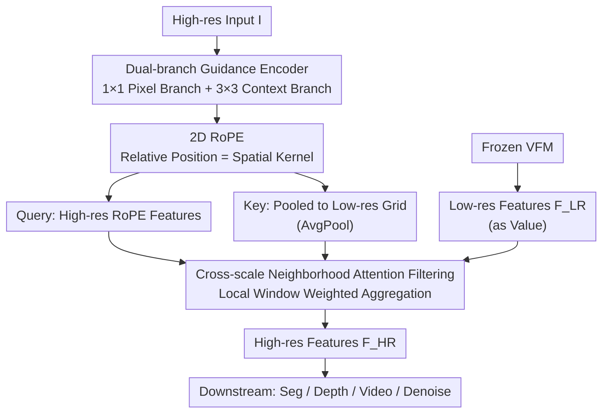

# NAF: Zero-Shot Feature Upsampling via Neighborhood Attention Filtering

**Conference**: CVPR 2026  
**Paper**: [CVF Open Access](https://openaccess.thecvf.com/content/CVPR2026/html/Chambon_NAF_Zero-Shot_Feature_Upsampling_via_Neighborhood_Attention_Filtering_CVPR_2026_paper.html)  
**Code**: https://github.com/valeoai/NAF  
**Area**: General Vision Operators / Feature Upsampling  
**Keywords**: Feature Upsampling, Vision Foundation Models, Zero-Shot, Neighborhood Attention, Joint Bilateral Filtering

## TL;DR
NAF reformulates the task of "upsampling low-resolution features from Vision Foundation Models (VFMs)" as a neighborhood attention filtering process that **only observes the high-resolution input image, ignoring the VFM features themselves** during guidance. Trained once, it can be applied zero-shot to any VFM (including 7B models) and any magnification factor. It achieves new SOTA results across downstream tasks such as semantic segmentation, depth estimation, open-vocabulary segmentation, and video propagation, while operating approximately 4x faster than comparable methods.

## Background & Motivation
**Background**: Vision Foundation Models (VFMs) like DINOv2, RADIO, DINOv3, and SigLIP2 extract features with strong semantic information. However, due to computational and structural constraints, output feature maps are significantly downsampled (typically 1/14 or 1/16 of the original image). This coarse resolution is detrimental to tasks requiring pixel-level precision, such as semantic segmentation and depth estimation. While increasing input resolution can improve detail, most VFMs lack scale invariance (leading to performance drops) and computational costs scale quadratically. Thus, the prevailing strategy is to **directly upsample the low-resolution features** output by the VFM.

**Limitations of Prior Work**: Existing upsamplers face a dilemma. On one hand, classical filters (Joint Bilateral Filter JBF, Joint Bilateral Upsampling JBU) are fast, universal, and interpretable, but they use fixed kernel forms (e.g., Gaussian) which lack expressivity and precision. On the other hand, learned upsamplers (FeatUp, JAFAR, LoftUp) offer high precision, but their guidance signals **depend on the specific semantic features of a VFM**, necessitating retraining for every new model. Furthermore, these methods often involve complex pipelines, low throughput, high memory consumption, and limited maximum upsampling factors (FeatUp/LiFT often support only fixed ratios).

**Key Challenge**: There is a fundamental coupling between "universality/speed" and "precision." Achieving high precision typically involves coupling the upsampler's weights to a specific VFM's feature distribution, sacrificing zero-shot transferability. Conversely, VFM-agnostic methods (like JBU or the concurrent AnyUp) often fail to match the performance of VFM-specific ones; even AnyUp's guidance computation requires reading low-resolution VFM features and remains slower than leading specialized methods.

**Goal**: To develop a truly VFM-agnostic, zero-shot, plug-and-play module that exceeds the performance of VFM-specific upsamplers while maintaining the speed and interpretability of classical filters, capable of scaling to 2K resolutions and 7B-parameter models.

**Key Insight**: The authors observe that the clues for "which neighbors should be weighted and aggregated" for upsampling are primarily contained within the high-resolution original image (edges, textures, local structures), rather than the low-resolution semantic features of the VFM. Consequently, guidance signals can be extracted solely from the input image, completely severing the dependency on VFM features.

**Core Idea**: Upsampling is formulated as "neighborhood attention filtering." The attention *values* are the low-resolution VFM features, while the *Query* and *Key* that determine weights are **encoded only from the high-resolution input image**. Using cross-scale neighborhood attention combined with RoPE, the model learns a data-adaptive aggregation kernel that is both space- and content-aware. The authors further prove this is equivalent to implicitly learning the Inverse Discrete Fourier Transform (IDFT) of the aggregation kernel—where the network predicts frequency spectrum coefficients to reconstruct spatial filters—thereby combining the interpretability of classical filtering with the flexibility of learned methods.

## Method

### Overall Architecture
NAF addresses the following: given a high-resolution image $\mathbf{I}\in\mathbb{R}^{H_{HR}\times W_{HR}\times 3}$ and low-resolution features $\mathbf{F}^{LR}\in\mathbb{R}^{H_{LR}\times W_{LR}\times d}$ from a VFM, it reconstructs high-resolution features $\mathbf{F}^{HR}$ aligned with image details (at magnification factor $s$). The process is streamlined: the image passes through a lightweight **dual-branch guidance encoder** $\mathrm{Enc}_\theta$ to generate high-resolution guidance maps. Combined with **2D RoPE**, features at high-resolution positions serve as Query $Q$, while the same features average-pooled to the low-resolution grid serve as Key $K$. The VFM's low-resolution features $\mathbf{F}^{LR}$ act directly as the attention *Value*. Finally, a **cross-scale neighborhood attention** is performed, where each high-resolution pixel aggregates only within a small window around its corresponding low-resolution position. Notably, the VFM remains frozen and only contributes values; all weighting decisions derive from the image, ensuring zero-shot transferability.

Core aggregation formula (Eq. 3):

$$\mathbf{F}^{HR}_{p}=\frac{1}{Z(p)}\sum_{q\in\mathcal{N}(p)}\exp\!\left(\frac{\langle Q_p,K_q\rangle}{\sqrt{d}}\right)\mathbf{F}^{LR}_{q}$$

Where $\mathcal{N}(p)$ is the local neighborhood and $Z(p)$ is the normalization factor. This is structurally isomorphic to classical Joint Bilateral Filtering (Eq. 1): $\mathbf{F}^{HR}_p=\frac{1}{Z(p)}\sum_q w(p,q\mid\mathbf{G})\,\mathbf{F}^{LR}_q$—simply replacing handcrafted weights $w$ with learned attention weights derived from the image.

### Key Designs

**1. Cross-scale Neighborhood Attention Filtering: Upsampling as Local Aggregation**

While classical filters have hard-coded kernel shapes (Gaussian/Bilateral) and limited expressivity, global attention is computationally prohibitive for high resolutions. NAF sets the attention value to the VFM's low-res features, with weights derived from the Query/Key dot product. Crucially, **each high-resolution query only attends to a compact neighborhood around its low-resolution counterpart**. This locality dramatically reduces Key-Query interactions (approx. 40% fewer GFLOPs than JAFAR), enabling support for 2K feature maps, 72× magnification, and 7B VFMs. Moreover, the aggregation is equivalent to learning the IDFT of the kernel, allowing the network to adaptively predict spatial kernels through the frequency domain.

**2. Guidance Solely from Input / Keys Pooled from Queries: True VFM-Agnostic Zero-Shot**

This is the cornerstone of NAF. To solve the retraining requirement of existing methods, NAF derives both Query and Key **entirely from the high-resolution image encoding $\mathrm{Enc}_\theta(\mathbf{I})$**. Specifically, $Q_p:=\mathrm{RoPE}(\mathrm{Enc}_\theta(\mathbf{I}))_p$ (Eq. 4), and $K_q:=\mathrm{AvgPool}_{q'\in q}[\mathrm{RoPE}(\mathrm{Enc}_\theta(\mathbf{I}))_{q'}]$ (Eq. 5). By using simple average pooling to generate Keys, the model ensures geometric alignment between Keys and low-resolution features without reading the features themselves. Experiments show that adding 1×1 convolutions after pooling (as in JAFAR/AnyUp) actually degrades performance by breaking channel alignment between Query and Key.

**3. 2D RoPE as "Spatial Kernel", Dual-branch Encoder for "Content Kernel"**

Classical JBU factorizes weights into spatial proximity and content similarity. NAF delegates these to learnable components. The **spatial kernel** is provided by 2D RoPE, which encodes relative spatial offsets directly into the dot product, expressing geometric priors without extra parameters. The **content kernel** is provided by the dual-branch encoder: one branch uses 1×1 convolutions for pixel-level detail, and the other uses 3×3 convolutions for local context. This combination effectively reconstructs an adaptive filter kernel.

### Loss & Training
The training is minimal: given a high-resolution image $\mathbf{I}^{HR}$, a low-resolution image $\mathbf{I}^{LR}$ is created via bilinear downsampling. The same VFM extracts features from both. $\mathbf{F}^{HR}$ serves as the target, and $\mathbf{F}^{LR}$ as input. NAF is trained using only an $\ell_2$ reconstruction loss: $\mathcal{L}_{train}=\|\hat{\mathbf{F}}^{HR}-\mathbf{F}^{HR}\|_2^2$. Unlike competitors, NAF requires no total variation, mask supervision, or crop consistency regularization.

## Key Experimental Results

### Main Results

Linear probing across VFMs (Pascal VOC mIoU / NYUv2 δ1), ∆Mean relative to nearest-neighbor baseline:

| Method | VFM Agnostic | Seg ∆Mean (mIoU) | Depth ∆Mean (δ1) | DINOv3-7B Compatible |
|------|:---:|:---:|:---:|:---:|
| FeatUp | ✗ | +3.29 | +2.09 | No (OOM) |
| AnyUp | ✓ | +4.09 | +2.52 | Yes |
| JAFAR | ✗ | +5.12 | +2.39 | No (OOM) |
| **NAF** | ✓ | **+5.58** | **+3.16** | **Yes** |

NAF is the **first VFM-agnostic upsampler to outperform VFM-specific methods (JAFAR)**. On large models like DINOv3-7B where specialized methods fail due to OOM, NAF provides a +12.69 depth δ1 improvement.

Efficiency comparison (×16 upsampling, input (384,28,28)):

| Method | VFM Agnostic | Params(M) | GFLOPs | FPS | Max Upsampling |
|------|:---:|:---:|:---:|:---:|:---:|
| JBU | ✓ | 0.03 | 4.88 | 4 | 28 |
| AnyUp | ✓ | 0.88 | 329 | 5 | 32 |
| JAFAR | ✗ | 0.63 | 366 | 11 | 32 |
| **NAF** | ✓ | 0.66 | 265 | **18** | **72** |

### Ablation Study

Impact of Key design and spatial encoding (Cityscapes mIoU):

| Configuration | Mean mIoU | Note |
|------|:---:|------|
| AvgPool (Default Key) | **60.41** | Best, local aggregation |
| MaxPool | 59.93 | Slightly worse |
| Bilinear (No Pool) | 59.66 | Loses local alignment |
| AvgPool + Conv. | 58.38 | **Worst**, breaks channel alignment |
| RoPE (Default Spatial) | **60.41** | Best relative geometry |
| Gaussian Kernel | 58.19 | Explicit spatial kernel |
| Manhattan Kernel | 58.03 | Explicit spatial kernel |
| ∅ (No Pos. Enc.) | 57.07 | Lacks spatial awareness |

### Key Findings
- **Guidance Decoupling is Crucial**: Forcing Key independence via convolutions (AnyUp style) degrades mIoU to 58.38, confirming that Key pooling from Query is essential for alignment.
- **RoPE is Essential**: Removing position encoding drops performance to 57.07. RoPE outperforms all explicit multiplicative spatial kernels.
- **Robustness Across Datasets**: In cross-dataset settings, classical-style filtering in NAF proves more robust than purely learned "black-box" approaches like JAFAR or FeatUp.
- **Broad Generalization**: NAF improves ProxyCLIP open-vocabulary segmentation (+1.04 mIoU) and DAVIS video object propagation (+3.37) as a drop-in replacement.
- **Denoising Capability**: Applying the same architecture to image denoising yields performance close to Restormer (26.13M params) with only 0.66M parameters.

## Highlights & Insights
- **Unified Perspective**: The link between "Upsampling = Filtering = Attention = IDFT" provides a strong theoretical foundation, aligning classical signal processing with modern Transformers.
- **Masterful Decoupling**: Setting the Value to VFM features while deriving Query/Key from the image is the "secret sauce" for zero-shot performance on large-scale models.
- **Simplicity Wins**: The "Key = Pooled Query" trick reminds us that structural alignment is often more important than parameter-heavy expressivity in cross-resolution tasks.
- **Inductive Bias over Training Tricks**: Achieving SOTA with a simple $\ell_2$ loss suggests the strength lies in the architecture (locality + image guidance + RoPE).

## Limitations & Future Work
- **No Semantic Creation**: Since Values are fixed VFM features, NAF cannot recover semantic information entirely missing from the low-resolution map.
- **Task Specialization**: While strong, NAF still trails the best domain-specific architectures in heavy denoising tasks.
- **Adaptive Neighborhoods**: Current window sizes (e.g., 9 or 15) are manually tuned; making these self-adaptive remains an open problem.

## Related Work & Insights
- **vs. Classical Filters**: NAF maintains the VFM-agnostic nature of JBU but replaces fixed kernels with learned attention, significantly improving precision.
- **vs. VFM-Specific Methods**: NAF breaks the retraining requirement and memory bottlenecks, outperforming JAFAR for the first time as a VFM-agnostic model.
- **vs. AnyUp**: NAF is significantly faster and more lightweight by avoiding VFM features in the guidance computation.
- **Inspiration**: Decoupling the "decision" (guidance) from the "payload" (VFM features) is a powerful paradigm for cross-modal or cross-resolution tasks where backbones are frequently swapped.

## Rating
- Novelty: ⭐⭐⭐⭐⭐ 
- Experimental Thoroughness: ⭐⭐⭐⭐⭐ 
- Writing Quality: ⭐⭐⭐⭐ 
- Value: ⭐⭐⭐⭐⭐ 

<!-- RELATED:START -->

## Related Papers

- [\[CVPR 2026\] Upsample Anything: A Simple and Hard to Beat Baseline for Feature Upsampling](upsample_anything_a_simple_and_hard_to_beat_baseline_for_feature_upsampling.md)
- [\[CVPR 2026\] UPLiFT: Efficient Pixel-Dense Feature Upsampling with Local Attenders](uplift_efficient_pixel-dense_feature_upsampling_with_local_attenders.md)
- [\[ICLR 2026\] AnyUp: Universal Feature Upsampling](../../ICLR2026/others/anyup_universal_feature_upsampling.md)
- [\[CVPR 2026\] Hyperbolic Defect Feature Synthesis for Few-Shot Defect Classification](hyperbolic_defect_feature_synthesis_for_few-shot_defect_classification.md)
- [\[CVPR 2026\] Language Does Matter for Cross-Domain Few-Shot Visual Feature Enhancement](language_does_matter_for_cross-domain_few-shot_visual_feature_enhancement.md)

<!-- RELATED:END -->
